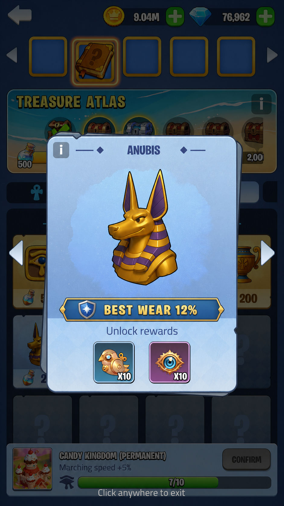

# 王国秘宝磨损度优化设计

## 1. 目标

在不改变王国秘宝现有挖掘收益、活动积分、图鉴积分、通行证进度和奖励结构的前提下，增加宝藏收藏差异：

- 完整发掘宝藏时，随机生成一次磨损度。
- 每个图鉴条目永久记录历史最低磨损度。
- 新增同赛季跨服排行榜，统计标准为玩家任意宝藏的历史最低磨损度。

本次不包含宝藏修复、磨损度重抽、磨损度养成、磨损度交易，以及基于磨损度增减任何产出。

## 2. 名词与判定口径

- **本次磨损度**：本次完整发掘宝藏时生成的数值，取值为 0%～100% 的整数。
- **历史最低磨损度**：同一图鉴条目曾获得的最小磨损度。
- **图鉴条目**：由“宝藏配置 ID + 版本类型”唯一确定；普通版与黄金版分别记录。
- 磨损度越低，宝藏保存越完好；0% 为最佳，100% 为最差。

## 3. 磨损度生成

### 3.1 生成时机

- 仅在一个宝藏的全部占地格被成功发掘、宝藏进入完整揭示状态时生成一次。
- 单格发掘、重复请求、断线重连、回放揭示和客户端表现不得再次生成。
- 服务端在同一结算事务内依次完成：确认首次完整揭示、生成磨损度、发放原有奖励、更新图鉴纪录。
- 同一宝藏的重复结算请求必须返回已落库结果，不能重新随机。

### 3.2 随机方式

采用“权重区间 + 区间内等概率整数”方案。先按权重抽中一个区间，再在区间内随机一个整数。普通版与黄金版首版共用同一组概率。

| 磨损度区间 | 权重 | 定位 |
|---|---:|---|
| 0%～5% | 1 | 极稀有、接近完好 |
| 6%～20% | 9 | 稀有 |
| 21%～40% | 20 | 较好 |
| 41%～70% | 30 | 常见 |
| 71%～100% | 40 | 高磨损 |

区间及权重均走配置，以上为首版默认值。权重按相对值计算，不要求配置人员手工换算概率。

### 3.3 结果影响

磨损度仅用于收藏与展示，不影响：

- 发掘奖励、单格奖励、完整宝藏奖励；
- 活动积分、图鉴积分、图鉴解锁奖励；
- 通行证任务、通行证经验与活动完成条件；
- 普通版或黄金版宝藏的原有产出。

## 4. 图鉴历史最低磨损度

### 4.1 首次获得

- 按“宝藏配置 ID + 版本类型”解锁对应图鉴条目。
- 写入本次磨损度，作为该条目的历史最低磨损度。
- 原有首次解锁奖励照常发放。

### 4.2 重复获得

- 本次磨损度小于历史最低值：覆盖历史最低值，并标记“刷新纪录”。
- 本次磨损度等于历史最低值：不覆盖纪录，不改变原纪录时间。
- 本次磨损度大于历史最低值：不覆盖纪录。
- 重复获得不重复发放首次图鉴解锁奖励。

### 4.3 数据生命周期

- 图鉴历史最低磨损度为玩家永久数据，活动关闭、活动重开和活动期数切换均不清空。
- 关闭投放的宝藏配置不得物理删除；其历史图鉴仍需可读取名称、图标和版本信息。
- 功能上线前已经解锁的旧图鉴条目显示“暂无磨损度纪录”。玩家在功能上线后再次获得该条目时，才写入第一条纪录；不为旧数据补随机值。

## 5. 跨服排行榜

新增同赛季跨服排行榜，统计标准为玩家任意宝藏的历史最低磨损度。

## 6. 界面调整

### 6.1 获得宝藏弹窗

- 在宝藏名称下方增加“本次磨损度 X%”。
- 首次建立该图鉴条目的磨损度纪录时，显示“首次收录”。
- 若本次结果刷新已有图鉴条目的历史最低值，显示“图鉴新纪录”。
- 未刷新纪录时仍展示本次磨损度，不展示纪录标签。
- 弹窗保留原有奖励、宝藏名称和确认操作；磨损度不与奖励数值合并展示。

### 6.2 图鉴详情弹窗

- 在宝藏主体展示区与解锁奖励区之间增加“历史最低磨损度 X%”。
- 旧图鉴没有上线后纪录时显示“历史最低磨损度：暂无纪录”。
- 普通版与黄金版分别展示各自条目的历史最低值。
- 不在图鉴卡片列表上增加磨损度数字，避免网格信息拥挤。

### 6.3 排行榜

- 排行榜不单独制作效果图。

## 7. 配置设计

在 `ActivityKingdomTreasure.xlsx` 中新增工作表 `ActvKingdomTreasureWearCfg`，首版使用一组全局磨损度区间。

| 字段 | 类型 | 说明 |
|---|---|---|
| ID | int | 区间唯一 ID |
| MinWear | int | 区间下限，包含该值 |
| MaxWear | int | 区间上限，包含该值 |
| Weight | int | 区间抽取权重，必须大于 0 |
| Switch | int | 是否启用该区间 |

配置检查规则：

- 启用区间必须位于 0～100，且 `MinWear <= MaxWear`。
- 启用区间不得重叠，首版要求连续覆盖 0～100。
- 启用权重总和必须大于 0。
- 配置非法时阻止发布；运行时不得退化为客户端随机。

首版不增加单宝藏概率字段；如后续需要不同宝藏使用不同分布，再扩展分组引用，避免当前过度配置。

## 8. 数据与接口

### 8.1 服务端数据

- 已揭示宝藏实例新增本次磨损度，保证重连和重复请求读取同一结果。
- 图鉴条目新增历史最低磨损度。

### 8.2 客户端数据

- 完整揭示结果下发本次磨损度、是否刷新图鉴纪录和刷新后的历史最低值。
- 图鉴详情下发对应条目的历史最低磨损度和“是否有纪录”。

### 8.3 一致性

- 随机、比较、落库和榜单更新均由服务端完成，客户端仅展示。
- 并发结算时以服务端原子比较更新为准，只允许更低值覆盖。

## 9. 异常与边界

- 配置热更发生在已生成结果之后：已有宝藏磨损度不重算，新揭示宝藏使用生效后的配置。
- 玩家在弹窗出现前断线：重连后读取已落库磨损度，不重新随机；奖励按现有补发规则处理。
- 同一玩家在多端同时完成发掘：图鉴和个人纪录只接受更低值，榜单最终与永久纪录一致。
- 宝藏停止投放：历史图鉴纪录保留，对应基础配置与资源必须保留。
- 数值相同：图鉴历史最低磨损度保持不变。

## 10. 埋点与验收

完整揭示事件补充：宝藏配置 ID、版本类型、本次磨损度、旧/新图鉴最低值、是否刷新图鉴纪录。

核心验收项：

- 0% 和 100% 边界可正常生成、保存与展示。
- 区间权重抽取、区间内整数抽取和非法配置拦截正确。
- 同一宝藏重复请求、断线重连不会重抽磨损度。
- 普通版与黄金版图鉴纪录完全独立。
- 低于、等于、高于历史值三种比较结果正确。
- 活动重开后图鉴历史最低值不重置。
- 旧图鉴显示“暂无纪录”，首次重新获得后正确建档。
- 磨损度不会改变任何原有奖励、积分、通行证和活动完成条件。

## 11. 变更影响范围

- 客户端：完整揭示结果表现、获得宝藏弹窗和图鉴详情弹窗。
- 服务端：宝藏实例结算和图鉴历史纪录。
- 配置：新增磨损度区间工作表及发布校验。
- 美术：仅需两处磨损度信息组件。
- 测试：随机、持久化、并发、断线和旧数据兼容。
