# 世界杯主题活动原型图标注说明
> 标注方式：原图只添加红色编号圆点；说明文本单独在下方表格维护。坐标和元素归类基于当前截图视觉识别，后续写入钉钉文档前建议逐图复核。
## 主界面
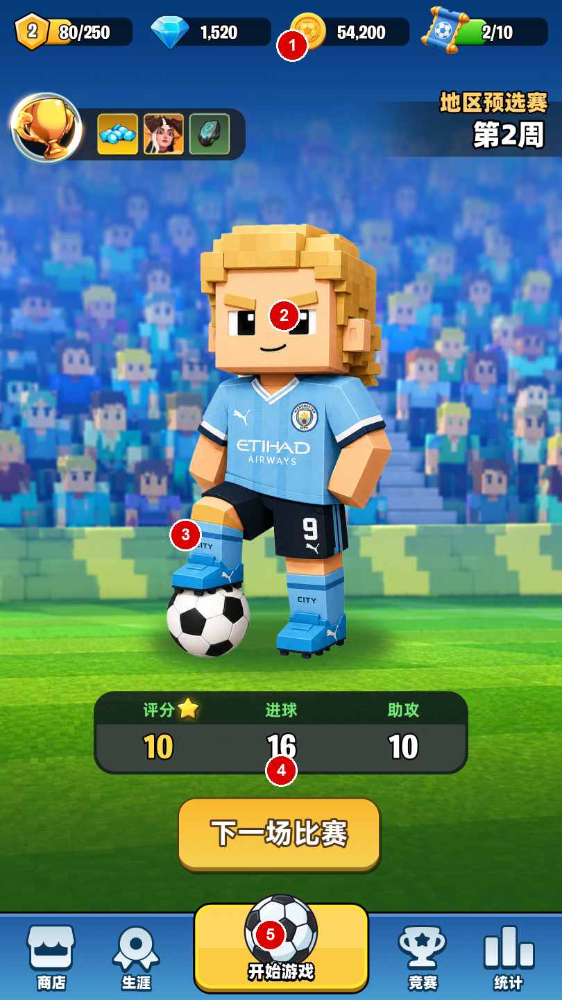
| 标号 | 图中内容 | 规则说明 |
|---:|---|---|
| 1 | 顶部资源栏：金币、钻石、体力等资源 | 资源数值由服务端下发；体力不足时主线入口应提示不足或置灰。 |
| 2 | 中央球员形象和当前队服 | 展示玩家当前角色与队伍外观；外观修改后需要同步刷新。 |
| 3 | 评分 / 进球 / 助攻三项数据 | 统计值来自活动累计数据；不在前端本地推导。 |
| 4 | 黄色按钮“下一场比赛” | 点击进入当前可挑战关卡或战前界面；需校验体力、关卡解锁状态。 |
| 5 | 底部主导航，当前停留在“开始”页 | 底部导航用于商店、比赛、开始、赛程、榜单等模块切换，红点表示有待处理事项。 |

## 入队审批
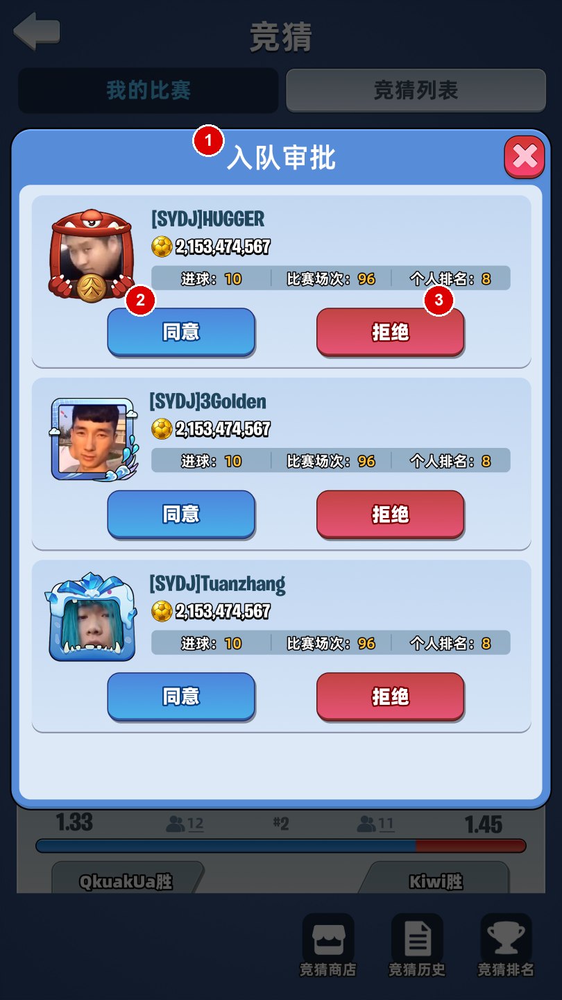
| 标号 | 图中内容 | 规则说明 |
|---:|---|---|
| 1 | 弹窗标题“入队审批” | 队长查看入队申请；背景竞猜页和底部导航不作为本弹窗标注对象。 |
| 2 | 申请人卡片 | 同一申请卡组件展示头像框、玩家名、评分、进球、场次、排名；多条申请纵向复用该组件。 |
| 3 | 审批操作按钮组 | 同意/拒绝复用按钮组件；同意前校验队伍人数上限和申请状态，拒绝后移除申请记录并刷新列表。按钮需支持正常、置灰、点击中状态。 |

## 关卡结算——平局和失败
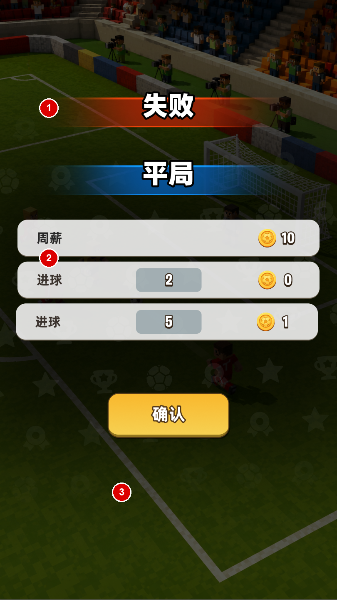
| 标号 | 图中内容 | 规则说明 |
|---:|---|---|
| 1 | 失败/平局结果标题 | 失败、平局、胜利复用同一结算标题组件；该图展示失败和平局两种状态对照。 |
| 2 | 奖励明细列表 | 不同结果使用同一结算结构；进球/助攻为 0 时仍显示对应行和 0 值。 |
| 3 | 确认按钮 | 关闭结算并进入排名结算或返回；按钮需防重复点击。 |

## 关卡结算——胜利
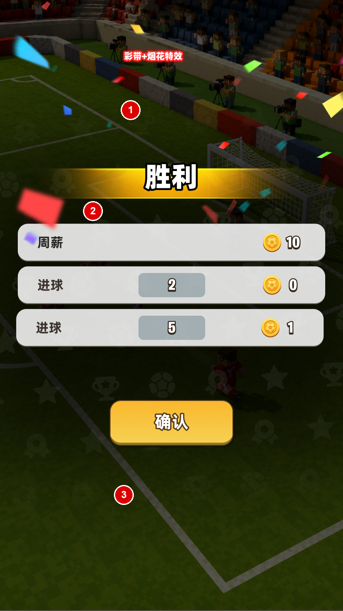
| 标号 | 图中内容 | 规则说明 |
|---:|---|---|
| 1 | 结算标题与结果状态 | 根据关卡结果展示胜利、平局或失败；结果状态复用同一标题组件，仅替换文案和视觉表现。 |
| 2 | 奖励明细列表 | 周薪、进球、助攻等奖励复用同一列表行组件；奖励名称、图标和数值由结算结果下发。 |
| 3 | 确认按钮 | 奖励入账后关闭；按钮需防重复点击，结算发奖需按 attempt_id 幂等。 |

## 匹配成功
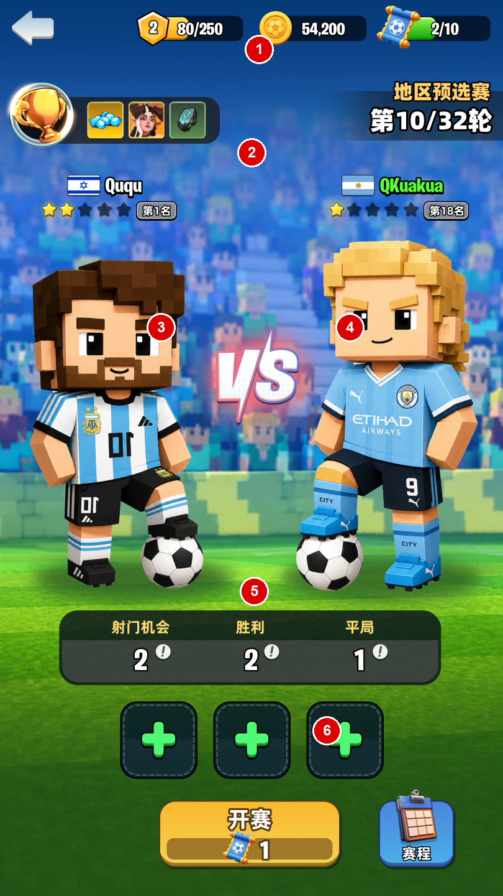
| 标号 | 图中内容 | 规则说明 |
|---:|---|---|
| 1 | 顶部资源栏 | 进入战前页仍保留资源展示，体力消耗在开球确认时校验。 |
| 2 | 联赛与轮次标题 | 显示当前联赛、大关卡/轮次信息，由关卡进度下发。 |
| 3 | 左侧我方球队与球员模型 | 展示玩家所在队伍、星级和排名。 |
| 4 | 右侧对手球队与球员模型 | 展示对手队伍、星级和排名。 |
| 5 | 射门机会 / 胜利 / 平目标条 | 说明本关目标阈值；胜平负按关卡配置判定。 |
| 6 | 黄色“开球”按钮 | 点击后扣除体力/门票并进入关卡；需防重复点击。 |

## 升级
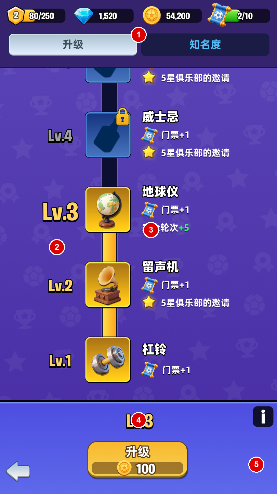
| 标号 | 图中内容 | 规则说明 |
|---:|---|---|
| 1 | 页签：升级 / 球会赛季 | 用于切换成长奖励与赛季信息。 |
| 2 | 左侧纵向等级进度轴 | 显示当前等级位置和可领取等级段。 |
| 3 | 当前等级奖励卡 | 展示升级奖励内容；已达等级且未领取时可领。 |
| 4 | 底部升级按钮与消耗 | 资源足够时可升级；不足时置灰或跳转获取。 |
| 5 | 右下信息按钮 | 打开升级规则或奖励说明。 |

## 合同
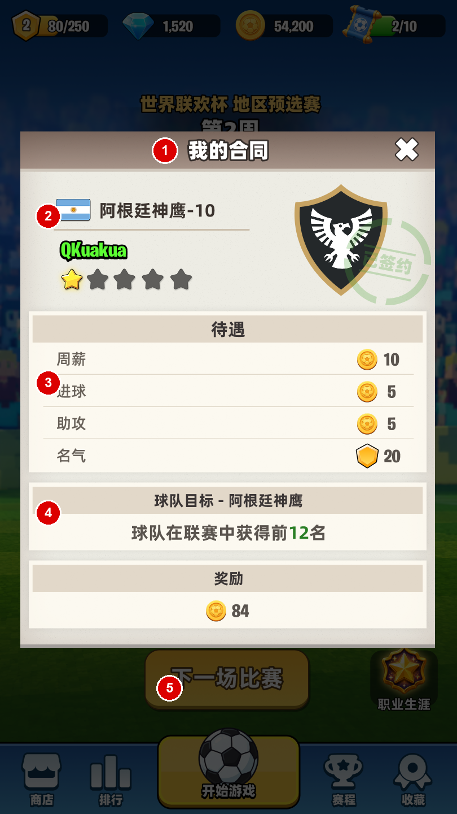
| 标号 | 图中内容 | 规则说明 |
|---:|---|---|
| 1 | 弹窗标题“我的合同” | 合同详情弹窗；仅说明弹窗内部内容，背景资源栏和底部导航不作为本图标注对象。 |
| 2 | 球队基础信息区：国家、队名、星级、队徽 | 合同绑定当前签约球队；国家、队名、星级、队徽由合同配置下发，详情弹窗内不可直接修改。 |
| 3 | 待遇奖励列表 | 周薪、进球、助攻、名气等奖励使用同一列表组件；不同奖励类型仅图标和数值不同，结算口径由配置决定。 |
| 4 | 球队目标与目标奖励 | 目标达成条件与奖励同属合同目标模块；目标未达成只展示，不发放奖励。 |
| 5 | 黄色“下一场比赛”按钮 | 签约完成后可继续进入下一场比赛；点击前仍需校验体力、赛程和关卡状态。 |

## 合同——签约
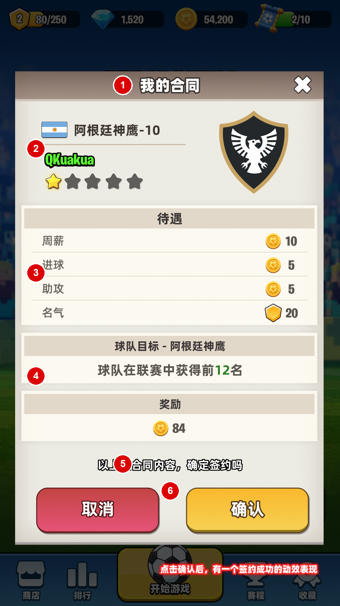
| 标号 | 图中内容 | 规则说明 |
|---:|---|---|
| 1 | 弹窗标题“我的合同” | 签约确认弹窗；仅说明弹窗内部内容，背景资源栏和底部导航不作为本图标注对象。 |
| 2 | 待签球队基础信息区 | 确认前展示玩家选择的球队；国家、队名、星级、队徽应与上一流程选择结果一致。 |
| 3 | 待遇奖励列表 | 周薪、进球、助攻、名气等使用同一列表组件；不同奖励类型只替换文案、图标和数值。 |
| 4 | 球队目标与奖励 | 目标只展示，不在签约时发奖；完成后由赛季结算或对应流程发放。 |
| 5 | 签约确认提示文案 | 确认前提示玩家核对合同内容；点击确认后播放签约成功表现。 |
| 6 | 取消 / 确认按钮组 | 取消关闭弹窗不写入；确认写入签约球队并进入后续流程。按钮状态需支持正常、置灰、点击中三类。 |

## 名气界面
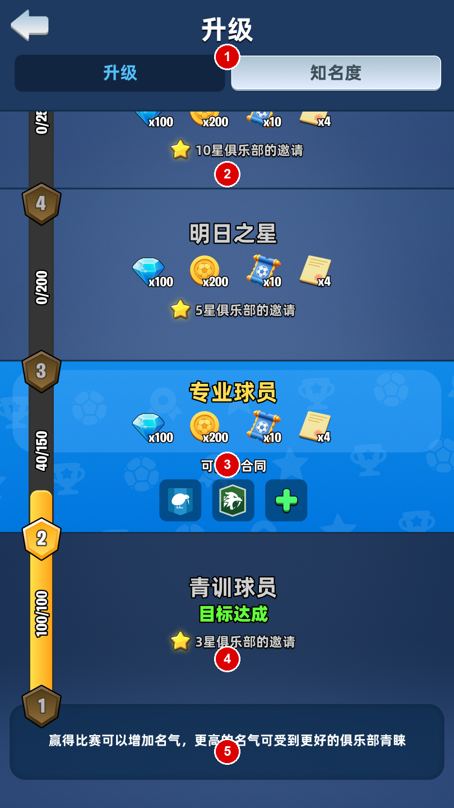
| 标号 | 图中内容 | 规则说明 |
|---:|---|---|
| 1 | 顶部标题“世界杯” | 名气/徽章类界面入口标题。 |
| 2 | 球员形象展示区 | 展示当前角色外观和队服。 |
| 3 | 徽章/队标选择区 | 展示已解锁徽章或名气标识；未解锁项不可选。 |
| 4 | 名称输入框与编辑按钮 | 用于编辑展示名称；需做长度和敏感词校验。 |
| 5 | 黄色“使用/确认”按钮 | 保存当前选择；保存成功后刷新主界面展示。 |

## 局内——回顾进球
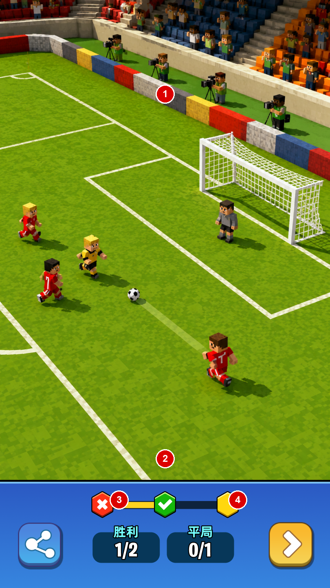
| 标号 | 图中内容 | 规则说明 |
|---:|---|---|
| 1 | 球门与回放画面 | 切片完成后展示回放。 |
| 2 | 底部状态栏：胜利/平目标进度 | 实时展示关卡目标进度。 |
| 3 | 分享/回放类按钮 | 可查看或分享本次进球回放。 |
| 4 | 黄色下一步按钮 | 点击进入下一切片或结算。 |

## 局内——教学1
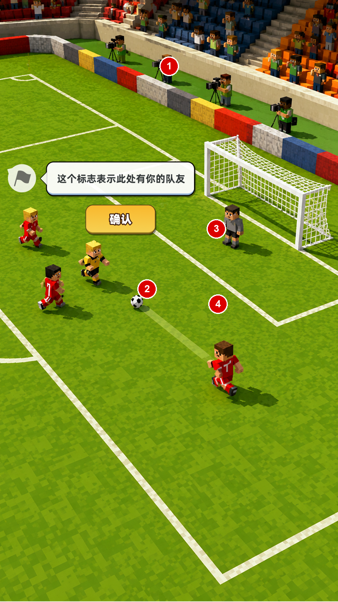
| 标号 | 图中内容 | 规则说明 |
|---:|---|---|
| 1 | 球场与当前切片场景 | 局内教学场景，不显示复杂 HUD。 |
| 2 | 队友方向星标 | 提示该方向存在可传球队友。 |
| 3 | 蓝色说明气泡 | 说明队友方向标识含义。 |
| 4 | 绿色“明白了”按钮 | 点击关闭教学并继续操作。 |

## 局内——教学2
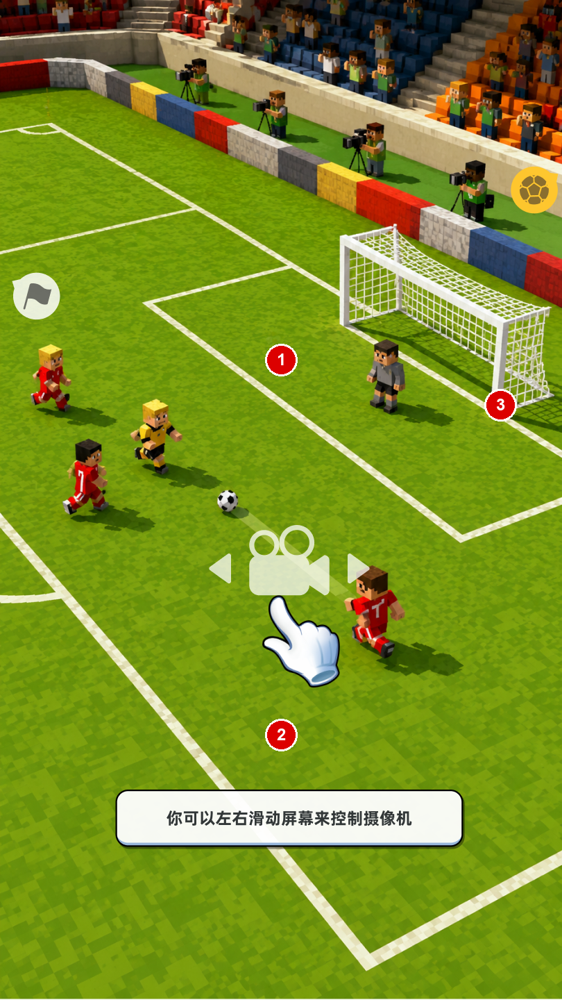
| 标号 | 图中内容 | 规则说明 |
|---:|---|---|
| 1 | 相机移动手势图标 | 提示可在屏幕上半部左右滑动移动相机。 |
| 2 | 底部教学文案 | 文案说明视角操作方式。 |
| 3 | 右侧视角按钮 | 可作为相机/视角入口或提示锚点。 |

## 开始通知

| 标号 | 图中内容 | 规则说明 |
|---:|---|---|
| 1 | 弹窗标题“足球联赛已开始” | 阶段开启时弹出通知；背景主界面不作为本弹窗标注对象。 |
| 2 | 赛事宣传图与说明文案 | 文案提示玩家尽快组队/加入赛事；宣传图与文案作为同一运营内容区域维护。 |
| 3 | 黄色“加入”按钮 | 点击跳转赛事/组队入口；按钮支持正常、置灰、点击中状态。 |
| 4 | 关闭按钮 | 关闭后本次不再强弹，红点仍可保留。 |

## 徽章说明
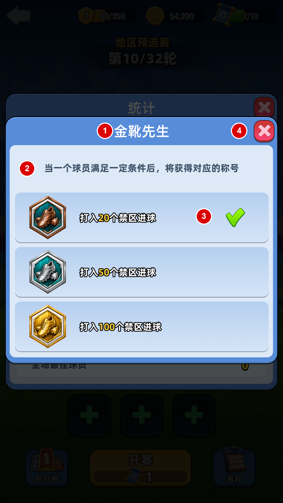
| 标号 | 图中内容 | 规则说明 |
|---:|---|---|
| 1 | 标题“金靴先生” | 展示当前选中徽章/称号名称；背景统计弹窗不作为本图标注对象。 |
| 2 | 徽章说明文本 | 说明获取方式或效果；文本来自配置。 |
| 3 | 任务完成状态标识 | 同一任务行组件支持已完成、未完成、锁定三类状态；已完成展示勾选，未完成不显示勾选，锁定时需展示锁定或置灰。 |
| 4 | 关闭按钮 | 关闭说明弹窗返回上一界面。 |

## 我的比赛
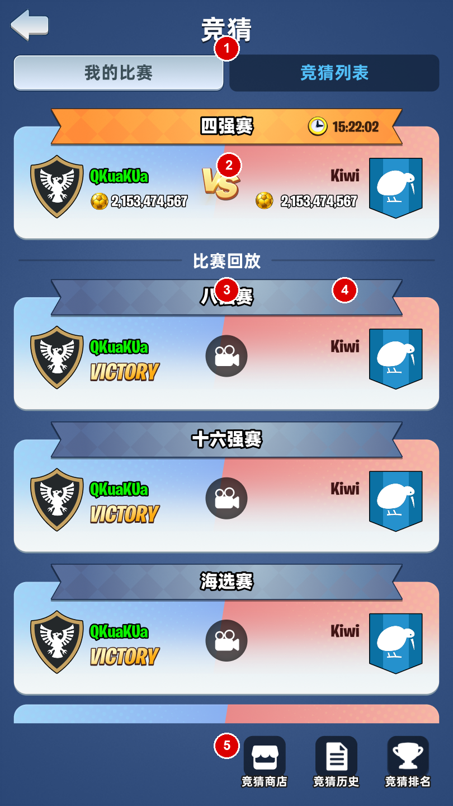
| 标号 | 图中内容 | 规则说明 |
|---:|---|---|
| 1 | 标题“竞猜”与页签 | 竞猜模块内页签切换。 |
| 2 | 我的比赛 / 竞猜列表页签 | 切换我的比赛与竞猜列表。 |
| 3 | 比赛卡片：双方、比分、胜负标识 | 展示玩家相关比赛结果。 |
| 4 | 录像/回放按钮 | 有回放数据时可播放；轮空或无数据时隐藏。 |
| 5 | 底部导航：比赛/竞猜/榜单 | 在淘汰赛相关子模块间切换。 |

## 排名结算
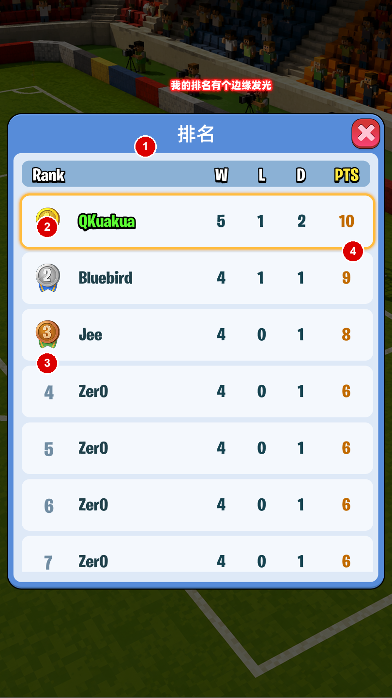
| 标号 | 图中内容 | 规则说明 |
|---:|---|---|
| 1 | 排名表标题与联赛名 | 关卡结算后展示当前联赛排名；背景球场不作为本弹窗标注对象。 |
| 2 | 表头 Rank / W / L / D / PTS | 若采用切片胜利积分，应调整表头口径避免误解。 |
| 3 | 排名列表行 | 普通行复用同一列表组件，展示球队名和排名数据；列表可纵向滚动。 |
| 4 | 当前玩家队伍高亮行 | 玩家所属队伍需突出显示；高亮态与普通态复用同一行组件，仅边框/底色不同。 |

## 竞猜
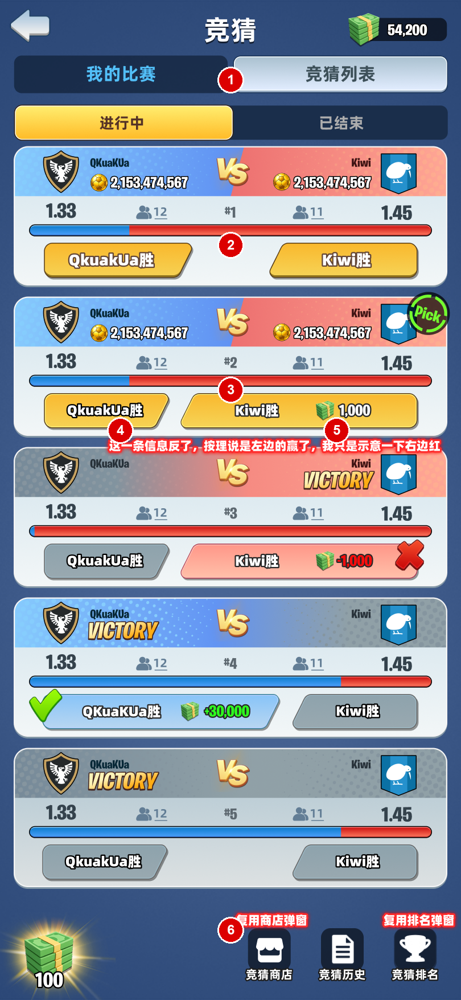
| 标号 | 图中内容 | 规则说明 |
|---:|---|---|
| 1 | 标题“竞猜”与页签 | 竞猜模块顶部页签。 |
| 2 | 阶段条与倒计时 | 展示当前可竞猜阶段和截止时间。 |
| 3 | 竞猜场次卡 | 每张卡展示双方、赔率、排名和投注人数。 |
| 4 | 左侧 Betting 按钮 | 选择左侧队伍下注。 |
| 5 | 右侧 Betting / Change 按钮 | 未下注显示 Betting，已下注显示 Change。 |
| 6 | 底部导航：商店/历史/我的竞猜/收益榜 | 在竞猜相关子模块间切换。 |

## 竞猜历史
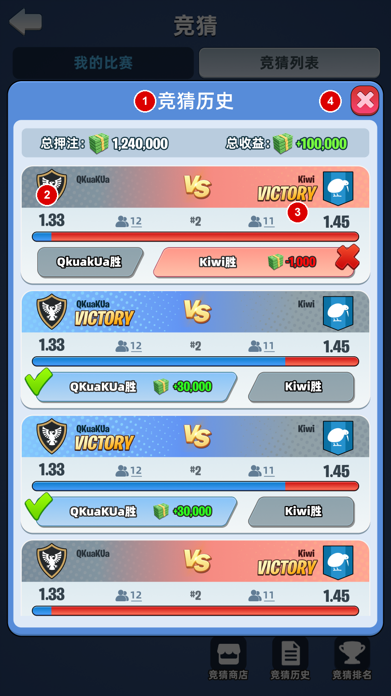
| 标号 | 图中内容 | 规则说明 |
|---:|---|---|
| 1 | 标题“竞猜历史” | 查看历史下注记录；背景竞猜页不作为本弹窗标注对象。 |
| 2 | 历史记录列表 | 历史卡片复用同一组件，显示过往竞猜场次、选择、结果和收益。 |
| 3 | 结果状态标识 | 胜、负、已结算、未结算复用同一状态位。 |
| 4 | 关闭按钮 | 关闭返回竞猜页。 |

## 竞猜弹窗
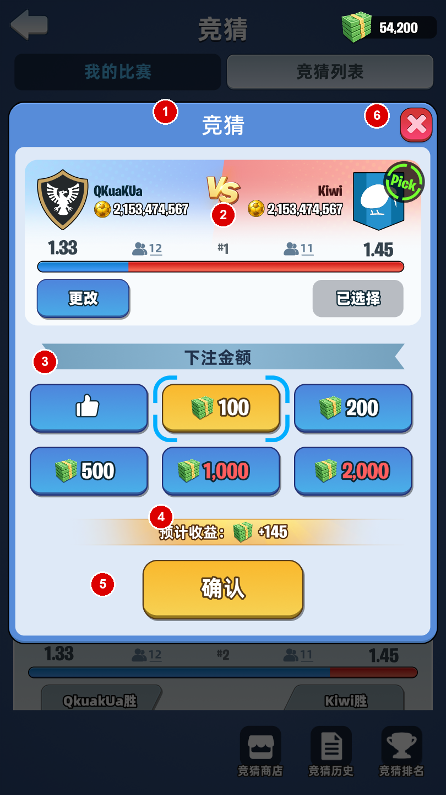
| 标号 | 图中内容 | 规则说明 |
|---:|---|---|
| 1 | 弹窗标题“竞猜” | 下注确认弹窗；背景竞猜列表不作为本弹窗标注对象。 |
| 2 | 双方赔率与选择区域 | 展示所选晋级方和双方赔率；已选、可更改、不可更改复用同一对阵卡状态位。 |
| 3 | 下注金额档位 | 快捷选择投注额；选中、未选、余额不足置灰复用同一金额按钮组件，不能超过竞猜币余额。 |
| 4 | 预计收益/返还说明 | 按服务端赔率计算，前端只展示。 |
| 5 | 黄色确认按钮 | 提交下注；截止后不可提交，按钮支持正常、置灰、点击中状态。 |
| 6 | 关闭按钮 | 关闭弹窗不保存修改。 |

## 竞猜结算——赔了
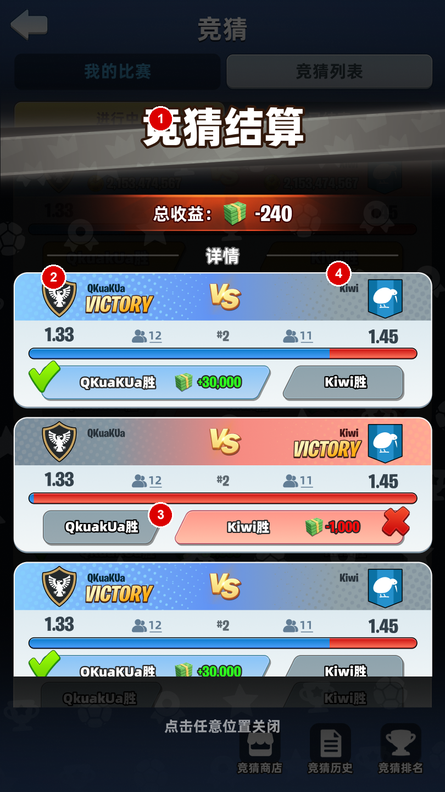
| 标号 | 图中内容 | 规则说明 |
|---:|---|---|
| 1 | 标题“竞猜结算”与总收益 | 竞猜结算浮层；押中展示正收益，押错展示负收益，同一收益条组件按正负切换颜色和符号。 |
| 2 | 结果列表卡 | 同一结果卡组件展示对阵、赔率、下注额、收益；胜负、正负收益和选中方状态在卡片内切换。 |
| 3 | 下方结果列表卡 | 继续展示同批次结算明细；点击任意位置关闭结算层。 |
| 4 | 对手队伍与比赛结果标识 | 用于展示对手、胜负和结算态；有回放数据时可扩展查看入口。 |

## 竞猜结算——赚了
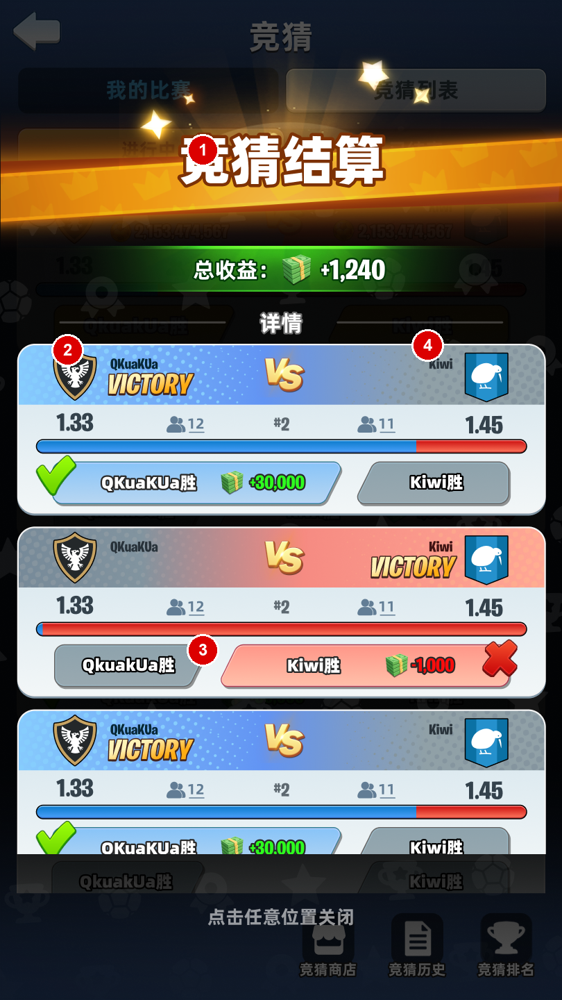
| 标号 | 图中内容 | 规则说明 |
|---:|---|---|
| 1 | 标题“竞猜结算”与总收益 | 竞猜结算浮层；押中展示正收益，押错展示负收益，同一收益条组件按正负切换颜色和符号。 |
| 2 | 结果列表卡 | 同一结果卡组件展示对阵、赔率、下注额、收益；胜负、正负收益和选中方状态在卡片内切换。 |
| 3 | 下方结果列表卡 | 继续展示同批次结算明细；点击任意位置关闭结算层。 |
| 4 | 对手队伍与比赛结果标识 | 用于展示对手、胜负和结算态；有回放数据时可扩展查看入口。 |

## 管理编队——可加入队伍
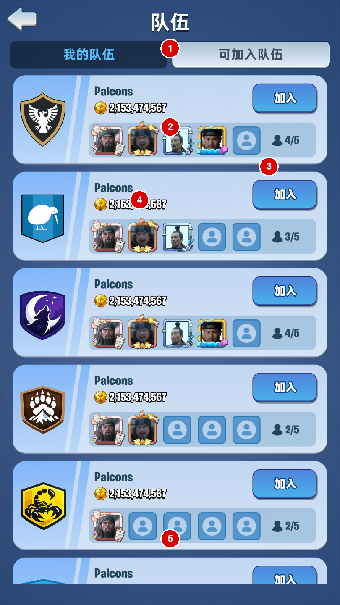
| 标号 | 图中内容 | 规则说明 |
|---:|---|---|
| 1 | 队伍列表页签与顶部资源 | 用于浏览可加入队伍。 |
| 2 | 队伍卡片列表 | 每张卡展示队名、总评分、成员位和当前人数。 |
| 3 | “加入”按钮 | 可申请加入；满员、已申请、非组队期置灰。 |
| 4 | 成员头像与空位 | 展示队内成员和待招募空位。 |
| 5 | 列表滚动区域 | 队伍较多时纵向滚动；刷新后保持当前筛选。 |

## 管理编队——我的队伍

| 标号 | 图中内容 | 规则说明 |
|---:|---|---|
| 1 | “我的队伍：4/5”人数状态 | 展示当前成员数和上限。 |
| 2 | 队长/玩家成员卡 | 第一张高亮卡通常表示自己或队长。 |
| 3 | 橙色“踢出”按钮 | 队长在组队期可踢出成员；非队长隐藏或置灰。 |
| 4 | 大号加号空位 | 点击邀请或补充成员；组队结束后不可用。 |
| 5 | “审批”按钮 | 进入入队申请审批列表。 |

## 统计
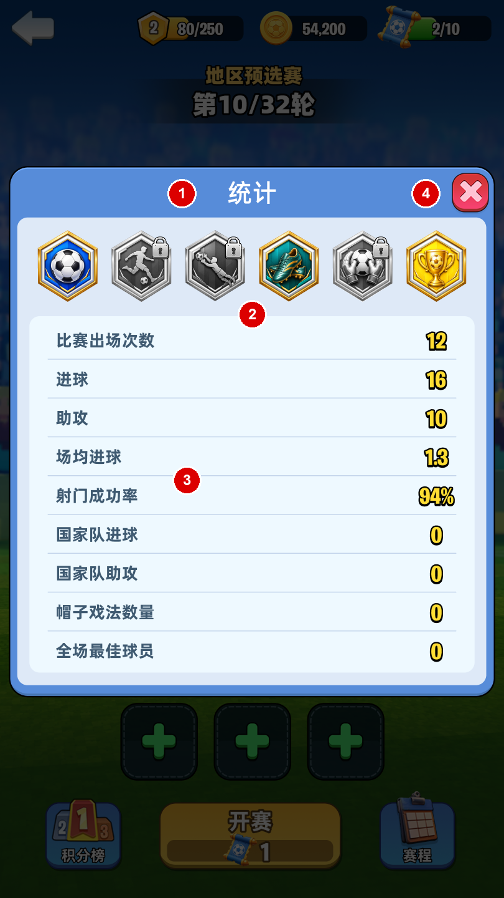
| 标号 | 图中内容 | 规则说明 |
|---:|---|---|
| 1 | 弹窗标题“统计” | 展示本阶段或本赛事统计；背景赛程页和底部入口不作为本弹窗标注对象。 |
| 2 | 徽章/页签图标行 | 点击切换不同统计分类；已解锁、未解锁、当前选中复用同一徽章组件，在规则中区分亮态、灰态、锁态和选中态。 |
| 3 | 统计条目列表 | 列表行复用同一组件，左侧展示指标名、右侧展示数值；数值为 0 时仍保留行结构。 |
| 4 | 关闭按钮 | 关闭统计弹窗。 |

## 编辑我的队列
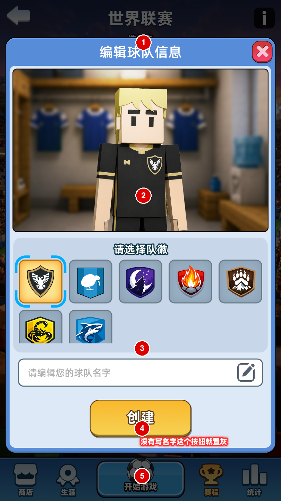
| 标号 | 图中内容 | 规则说明 |
|---:|---|---|
| 1 | 标题“编辑球队信息” | 创建/管理队伍时编辑队伍外观与名称。 |
| 2 | 球员与队服预览 | 选择队服后实时刷新预览。 |
| 3 | 队服网格 | 点击队服单选；已选队服显示勾选标记。 |
| 4 | 队伍名输入框与编辑图标 | 队名需校验长度、敏感词和重复名。 |
| 5 | 橙色“创建/修改”按钮 | 组队期可提交；非组队期置灰。 |

## 训练完成
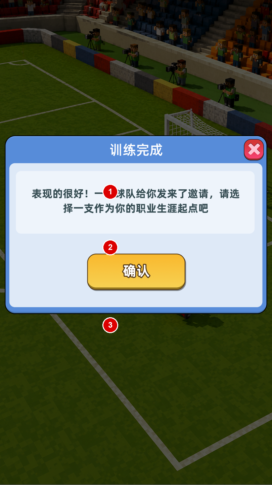
| 标号 | 图中内容 | 规则说明 |
|---:|---|---|
| 1 | 弹窗标题“训练完成” | 完成全部试训切片后出现；背景球场不作为本弹窗标注对象。 |
| 2 | 球队邀请说明文案 | 提示玩家即将进入球队选择流程。 |
| 3 | 黄色“确认”按钮 | 点击进入选择队伍；试训状态写为完成，按钮需防重复点击。 |

## 赛季关卡
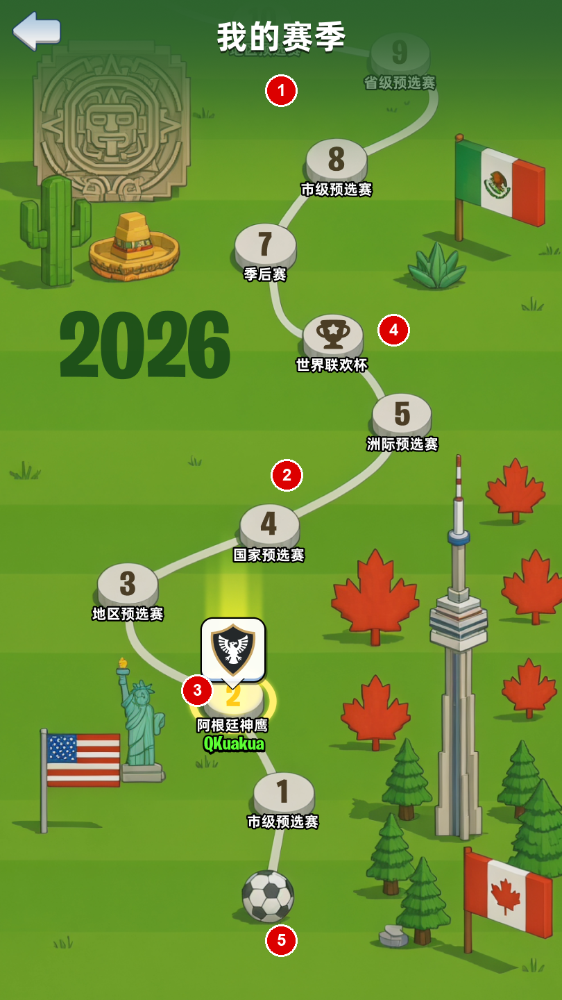
| 标号 | 图中内容 | 规则说明 |
|---:|---|---|
| 1 | 标题“我的赛季” | 积分赛赛季地图入口。 |
| 2 | 路线节点 1-8 | 按顺序解锁；当前节点高亮。 |
| 3 | 当前球队/玩家标记 | 表示当前位置和当前关卡。 |
| 4 | 已完成或可挑战节点 | 已完成、可挑战、未解锁需使用不同状态。 |
| 5 | 底部导航 | 与主界面导航一致。 |

## 赛程——八强选拔阶段
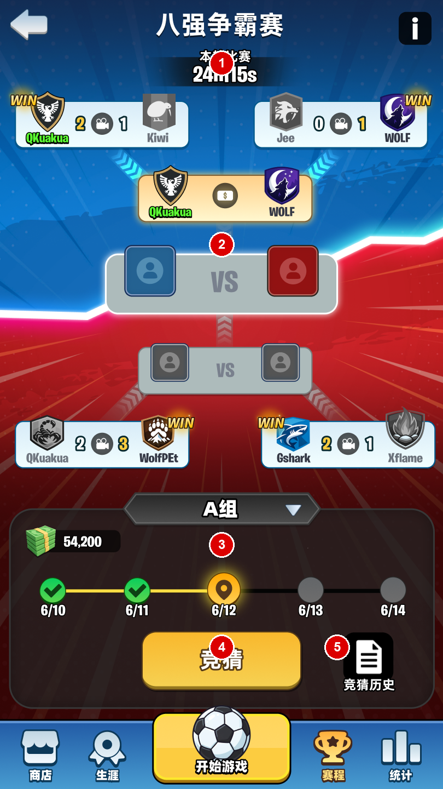
| 标号 | 图中内容 | 规则说明 |
|---:|---|---|
| 1 | 标题“八强争霸赛”与倒计时 | 展示淘汰赛阶段和剩余时间。 |
| 2 | 淘汰赛对阵树 | 显示对阵节点、比分、胜负状态。 |
| 3 | 阶段时间轴 | 显示当前所在淘汰轮次。 |
| 4 | 竞猜按钮 | 仅单淘汰非轮空比赛开放竞猜。 |
| 5 | 赛程/列表按钮 | 打开详细赛程列表。 |

## 赛程——决赛已结束
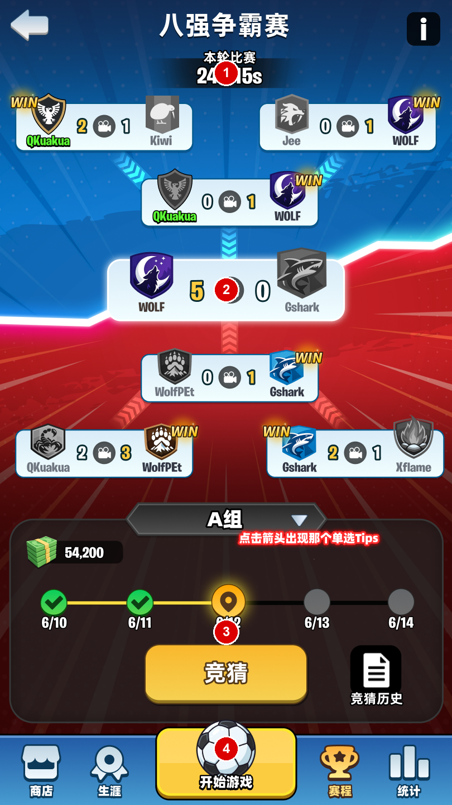
| 标号 | 图中内容 | 规则说明 |
|---:|---|---|
| 1 | 标题“世界杯” | 赛事已进入结束/回顾状态。 |
| 2 | 球场背景与阶段图标 | 展示赛事最终状态。 |
| 3 | 结果/查看按钮区 | 可查看最终排名、奖励或回放。 |
| 4 | 底部导航 | 活动结束后仍可查看历史信息。 |

## 赛程——决赛阶段未开始
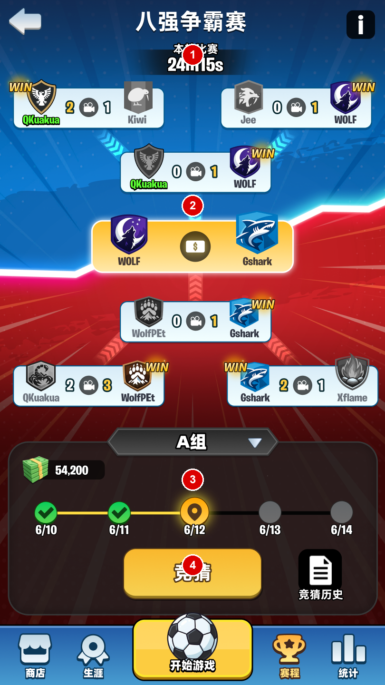
| 标号 | 图中内容 | 规则说明 |
|---:|---|---|
| 1 | 标题“八强争霸赛” | 仍处于淘汰赛页。 |
| 2 | 对阵树与锁定节点 | 未开始的决赛节点展示锁定或空状态。 |
| 3 | 阶段时间轴 | 展示即将进入下一阶段。 |
| 4 | 竞猜按钮 | 未到开放时间时置灰或提示未开始。 |

## 赛程——准备阶段
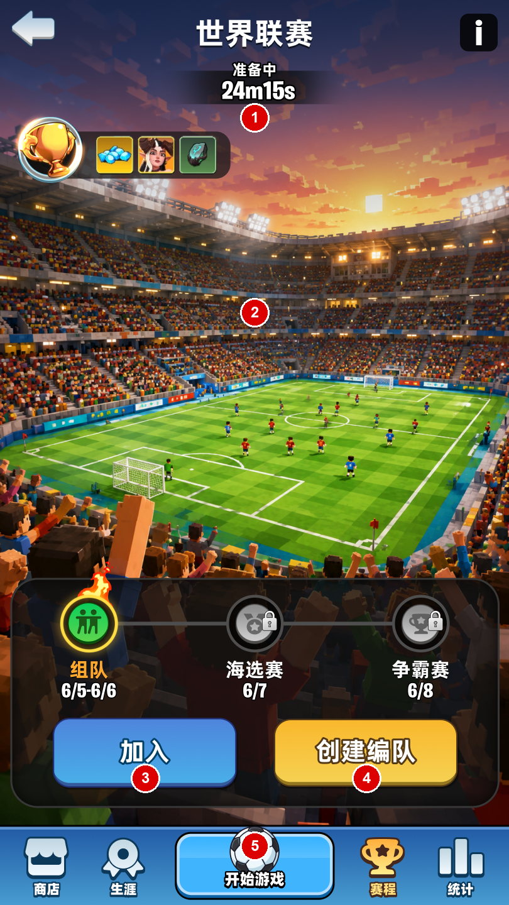
| 标号 | 图中内容 | 规则说明 |
|---:|---|---|
| 1 | 赛事阶段时间轴：组队/海选/争霸赛 | 展示赛事阶段与开放日期。 |
| 2 | 阶段介绍与奖励信息 | 显示当前准备阶段说明和奖励预览。 |
| 3 | 蓝色“加入”按钮 | 加入已有队伍或进入队伍列表。 |
| 4 | 橙色“创建编队”按钮 | 创建队伍；仅组队期可用。 |
| 5 | 底部导航 | 赛事、竞猜、排名等入口。 |

## 赛程——没加入海选
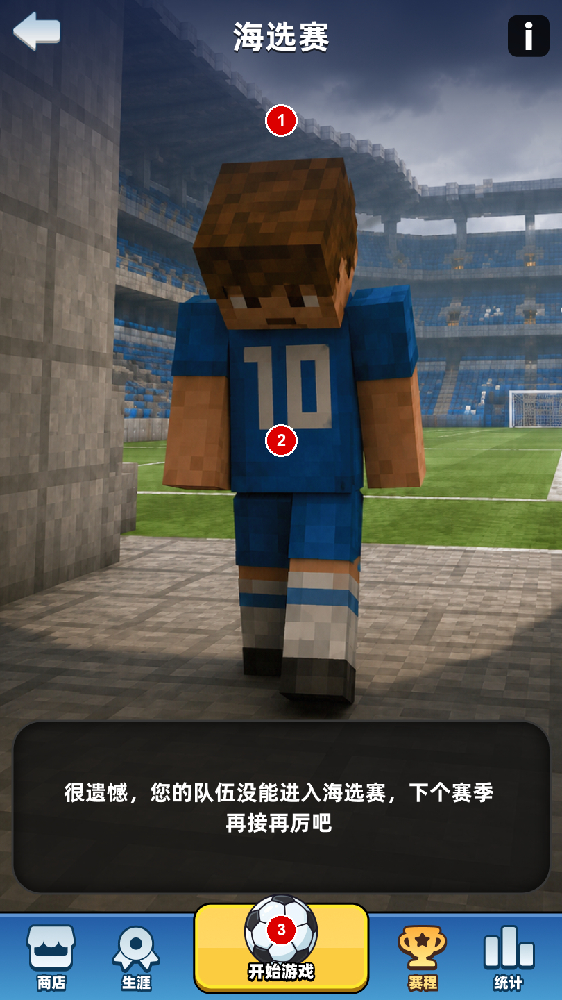
| 标号 | 图中内容 | 规则说明 |
|---:|---|---|
| 1 | 标题“海选赛” | 海选阶段但玩家未加入。 |
| 2 | 球员背影与说明文案 | 提示错过报名/未进入海选，无法参与当前阶段。 |
| 3 | 底部导航 | 仍可切换查看其他活动页。 |

## 赛程——海选赛阶段
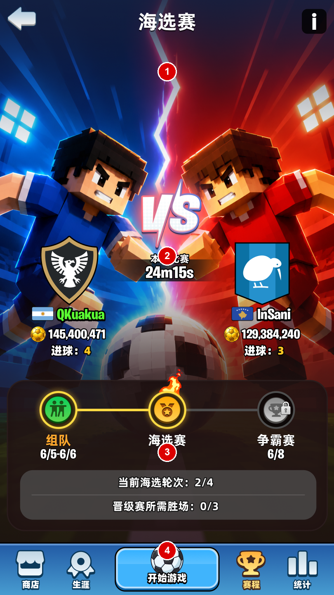
| 标号 | 图中内容 | 规则说明 |
|---:|---|---|
| 1 | 标题“海选赛”与倒计时 | 展示当前海选阶段剩余时间。 |
| 2 | 双方 VS 对阵区 | 展示本轮对阵双方、评分和胜场。 |
| 3 | 队伍状态与晋级信息 | 展示当前海选轮次和晋级要求。 |
| 4 | 底部导航 | 切换赛事、竞猜、排名等入口。 |

## 赛程弹窗
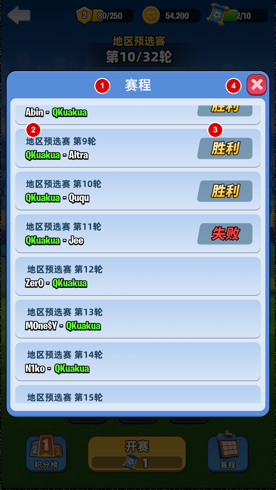
| 标号 | 图中内容 | 规则说明 |
|---:|---|---|
| 1 | 弹窗标题“赛程” | 展示联赛轮次列表；背景比赛页和底部入口不作为本弹窗标注对象。 |
| 2 | 赛程比赛行 | 同一比赛行组件覆盖已完成、胜利、失败、未完成四类状态；完成后展示结果标签，未完成行不显示结果并可按配置跳转或只读。 |
| 3 | 比赛结果状态标签 | 胜利、失败、空状态复用同一状态位；状态由比赛结果下发，前端不本地推导。 |
| 4 | 关闭按钮 | 关闭弹窗返回战前页。 |

## 选择队伍
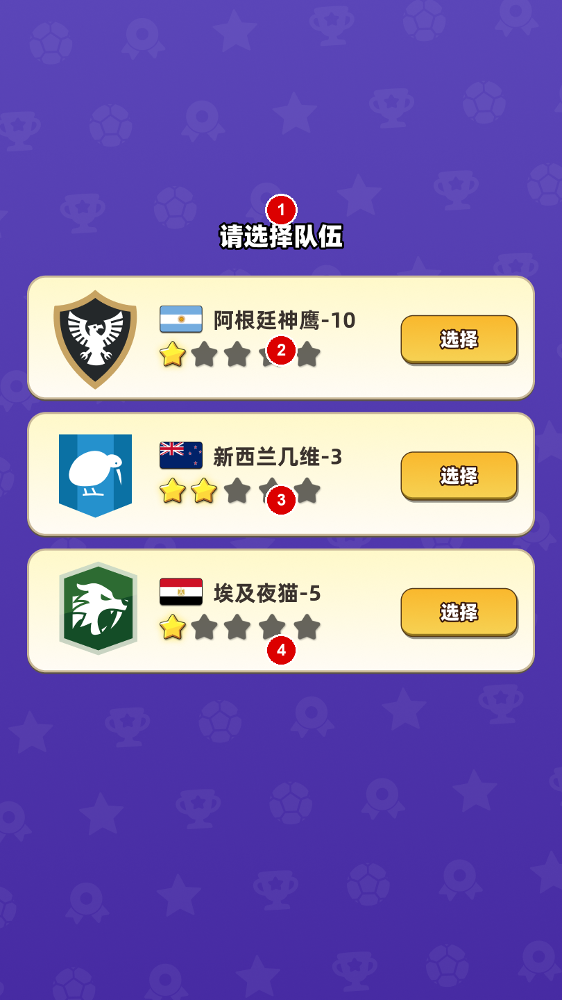
| 标号 | 图中内容 | 规则说明 |
|---:|---|---|
| 1 | 标题“请选择队伍” | 进入首签球队选择流程。 |
| 2 | 候选球队卡 1 | 默认或按国籍生成的候选球队；点击可查看合同。 |
| 3 | 候选球队卡 2 | 候选队伍星级、国家、名称、队标均由配置下发。 |
| 4 | 候选球队卡 3 | 三支首签球队应为同星级，仅名称/地区差异。 |

## 重试
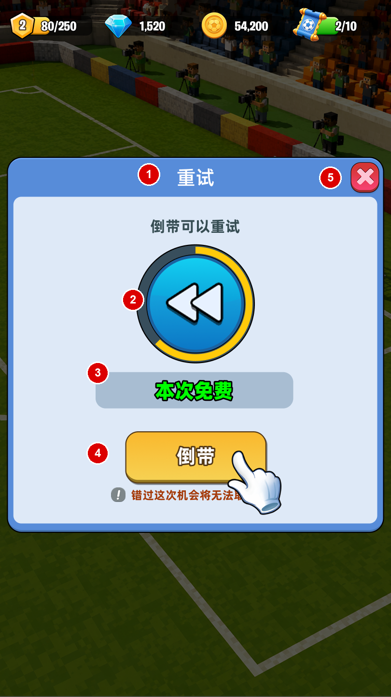
| 标号 | 图中内容 | 规则说明 |
|---:|---|---|
| 1 | 弹窗标题“重试” | 切片失败后出现；背景球场和顶部资源栏不作为本弹窗标注对象。 |
| 2 | 倒带图标 | 表示回溯到该切片初始状态；图标和外圈进度表现由资源状态决定。 |
| 3 | 消耗状态条 | 免费次数优先消耗；免费时展示“本次免费”，无免费次数时展示道具或货币消耗，组件位置保持一致。 |
| 4 | 黄色“倒带”按钮 | 确认回溯；按钮支持正常、置灰、点击中状态，提交时需防重复点击。 |
| 5 | 关闭按钮 | 关闭视为放弃回溯，进入失败流程。 |

