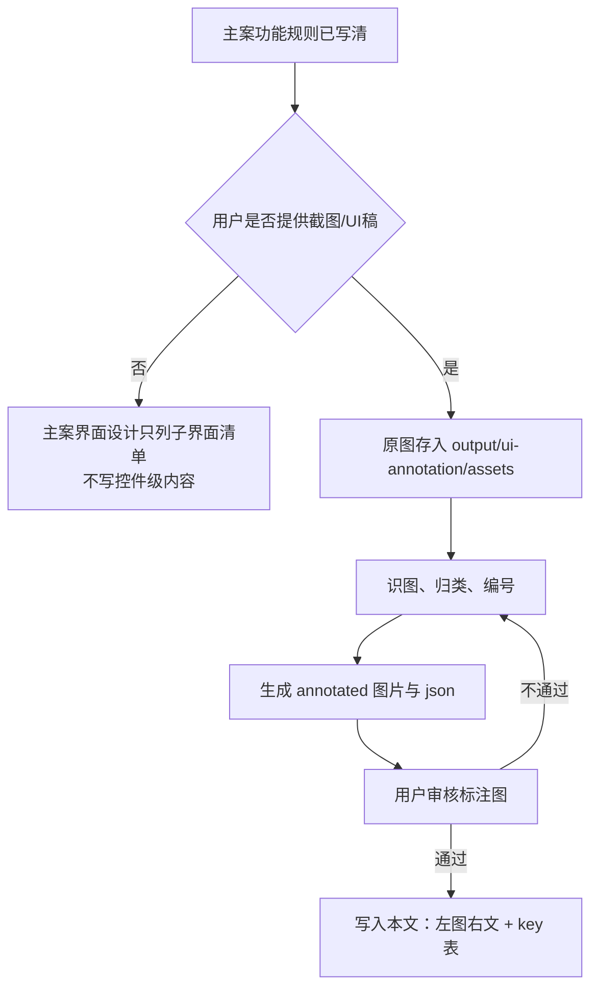

# K1新服大地图重构 · 界面标注（派生文档）

> **定位**：主策划案 [K1新服大地图重构.md](K1新服大地图重构.md) 之界面设计 SSOT。  
> **规则层**在主案「详细规则」；本文只收界面规则、控件状态、文案 key 与交互标注。  
> 当前未提供截图/UI 稿，本文只建立标注流程和子界面清单，不写控件级内容。

---

## 标准流程（用户提供图片后）

### 硬性约束

- **无图不写控件**；不得凭相似系统补图里没有的元素。
- 功能触发、结算、资格、数值写在主案；按钮态、布局、文案 key 和交互反馈写在本文。
- 新建 key 按 K1 功能名前缀命名；正式落地前必须对 localization 查重。当前无查重源时，在备注注明“新建·未查重”。

---

## 子界面清单与进度

| 模块 | 界面 ID | 界面名 | 源图 | 标注 | 已写本文 | 已同步钉钉 |
|------|---------|--------|------|------|----------|------------|
| 大地图 | `new-server-map-main` | 新服大地图主界面 | 待收图 | ☐ | ☐ | ☐ |
| 大地图 | `fortress-detail` | 堡垒详情弹窗 | 待收图 | ☐ | ☐ | ☐ |
| 大地图 | `strategic-point-detail` | 龙巢/火龙巢/圣坛详情弹窗 | 待收图 | ☐ | ☐ | ☐ |
| 联盟 | `alliance-strategy` | 联盟战略目标列表 | 待收图 | ☐ | ☐ | ☐ |
| 迷雾 | `fog-unlock-notice` | 迷雾开放提示 | 待收图 | ☐ | ☐ | ☐ |
| 王座 | `throne-entry` | 王座入口/详情 | 待收图 | ☐ | ☐ | ☐ |
| 引导 | `first-fortress-guide` | 首次占领堡垒引导 | 待收图 | ☐ | ☐ | ☐ |

---

## 单屏模板（收图后填写）

### 界面名

| 项 | 内容 |
|----|------|
| 界面 ID | `待填写` |
| 源图 | `output/ui-annotation/assets/{界面ID}.png` |
| 标注图 | `output/ui-annotation/assets/{界面ID}_annotated.png` |
| 钉钉占位 | `<!-- IMG: 界面名 \| 界面ID -->` |

#### 概述

待收图后填写：入口、默认状态、主要可操作对象、异常态和空态。

#### 左图右文

| 编号 | 说明 |
|------|------|
| 1 | 待收图后标注。涉及文案时只引用 key 名，中文内容统一登记在文末。 |

---

## 本地化文本汇总

| 枚举 KEY | 中文内容 | 占位符传参说明 | 备注 |
|----------|----------|----------------|------|
| 待收图 | 待收图 | 待收图 | 待收图后查重 |
