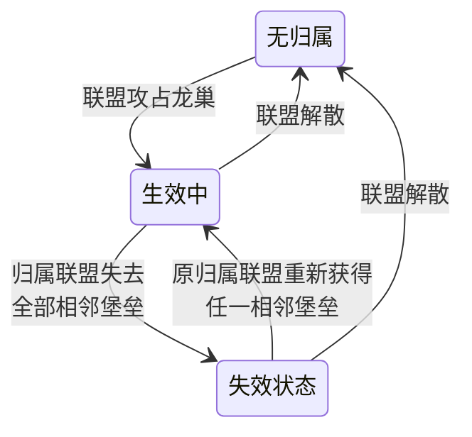

# 《大地图重构GDD》精简复测报告

> 复测日期：2026-08-06  
> 重审基线：[K1新服大地图重构功能策划案.md](./K1新服大地图重构功能策划案.md)，版本 v1.3；9,969 字符、283 行、5 个一级标题、10 个二级标题、70 行表格数据、2 个 Mermaid 图。  
> 在线参考：[大地图重构GDD](https://alidocs.dingtalk.com/i/nodes/20eMKjyp81R0Ndp0Cej45LkMWxAZB1Gv)，已读取快照的变更记录至 v1.2，仅用于核对用户指出的染色规则和 Hex 内容，不作为覆盖 v1.3 的权威基线。  
> 操作边界：本报告只修改本地复测材料；未调用钉钉写入、覆盖、追加或块编辑命令。

## 1. 结论

前一版“可以安全精简”的结论撤回，大地图应退回重审。本报告现提供的是 **v1.3 重审候选稿**：只有源规则覆盖矩阵全部闭环、所有从主案移出的内容都有真实落点，才可转为通过；目标派生文档不存在的项目必须继续留在候选稿中。这里减少的是主案体积，不代表项目总信息被删除：K1 关键业务常量在主案保留语义与 ID 关联；任务配置 ID、代码路径和本地化命中已由既有《计数排行排查清单》承接；详细技术方案与测试用例尚不存在，相关核对项继续保留在候选稿中。重点是：

1. 将重复规则收敛到唯一落点；
2. 先拆分机制、玩家行为与视觉参数；只有目标文件、章节、内容和版本都核验完成，才将视觉参数计为已迁移；
3. 条件判定图与同义文字重复时可合并为表；状态流转图保留为详细 SSOT；
4. 保留四邻拓扑、缩略地图自动呼出、联盟染色循环、神器发放范围、PVE 计数口径、联盟商店投放意图、并发结算、名额不足提示、龙巢失效、迷雾限制、KVK 往返和数据兼容等高风险规则。

按本报告附带的精简稿预览复算，正文从 **9,969 字符 / 283 行** 收敛到 **5,225 字符 / 200 行**，字符减少 **47.6%**、行数减少 **29.3%**。压缩率超过 40%，因此本次按高风险精简执行逐条覆盖核验；不得为了追求更高比例而删除边界、玩家行为、染色机制、常量关联、未闭环迁移项与兼容规则。

## 2. 前后对比总览

| 维度 | 精简前 | 精简后建议 | 变化 |
|---|---:|---:|---|
| 正文字符数 | 9,969 | 5,225 | 减少 47.6% |
| 正文行数 | 283 | 200 | 减少 29.3% |
| Mermaid 图 | 2 | 1 | 条件判定图合并为表；龙巢状态流转图保留 |
| 主案中的 Hex 色值 | 在线 v1.2 快照含 12 组；本地 v1.3 未收录 | 不计入“已迁移” | 目标落点未闭环，发布前须在源或派生文档保留 |
| 主案中的关键常量 ID | 2 个 | 2 个 | 保留业务语义与常量关联，不展开字段 schema |
| 主案中的代码文件路径 | 3 个 | 0 | 既有《计数排行排查清单》已承接具体路径 |
| 主案中的本地化命中统计 | 3 组 | 0 | 既有《计数排行排查清单》已承接命中数与 key |
| 高风险自检表 | 14 项，混合业务/技术/QA | 6 条业务兼容总则 + 6 组暂存核对项 | 技术方案与测试用例不存在，暂不迁出 |

## 3. 精简审查表

| 位置 | 标签 | 动作 | 唯一落点 | 理由 |
|---|---|---|---|---|
| 变更记录 | `protect` | 原样保留 | 主案“变更记录” | 属于版本追溯信息 |
| 简介中的功能简述、对标要点与非目标 | `merge` | 合并为“目标与范围” | 主案“目标与范围” | 三处共同回答本期做什么、不做什么 |
| 关键决策表 | `protect` | 保留并作为摘要 | 主案“关键决策” | 承载评审所需的核心取舍 |
| 7200×7200、24×24、四邻拓扑 | `protect` | 保留，删除其他章节同义重复 | 主案“地图与出生” | 直接影响攻击资格和空间结构 |
| 堡垒可配置字段枚举 | `relocate` | 主案只写用途 | 配置表结构文档 | 字段 schema 不属于功能规则 |
| 最高 LOD 自动呼出缩略地图、HUD 按钮直接打开 | `protect` | 主案保留两种玩家入口行为 | 主案“地图与出生” | 决定玩家如何进入功能，属于系统行为而非纯 UI 参数 |
| 12 组联盟染色 Hex | `protect` | 暂时保留；建议移动到派生文档：大地图重构-界面标注或联盟颜色配置。 | 在线参考中的原章节 | 属于视觉参数，但现有派生文档未命中具体内容 |
| 联盟染色抽取与色池重置 | `protect` | 保留首次占领触发、不放回随机和色池重置规则 | 主案“地图与出生” | 属于业务触发、分配机制与循环边界，不能随 Hex 参数迁出 |
| 原区域 ID 到新区域 ID 示例 | `relocate` | 改为“由出生配置映射” | 配置表结构文档 | 示例 ID 容易被误当成正式配置 |
| 堡垒进攻 Mermaid 与后续文字 | `merge` | 合并为一张判定表 | 主案“堡垒占领” | 两种媒介重复同一判断链 |
| 常量 10135678、10135681 | `protect` | 保留“占领上限/低余量阈值”与常量 ID 的关联 | 主案“堡垒占领” | K1 以关键常量关联支持评审、配表核对和问题追溯 |
| 名额充足、低余量、满额三种状态 | `protect` | 合并为状态表 | 主案“堡垒占领” | 包含提示、拦截和结果反馈 |
| 龙巢状态文字与 Mermaid | `protect` | 保留 Mermaid 作为详细状态 SSOT，文字压缩为补充规则 | 主案“地图对象” | 状态图比表格更直接地表达失效、恢复与归零流转 |
| 圣坛规则在简介、决策、对象章节重复 | `merge` | 决策留摘要，对象章节留唯一细则 | 主案“地图对象” | 避免多处维护归属口径 |
| 联盟主干能力长枚举 | `reuse` | 收敛为“除明确改动外沿用现状” | 主案“联盟与 KVK” | 无变化能力无需逐项重写 |
| 联盟商店增加橙色英雄等高价值物品 | `protect` | 主案保留“增加高价值投放”的业务意图，具体商品由运营配置 | 主案“联盟与 KVK” | 投放意图属于本期功能变化，商品清单才属于配置 |
| KVK 报名、进入、结束多处同义说明 | `merge` | 合并为一组往返规则 | 主案“联盟与 KVK” | 保留原服不冻结这一关键例外 |
| v1.3 神器自动发放范围 | `protect` | 详细规则只保留每个区域第 1、2 名自动发放 | 主案“计数、排行与替换” | 当前奖励范围属于业务规则，版本变化由 v1.3 变更记录承接 |
| “原仅向第 1 名发放的规则废止” | `delete` | 从详细规则删除重复版本过程 | 无（v1.3 变更记录已覆盖） | 不影响当前发奖行为 |
| “火龙巢/龙巢统一称谓”的修订说明 | `delete` | 正文统一使用“龙巢”，删除过程说明 | 无（v1.1 变更记录已覆盖） | 已落实的术语修正不是业务规则 |
| 出生区、领土范围和列表来源的旧→新过程句 | `merge` | 改写为当前最终状态 | 对应详细规则 | 保留最终系统行为，不在细则重复版本比较 |
| PVE 活动基础计数与迷雾适配 | `protect` | 保留基础计数不变及条件适配口径 | 主案“计数、排行与替换” | 决定活动统计是否变化及何时适配 |
| 任务/成就配置 ID 清单 | `relocate` | 主案只保留替换映射 | 《计数排行排查清单》“逐类详细排查结果”“任务与成就” | 目标文件存在，枚举、配置行和冲突风险均已实际承接 |
| 红点挂载代码路径 | `relocate` | 从主案移出 | 《计数排行排查清单》“3.3 红点触发源” | 目标文件存在，具体框架、判断路径和风险点均已实际承接 |
| 本地化命中数与 key 示例 | `relocate` | 从主案移出 | 《计数排行排查清单》“3.5 多语言文案” | 目标文件存在，权威文案源、命中数和 key 均已实际承接 |
| 边界表与正文重复条目 | `merge` | 正文保留通用规则，边界表只留例外 | 主案“边界与兼容” | 建立唯一 SSOT |
| 龙巢占领上限已满时“按项目规则” | `clarify` | 明确标记待规则负责人定案 | 主案“地图对象” | 当前表述没有可执行结论 |
| 高风险自检的技术与测试项 | `protect` | 暂时保留；建议移动到派生文档：大地图重构-技术方案、大地图重构-测试用例。 | 主案“边界与兼容 → 技术与验收核对（暂存）” | 归属虽应调整，但目标派生文档尚不存在 |
| “肉鸽关卡数值变更：不涉及” | `delete` | 删除 | 无 | 与本功能无关，属于模板噪声 |
| 配置表字段边界说明与链接 | `reuse` | 保留一次链接，合并用途表 | 主案“配置依赖” | 复用现有配置表结构，不重新定义字段 |

审查汇总：`delete` 3 项、`reuse` 2 项、`merge` 6 项、`relocate` 5 项、`clarify` 1 项、`protect` 13 项。未创建新的 UI 标注、技术方案或测试用例；相应内容暂时保留，且不计入已迁移。既有派生文档只有在文件存在且具体内容命中时才作为迁移落点。

### 3.1 迁移闭环核验

| 源内容 | 候选目标 | 文件存在 | 具体内容命中 | 版本一致 | 结论 |
|---|---|---|---|---|---|
| 12 组联盟染色 Hex | 大地图重构-界面标注或联盟颜色配置 | 否 | 否 | 无法判断 | 暂时保留；建议移动到派生文档：大地图重构-界面标注或联盟颜色配置。 |
| HUD 按钮样式、LOD 技术参数 | 大地图重构-界面标注 | 否 | 否 | 无法判断 | 暂时保留；建议移动到派生文档：大地图重构-界面标注。自动呼出与直接打开行为继续保留在主案。 |
| 地图、出生、堡垒字段结构 | `K1新服大地图重构功能策划案-配置表结构.md` | 是 | 是 | 需随 v1.3 发布复核 | 候选复用 |
| 旧任务、计数与排行排查证据 | `K1新服大地图重构功能策划案-计数排行排查清单.md` | 是 | 是；含 PVE 保持不变说明 | 需随 v1.3 发布复核 | 候选复用 |
| 任务/成就配置 ID | `K1新服大地图重构功能策划案-计数排行排查清单.md` | 是 | 是；见“逐类详细排查结果”“3.1 任务与成就” | 与本地源同仓基线，发布前复核 | 已承接，可迁移 |
| 红点代码路径 | `K1新服大地图重构功能策划案-计数排行排查清单.md` | 是 | 是；见“3.3 红点触发源” | 与本地源同仓基线，发布前复核 | 已承接，可迁移 |
| 本地化命中数与 key | `K1新服大地图重构功能策划案-计数排行排查清单.md` | 是 | 是；见“3.5 多语言文案” | 与本地源同仓基线，发布前复核 | 已承接，可迁移 |
| 地图美术需求 | `K1新服大地图重构功能策划案-美术需求.md` | 是 | 未命中 Hex、染色池、HUD 或 LOD | 需随 v1.3 发布复核 | 不能承接上述缺口 |
| 高风险技术实现与详细测试项 | 大地图重构-技术方案、大地图重构-测试用例 | 否 | 否 | 无法判断 | 暂时保留；建议移动到派生文档：大地图重构-技术方案、大地图重构-测试用例。 |

现有 `K1新服大地图重构_开发checklist_精简版.xlsx` 可继续作为执行清单，但本次只做只读复测，未把其中任何内容视为已经完成迁移。

## 4. 核心段落前后对比

### 4.1 缩略地图与联盟染色

**精简前**：正文同时描述 HUD 按钮、无级缩放、最高 LOD、随机染色池重置，并附 12 行 Hex 色值。

**精简后**：

> 缩略地图复用现有 KVK 领土界面，展示堡垒格、战略对象和联盟归属；联盟按不同颜色区分。界面标注与颜色配置尚不存在，控件样式、LOD 技术参数和 Hex 色值暂时保留；建议移动到派生文档：大地图重构-界面标注或联盟颜色配置。
>
> 无级缩放到最高 LOD 时自动呼出缩略地图，HUD 按钮也可直接打开。

- **缩略地图入口**
  - 无级缩放到最高 LOD 时自动呼出缩略地图。
  - 玩家也可通过 HUD 按钮直接打开。

- **联盟染色**
  - 联盟首次占领时，从当前染色池中不放回随机一个颜色。
  - 染色池全部用完后，将全部颜色放回，再开启新一轮不放回随机。

结果：主案保留两种入口行为以及染色触发、抽取方式和色池重置规则。具体控件样式、LOD 技术参数与 Hex 色值只有在目标文件、章节、内容和版本核验完成后才能迁出；本次尚未闭环。

### 4.2 堡垒进攻资格

**精简前**：关键决策表、流程图、“相邻扩张”和“边界情况”四处重复首战锚点、四邻、免战与成功占领。

**精简后**：

| 联盟状态 | 可攻目标 | 额外限制 |
|---|---|---|
| 尚无普通堡垒 | 初始共享堡垒四邻的普通堡垒 | 目标不得处于免战 |
| 已有普通堡垒 | 任一已占普通堡垒四邻的普通堡垒 | 飞地仍可作为扩张起点；目标不得处于免战 |

> 攻击、战斗与占领复用现有 KVK 堡垒战；成功后目标归属进攻联盟并进入配置免战时间。

结果：一张表成为详细规则 SSOT，关键决策只保留“四邻扩张”的摘要。

### 4.3 堡垒占领名额

**精简前**：占领上限、低余量、满额拦截、按钮显隐分散在多个小节，并直接写常量 ID。

**精简后**：

| 剩余名额 | 攻击/集结新堡垒 | 放弃入口 |
|---|---|---|
| 大于等于低余量阈值 | 正常发起 | 隐藏 |
| 大于 0 且低于阈值 | 二次确认后发起 | 仅 R4/R5 可见 |
| 等于 0 | 拦截并提示先放弃堡垒或提升联盟科技 | 仅 R4/R5 可见 |

结果：保留三种状态、权限、提示和结果；K1 主案继续标注占领上限常量 `10135678` 与低余量阈值常量 `10135681`，字段结构仍由配置文档维护。

### 4.4 龙巢失效与恢复

**精简前**：五条文字规则和一张状态图重复表达“失去全部相邻堡垒后失效、重新取得后恢复”。

**精简后**：

> 失效状态保留原归属、暂停加成、不可防守，但仍可被其他联盟攻击；恢复还要求龙巢未被其他联盟夺取。

结果：状态图保留为详细 SSOT，文字只补充图中不宜承载的状态效果和恢复约束。

### 4.5 联盟主干能力

**精简前**：逐项列出报名、退出、弹劾、盟主竞选、公告、投票、聊天、官员、机器人、联盟礼物等十余项不变能力。

**精简后**：

> 除本节明确调整的领土判定、建筑入口、迁城、解散和科技外，联盟主干能力沿用现状。

结果：不改变范围，只消除“无变化映射”噪声。

### 4.6 任务、红点与本地化排查

**精简前**：正文包含任务 ID、配置表字段、三个代码路径，以及“方尖碑 142 条、远征堡垒 57 条”等检索证据。

**精简后**：

> 新服模板不得继续投放依赖方尖碑、中心堡垒、远征堡垒或旧龙巢连接规则的任务、排行、红点和文案；按目标价值映射到普通堡垒、龙巢、圣坛和王座。具体配置 ID、代码挂载点和本地化 key 由既有《K1新服大地图重构功能策划案 · 计数与排行排查清单》维护。

结果：主案保留“必须替换什么、替换成什么”，排查证据迁到执行清单。

### 4.7 数据兼容与高风险自检

**精简前**：14 行检查表混合业务结论、技术实现、测试覆盖和无关模板项。

**精简后**：主案收敛新旧模板隔离、最低版本拦截、旧任务热更、转服、联盟变更、KVK 往返六类业务结论；技术方案与详细测试用例尚不存在，因此字段默认值、真实数据回归、通知兼容、占位符和战斗覆盖等核对项暂时保留，并仅在报告中建议后续迁移。

## 5. 精简后正文预览（不回写）

<!-- COMPACT_DRAFT_START -->
# 变更记录

| 版本 | 变更类型 | 变更内容 | 经办人 | 时间 |
|---|---|---|---|---|
| v1.0 | 新建 | 基于输入草案整理为功能开发策划案 | 蒋镇宇 | 2026-07-10 |
| v1.1 | 修订 | 统一龙巢术语，补充领土保护、联盟科技与转服口径 | 蒋镇宇 | 2026-07-13 |
| v1.2 | 修订 | 补充堡垒占领上限、低余量确认、满额拦截和放弃规则 | 蒋镇宇 | 2026-07-17 |
| v1.3 | 修订 | 神器自动发放范围由每个区域第 1 名扩大为每个区域前 2 名 | 蒋镇宇 | 2026-07-31 |

# 目标与范围

- 目标：降低新服大地图参与难度与联盟管理成本，强化联盟战略边界、争夺焦点和玩家早期目标感。
- 本期将新服原服地图调整为方格化战略地图，以堡垒占领替代方尖碑扩张，并适配龙巢、圣坛、迷雾、联盟领土、任务计数和 KVK 往返。
- 本期复用现有大地图/KVK 技术基础、堡垒战、龙巢、圣坛、王座战、联盟主干与商业化模型。
- 不重构 KVK 玩法、老服大地图、KVK 阵营/匹配/天气/女神机制，也不引入完整 KVK 活动规则。

# 关键决策

| 维度 | 决策 | 约束 |
|---|---|---|
| 地图 | 新服原服采用 7200×7200 方格地图 | 仍是原服，不是 KVK 战场 |
| 拓扑 | 堡垒方格采用四邻 | 对角不提供相邻关系或攻击资格 |
| 扩张 | 联盟占领相邻普通堡垒扩张领土 | 新服关闭方尖碑、中心堡垒、远征堡垒建造链 |
| 出生 | 新服设置 4 个出生区 | 只作分流，不代表阵营 |
| 首战 | 永久中立的初始共享堡垒提供公共锚点 | 不可被联盟占领 |
| 龙巢 | 位于堡垒交叉点并独立争夺 | 失去全部相邻堡垒后失效，不自动转移归属 |
| 圣坛 | 嵌入指定堡垒 | 归属和加成随堡垒变化 |
| 王座 | 复用 K1 现有王座战 | 仅适配入口、时间、位置和可达性 |
| 迷雾 | 首版按开服时间全服解锁 | 混合进度驱动不在本期 |
| KVK | 报名、进入和回归不变 | 原服归属保留，原服地图不冻结 |
| 计数 | 旧地图目标替换为新地图目标 | 新服不得继续要求旧建筑目标 |
| 兼容 | 新旧服务器模板隔离 | 低版本客户端必须拦截或降级 |

# 详细规则

## 地图与出生

- 地图尺寸为 7200×7200，基础结构为 24×24；可用堡垒格扣除王座区和特殊阻挡区。
- 普通堡垒是联盟领土的最小归属单位；相邻关系只认上、下、左、右。
- 龙巢显示在多个堡垒交叉区域，圣坛显示在所属堡垒内，王座独立显示在中心区。
- **缩略地图**
  - 复用现有 KVK 领土界面，展示堡垒格、战略对象和联盟归属。
  - 无级缩放到最高 LOD 时自动呼出缩略地图。
  - 玩家也可通过 HUD 按钮直接打开。
  - 界面标注与颜色配置尚不存在，控件样式、LOD 技术参数与 12 组 Hex 色值暂时保留；建议移动到派生文档：大地图重构-界面标注或联盟颜色配置。
- **联盟染色**
  - 联盟首次占领时，从当前染色池中不放回随机一个颜色。
  - 染色池全部用完后，将全部颜色放回，再开启新一轮不放回随机。
- 新服设 4 个出生区。玩家首次进入时复用现有分配规则，原区域到新区域的映射由配置定义。
- 出生区只影响初始分流；玩家和联盟仍保留区域属性。加盟与迁城可跨出生区，但必须满足目标区域迷雾已开放。

## 堡垒占领

联盟领土等于该联盟已占领的普通堡垒集合。

| 联盟状态 | 可攻目标 | 限制 |
|---|---|---|
| 尚无普通堡垒 | 初始共享堡垒四邻的普通堡垒 | 目标不得处于免战 |
| 已有普通堡垒 | 任一已占普通堡垒四邻的普通堡垒 | 飞地仍可作为扩张起点；目标不得处于免战 |

- 初始共享堡垒永久中立，不可被任何联盟占领。
- 攻击、战斗与占领复用现有 KVK 堡垒战。占领成功后归属进攻联盟，并进入配置免战时间。
- 堡垒脱离联盟其他领土后形成飞地，归属与加成不变，仍可作为扩张起点。
- 允许多个联盟同时进攻同一堡垒；胜者成为新的防守方，后续战斗继续按现有规则结算。
- 若提供攻击资格的起点堡垒在战斗中被夺，本场仍结算；进攻方即使胜利，部队也立即返回，且不增加目标占领时间。
- 多场并发结算导致占领数超过科技上限时，拦截结算更晚的战斗对应堡垒。
- 堡垒归联盟所有。联盟解散后，其普通堡垒转为中立。
- 免战堡垒不可被攻击；免战触发时立即遣返堡垒内及后续到达部队。

剩余名额 = 当前占领上限 - 已占普通堡垒数。

- **占领名额配置**
  - 占领上限由常量 `10135678` 配置，并叠加盟科技加成。
  - 低余量阈值由常量 `10135681` 配置。

| 剩余名额 | 攻击/集结新堡垒 | 放弃入口 |
|---|---|---|
| 大于等于低余量阈值 | 正常发起 | 隐藏 |
| 大于 0 且低于阈值 | 所有有权发起者均需二次确认；取消则不发起 | 仅 R4/R5 可见 |
| 等于 0 | 拦截并提示“请先放弃堡垒或提升联盟科技” | 仅 R4/R5 可见 |

- R4/R5 可放弃已占普通堡垒，放弃时长由配置定义，可为 0；R1-R3 始终无入口。
- 放弃成功后堡垒转为中立，立即重算剩余名额并刷新确认与入口状态。
- 放弃导致龙巢失去唯一相邻堡垒时，按龙巢失效规则处理；进行中战斗仍按并发规则结算。

## 地图对象

### 龙巢

- 龙巢复用既有对象类型、显示、战斗、占领和加成规则。
- 龙巢位于多个堡垒的交叉区域。联盟占领任一相邻普通堡垒后获得攻击资格，龙巢不随堡垒自动归属。

- 失效状态保留原归属、暂停加成、不可防守，但仍可被其他联盟攻击。
- 恢复还要求龙巢未被其他联盟夺取。

- 联盟科技可限制龙巢占领数量。名额已满时的拦截、替换或放弃规则由龙巢规则负责人补充定案，不能仅写“按项目规则”。

### 圣坛、王座与野外对象

- 圣坛嵌入指定堡垒，不单独争夺；占领堡垒即获得圣坛加成，堡垒归属变化时圣坛同步变化，加成复用现有规则。
- 王座复用现有规则。
- 普通野怪保留 1—50 级首杀和逐级挑战，不因城堡等级跳过限制；泰坦保留分级首杀和逐级挑战；黑暗祭祀、恶魔守卫暂不刷新。

## 迷雾

迷雾是服务器共享状态，不是个人探索视野，按开服时间自动全服解锁。

| 层级 | 区域 | 开放时间 |
|---|---|---|
| 0 | 4 个出生区 | D0；可按区域独立配置开关 |
| 1 | 中间圈 | D8 |
| 2 | 核心圈 | D15 |
| 3 | 王座区 | D21 |

- 未开放区域保留堡垒、龙巢、圣坛和王座的美术轮廓，但隐藏铭牌、LOD、归属、类型与战斗状态；屏蔽点击，部队和城堡不可进入。
- 开放后恢复数据层、点击和通行；玩家在线时刷新地图状态，系统提示或入口红点按项目统一规范处理。

## 联盟与 KVK

- 除本节明确调整的领土、建筑入口、迁城、解散和科技外，联盟主干能力沿用现状。
- 联盟领土范围为该联盟已占普通堡垒的范围合集；领土保护状态变化沿用现有规则。
- 新服关闭中心堡垒、远征堡垒和方尖碑建造入口；提供堡垒列表，并保留龙巢列表、堡垒属性、圣坛效果汇总和领地资源收益。
- 与旧建筑直接绑定的任务、活动、引导和红点不得触发；领地排行增加普通堡垒积分。
- 联盟迁城必须落在本联盟领土内，并沿用与盟主城堡的距离限制；首次迁城不是首战前置条件。
- 联盟解散后，普通堡垒和龙巢转为中立，圣坛随堡垒归属变化。
- 联盟科技按服务器开关生效，用于提升普通堡垒和龙巢占领上限。
- 联盟商店增加高价值投放，具体商品由运营配置维护。
- KVK 报名、进入和回归方式不变。参战期间原服普通堡垒、龙巢、圣坛和王座归属保留，但原服地图不冻结，仍可争夺和开放迷雾。
- KVK 期间原服普通堡垒和龙巢占领时间可由配置倍率调整，联盟冻结沿用现状。
- KVK 结束不重置原服战略对象；若对象在参战期间已按原服规则被夺取，则保留最新归属。

## 计数、排行与替换

旧目标按玩家目标价值映射到新地图目标，不要求名称一一对应。

| 旧目标 | 新目标 |
|---|---|
| 建造方尖碑 | 占领普通堡垒 |
| 修建/升级中心堡垒或远征堡垒 | 取消 |
| 连接龙巢 | 占领龙巢相邻堡垒，或攻击并占领龙巢 |
| 占领龙巢 | 占领交叉点龙巢 |
| 占领圣坛 | 占领带圣坛的堡垒 |
| 王座目标 | 参与王座战、占领王座或获得王座积分 |
| 联盟领地面积 | 联盟已占普通堡垒数 |
| 联盟建筑战斗 | 堡垒战、龙巢战或王座战 |

- 新服不得投放依赖旧地图结构的任务、成就、排行、引导、红点或文案；已经投放的内容须热更替换或隐藏，并按影响补偿。
- 区域排行结算时，每个区域排名第 1、2 名的玩家自动发放神器。
- PVE 活动的野怪、泰坦和采集基础计数保持不变；活动要求特定区域或怪物等级时，按新迷雾层级适配。
- 红点替换为堡垒可攻击、龙巢可攻击、迷雾开放和王座开放等有效入口，不得保留空跳转。
- 具体配置 ID、代码挂载点和本地化 key 由既有《K1新服大地图重构功能策划案 · 计数与排行排查清单》维护。

## 边界与兼容

| 场景 | 处理 |
|---|---|
| 玩家退盟/加盟 | 不改变原联盟已占对象；玩家按当前联盟归属重新获得权限，不继承个人历史占领贡献 |
| 圣坛所在堡垒被夺 | 圣坛加成立即随堡垒归属转移 |
| 旧任务已投放 | 热更替换或隐藏，并按影响补偿 |
| 新旧服务器 | 新服使用新模板，旧服继续使用旧模板 |
| 低版本客户端 | 不得进入新地图；无法识别新参数时必须拦截或降级 |
| 热更/配表变更 | 进行中状态按服务器当前模板重算，已领取奖励不回收 |
| 新旧模板间转服 | 复用现有转服流程；转入后按目标服模板参与，迁移验证进入测试用例 |
| KVK 往返 | 不改变原服战略对象归属；原服进度按服务器时间继续推进 |
| 断线重连/重复请求 | 占领、放弃和奖励处理必须保持幂等 |

### 技术与验收核对（暂存）

技术方案与详细测试用例尚不存在，以下内容暂时保留：

- 新地图战斗需覆盖堡垒战、龙巢战、王座战的新实体配置、四邻攻击资格、并发结算和最低客户端版本拦截。
- 原服与 KVK 战场往返需分别验证参战与回归方向的数据一致性。
- 龙巢、圣坛、堡垒、王座复用既有对象类型和显示规则；迷雾不作为新增地图对象处理。
- 若新增迷雾开放、堡垒归属变更等系统通知类型，老客户端必须能够忽略未知通知。
- 若为地图关系、迷雾状态或四邻拓扑扩展共享实体字段，必须使用线上真实数据回归，验证默认值不影响旧服与 KVK。
- 新增提示文案包含参数占位符时，逐条核对各语言的占位符数量与顺序，避免崩溃或显示异常。

建议移动到派生文档：大地图重构-技术方案、大地图重构-测试用例。

# 配置依赖

字段结构复用现有[配置表结构](https://alidocs.dingtalk.com/i/nodes/XPwkYGxZV3R4Xdz4C9Y3QrrBWAgozOKL?utm_scene=team_space)。主案不维护字段类型、表头或最终数值；直接驱动业务分支的 K1 关键常量保留语义与 ID 关联。

| 模块 | 用途 |
|---|---|
| 地图与出生 | 地图尺寸、方格、阻挡、出生映射与容量 |
| 堡垒 | 类型、等级、坐标、四邻、初始共享、附属圣坛、占领与免战 |
| 龙巢与圣坛 | 点位、相邻堡垒、类型、等级、守卫和加成引用 |
| 迷雾 | 层级与开放时间 |
| 占领规则 | 占领时间、低余量阈值、放弃时长、KVK 期间倍率与上限判定 |
| 联盟科技 | 普通堡垒和龙巢占领上限分支 |
<!-- COMPACT_DRAFT_END -->

## 6. 源规则覆盖矩阵

本次压缩超过 40%，以下按业务原子核验高风险规则与候选迁移项。状态不是“已覆盖”的项目会阻止本稿转为安全精简。

| 源规则原子 | 标签 | 精简后落点 | 语义核对 | 状态 |
|---|---|---|---|---|
| v1.3 为当前本地重审基线 | `protect` | 变更记录 | 保留版本、变更范围和日期 | 已覆盖 |
| 最高 LOD 自动呼出缩略地图 | `protect` | 地图与出生 → 缩略地图 | 自动触发行为未迁出 | 已覆盖 |
| HUD 按钮可直接打开缩略地图 | `protect` | 地图与出生 → 缩略地图 | 主动入口行为未迁出 | 已覆盖 |
| 首次占领从染色池不放回随机 | `protect` | 地图与出生 → 联盟染色 | 保留触发、随机方式和不放回约束 | 已覆盖 |
| 色池耗尽后全部放回并重新不放回随机 | `protect` | 地图与出生 → 联盟染色 | 保留耗尽重置循环 | 已覆盖 |
| 12 组 Hex 色值 | `protect` | 尚无闭环落点 | 本地 v1.3 和现有派生文档均未命中；不能证明信息已保存 | **未闭环** |
| 占领上限与低余量阈值由常量配置 | `protect` | 堡垒占领 → 占领名额配置 | 保留常量 `10135678`、`10135681` 的业务关联 | 已覆盖 |
| 龙巢失效、恢复、解散归零 | `protect` | 地图对象 → 龙巢状态图 | 所有状态边及补充约束保留 | 已覆盖 |
| 联盟商店增加高价值投放 | `protect` | 联盟与 KVK | 保留投放意图，商品明细交运营配置 | 已覆盖 |
| 每区第 1、2 名自动发放神器 | `protect` | 计数、排行与替换 | 详细规则只保留当前范围，1→2 的版本过程由 v1.3 变更记录承接 | 已覆盖 |
| PVE 野怪、泰坦、采集基础计数不变 | `protect` | 计数、排行与替换 | 保留“不改基础计数” | 已覆盖 |
| 特定区域或怪物等级按迷雾层级适配 | `protect` | 计数、排行与替换 | 保留适配触发条件 | 已覆盖 |
| 任务/成就配置 ID、红点代码路径与本地化命中 | `relocate` | 既有《计数排行排查清单》对应章节 | 文件存在且逐类详细排查、3.3、3.5 章节分别命中 | 已覆盖 |
| 战斗、跨场景、通知、共享字段与多语言验收项 | `protect` | 边界与兼容 → 技术与验收核对（暂存） | 技术方案与测试用例不存在，原内容未迁出 | 已覆盖 |
| 新旧模板、低版本、热更、转服、KVK 往返与幂等 | `protect` | 边界与兼容 | 业务结论逐项保留 | 已覆盖 |

## 7. 保护项核对

本次精简明确保留：

- 设计目的、范围边界与关键决策；
- v1.3 版本记录及“每个区域前 2 名发放神器”的本期变更；
- 最高 LOD 自动呼出和 HUD 按钮直接打开缩略地图的玩家入口行为；
- 联盟首次占领不放回随机染色、色池耗尽后全部放回并重新随机的完整机制；
- 四邻拓扑、首战锚点、免战、飞地、并发进攻、起点被夺后的结算和超上限拦截；
- 低余量二次确认、满额提示、R4/R5 放弃权限与状态刷新；
- 龙巢失效、恢复、不可防守但可被攻击，以及圣坛随堡垒转移；
- D0/D8/D15/D21 迷雾节奏、未开放区的可见/不可交互/不可通行限制；
- 联盟迁城、解散、科技，KVK 原服归属保留且原服地图不冻结；
- 联盟商店增加高价值投放的业务意图，以及具体商品由运营配置维护的边界；
- PVE 野怪、泰坦、采集基础计数保持不变及按迷雾层级适配的条件；
- 旧任务、计数、排行、红点和本地化替换原则；
- 尚无派生文档承接的战斗、跨场景、通知、共享字段和多语言验收核对项；
- 新旧模板、低版本、热更、转服、KVK 往返、断线重连与幂等兼容规则；
- 变更记录和配置结构引用。

## 8. 待确认项与重审结论

当前有 2 个项目阻止本稿转为“安全精简”：

1. **龙巢占领上限已满时，原文只写“可按项目规则”**，没有明确是发起前拦截、结算时拦截，还是允许替换/放弃旧龙巢。建议由龙巢规则负责人定案后写入“地图对象 → 龙巢”，再同步到配置和测试用例。
2. **在线 v1.2 快照中的 12 组 Hex 色值没有验证过的迁移落点**。发布前应选择一个权威源保留具体值，并在迁移核验表记录目标文件、章节和版本；不能以“属于 UI”为由直接删掉。

因此，大地图维持 **退回重审**。除上述未闭环项外，本报告已补回本次发现的规则丢失，并按 v1.3 校正神器、PVE、缩略地图入口和联盟商店口径；钉钉源文档未修改。
