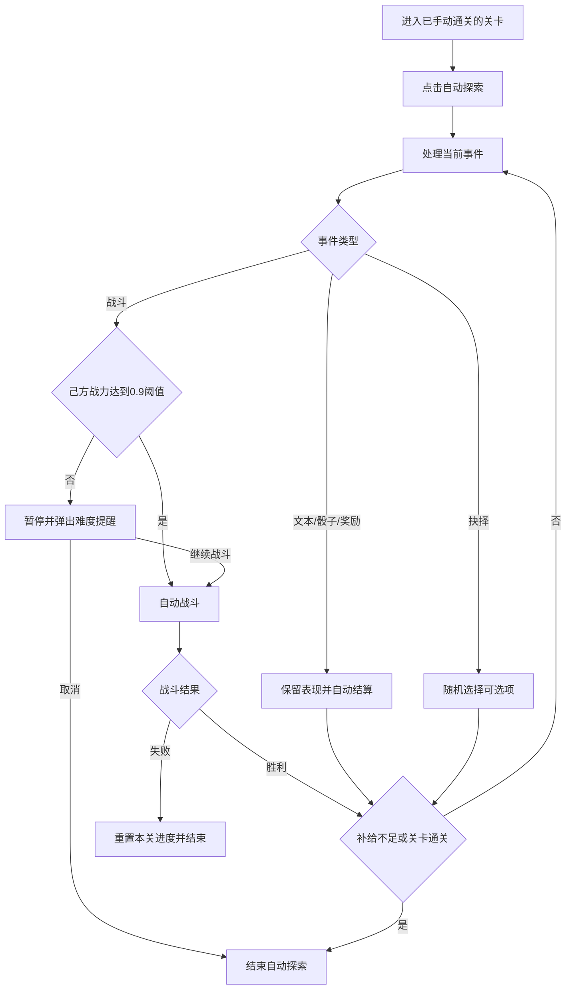
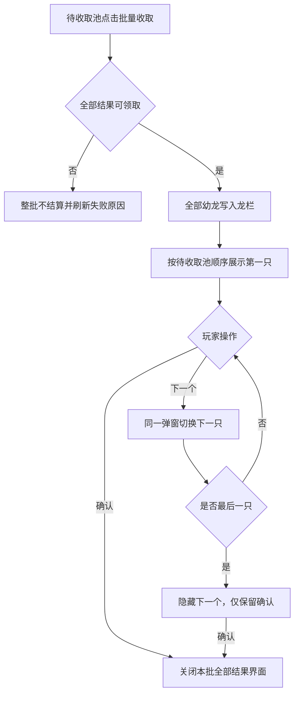
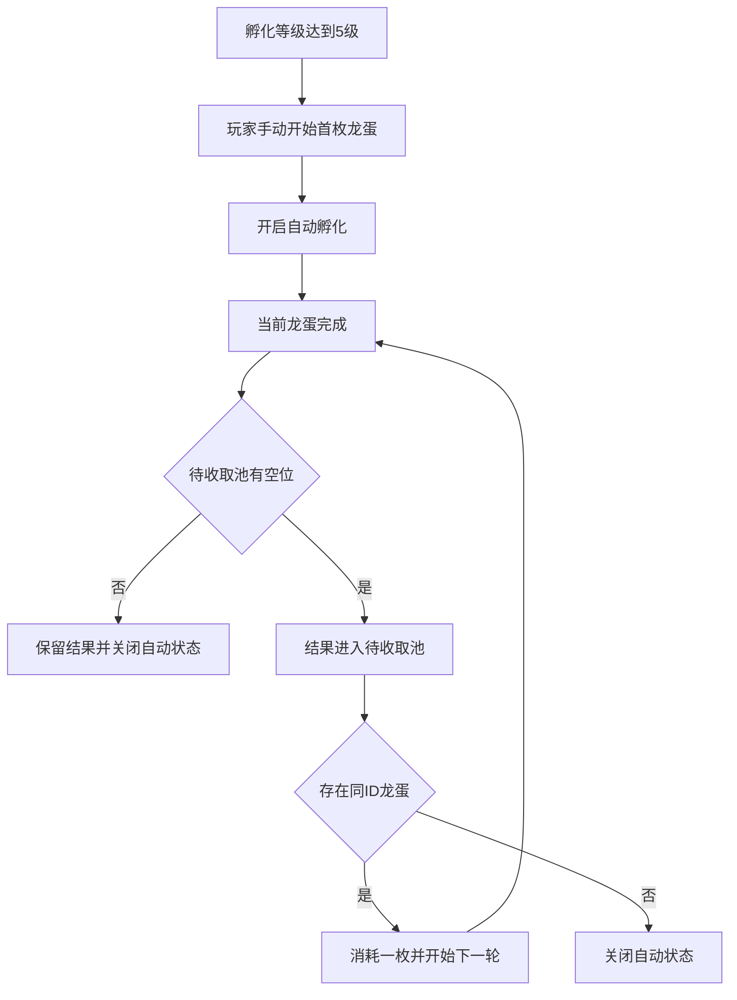

# 巨龙培育2期优化功能策划案

> 文档类型：线上功能增量策划案  
> 适用范围：巨龙培育一期已上线版本  
> 文档状态：评审稿  
> 更新时间：2026-07-27  
> 说明：本文只描述二期优化。一期已上线的培育、孵化、探索、游历、委派、特训和遣散规则继续生效，除本文明确修改的内容外均不调整。

## 变更记录

| 版本 | 变更类型 | 变更内容 | 时间 |
|---|---|---|---|
| v1.0 | 新建 | 根据《巨龙培育2期优化》列表、一期线上规则和现有界面整理二期增量方案 | 2026-07-27 |

## 1. 简介

### 1.1 设计目的

一期已完成巨龙培育的核心循环，二期以减少重复操作、降低误操作成本、强化待办回流和补齐跨界面查看能力为目标：

- 对已经通关的探索关卡提供自动推进能力，同时保留高风险战斗的玩家确认权。
- 对高等级孵化玩家提供同类龙蛋连续孵化能力，减少反复上线接续孵化的操作。
- 提供批量遣散和更明确的状态反馈，防止误遣散重要守护龙。
- 将孵化、探索和游历待办汇总到 HUD，缩短玩家回流路径。
- 补齐特训、委派、己方养成跳转和他人守护龙查看体验。

### 1.2 二期范围

| 编号 | 优化项 | 所属模块 | 本文结果 |
|---|---|---|---|
| 1 | 探索战斗事件增加战力对比和难度提醒 | 探索 | 增加战力弹窗、失败规则说明及自动探索暂停确认 |
| 2 | 通关后解锁自动探索 | 探索 | 按关卡单独解锁，事件自动处理，指定条件停止 |
| 3 | 孵化等级5级解锁自动孵化 | 孵化 | 同 ID 续孵、待收取池、容量和停止规则 |
| 4 | 一键遣散并按品质勾选 | 守护龙管理 | 品质批选、不可遣散状态置灰、二次确认 |
| 5 | HUD 增加培育气泡合集 | HUD提醒 | 收纳孵化待收取、自动探索暂停/结束、游历到达上限 |
| 6 | 特训结果待确认优化 | 特训 | 材料不足时以“放弃”替代“再次特训” |
| 7 | 委派按钮强化 | 养成界面 | 强化按钮图案或文字，不修改原功能 |
| 8 | 队伍入口查看己方守护龙可跳转养成 | 队伍/英雄 | 点击已装配守护龙直达其养成界面 |
| 9 | 查看他人守护龙详情 | 社交查看 | 复用现有详情弹窗，并隐藏绿色战力增量 |

### 1.3 非目标

- 不重做一期巨龙培育的成长、奖励、探索事件池、战斗结算和游历产出规则。
- 不新增龙蛋品质自动筛选、跨 ID 自动换蛋或重新获得龙蛋后的自动恢复。
- 不新增自动探索的离线挂机能力。
- 不调整委派效果、队伍加成和他人信息可见范围以外的社交规则。

## 2. 关键决策

| 维度 | 二期决策 | 约束 |
|---|---|---|
| 自动探索解锁 | 每个关卡首次手动通关后单独解锁 | 不做全局一次解锁 |
| 自动探索战斗 | 达到一期失败判定阈值时自动战斗 | 复用“探索战斗失败战力比例阈值”0.9 |
| 风险战斗 | 低于阈值时暂停并等待玩家确认 | 确认后重新校验并结算；胜利继续，失败重置 |
| 自动孵化选蛋 | 始终选择刚完成孵化的同 ID 龙蛋 | 不按品质筛选，不切换其他 ID |
| 待收取容量 | 龙栏上限减去当前已拥有守护龙数量 | 达到上限后关闭自动孵化 |
| 自动恢复 | 自动孵化停止后不自动恢复 | 玩家必须手动再次开启 |
| 批量遣散保护 | 游历、探索、委派、收藏状态保留展示但不可勾选 | 复用一期其他遣散限制 |
| HUD气泡范围 | 孵化待收取、自动探索暂停/结束、游历时间达到上限 | 不包含特训结果待确认 |
| 他人守护龙 | 复用现有详情弹窗，仅隐藏绿色战力增量 | 基础战力及其他现有信息保持不变，不增加新标识 |

## 3. 探索优化

### 3.1 自动探索解锁

- 自动探索以“关卡”为解锁单位。
- 玩家首次进入某关卡时，仅可手动探索；成功完成该关卡后，永久解锁该关卡的“自动探索”按钮。
- 已解锁状态跟随关卡通关记录保存，不随每日刷新、重新登录或探索进度重置而丢失。
- 未解锁时按钮显示锁定态，并提示“手动通关本关后解锁自动探索”。
- 线上已有玩家按既有通关记录直接补算：有该关卡通关记录则已解锁，无记录则保持锁定。

### 3.2 开启与停止

- 玩家点击“自动探索”后，按钮立即变为“停止”，界面显示“自动探索中”。
- 自动状态从当前可操作事件开始生效，不回退已经完成的事件。
- 玩家可随时点击“停止”。若当前请求已经提交，则先完成当前事件结算，再停止触发下一事件。
- 自动探索仅在探索界面内运行；主动离开探索界面、断线或重新登录后自动状态关闭，玩家重新进入后需手动开启。
- 自动探索状态不是永久设置，不因重新进入界面而自动开启。

### 3.3 自动事件处理

| 事件类型 | 自动探索处理 | 表现要求 |
|---|---|---|
| 文本事件 | 自动推进 | 保留一期文本演出，演出完成后继续 |
| 骰子事件 | 自动投掷并结算 | 保留投掷和结果表现，结果展示结束后自动确认 |
| 抉择事件 | 从当前可选项中等概率随机选择一项 | 保留被选中选项和结果反馈；无可选项时停止并提示异常 |
| 奖励事件 | 自动结算并继续 | 保留一期奖励展示，不要求玩家点击确认 |
| 战斗事件 | 按战力阈值自动战斗或暂停确认 | 见 3.4 |

- 所有事件必须按顺序逐个结算；上一事件尚未返回结果时不得提交下一事件。
- 自动探索不改变一期事件奖励、消耗、随机结果、事件组抽取和通关结算。

### 3.4 战力对比与难度提醒

- 手动探索遇到战斗事件时，战前弹窗展示己方战力、敌方战力和战斗失败后果。
- 自动探索遇到战斗事件时，复用一期战斗失败判定阈值：

  `己方战力 ≥ 敌方战力 × 0.9`

- 0.9 复用现有“探索战斗失败战力比例阈值”，不新增第二套自动探索阈值。
- 达到阈值：自动发起战斗并展示一期战斗结果。
- 低于阈值：立即暂停自动探索，弹出难度提醒，明确展示双方战力及“战斗失败将重置本关全部探索进度”。
- 玩家选择“继续战斗”后重新校验当前双方战力并发起战斗：
  - 胜利：恢复自动状态并继续探索。
  - 失败：复用一期规则，重置本关全部探索进度并结束自动探索。
- 玩家选择“取消”时关闭难度弹窗并结束自动探索，当前关卡进度保持不变。
- 难度弹窗存在期间，不自动推进其他事件，也不可重复提交战斗。

### 3.5 自动探索停止条件

| 停止场景 | 结果 | HUD消息 |
|---|---|---|
| 玩家点击“停止” | 当前已提交事件结算后停止 | 不生成 |
| 玩家取消低战力战斗 | 保留当前进度并停止 | 自动探索已暂停 |
| 战斗失败 | 重置本关全部进度并停止 | 自动探索已结束 |
| 旅途补给不足 | 不提交需消耗补给的下一操作并停止 | 自动探索已结束 |
| 关卡通关 | 正常结算并停止 | 自动探索已结束 |
| 离开界面、断线、重新登录 | 在最后一个已成功结算的事件处停止 | 不生成 |

> 图1：探索界面进入自动状态后，按钮切换为“停止”，玩家可随时中断自动探索。

> 图2：自动探索触发低战力条件时暂停推进，并由玩家确认取消或继续战斗。

## 4. 自动孵化

### 4.1 解锁与开启

- 孵化等级达到5级时解锁自动孵化。
- 已达到5级的线上玩家在版本更新后直接获得入口，但自动状态默认关闭。
- 自动孵化开关直接增加在现有孵化主页的孵化等级/进度区域；界面不展示下一枚龙蛋 ID、名称、品质、库存或预览信息。
- 首枚龙蛋仍由玩家按一期流程手动选择并开始孵化；玩家可在选择首枚龙蛋前或孵化过程中开启“自动孵化”，自动逻辑从该枚龙蛋完成时开始生效。
- 自动孵化是持续状态：开启后即使离开界面或离线，仍按服务器时间完成当前孵化并尝试续孵。
- 玩家主动关闭自动孵化时，当前龙蛋继续完成，但完成后按一期流程停留等待领取，不再自动续孵。

### 4.2 同 ID 续孵

- 当前龙蛋完成后，系统先将孵化结果存入待收取池。
- 续孵目标固定为刚完成孵化的龙蛋 ID；从背包中选择一枚相同 ID 的龙蛋并开始下一轮孵化。
- 同 ID 龙蛋存在多枚时逐枚消耗，选择顺序不影响结果。
- 不按品质、排序或其他条件切换龙蛋，也不会改选其他 ID。
- 同 ID 龙蛋耗尽后，当前结果正常进入待收取池，随后关闭自动孵化。
- 之后重新获得同 ID 龙蛋时不自动恢复，必须由玩家手动重新开启。

### 4.3 待收取池

待收取池容量动态计算：

`待收取池上限 = 龙栏上限 − 当前已拥有守护龙数量`

- 计算结果最低为0。
- 每个自动孵化结果占用一个待收取位置；待收取数量达到当前上限后，关闭自动孵化且不再开始下一枚龙蛋。
- 若当前龙蛋完成时待收取池已无空位，则孵化结果保留在当前孵化位的完成状态，等待玩家领取；不将结果丢弃或强行写入超上限的待收取池。
- 待收取池保留每个结果的单独“领取”，并在页面底部增加“批量收取”入口。
- 单独领取成功后，该守护龙计入“当前已拥有”，待收取数量同步减少。
- 领取时继续复用一期龙栏容量校验。领取失败时结果保留在待收取池，不丢失、不覆盖。
- 若孵化期间玩家通过其他来源获得守护龙，导致动态上限下降：已经产生的待收取结果继续保留；系统停止自动续孵，玩家需先腾出龙栏空间后再领取。
- 待收取池存在结果时触发 HUD“孵化待收取”消息；全部领取后消息消失。

### 4.4 批量收取结果浏览

- 点击“批量收取”后，系统在结算前统一校验待收取池中的全部结果，包括龙栏容量、结果有效性和重复领取状态。
- 任一结果不可领取时，本次批量收取整体失败，不领取任何结果；待收取池保留原顺序并刷新失败原因。
- 全部校验通过后，一次性将全部待收取幼龙写入龙栏，并按待收取池提交时的当前顺序生成固定结果列表；结果弹窗只负责浏览，不再次执行领取。
- 复用一期孵化成功弹窗，默认展示结果列表中的第一只幼龙。
- 点击“下一个”时，仅在同一个弹窗中切换为下一只幼龙的头像、特性、兵种和成长值，不新开第二层弹窗。
- 点击“确认”时，无论当前浏览到第几只，都关闭本批全部结果界面；尚未逐只查看的幼龙仍已完成领取，不回退到待收取池。
- 展示最后一只幼龙时隐藏“下一个”；本批只有一只时也仅显示居中的“确认”。
- 不增加页码、左右箭头、滑动切换或循环浏览；离线、重连和重复请求均不得撤销或重复发放本批结果。

### 4.5 自动孵化停止条件

| 场景 | 当前孵化 | 待收取结果 | 自动状态 |
|---|---|---|---|
| 玩家主动关闭 | 继续完成 | 完成后按一期方式等待领取 | 立即关闭 |
| 同 ID 龙蛋耗尽 | 已完成 | 正常进入待收取池 | 关闭 |
| 待收取池达到上限 | 不再开启下一枚 | 已有结果保留 | 关闭 |
| 服务器重启或玩家重新登录 | 按服务器时间校正 | 保留 | 若无停止条件则继续 |

> 图3：现有孵化主页只增加自动孵化开关，不展示下一枚龙蛋信息。

> 图4：待收取池独立展示容量与孵化结果；保留每个结果的“领取”，并在底部增加“批量收取”。

> 图4-2：批量收取成功后复用现有孵化结果弹窗；“下一个”切换当前展示，“确认”关闭整批结果界面。最后一只隐藏“下一个”。

## 5. 一键遣散

### 5.1 入口与选择

- 在“我的龙”列表增加“一键遣散”入口，进入后切换为批量选择模式。
- 批量模式展示品质多选项；默认不选中任何品质，避免进入页面即产生大批量选中。
- 勾选品质后，自动选中该品质下所有当前可遣散的守护龙；玩家可再逐个取消或补选。
- 列表继续展示所有守护龙，不因不可遣散而隐藏。
- 未选中任何可遣散对象时，底部遣散按钮置灰；按钮同时显示当前选中数量。

### 5.2 不可遣散状态

- 复用一期单只遣散的全部限制和返还规则。
- 以下二期明确状态在批量列表中保留展示但整体置灰，复选框不可选：
  - 游历中；
  - 探索中；
  - 委派中；
  - 已收藏。
- 玩家点击置灰复选框或卡片选择区域时，浮字提示对应的不可遣散原因。
- 同时命中多个状态时，可合并展示命中的原因，不要求玩家逐项尝试。

### 5.3 确认与结算

- 点击遣散按钮后进行二次确认，展示本次遣散数量和按一期规则汇总的预计返还资源。
- 玩家确认前不扣除守护龙、不发放返还资源。
- 确认时再次校验全部选中对象：若任一对象状态已变化为不可遣散，则本次批量操作整体取消，刷新列表并提示“守护龙状态已变化，请重新选择”，不做部分遣散。
- 全部校验通过后一次性完成遣散，移除对应守护龙并汇总展示实际返还资源。
- 重复点击或重复请求不得重复遣散、重复返还。

> 图5：品质批选、可遣散勾选、四类不可遣散状态置灰和点击提示示意。

## 6. HUD培育气泡

### 6.1 展示方式

- 在 HUD 通知区域增加“培育”气泡，视觉和展开交互复用聊天通知合集的表现规范。
- 收起态展示守护龙图标及未处理消息数量；无消息时隐藏气泡。
- 点击气泡展开消息合集，按最新触发时间从上到下排序。
- 同类消息聚合为一条；同类存在多个对象时在该条消息中展示数量，避免列表被同类消息刷满。
- 一期红点继续生效，HUD气泡作为额外回流入口，不替代原有页签红点。

### 6.2 消息类型

| 消息 | 触发条件 | 点击跳转 | 消除条件 |
|---|---|---|---|
| 孵化待收取 | 待收取池中至少有1个结果 | 孵化页的待收取池 | 待收取池清空 |
| 自动探索已暂停 | 因低战力等待确认或玩家在警告中取消 | 对应关卡探索界面 | 玩家进入处理后消除；若仍处于待确认状态则重新弹出难度提醒 |
| 自动探索已结束 | 补给不足、关卡通关或战斗失败导致自动状态结束 | 对应关卡界面 | 玩家点击查看后消除 |
| 游历时间已达上限 | 任一守护龙游历累计达到一期上限 | 对应游历界面并定位该守护龙 | 对应守护龙领取/结算并脱离满时长状态 |

- 玩家主动点击“停止”或主动离开探索界面，不生成自动探索消息。
- 特训结果待确认不进入 HUD 培育气泡。

> 图6：HUD 培育气泡收起态示意；图中英雄界面仅作为 HUD 风格参考。

> 图7：点击培育气泡后，独立展示孵化待收取、自动探索已暂停和游历时间已达上限三类消息。

## 7. 特训与委派优化

### 7.1 特训结果待确认

- 守护龙存在待确认特训结果时，继续复用一期结果对比、接受和放弃规则。
- 若当前材料足以再次特训，维持一期“再次特训”入口。
- 若材料不足以再次特训，以“放弃”按钮替代“再次特训”，并显示材料不足状态。
- 点击“放弃”时丢弃本次待确认的新结果，保留特训前属性；点击“接受”时采用新结果。
- 结果界面打开期间资源发生变化时立即刷新按钮：材料重新满足后恢复“再次特训”。
- 该优化不改变特训消耗、属性生成、结果保存和接受/放弃结算。

### 7.2 委派按钮强化

- 在守护龙养成界面强化委派入口，使用更明确的“图案＋委派文字”按钮。
- 委派按钮仍位于守护龙基础信息附近，便于玩家识别当前守护龙与委派对象的关系。
- 点击后继续打开一期委派界面；委派条件、队列、替换和卸下规则均不调整。

> 图8：特训材料不足时，以“放弃”替代“再次特训”，并保留“接受”按钮。

> 图9：守护龙养成界面将委派入口强化为图案加“委派”文字按钮。

## 8. 守护龙查看与跳转

### 8.1 己方守护龙跳转养成

- 在自己的队伍/英雄详情中，已装配守护龙头像改为可点击。
- 点击后直接打开该守护龙的养成详情，并默认定位被点击的守护龙。
- 未装配守护龙时继续显示一期添加入口，不跳转空的养成详情。
- 若守护龙数据在点击前发生变化，则刷新当前英雄/队伍信息并提示状态已更新。

### 8.2 他人守护龙详情

- 在他人英雄或部队详情中，点击已装配守护龙头像打开守护龙详情。
- 详情界面直接复用现有守护龙详情弹窗；保留标题、关闭按钮、守护龙头像、名称、等级、基础战力、成长值和全部特性信息。
- 查看他人数据时，仅隐藏基础战力右侧的绿色战力增量部分；基础战力数值保持展示。
- 不增加“只读”等额外标签，不改变现有弹窗背景、排版或其他字段；该弹窗本身不新增升级、特训、委派、收藏、遣散、替换等操作入口。
- 对方未装配守护龙时显示空槽，不提供点击入口。
- 数据失效或拉取失败时关闭加载态并提示“守护龙信息已更新，请稍后重试”，不得展示上一个玩家的缓存数据。

> 图10：己方已装配守护龙头像可点击，并直接跳转对应守护龙养成界面。

> 图11：复用现有守护龙详情弹窗，仅隐藏战斗力右侧的绿色增量；基础战力及其他信息保持不变。

## 9. 界面状态汇总

| 界面 | 新增/调整内容 | 主要状态 |
|---|---|---|
| 探索关卡 | 自动探索/停止按钮、自动状态、战力对比弹窗 | 未解锁、可开启、自动中、低战力暂停、已结束 |
| 孵化界面 | 现有主页增加自动孵化开关，并新增待收取池与批量收取结果浏览 | 未解锁、关闭、自动中、缺少同 ID、池满、待领取、逐只浏览 |
| 我的龙 | 一键遣散入口、品质选择、批量复选框 | 可选、已选、置灰、无选择、确认中 |
| HUD | 培育气泡及消息合集 | 隐藏、收起、展开、单类聚合、多类聚合 |
| 特训结果 | 材料不足状态和按钮替换 | 可再次特训、材料不足、待接受/放弃 |
| 守护龙养成 | 委派入口强化 | 可委派、沿用一期不可委派状态 |
| 己方英雄/队伍 | 已装配守护龙可点击 | 有守护龙、空槽、数据刷新 |
| 他人英雄/部队 | 复用守护龙详情，仅隐藏绿色战力增量 | 有数据、空槽、加载失败 |

> 本文12张配图均为单个调整点的独立界面图，不将两个调整拼接在同一张图中；全部按一期参考截图统一为 1080×1920（9:16）竖屏分辨率。配图用于说明信息层级和状态关系，不作为最终美术验收稿；字体、颜色、控件坐标及动效需以 UI/美术走查结果为准。

## 10. 本地化文本需求

下表仅列二期新增文本；一期已有的取消、确认、领取、接受、放弃等通用按钮继续复用现有枚举。

| 枚举 KEY | 中文 | 占位符传参说明 |
|---|---|---|
| `DragonBreed_AutoExplore` | 自动探索 | 无 |
| `DragonBreed_AutoExploring` | 自动探索中 | 无 |
| `DragonBreed_StopAutoExplore` | 停止 | 无 |
| `DragonBreed_AutoExploreUnlockTip` | 手动通关本关后解锁自动探索 | 无 |
| `DragonBreed_SelfPower` | 我方战力 | 无 |
| `DragonBreed_EnemyPower` | 敌方战力 | 无 |
| `DragonBreed_BattleRiskTip` | 当前战力较低，战斗失败将重置本关全部探索进度 | 无 |
| `DragonBreed_ContinueBattle` | 继续战斗 | 无 |
| `DragonBreed_AutoHatch` | 自动孵化 | 无 |
| `DragonBreed_PendingClaimCount` | 待收取 {0}/{1} | `{0}`=当前待收取数量；`{1}`=当前待收取池上限 |
| `DragonBreed_BatchClaim` | 批量收取 | 无 |
| `DragonBreed_NextHatchResult` | 下一个 | 无 |
| `DragonBreed_BatchDismiss` | 一键遣散 | 无 |
| `DragonBreed_BatchDismissCount` | 遣散（{0}） | `{0}`=当前勾选数量 |
| `DragonBreed_DismissRoamingTip` | 游历状态的守护龙不可遣散 | 无 |
| `DragonBreed_DismissExploringTip` | 探索状态的守护龙不可遣散 | 无 |
| `DragonBreed_DismissAssignedTip` | 委派状态的守护龙不可遣散 | 无 |
| `DragonBreed_DismissFavoriteTip` | 收藏状态的守护龙不可遣散 | 无 |
| `DragonBreed_DismissStateChanged` | 守护龙状态已变化，请重新选择 | 无 |
| `DragonBreed_HudHatchPending` | 孵化待收取 | 无 |
| `DragonBreed_HudExplorePaused` | 自动探索已暂停 | 无 |
| `DragonBreed_HudExploreEnded` | 自动探索已结束 | 无 |
| `DragonBreed_HudRoamCapped` | 游历时间已达上限 | 无 |
| `DragonBreed_MaterialInsufficient` | 材料不足 | 无 |
| `DragonBreed_AppointEntry` | 委派 | 无 |
| `DragonBreed_WhelpCultivate` | 守护龙养成 | 无 |
| `DragonBreed_WhelpDetail` | 守护龙详情 | 无 |
| `DragonBreed_WhelpInfoChanged` | 守护龙信息已更新，请稍后重试 | 无 |

## 11. 配置与一期规则复用

| 项目 | 二期处理 |
|---|---|
| 探索战斗失败战力比例阈值 | 复用一期现有配置，当前值0.9；自动探索不新增独立阈值 |
| 孵化等级 | 使用一期孵化等级数据，等级达到5级解锁自动孵化 |
| 关卡通关记录 | 复用一期关卡通关状态，作为每关自动探索解锁依据 |
| 事件奖励与消耗 | 全部复用一期配置 |
| 遣散返还 | 全部复用一期单只遣散规则并汇总计算 |
| 游历时长上限 | 复用一期上限，仅新增 HUD 触达 |

## 12. 线上数据兼容与异常处理

### 12.1 兼容总则

| 场景 | 处理 |
|---|---|
| 版本更新 | 新增自动状态默认关闭；待收取池默认为空，不修改一期进行中数据 |
| 老客户端连接新服务器 | 不展示二期入口，继续保持一期可用行为；涉及新状态时按项目版本策略限制进入或提示更新 |
| 已通关关卡 | 按历史通关记录直接解锁对应关卡自动探索 |
| 已达到孵化等级5级 | 直接解锁自动孵化入口，但不自动开启 |
| 进行中的孵化 | 保留原龙蛋和完成时间；玩家更新后可自行开启自动孵化 |
| 进行中的探索/游历 | 保留一期进度和结算状态，不因版本更新重置 |
| 待确认特训结果 | 保留原结果；打开界面时按当前材料刷新按钮 |
| 重复请求 | 探索推进、孵化续接、单个/批量收取和批量遣散均需保证重复请求不重复消耗或发奖 |

### 12.2 通用异常

| 场景 | 处理 |
|---|---|
| 自动探索中事件配置失效或无有效选项 | 停止自动探索，保留最后成功结算进度并提示稍后重试 |
| 自动孵化续接时背包数量变化 | 重新校验同 ID 龙蛋；不足则关闭自动状态 |
| 待收取领取时龙栏已满 | 领取失败，结果保留，并提示先清理龙栏 |
| 批量收取时任一结果不可领取 | 整批不结算，保留全部待收取结果及原顺序，并刷新失败原因 |
| 批量遣散对象状态变化 | 整批取消、刷新列表，不部分结算 |
| HUD消息对应状态已被其他入口处理 | 打开合集时重新计算并移除失效消息 |
| 他人守护龙信息失效 | 不显示旧缓存，提示信息已更新 |

## 13. 验收口径

- 九项二期优化均能从对应入口完成，且不会改变一期未声明修改的规则。
- 自动探索只在已手动通关的对应关卡开放；按钮状态、事件自动处理、战力阈值暂停和各停止条件符合本文规则。
- 自动孵化只在孵化等级5级解锁，只续孵同 ID 龙蛋；无蛋、池满或玩家关闭时不会自行恢复。
- 待收取结果在龙栏不足、登录切换和异常重试下不丢失、不重复生成；批量收取整批校验、一次结算并按原顺序浏览。
- 批量结果浏览中“下一个”只切换当前弹窗，“确认”从任意位置关闭整批结果；最后一只及单只批次隐藏“下一个”。
- 一键遣散不会选中游历、探索、委派、收藏及一期其他不可遣散对象，执行前后数量和返还一致。
- HUD只包含已确认的三类培育待办，点击跳转和消息消除条件正确。
- 特训、委派、己方跳转和他人守护龙详情均符合对应界面状态；他人详情只隐藏绿色战力增量，不新增其他界面调整。
