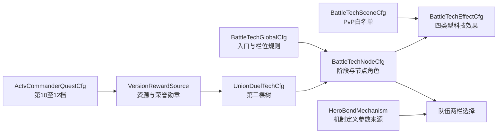

# 战争机器 · 配置表结构

# 文档边界

本文只定义 K1 Excel 配置文件、页签、字段与跨表约束，不包含玩家存档、协议或代码类名。主规则见[战争机器主策划案](https://alidocs.dingtalk.com/i/nodes/G1DKw2zgV2RKXL2KCvXZMrAEVB5r9YAn)，节点坐标与前置链见[战争机器-科技树结构](https://alidocs.dingtalk.com/i/nodes/dQPGYqjpJYgZ0b5ZsKAbawPaWakx1Z5N)。机制定义、参数、来源和成长继续由羁绊配置维护。

# 配置概览

## 文件清单

| 文件 | 页签 | 用途 |
|------|------|------|
| `UnionDuelTech.xlsx` | `UnionDuelTechCfg` | 增加 `TreeType=3` 的节点、等级、前置、消耗、文案和位置 |
| `UnionDuelBattleTech.xlsx` | `UnionDuelBattleTechGlobalCfg` | 维护入口、树类型、荣誉勋章、栏位和全局开关 |
| `UnionDuelBattleTech.xlsx` | `UnionDuelBattleTechNodeCfg` | 标记阶段、节点角色、队伍类型和队伍序号 |
| `UnionDuelBattleTech.xlsx` | `UnionDuelBattleTechEffectCfg` | 维护重要/填充节点的队伍类型效果值与上限 |
| `UnionDuelBattleTech.xlsx` | `UnionDuelBattleTechSceneCfg` | 维护战争机器科技效果的 PvP 场景白名单 |
| `ConstConfig.xlsx` | 现有常量页签 | 维护羁绊默认栏位数、最大栏位数和禁止重复机制 |
| `HeroBondMechanism.xlsx` | `HeroBondMechanismCfg` / `Param` / `Source` | 引用现有机制、参数和来源 |
| `ActivityCommander.xlsx` | `ActvCommanderQuestCfg` | 六个联盟对决积分内容追加第 10—12 档 |
| `VersionRewardSource.xlsx` | `VersionRewardBaseCfg` | 配置新增档位的常规资源与荣誉勋章 |
| `VersionRewardSource.xlsx` | `VersionRewardOverrideCfg` | 仅在确有版本差异时覆盖新增奖励 |

`UnionDuelBattleTech.xlsx` 为战争机器专用配置文件；其余文件扩展现有页签。

## 配置关系



## 配置基线

| 项目 | 配置口径 |
|------|----------|
| 联盟对决基础科技树 | `TreeType=1` |
| 联盟对决特殊兵种科技树 | `TreeType=2`；T10 终点科技为 `202301` |
| 战争机器科技树 | `TreeType=3` |
| 荣誉勋章 | `ItemCfg.CfgID=100100120`；全部战争机器节点的唯一消耗 |
| 个人进度 | 六个积分内容均配置第 1—12 档 |
| 羁绊机制栏 | 默认 1 栏，最多 2 栏；五个核心节点分别开放队伍 1—5 第二栏 |

# UnionDuelTech 扩展

## UnionDuelTechCfg

战争机器节点沿用现有表结构，以 `TreeType=3` 区分；一个 `Type` 表示一个节点，每个等级各占一行。

| 字段 | 类型 | 读取端 | 填表要求 |
|------|------|--------|----------|
| `Id` | int | cs | 科技等级唯一 ID；发布后不得复用 |
| `TreeType` | int | cs | 固定填 `3` |
| `Level` | int | cs | 沿用现有 0 级展示行和有效等级规则 |
| `Type` | int | cs | 节点稳定类型；与 `UnionDuelBattleTechNodeCfg.TechType` 一一对应 |
| `UpgradeCost` | ext[] | cs | 只填荣誉勋章 `100100120`；末级无下一级时填 `[]` |
| `AddBuffProperty` | int[] | cs | 新树统一填 `[]`，避免效果绕过队伍类型和 PvP 场景限制 |
| `AddBuffPropertyValue` | float[] | cs | 新树统一填 `[]`；数值在 EffectCfg 维护 |
| `Icon` | string | c | 同一节点各等级使用相同资源键 |
| `Name` | string | c | 多语言 KEY，不直接填中文 |
| `Des` | string | c | 多语言 KEY；参数顺序与 EffectCfg 展示顺序一致 |
| `MaxLv` | int | cs | 核心节点固定 1；重要和填充节点可多级 |
| `ValueDisplay` | int | c | 按现有百分比、整数或规则节点展示枚举配置 |
| `TechCondition` | int[] | cs | 维护硬前置：弓→冰、火→哥布林、冰＋哥布林→核心；下一阶段弓/火引用前一核心完成态 |
| `Position` | int[] | c | 复用现有科技树布局模板，位置唯一 |
| `remind` | int | c | 五个核心节点按关键节点规则开启，普通节点关闭 |

### 消耗格式

所有有效升级行只允许出现荣誉勋章：

```json
[{"typ":"item","id":100100120,"val":配置数量}]
```

# 战争机器科技配置

## UnionDuelBattleTechGlobalCfg

首期维护一行有效配置。

| 字段 | 类型 | 读取端 | 说明 | 首期要求 |
|------|------|--------|------|----------|
| `Id` | int | cs | 配置 ID | 全表唯一 |
| `Enable` | bool | cs | 功能总开关 | 关闭入口与研究时保留已有科技数据 |
| `BattleEffectEnable` | bool | cs | 新科技战斗效果开关 | 关闭时不清科技等级、不收第二栏 |
| `EntryTechID` | int | cs | 入口前置科技 | 填 `202301` |
| `TreeType` | int | cs | 科技树类型 | 填 `3` |
| `HonorMedalItemID` | int | cs | 科技消耗物 | 填 `100100120` |
| `StageCount` | int | cs | 阶段数 | 填 `5` |
| `FormationCount` | int | cs | 支持的队伍序号数 | 填 `5` |
| `DefaultMechanismSlotCount` | int | cs | 羁绊默认机制栏位 | 填 `1` |
| `MaxMechanismSlotCount` | int | cs | 科技完成后的最大栏位 | 填 `2` |
| `AllowDuplicateMechanism` | bool | cs | 同队两栏是否允许同机制 | 填 `0` |
| `SceneGroupID` | int | cs | 科技效果场景组 | 引用首期正常 PvP 白名单 |

## UnionDuelBattleTechNodeCfg

每个 `UnionDuelTechCfg.Type` 维护一行，标记其业务角色和阶段规则。

| 字段 | 类型 | 读取端 | 说明 | 填表要求 |
|------|------|--------|------|----------|
| `Id` | int | cs | 映射行 ID | 全表唯一 |
| `TechType` | int | cs | 科技节点 Type | 只引用 `TreeType=3`；一对一 |
| `Stage` | int | cs | 所属阶段 | 1—5 |
| `NodeRole` | int | cs | 节点角色 | 1=核心；2=重要；3=填充 |
| `TroopType` | int | cs | 队伍类型 | 核心填 0；效果节点使用 K1 现有弓/火/冰/哥布林枚举 |
| `FormationIndex` | int | cs | 解锁第二栏的队伍序号 | 仅核心节点填 1—5；其他填 0 |
| `Enable` | bool | cs | 映射开关 | 必须与科技节点同步 |

### 五个核心节点约束

| 阶段 | FormationIndex | 第一层开放条件 | 核心前置 |
|------|----------------|----------------|----------|
| 1 | 1 | 弓、火引用入口科技 `202301` | 本阶段冰、哥布林达到配置要求 |
| 2 | 2 | 弓、火引用队伍 1 核心完成态 | 本阶段冰、哥布林达到配置要求 |
| 3 | 3 | 弓、火引用队伍 2 核心完成态 | 本阶段冰、哥布林达到配置要求 |
| 4 | 4 | 弓、火引用队伍 3 核心完成态 | 本阶段冰、哥布林达到配置要求 |
| 5 | 5 | 弓、火引用队伍 4 核心完成态 | 本阶段冰、哥布林达到配置要求 |

- 同阶段冰节点的 `TechCondition` 只引用弓节点达到配置要求时的等级 ID。
- 同阶段哥布林节点的 `TechCondition` 只引用火节点达到配置要求时的等级 ID。
- 同阶段核心节点的 `TechCondition` 同时引用冰、哥布林达到配置要求时的等级 ID。
- 前置等级不要求节点满级；核心完成后，前阶段强化节点仍可继续研究。
- 节点连线必须与 `TechCondition` 一致。
- 热更调整前置等级不得撤销已完成核心节点及已经获得的第二机制栏权限。

## UnionDuelBattleTechEffectCfg

一行表示某科技完成态提供的一项效果。一个等级同时提供多个参数时拆成多行，不使用不定长 JSON。

| 字段 | 类型 | 读取端 | 说明 | 填表要求 |
|------|------|--------|------|----------|
| `Id` | int | cs | 效果行 ID | 全表唯一，发布后不复用 |
| `SourceTechID` | int | cs | 效果来源科技完成态 ID | 引用 `TreeType=3` 的具体等级行 |
| `TroopType` | int | cs | 生效队伍类型 | 使用弓/火/冰/哥布林现有枚举 |
| `EffectType` | int | cs | 固定效果类型 | 仅允许首期五类 |
| `PropertyID` | int | s | 可复用的现有战斗属性 ID | 有现成属性时填写；规则型入口无属性填 0 |
| `EffectValue` | float | cs | 当前等级最终值 | 同一节点只取最高已完成等级行 |
| `FinalUpperLimit` | float | cs | 合并所有来源后的统一上限 | 暴击、闪避必须配置；其他效果按战斗框架要求配置 |
| `ValueType` | int | cs | 数值单位 | 使用 K1 现有绝对值/万分率枚举 |
| `DisplayUnit` | int | c | 展示格式 | 与 ValueType 一致 |
| `DisplaySort` | int | c | 文案参数顺序 | 同节点从小到大稳定传参 |
| `ReportDisplay` | bool | c | 是否并入战报摘要 | 可归因效果填 1 |
| `Enable` | bool | cs | 效果开关 | 关闭不降低科技等级 |

### 首期 EffectType

| 业务名 | 节点角色 | 是否要求装备同名机制 | 结算口径 |
|--------|----------|------------------------|----------|
| 暴击概率提升 | 重要 | 否 | 匹配队伍类型后直接加到最终暴击属性 |
| 闪避概率提升 | 重要 | 否 | 匹配队伍类型后直接加到最终闪避属性 |
| 战斗额外恢复伤兵 | 填充 | 否 | 复用巨龙培育同类通用特性口径 |
| 战斗轻伤比例提升 | 填充 | 否 | 复用巨龙培育同类通用特性口径 |
| 杀敌重伤比例提升 | 填充 | 否 | 复用巨龙培育同类通用特性口径 |

### 等级与叠加

- 同一 `TechType` 有多个等级时，只取玩家最高已完成等级对应的 EffectCfg，不把 1 级至当前等级重复相加。
- 不同科技节点提供同类效果时先按现有同类规则合并，再与羁绊机制、巨龙特性等来源合并。
- 暴击、闪避在没有装备同名羁绊机制时仍读取科技值；装备后与机制值加算并受 `FinalUpperLimit` 限制。
- 填充效果只提供参数，不重复执行伤亡转换流程；战斗侧以合并后的最终参数执行一次既有结算。
- 核心节点不得配置 EffectCfg；其唯一效果是对应 `FormationIndex` 第二机制栏权限。

## UnionDuelBattleTechSceneCfg

白名单语义：没有有效行的场景默认不获得战争机器科技属性。

| 字段 | 类型 | 读取端 | 说明 |
|------|------|--------|------|
| `Id` | int | cs | 配置行 ID |
| `SceneGroupID` | int | cs | 场景组；与 GlobalCfg 对应 |
| `SceneType` | int | cs | K1 现有战斗场景枚举 |
| `Enable` | bool | cs | 是否允许战争机器科技效果 |
| `ReportDisplay` | bool | c | 是否在该场景战报展示科技摘要 |

- 主地图、KVK、联盟对决等使用正式养成数据的 PvP 场景按评审结果开启。
- 纯 PvE、剧情、挑战 NPC、公平竞技和未评审新场景关闭。
- 本表只限制战争机器科技的五类常驻效果，不限制第二栏中羁绊机制自身的适用场景。

# 羁绊机制配置接口

## ConstConfig

若现有羁绊常量尚未支持多栏，增加以下配置；具体 Key 以正式表查重结果为准。

| 建议 Key | 类型 | 值 | 用途 |
|----------|------|----|------|
| `HeroBondDefaultMechanismSlotCount` | int | 1 | 羁绊系统默认提供第一栏 |
| `HeroBondMaxMechanismSlotCount` | int | 2 | 单队最大两栏 |
| `HeroBondAllowDuplicateMechanism` | bool | 0 | 同队两栏禁止相同机制 |

## HeroBondMechanism

- `HeroBondMechanismCfg` 继续维护现有机制定义；战争机器直接引用，不配置专属机制行。
- `HeroBondMechanismParam` 继续维护每种机制的固定参数、成长参数和上限；第二栏不复制参数行。
- `HeroBondMechanismSource` 继续维护通用、当前主将与指定英雄条件；第二栏共用已有队伍解锁记录。
- 暴击和闪避科技值不写入上述机制参数表，因为科技未装备同名机制也要生效。
- 两个已装备机制都读取同一历史成长节点，再分别按各自参数行计算最终效果。

# 联盟对决个人进度

## ActvCommanderQuestCfg

六个联盟对决积分内容分别追加 `DisplayID=10、11、12`，旧 1—9 档不修改。

| 字段 | 类型 | 读取端 | 第 10—12 档要求 |
|------|------|--------|------------------|
| `ID` | int | cs | 各 ContentID、各档唯一 |
| `ContentID` | int | cs | 六个现有积分内容均补齐 |
| `StageID` | int | cs | 沿用现有联盟对决通用值 `0` |
| `Level` | int[] | s | 沿用同组旧档范围 |
| `DisplayID` | int | cs | 分别填 10、11、12 |
| `Count` | long | cs | 同一 ContentID 严格递增 |
| `RewardId` | int | cs | 引用新增奖励包 |
| `QuestDes` | string | cs | 复用或新增高档任务说明 KEY |
| `Condition` | ext[] | cs | 统一要求完成科技 `202301` |

条件参考：

```json
[{"op":"eq","typ":"UnionDuelTech","val":202301}]
```

| 档位 | 统计分母 | 目标达成率 |
|------|----------|------------|
| 10 | 已完成 T10 且参与当前积分阶段 | 约 10% |
| 11 | 同上 | 约 3% |
| 12 | 同上 | 约 1% |

## VersionRewardBaseCfg

| 字段 | 类型 | 读取端 | 要求 |
|------|------|--------|------|
| `Id` | int | cs | 新增奖励包 ID，全表唯一 |
| `RuleType` | int | cs | 沿用联盟对决固定奖励口径 |
| `Content` | string[] | cs | 只包含常规资源与荣誉勋章 `100100120` |
| `View` | string[] | c | 与 Content 的物品和数量完全一致 |

- 第 10→12 档的奖励总价值和荣誉勋章数量严格递增。
- `VersionRewardOverrideCfg` 只在确有版本差异时新增；覆盖后的 Content 与 View 同样遵守上述规则。

# 跨表校验

| 检查项 | 规则 |
|--------|------|
| 树唯一性 | `TreeType=3` 的 Id、Type、Position 不与旧树冲突；同节点 MaxLv、Icon、Position 一致 |
| 唯一货币 | 所有 UpgradeCost 只出现荣誉勋章 `100100120` |
| 阶段结构 | Stage 1—5 均存在一个核心节点；FormationIndex 1—5 各出现一次且前置串联 |
| 前置结构 | 每阶段满足弓→冰、火→哥布林、冰＋哥布林→核心；下一阶段弓/火引用前一核心完成态 |
| 连线一致性 | 所有展示连线与 `TechCondition` 一致，不存在仅展示、不参与解锁的关系 |
| 类型覆盖 | 弓、火、冰、哥布林均覆盖暴击、闪避及三类填充效果 |
| 核心边界 | 核心节点不配置 EffectCfg，只提供对应队伍第二栏权限 |
| 科技常驻 | 重要/填充效果不检查机制装备状态，但必须检查队伍类型和 PvP 白名单 |
| 羁绊复用 | 两栏引用现有机制、参数、来源和成长记录，同队禁止重复 |
| 属性叠加 | 科技与羁绊同名暴击/闪避加算，最终值不超过统一上限 |
| 场景边界 | 战争机器科技效果使用 PvP 白名单；第二栏机制仍读取羁绊机制自身场景规则 |
| 进度档位 | 六个 ContentID 均有 10、11、12，积分严格递增，Condition 统一引用 `202301` |
| 奖励预览 | Content 与 View 一致，只包含常规资源和荣誉勋章 |
