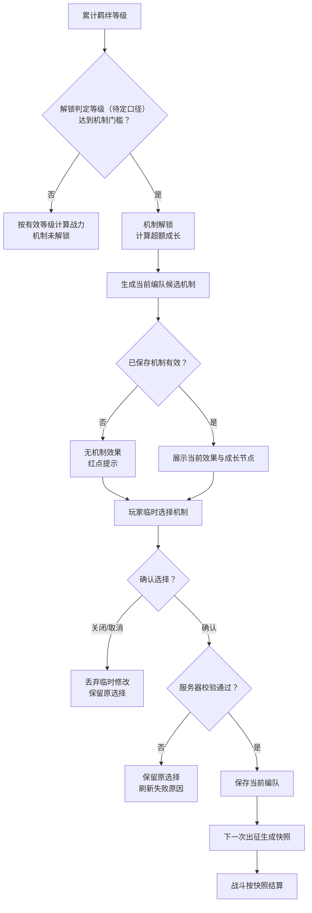

# 《羁绊系统调整GDD》精简复测报告

> 复测日期：2026-08-06  
> 源文档：[羁绊系统调整GDD](https://alidocs.dingtalk.com/i/nodes/NZQYprEoWoexro6xtB2Or0L1J1waOeDk)  
> 源文档快照：v1.0；17,453 字符、404 行、6 个二级标题、19 个三级标题、81 行表格数据、1 个 Mermaid 图。  
> 操作边界：只读取源文档；未调用钉钉写入、覆盖、追加或块编辑命令。

## 1. 结论

该文档在补回入口条件、关闭/取消分支，并显式保留解锁口径冲突后可 **有条件通过**。第一收益不是“改写规则”，而是纠正文档归属：源 GDD 把三张界面图的编号说明、控件规则和多语言 KEY 整段嵌入主案，同时项目中已经存在正式的界面标注派生文档，形成了明显双写。

- **零规则改写方案**：直接复用现有本地主案结构，并让界面细则回到既有界面标注，正文可从 17,453 字符降到约 12,517 字符，减少 28.3%。
- **完整精简方案**：继续合并关键决策与详细规则的同义内容、保留完整流程图、删除与图重复的文字复述、合并兼容与边界重复项后，精简正文预览为 **5,878 字符 / 236 行**，字符减少 **66.3%**。该比例是“主案正文”的变化，界面、配置和执行信息仍保留在既有派生文档中。
- **信息处理原则**：解锁入口、关闭/取消、战斗机制、候选来源、保存校验、失效恢复、出征快照、红点和线上兼容均保留；来源冲突使用 `clarify`，不在精简时任选口径；截图标号、KEY、配置字段和执行清单复用已有派生文档，不重新创建。

## 2. 前后规模对比

| 口径 | 字符数 | 行数 | 相对钉钉源文档 |
|---|---:|---:|---:|
| 钉钉源文档 | 17,453 | 404 | 基线 |
| 现有本地主案（仅移出内嵌界面标注） | 12,517 | 430 | 字符减少 28.3% |
| 本报告精简正文预览 | 5,878 | 236 | 字符减少 66.3% |

可直接复用的既有交付物：

- [羁绊系统调整-界面标注.md](C:/Project/MindToDoc/output/羁绊系统调整-界面标注.md)：三张效果图、编号标注、控件规则与多语言 KEY；已注明用户审核通过。
- [羁绊系统调整-配置表结构.md](C:/Project/MindToDoc/output/羁绊系统调整-配置表结构.md)：全局参数、机制定义、参数、来源条件与配置校验。
- [羁绊系统调整-开发Checklist.md](C:/Project/MindToDoc/output/羁绊系统调整-开发Checklist.md)：客户端、服务器、战斗、资源、多语言、兼容和联调任务。

以上三个候选落点均已确认文件存在且具体内容命中，因此本报告中的 `reuse`/`relocate` 可以成立；若后续出现新的迁移项而目标文件尚不存在，应改标 `protect`，原内容暂时保留，并在报告注明“建议移动到派生文档：……”。

## 3. 精简审查表

| 位置 | 标签 | 动作 | 唯一落点 | 理由 |
|---|---|---|---|---|
| 变更记录 | `protect` | 保留 | 主案“变更记录” | 版本追溯信息不可删除 |
| 设计目的的五项目标 | `merge` | 合并为目标、约束、体验三句话 | 主案“简介” | 与功能简述和关键决策重复 |
| 功能简述、目标与对标、调整范围 | `merge` | 合并为“目标与范围” | 主案“简介” | 同时回答做什么、不做什么 |
| 关键决策表 | `protect` | 保留摘要，删去细则复述 | 主案“关键决策” | 承载评审取舍 |
| 660、10、1% 等当前设计值 | `relocate` | 正文只作示例并明确配置化 | 配置表结构 | 最终平衡值不应固化在主案 |
| 名词定义中的四个公式概念 | `merge` | 与成长计算合并 | 主案“等级与成长” | 名词表和计算章节重复解释 |
| 17 节点整体流程图 | `protect` | 保留关键判断和流转，精简节点文案 | 主案“详细规则 → 整体流程” | 流程图比状态表更适合表达分支、汇合和先后关系 |
| 机制解锁判定口径冲突 | `clarify` | 同时保留“有效羁绊等级”和“总羁绊等级”两处证据，等待规则负责人定案 | 主案“待确认项” | 精简不能替规则负责人选择口径 |
| 羁绊页展示控件细节 | `reuse` | 从主案移出 | 既有界面标注“羁绊页签” | 已有审核通过的唯一落点 |
| 机制页展示控件细节 | `reuse` | 从主案移出 | 既有界面标注“机制页签” | 已有审核通过的唯一落点 |
| 选择弹窗控件细节 | `reuse` | 从主案移出 | 既有界面标注“机制选择弹窗” | 已有审核通过的唯一落点 |
| 三张图片后的 HTML 编号说明 | `delete` | 从主案删除重复副本 | 无 | 同内容已存在界面标注表格 |
| 三组 HTML 后的摘要 bullet | `delete` | 删除第二份同义说明 | 无 | 与紧邻的编号说明再次重复 |
| 主案中的多语言 KEY | `relocate` | 迁出 | 既有界面标注“本地化文本汇总” | KEY 不属于功能规则层 |
| 页面状态矩阵 | `merge` | 主案只留业务状态，控件列迁出 | 主案“解锁与机制状态”＋界面标注 | 状态结论属于主案，按钮/区域表现属于 UI |
| 六类机制规则表 | `protect` | 保留并压缩措辞 | 主案“机制规则” | 是核心战斗语义 |
| 递归触发限制 | `protect` | 合并到统一战斗规则 | 主案“机制规则” | 防止无限触发链 |
| 候选池、来源去重、英雄条件 | `protect` | 合并为来源判定表述 | 主案“候选与选择” | 决定可选性和失效判定 |
| 只有机制功能已解锁时才可打开选择弹窗 | `protect` | 补回功能入口条件 | 主案“候选与选择 → 打开弹窗” | 决定玩家能否进入选择流程，不是纯界面规则 |
| 临时选择、确认重校验与幂等 | `protect` | 保留 | 主案“候选与选择” | 包含提交边界和失败反馈 |
| 关闭/取消选择 | `protect` | 在流程图与正文保留丢弃临时修改、保留原选择 | 主案“整体流程”及“候选与选择” | 是确认分支的完整对偶，不能只留成功/失败校验 |
| 失效、保留、自动恢复 | `protect` | 保留 | 主案“失效、恢复与快照” | 降低误操作成本的核心设计 |
| 出征快照与生命周期 | `protect` | 保留并合并重复句 | 主案“失效、恢复与快照” | 保证战斗稳定性和热更边界 |
| 红点触发/消除/刷新 | `protect` | 保留系统规则，位置迁出 | 主案“红点”；界面标注 | 系统判定与 UI 表现需分层 |
| 配置模块与字段/校验说明 | `reuse` | 主案只留模块用途和链接 | 既有配置表结构 | 已有完整配置 SSOT |
| 线上数据兼容与边界情况 | `merge` | 按场景合成一张表 | 主案“兼容与边界” | 断线、重复请求、热更等多处重复 |
| 配置异常记录供排查 | `relocate` | 从主案迁出执行动作 | 开发 Checklist | 排查记录是研发任务，不是玩法规则 |
| 界面设计的 ID 与进度表 | `reuse` | 从主案移出 | 既有界面标注“子界面清单与进度” | 已有更完整落点 |
| 必须避免的方向 | `merge` | 将红线并回对应详细规则 | 各规则唯一落点 | 不再在文末重复九条否定句 |
| “+1%”的百分点语义 | `merge` | 并入战斗参数用途，不单独成条 | 主案“配置依赖 → 战斗参数” | 有效数值语义应贴近参数定义 |
| 正式界面替换 `X%` 占位符 | `delete` | 从精简主案删除 | 无 | 属于成稿清理/界面验收说明，不是功能规则 |
| “破甲”示例改为“闪避” | `delete` | 正文已使用正确机制后删除历史纠错说明 | 无 | 已落实的示例纠错不应继续占用详细规则 |
| “当前版本”“本期不修改原规则”等过程措辞 | `merge` | 改写为稳定的当前状态和复用边界 | 主案“简介”“机制规则” | 业务结论保留，但不依赖阅读时间 |

审查汇总：`delete` 4 项、`reuse` 5 项、`merge` 8 项、`relocate` 3 项、`clarify` 1 项、`protect` 12 项。拒绝创建 3 项重复派生文档：新界面标注、新配置表结构、新开发 Checklist，全部复用现有文件。

## 4. 核心前后对比

### 4.1 界面内容归属

**精简前**：每张图片后依次出现 HTML 编号说明、建议 KEY、第二组摘要 bullet；文末又有一张界面 ID 表。相同内容在既有界面标注中还维护了一份。

**精简后**：

> 主案只定义未解锁、未选择、有效、失效四种业务状态及系统行为。截图、编号、按钮显隐、KEY 和界面 ID 统一见《羁绊系统调整 · 界面标注》。

### 4.2 整体流程

**精简前**：17 节点 Mermaid 图正确表达了等级、解锁、候选、选择与快照之间的流转，但部分节点文案和后文逐章说明重复。

**精简后**：保留流程图作为流转关系的 SSOT，只缩短节点文案；确认、关闭/取消、校验成功和校验失败均保留为独立分支，后文负责解释各节点的计算、条件和反馈。

> 校验说明：当前环境未安装 `mmdc`；本报告会校验节点、分支与起终点可达性，但未执行 Mermaid 渲染校验。

### 4.3 等级、成长与示例

**精简前**：名词定义、关键决策、成长计算、成长示例、成长进度和边界表多次解释 660、685、690、10 级与 1%。

**精简后**：

> 有效等级 = `min(总等级, 战力上限)`；超额等级 = `max(0, 总等级 - 战力上限)`；机制成长值 = `floor(超额等级 / 成长间隔) × 单次成长值`，各成长参数再按自身上限截断。未完成一个间隔的余数不产生部分效果。

只保留一个 685→690 的界面示例，其余精确边界集中到兼容与边界表。

### 4.4 候选来源与失效

**精简前**：关键决策、候选池、多来源判定、编队保存、失效条件和边界表分散描述“任一来源有效即有效、全部失效才失效”。

**精简后**：

> - **候选有效性**
>   - 候选池为通用来源与当前主将来源的并集，同类型去重。
>   - 任一来源有效：机制保持有效。
>   - 全部来源失效、英雄条件不满足或配置关闭：保留选择，允许出征，但不向新部队提供效果。
>   - 条件恢复且玩家未改选：机制自动恢复。

### 4.5 确认与保存

**精简前**：弹窗规则、关键决策、界面标注和边界表四处重复“点卡片只是临时选择，确认才保存”。

**精简后**：

> - **确认保存**
>   - 仅机制功能已解锁时允许打开选择弹窗；未解锁时只展示解锁条件。
>   - 卡片点击只改变本地临时选择。
>   - 确认时服务器重新校验功能解锁、机制开放、来源和英雄条件。
>   - 校验成功：保存当前编队并刷新状态。
>   - 校验失败：保留原选择，弹窗继续展示并刷新失败原因。
>   - 关闭弹窗：丢弃临时修改。
>   - 重复提交同一结果：按幂等成功处理。

### 4.6 快照、热更与已出征部队

**精简前**：关键决策、失效恢复、快照、保存提示、兼容和边界表反复说明“不回溯已出征部队”。

**精简后**：

> - **出征快照**
>   - 出征时记录机制类型、有效状态、最终参数和判定版本。
>   - 快照随部队持续到完成、撤回或解散。
>   - 升星、阵容、选择、条件恢复和配置热更只影响之后创建的新出征实例。

## 5. 精简后正文预览（不回写）

<!-- COMPACT_DRAFT_START -->
# 变更记录

| 版本 | 变更类型 | 变更内容 | 经办人 | 时间 |
|---|---|---|---|---|
| v1.0 | 新建 | 明确羁绊封顶后成长、机制解锁与选择、失效恢复、出征快照、红点和兼容规则 | — | 2026-08-05 |

# 简介

羁绊达到战力等级上限后，英雄继续升星缺少可感知成长。总羁绊等级继续累计，羁绊战力不再增长；超额等级用于提升编队所选机制，使长期培养形成战前策略选择。

- 总羁绊等级继续累计；羁绊战力在配置上限停止成长，超额等级只提升机制效果。
- 每个编队独立选择一个机制，不分配点数、不叠加多个机制，也不新增养成资源、升级按钮或预设方案。
- 已保存机制条件失效时保留选择，条件恢复后自动生效；机制变更不回溯已出征部队。
- 羁绊激活、英雄星级折算、英雄详情和战斗系统结算顺序沿用既有规则。

# 关键决策

| 维度 | 决策 | 约束 |
|---|---|---|
| 等级 | 总羁绊等级沿用现有星级累计且只增不减 | 战力只读取有效羁绊等级 |
| 封顶 | 战力上限与机制解锁门槛分别配置 | 当前可取相同值，但不得在程序中强绑定 |
| 解锁口径 | 解锁判定读取总羁绊等级还是有效羁绊等级待规则负责人确认 | 定案前不得在精简稿中任选其一 |
| 成长 | 超额等级按配置间隔自动换算机制成长 | 不消耗道具，不允许自由分配 |
| 选择 | 每个编队槽位最多保存一个机制 | 编队之间不继承、不联动覆盖 |
| 候选 | 通用来源与当前主将来源取并集，同类型去重 | 任一来源有效即有效，来源不向玩家展示 |
| 解锁初态 | 不强制跳转、弹窗或自动选择 | 未选择仍可出征，但无机制效果 |
| 保存 | 点击卡片仅产生临时选择，确认后才保存 | 确认时重新校验，关闭弹窗放弃修改 |
| 失效 | 保留已保存选择并标记失效 | 条件恢复且未改选时自动恢复 |
| 生效 | 保存结果只作用于下一次新出征 | 已出征部队始终使用原快照 |
| 战斗 | 每队同时只有一个机制生效 | 派生攻击、伤害与反击不得递归触发机制 |
| 数值 | 固定参数、成长参数和参数上限按机制独立配置 | 不同机制按自身上限重新计算 |

# 详细规则

## 整体流程

流程图是等级成长、机制选择与出征生效关系的唯一流转视图；后续章节解释各节点的条件、数值和异常反馈。

## 等级、解锁与成长

- **等级累计**
  - 总羁绊等级按现有英雄星级规则累计，达到战力上限后仍继续增长。
  - 阵容变化不回扣总等级。
- 有效羁绊等级 = `min(总羁绊等级, 羁绊战力上限)`，只用于羁绊战力与主进度。
- 超额等级 = `max(0, 总羁绊等级 - 羁绊战力上限)`，只用于机制成长，不继续增加羁绊战力。
- **成长计算**
  - 机制成长值 = `floor(超额等级 / 成长间隔) × 单次成长值`。
  - 未完成一个间隔的余数不产生部分效果。
  - 每项成长参数按该机制自身上限截断，固定参数不参与成长。
- **多参数与封顶**
  - 同一机制的多个成长参数在同一节点同步提升并分别封顶。
  - 全部参数封顶后不显示虚假的下一节点；总等级仍继续累计。
  - 切换机制时按新机制的参数与上限重算。
- **示例**
  - 若战力上限 660、间隔 10、单次成长 1 个百分点，总等级 685 时成长值为 2 个百分点，下一节点为 690。
  - 示例数值不代表最终配置。

机制页存在以下业务状态：

| 状态 | 系统行为 | 红点 |
|---|---|---|
| 未解锁 | 展示动态解锁条件；不计算、不保存机制；可正常使用原羁绊 | 无 |
| 已解锁、未选择 | 允许出征但不产生机制效果；超额等级继续累计 | 有 |
| 已选择且有效 | 展示并使用当前效果；未封顶时计算下一成长节点 | 无 |
| 已选择但失效 | 保留选择，不向新出征提供效果；允许改选 | 有 |

- **首次解锁**
  - 达到门槛后立即解锁。
  - 不强制跳转、不弹窗、不自动选择；所有编队初始为空。
- **解锁状态**
  - 正常成长下不会因阵容变化回退。
  - 运营修改门槛时按兼容规则重算。
- **羁绊主进度**
  - 按有效等级/战力上限展示。
  - 达到上限后显示满级，并说明超额等级用于机制成长。
- 界面控件、截图标号、数字格式与多语言 KEY 统一见《羁绊系统调整 · 界面标注》。

## 机制规则

机制包括以下六类。名称、说明、图标、顺序、固定参数、成长参数、上限和来源均配置化。

| 机制 | 规则 | 关键判定 |
|---|---|---|
| 暴击 | 攻击时按概率造成配置倍率的总伤害 | 倍率表示总伤害而非额外伤害；一次攻击最多触发一次 |
| 闪避 | 受击时按概率将本次攻击伤害记为 0 | 与伤害无关的控制或状态仍按原技能规则处理 |
| 连击 | 攻击时按概率追加配置次数的攻击 | 沿用原目标；目标失效时按原规则寻敌；追加攻击不再触发机制 |
| 额外伤害 | 按本次攻击结算后的实际伤害追加配置比例伤害 | 追加伤害不再触发机制 |
| 反击 | 受击后按实际承受伤害的配置比例反击 | 承伤为 0 或攻击者已失效时不反击；反击不再触发机制 |
| 克制强化 | 提高对被我方克制目标的伤害，并降低非克制方对我方的伤害 | 两个参数同节点成长、分别封顶 |

- 每支队伍同时只有一个机制生效，不存在多个羁绊机制之间的触发顺序。
- **触发事件**
  - 机制只在定义的攻击、受击或伤害事件成立时判定。
  - 治疗、护盾获得和非伤害状态变化不触发攻击类机制。
- 追加攻击、追加伤害和反击统一标记为机制派生行为，不得再次触发机制，避免无限链。
- 与英雄技能、Buff 或同类属性并存时，合并、互斥和结算顺序沿用既有战斗规则。
- 概率按出征快照的最终值独立判定，并受配置上限约束。

## 候选、选择与保存

- **候选池刷新**
  - 进入机制页、打开弹窗、调整当前编队阵容或主将后，重新计算候选状态。
  - 候选池为通用来源与当前主将来源的并集；同类型只展示一次。
  - 来源只决定可选性，不叠加效果或改变成长换算。
- **英雄条件与来源**
  - 指定英雄在当前编队即满足上阵条件，除非来源明确要求其担任主将。
  - 任一来源有效：机制保持有效。
  - 条件不满足：卡片保留配置顺序并显示锁定，不隐藏、不沉底。
  - 来源本身不向玩家展示。
- **编队保存归属**
  - 机制保存到可编辑编队槽位；换英雄后保留机制并重新判断有效性。
  - 复制编队只复制阵容，不复制机制；目标编队保留自身选择。
- **打开弹窗**
  - 仅机制功能已解锁时允许打开选择弹窗；未解锁时显示动态解锁条件，不进入选择流程。
  - 以当前有效保存结果作为临时选择。
  - 未选择或已失效时，不自动选中其他机制。
- **临时选择**
  - 点击可用卡片：只修改临时选择，确认前可反复切换。
  - 点击锁定卡：不改变选择，并提示所需英雄。
- **确认保存**
  - 确认时服务器重新校验功能解锁、机制开放、来源和英雄条件。
  - 校验成功：保存当前编队并刷新状态。
  - 校验失败：不覆盖原选择，弹窗保留并展示最新原因。
  - 重复提交同一结果：按幂等成功，不产生重复状态变化。
  - 保存成功后提示：结果只对下一次新出征生效。
- **取消修改**
  - 关闭、返回或点击允许关闭区域时丢弃临时修改，并继续使用打开弹窗前的原选择。

## 失效、恢复与出征快照

以下任一情况使已保存机制失效：全部来源均不再有效、指定英雄条件不满足，或配置将机制关闭/移除。

- **失效处理**
  - 保留机制 ID，不自动清空或替换。
  - 显示失效状态及可恢复条件。
  - 玩家仍可出征或改选，但新出征不获得失效机制效果。
- **自动恢复**
  - 重新满足任一来源后自动恢复，无需再次确认。
  - 恢复只影响之后的新出征。
  - 若失效期间已改选，则不再自动切回旧机制。
- **快照生成**
  - 每次出征重新校验已保存机制。
  - 机制有效：记录机制类型、固定参数、成长参数最终值和战斗判定版本。
  - 未选择或失效：记录“无有效机制”。
- **快照生命周期**
  - 快照随出征部队持续到完成、撤回、解散或按原规则结束。
  - 同一部队连续战斗始终读取同一快照。
  - 升星、成长、阵容、选择、条件恢复和配置热更不修改已有快照，只影响之后创建的新出征实例。
  - 地图上的继续行军、转向或再次进入战斗不算新出征。

## 红点

- **触发条件**
  - 机制已解锁，且当前编队未保存机制。
  - 机制已解锁，且当前编队已保存机制失效。
- **不触发条件**
  - 功能未解锁。
  - 当前机制有效或已封顶。
  - 仅存在锁定的新卡片。
- **消除条件**
  - 成功保存有效机制。
  - 失效机制自动恢复。
  - 弹窗内只做临时选择时不消除。
- **刷新时机**
  - 首次解锁、切换编队、调整阵容或主将。
  - 确认选择、自动恢复或配置变化。
  - 登录、断线重连或服务器推送后。
- **展示规则**
  - 页签位置与父入口冒泡沿用项目统一红点规范，界面表现见界面标注。

## 配置依赖

主案只定义配置用途。字段、类型、默认值和最终数值统一见《羁绊系统调整 · 配置表结构》；执行任务见《羁绊系统调整 · 开发 Checklist》。

| 模块 | 用途 |
|---|---|
| 羁绊全局参数 | 战力上限、解锁门槛、成长间隔和单次成长值 |
| 机制定义与参数 | 类型、文案、图标、顺序、固定/成长参数及上限 |
| 来源与条件 | 通用来源、主将来源、指定英雄条件和开放状态 |
| 战斗参数 | 概率、倍率、比例、追加次数和战斗效果标识；百分比成长值按百分点解释 |

- **配置一致性**
  - 客户端展示与服务器战斗读取同一版本数值。
  - 机制关闭或移除时按失效规则处理，不得静默替换。

# 兼容与边界

| 场景 | 处理 |
|---|---|
| 既有玩家等级 | 上线时按现有星级数据计算总等级；有效等级按上限截断，超额等级直接参与机制成长 |
| 既有选择与编队 | 各编队初始化独立空选择，不自动分配；达到门槛的未选择编队显示红点 |
| 既有战力 | 超过新上限的战力按有效等级读取；不追回历史收益，也不补发资源 |
| 恰好达到门槛 | 功能解锁，超额等级为 0；可选择机制，成长参数使用初始值 |
| 尚未完成成长间隔 | 余数不产生部分效果，下一节点按完整间隔计算 |
| 未选择机制持续成长 | 总等级正常累计；选择后按当时总等级直接计算，无需补做升级 |
| 切换机制 | 按新机制参数和上限立即重算，不损失总等级 |
| 多来源同一机制 | 只展示一次；任一来源有效即有效，不叠加效果 |
| 弹窗期间条件变化 | 确认时重校验；失败则保留原选择并刷新状态和提示 |
| 保存断线或超时 | 重连后以服务器保存结果为准，不以本地高亮判定成功 |
| 老客户端 | 不支持界面的客户端不能发起选择；服务器保留已有选择，且不得因缺少展示字段导致异常出征 |
| 转服/跨服 | 编队选择随玩家迁移；已出征部队继续使用原快照，不按新编队重算 |
| 热更参数 | 只影响热更后生成的新快照；已有部队使用旧参数 |
| 解锁门槛提高 | 按新门槛重算；暂时不满足时保留历史选择但不生效，重新满足后恢复 |
| 机制关闭/移除 | 保留历史选择并标记失效；恢复配置且玩家未改选时自动恢复 |
| 断线重连 | 读取服务器保存结果和有效性；未确认的临时选择不恢复 |
| 重复确认 | 按玩家、编队和目标机制幂等处理，无重复副作用 |
| 配置缺失或非法 | 机制不可用，不进入候选或快照；历史选择进入失效态，技术排查由 Checklist 跟踪 |
| 派生行为再次满足触发条件 | 不再次触发机制，终止递归链 |
| 参数达到上限 | 按上限取值，不再展示下一成长节点 |

# 待确认项

- **解锁判定口径**：解锁判定读取总羁绊等级还是有效羁绊等级，须由羁绊规则负责人定案。
  - 证据 A：源文档“简介 → 功能简述”写“有效羁绊等级达到配置门槛后开放机制功能”。
  - 证据 B：源文档“整体流程”“未解锁状态”“首次解锁”写“总羁绊等级达到门槛”。
  - 定案前，客户端、服务器、配置和测试不得各自选择不同口径；流程图用“解锁判定等级（待定口径）”占位。
<!-- COMPACT_DRAFT_END -->

## 6. 迁移闭环核验

| 源内容 | 目标文件 | 目标章节/证据 | 存在性 | 内容命中 | 结论 |
|---|---|---|---|---|---|
| 三张界面图、编号、控件表现和 KEY | `羁绊系统调整-界面标注.md` | “羁绊页签”“机制页签”“机制选择弹窗” | 是 | 是 | 可复用，主案保留业务行为 |
| 未解锁时禁用更换入口 | `羁绊系统调整-界面标注.md` | 第 59 行“未达到门槛时…禁用更换入口” | 是 | 是 | UI 表现已闭环，功能入口条件仍在主案保留 |
| 未解锁无法打开选择弹窗 | `羁绊系统调整-开发Checklist.md` | 第 118 行边界用例 | 是 | 是 | 测试证据已存在，不能代替主案规则 |
| 关闭/取消保留原选择 | `羁绊系统调整-开发Checklist.md` | 第 124 行边界用例 | 是 | 是 | 测试证据已存在，流程图与正文仍保留分支 |
| 全局参数、机制、来源与校验 | `羁绊系统调整-配置表结构.md` | 全局常量与机制配置章节 | 是 | 是 | 可复用 |
| 解锁判定等级口径 | 主案、配置表结构、Checklist | 主案简介写“有效等级”；其他位置多写“总等级” | 是 | 冲突 | 不算迁移闭环，必须 `clarify` |

## 7. 源规则覆盖矩阵

本次正文压缩超过 40%，按高风险精简逐条核验核心业务原子：

| 源规则原子 | 标签 | 精简后落点 | 语义核对 | 状态 |
|---|---|---|---|---|
| 总等级、有效等级、超额等级与成长公式 | `protect` | 等级、解锁与成长 | 计算关系及截断规则保留 | 已覆盖 |
| 解锁判定读取总等级或有效等级 | `clarify` | 待确认项 | 双方证据均保留，未擅自选边 | **待负责人定案** |
| 首次解锁不强制跳转、弹窗或自动选择 | `protect` | 等级、解锁与成长 | 三个否定条件均保留 | 已覆盖 |
| 仅机制功能已解锁时允许打开选择弹窗 | `protect` | 候选、选择与保存 → 打开弹窗 | 未解锁只展示条件，不进入选择流程 | 已覆盖 |
| 点击卡片只形成临时选择 | `protect` | 候选、选择与保存 → 临时选择 | 提交边界保留 | 已覆盖 |
| 关闭/取消丢弃临时修改并保留原选择 | `protect` | 整体流程及取消修改 | 流程边与正文结果一致 | 已覆盖 |
| 确认时服务器重新校验四类条件 | `protect` | 候选、选择与保存 → 确认保存 | 功能解锁、机制开放、来源、英雄条件均保留 | 已覆盖 |
| 校验成功保存、失败不覆盖并刷新原因 | `protect` | 整体流程及确认保存 | 成功/失败分支均保留 | 已覆盖 |
| 六类机制及派生行为禁止递归 | `protect` | 机制规则 | 战斗语义与终止规则保留 | 已覆盖 |
| 百分比成长值按百分点解释 | `merge` | 配置依赖 → 战斗参数 | 数值语义并入参数用途，不再独立成条 | 已覆盖 |
| `X%` 占位符替换说明 | `delete` | 无 | 精简正文已无该占位符，界面验收不作为业务规则保留 | 已清理 |
| “破甲”改为“闪避”的旧示例纠错 | `delete` | 无 | 六类机制表已使用正确名称 | 已清理 |
| 任一来源有效、全部失效才失效 | `protect` | 候选及失效处理 | 多来源有效性完整保留 | 已覆盖 |
| 失效保留、条件恢复后自动恢复 | `protect` | 失效、恢复与出征快照 | 不清空、不替换及恢复条件保留 | 已覆盖 |
| 已出征部队使用原快照 | `protect` | 失效、恢复与出征快照 | 生命周期与热更边界保留 | 已覆盖 |
| 老客户端、转服、门槛调整、断线与幂等 | `protect` | 兼容与边界 | 核心兼容场景逐项保留 | 已覆盖 |

## 8. 保护项

本次精简明确保留：

- 长期培养出口、战力不继续膨胀和战前单机制选择的设计目的；
- 总等级、有效等级、超额等级和机制成长的完整计算关系；
- 六类机制的战斗语义、目标处理、伤害基数、克制条件和递归限制；
- 通用来源、主将来源、指定英雄条件、去重、排序和任一来源有效判定；
- 仅解锁后可打开选择弹窗，以及未解锁时不进入选择流程；
- 编队独立保存、复制编队不复制机制、临时选择、确认重校验、关闭/取消、成功/失败反馈和幂等；
- 失效保留、自动恢复、失效期间改选不回切；
- 出征快照内容、生命周期和“下一次新出征”边界；
- 红点触发、消除、刷新与不触发条件；
- 老客户端、转服/跨服、热更、门槛调整、断线重连、重复请求和配置异常；
- 变更记录及全部本期排除项。

## 9. 复测判断

本次发现 1 个必须由规则负责人定案的核心冲突：**解锁判定读取总羁绊等级还是有效羁绊等级**。由于本地配置表结构和 Checklist 已偏向“总羁绊等级”，但源文档简介明确写“有效羁绊等级”，这些派生物只能作为冲突证据，不能反向证明口径已定。

因此，羁绊精简稿为 **有条件通过**：入口条件和关闭/取消分支已补回，流程图继续作为完整流转 SSOT；待羁绊规则负责人拍板解锁口径，并同步主案、配置表结构、Checklist 和测试用例后，才能转为正式通过。本报告未修改钉钉源文档。
