# 2026世界杯主题活动 开发文档

> 目标平台：移动端（iOS / Android，竖屏单手操作） | 参考对标：足球生涯养成 + 切片休闲操作类 | 生成日期：2026-06-01

## 1. 概述

- **一句话定位**：世界杯期间上线的限时主题活动，以「足球切片小游戏 + 球星生涯养成 + 配套活动」三层结构，借赛事热点提升活跃与付费，并验证划线/弹弓两种操作模式。
- **核心玩法**：以"切片"为最小单位完成单次足球操作（进攻/任意球/点球/角球/界外球/守门），多个切片组成一个关卡；外层是球星生涯养成（知名度/训练/生活三条等级线 + 合同）；再外层是积分赛、淘汰赛、竞猜、排名、BP、商店等配套活动。
- **参考游戏对标**：足球生涯养成类（签约、训练、赛季目标）+ 切片式休闲操作（单次进攻/守门手动操作）。竞猜赔率参考内部"X1 竞猜系统"（资料缺失，见待确认）。
- **目标平台**：移动端，竖屏单手操作，作为主游戏内的限时活动模块。

## 2. 核心玩法机制

- **玩法循环**：创角签约 → 进入积分赛关卡 → 消耗门票 → 逐切片手动操作（划线/弹弓）→ 切片成功/失败（失败可回溯）→ 关卡结算（胜平负/进球/助攻奖励）→ 积分排名 → 养成提升（知名度/训练/生活）→ 解锁更高星级球队/新合同 → 中后期开放淘汰赛与竞猜 → 配套活动（排名/BP/商店）消耗产出。
- **全局规则**：
  - 切片是最小操作单元；关卡由多切片组成；胜平负由关卡配置（通常按进球数/切片数比例）判定。
  - 积分赛单次消耗**门票**，门票有上限与恢复速度（受生活等级 buff 影响）。
  - 操作模式（划线/弹弓）两种均需开发。**正式关卡：首个非守门切片选定模式后，整关锁定不可更改；守门切片强制划线，不占用也不改变锁定**。**试训为唯一例外，每个切片可自主切换以触发对应教学**。失败回溯后沿用本关已锁定模式。
  - 局内道具：哨子（+1 非守门切片，默认生效）、回溯（切片失败重来，有免费次数）、瞄准/辅助线（默认生效）。
  - 积分排名规则与真实足球不同：仅按切片胜利数量计分，非胜3平1负0。
- **数值框架**：门票上限/恢复速度、各等级经验曲线、合同待遇、AI 难度档位、竞猜赔率公式等均为待配置数值；本文档在各系统数据表中**预留字段并标注 TODO**，不预设具体数值（见各系统）。

## 3. 系统设计

### 3.1 创角与新手引导

#### 规则与逻辑

首次进入活动的一次性流程，结束后进入活动主界面。

- **开场视频**：timeline 或视频，展示球星经典射门（参考游戏为 C 罗世界杯任意球）。
- **选角**：固定 **4 个角色，仅外观差异、无数值差异**，后续可修改。选角界面点选角色 → 拉近镜头 → 显示战力 → 弹出**国籍选择**弹窗，可随时返回重选。
- **国籍**：仅影响**首次签约时系统提供的球队选项**（决定球队所属地区），不影响角色属性、外观或其他系统。
- **试训**：固定包含**进攻、任意球、点球**三类切片教学，**顺序执行**。试训是操作模式锁定规则的**唯一例外**——每个切片玩家可自主切换划线/弹弓两种操作模式，并触发对应模式的教学（操作细节见 [3.2 切片操作核心]）。
- **首次签约**：试训完成后收到球队合同，进入选择球队。默认提供 **1 个 1 星球队**，并按国籍**动态生成 2 个对应地区球队**；三者**仅名字与国籍区别**，星级同为 1 星。小游戏不要求输入名字，默认用玩家名。
- **签约亮相**：确认签约后展示亮相动画（独立模块「签约亮相」并入此处），进入活动主界面，强引导指向第一关。
  - 第一关还有**队友游标**和**滑动视角**的教学。
- **边界**：第一关本身的新手引导归属 [3.3 基础关卡]（未通关重进会重复触发），签约亮相这段仅负责到"进入主界面 + 强引导指向第一关"。

#### 流程图

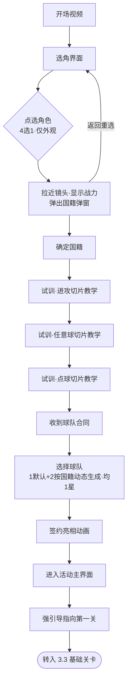

#### 界面原型

- 原型文件：[output/prototypes/character-creation.html](prototypes/character-creation.html)
- 关键交互要点：竖屏单手；中部角色立绘 + 战力徽标；底部 4 个角色头像横向切换（选中态高亮）；点"确定"从底部弹出国籍选择半屏弹窗，含"可随时返回重选"提示；选国籍后进入试训。

#### 数据结构 / 配置表

**角色配置表 `character_config`**

| 字段 | 类型 | 说明 | 取值范围 |
|------|------|------|----------|
| character_id | int | 角色ID | 1–4 |
| appearance_key | string | 外观资源键 | 非空 |
| display_power | int | 展示用战力（仅表现，无数值差异） | ≥0，TODO 数值 |

**国籍配置表 `nationality_config`**

| 字段 | 类型 | 说明 | 取值范围 |
|------|------|------|----------|
| nationality_id | int | 国籍ID | ≥1 |
| name | string | 国籍名称 | 非空 |
| region | enum | 所属地区（决定首签球队选项） | 枚举，TODO 列表 |
| team_pool | int 数组 | 该国籍可动态生成的球队池ID | 引用 team_config |

**试训配置表 `tutorial_config`**

| 字段 | 类型 | 说明 | 取值范围 |
|------|------|------|----------|
| step_index | int | 试训步骤序号 | 1–3 |
| slice_type | enum | 切片类型 | attack/free_kick/penalty |
| forced_order | bool | 是否强制顺序 | true |

**玩家创角存档 `player_profile`（创角相关字段）**

| 字段 | 类型 | 说明 | 取值范围 |
|------|------|------|----------|
| player_name | string | 玩家名（默认即角色名） | 非空 |
| character_id | int | 选定角色 | 1–4 |
| nationality_id | int | 选定国籍 | 引用 nationality_config |
| signed_team_id | int | 首签球队 | 引用 team_config |
| tutorial_done | bool | 是否完成新手引导 | 默认 false |

### 3.2 切片操作核心

#### 规则与逻辑

单次足球操作的核心引擎，被所有关卡切片调用。

- **操作模式**：
  - **划线**：忽略力度和高度，玩家确定落点和弧度，系统做自动轨迹修正。
  - **弹弓**：忽略高度和弧度，玩家确定方向和力度。
  - **守门切片只能用划线**（强制，不触发锁定、也不受锁定影响）；其余切片（进攻/任意球/点球/角球/界外球）的模式由**本关第一个非守门切片选定后锁定整关**，关卡内不可更改，失败回溯后仍沿用锁定模式。
  - **唯一例外是试训**（[3.1]）：试训每个切片可单独切换模式，不锁定，用于教学两种操作。
- **6 类切片核心参数**（见数据表）：进攻、任意球、点球、角球、界外球、守门。
- **成功/失败判定**：
  - 非守门切片：玩家操作结果（落点/方向/力度）与切片参数（门将权重、可操作夹角等）做命中计算。**失败 = 被门将扑出，或被对方球员出球并踢出界外**；否则进球/推进视为成功。
  - 守门切片：有**反应时间**，**超时失败**；判断扑救方向错误失败。
- **瞄准辅助线**：默认生效。划线与弹弓两种模式下，辅助线均**准确标出足球完整运行轨迹与落点**。
- **操作时间**：仅守门切片有反应时间限制；其余切片等待操作时**纯暂停、无时间限制**。
- **局内道具**：
  - **哨子**：增加 1 次非守门切片，默认生效。
  - **回溯**：切片失败时可选使用，**将场景重置到该切片最初状态**（足球与所有球员位置从配置初始位置重新加载）；有免费次数，携带道具时优先用免费次数。
  - **瞄准**：提供辅助线，默认生效。
- **关系**：被 [3.3 基础关卡] 的每个切片调用；道具携带与库存见 [3.4 球星养成] 与局外道具系统。

#### 流程图

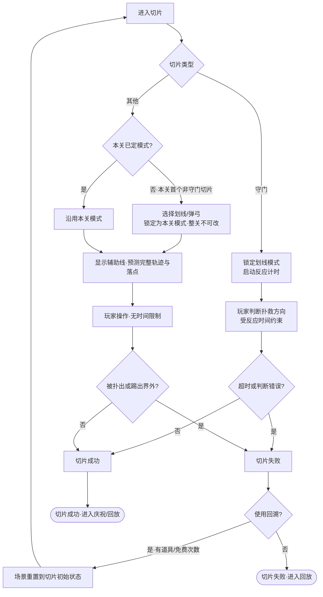

#### 界面原型

- 原型文件：[output/prototypes/slice-operation.html](prototypes/slice-operation.html)
- 关键交互要点：竖屏球场视角；顶部 HUD 显示切片序号/类型与本关锁定模式；操作区显示球门、门将、可操作夹角、控球球员与足球；辅助线以虚线弧+落点圆点标出完整预测轨迹；底部道具栏（哨子/回溯剩余次数/瞄准开关）。守门切片改为方向判断交互 + 反应时间条。

#### 数据结构 / 配置表

**操作模式枚举 `operation_mode`**：`draw_line`（划线）/ `slingshot`（弹弓）

切片配置采用**三层 + 两个正交模块**，兼顾配置便捷（preset 复用）、扩展性（加数据不加列）与趣味性（机制/目标可插拔）。

```
L1 slice_type_def   类型固有规则(只读, 程序定)
L2 slice_preset     可复用摆位预设(策划90%引用)
L3 slice_instance   关卡里的一个切片 = preset + override + 目标 + 机制
       ├─ objectives  目标/胜负判定(正交)
       └─ modifiers   玩法机制(正交, 可插拔, 数据驱动)
```

**叠加优先级（必须固定）**：`preset 基线 → instance.overrides → ai_profile(关卡难度) → modifiers(机制)`；后者覆盖前者，modifiers 最后生效。

**L1 切片类型定义 `slice_type_def`（只读，程序定，新增类型加一行不动下游）**

| 字段 | 类型 | 说明 | 取值范围 |
|------|------|------|----------|
| slice_type | enum | 切片类型 | attack/free_kick/penalty/corner/throw_in/goalkeep |
| allowed_modes | enum 数组 | 允许的操作模式 | 守门=仅 draw_line；其余=draw_line 与 slingshot |
| judge_fn | string | 判定函数键（程序实现） | 非空 |
| payload_schema | json | 该类型 `type_payload` 字段定义与校验 | 见各类型 |
| default_camera | json | 默认相机 | - |

各类型 `payload_schema` 字段（preset/instance 的 `type_payload` 按此填）：

| 切片类型 | type_payload 字段 |
|----------|----------|
| 进攻 attack | 默认目的地、门将权重、可操作夹角 |
| 任意球 free_kick | 罚球点位、墙体站位、可操作夹角、门将权重 |
| 点球 penalty | 点球点、门将扑救方向权重、反应时间 |
| 角球 corner | 角球发球位、禁区跑位模板、第一落点权重 |
| 界外球 throw_in | 发球位、接应跑位、二次进攻模板 |
| 守门 goalkeep | 对手射门方向权重、反应时间（超时失败）、判断错误失败 |

**L2 摆位预设 `slice_preset`（可复用、可独立预览的完整摆位，策划资产）**

| 字段 | 类型 | 说明 | 取值范围 |
|------|------|------|----------|
| preset_id | int | 预设ID（被 instance 引用） | ≥1 |
| slice_type | enum | 所属类型 | 引用 slice_type_def |
| name | string | 预设名（如"右路单刀"） | 非空 |
| tags | string 数组 | 检索标签（side/distance/difficulty…） | 可空 |
| ball_pos | vec3 | 足球初始位置 | 公共摆位 |
| ball_vector | vec3 | 足球初始向量 | 公共摆位 |
| ball_owner | int | 初始控球球员索引 | 守门可空 |
| players_init | json | 双方球员初始位置/朝向列表 | 公共摆位 |
| camera | json | 默认视角 | instance 可 override |
| target_point | vec3 | 默认目标点/落点 | 守门可空 |
| operable_angle | float | 默认可操作夹角 | 非守门 |
| type_payload | json | 类型差异参数**默认值**（按 L1 schema，自包含可预览） | - |
| recommended_modes | enum 数组 | 建议操作模式（仅提示，不强制） | 可空 |

**L3 切片实例 `slice_instance`（一次关卡使用 = 装配单，被 level_config 引用）**

| 字段 | 类型 | 说明 | 取值范围 |
|------|------|------|----------|
| slice_instance_id | int | 实例ID | ≥1 |
| slice_type | enum | 引用类型 | slice_type_def |
| preset_id | int | 引用摆位预设 | slice_preset，可空=纯手填 |
| overrides | json | 覆盖 preset 的局部字段（小改不必新建 preset） | 可空 |
| type_payload | json | 覆盖 preset 的类型参数 | 可空=用 preset 默认 |
| objectives | json 数组 | 目标/胜负判定（见下） | ≥1 |
| modifiers | json 数组 | 挂载的玩法机制（见下） | 可空 |
| ai_override | json | 实例级 AI 微调（叠在关卡 AI 档之上） | 可空 |

**目标定义 `objective_def`（正交，决定"这一关要玩家做成什么"）**

| objective type | 成功条件 | params |
|----|------|------|
| score | 进球 | - |
| pass_to | 传给指定队友（计助攻） | target |
| hit_zone | 命中指定区域 | zone |
| keep_possession | 护球不被断 | duration |
| survive | 守门撑过反应时间且方向正确 | - |

**机制定义 `modifier_def`（正交、可插拔，新玩法加一行不动引擎 → 趣味+扩展核心）**

| modifier_id | 效果 | params |
|----|------|------|
| wind | 球轨横向偏移 | direction, strength |
| moving_keeper | 门将左右移动 | speed, range |
| shrink_goal | 球门变窄 | scale |
| no_aim_line | 关闭辅助线 | - |
| multi_target | 多得分区，分值不同 | zones 数组 |
| time_pressure | 非守门切片加倒计时 | ms |
| combo_required | 须前一切片成功才解锁 | prev_slice |

> 实例示例：右路单刀 preset(33) + `overrides:{operable_angle:28}` + `objectives:[{score}]` + `modifiers:[{moving_keeper},{no_aim_line}]`，即"复用单刀摆位、微调夹角、要求射门、门将会动且无辅助线"。

**局内道具表 `in_match_item_config`**

| 字段 | 类型 | 说明 | 取值范围 |
|------|------|------|----------|
| item_id | enum | 道具 | whistle/rewind/aim |
| effect | string | 效果 | 哨子+1非守门切片/回溯重置切片/瞄准辅助线 |
| default_active | bool | 是否默认生效 | 哨子=true,瞄准=true,回溯=false |
| free_count | int | 免费次数（仅回溯） | ≥0，TODO 数值 |

**切片运行时状态 `slice_runtime`**

| 字段 | 类型 | 说明 | 取值范围 |
|------|------|------|----------|
| slice_id | int | 切片实例ID | ≥1 |
| locked_mode | enum | 本关锁定的操作模式 | operation_mode |
| reaction_time_ms | int | 反应时间（仅守门/点球） | ≥0，TODO 数值 |
| result | enum | 切片结果 | success/fail |
| fail_reason | enum | 失败原因 | saved/out_of_bounds/timeout/wrong_judge |

### 3.3 基础关卡

#### 规则与逻辑

关卡是切片的容器，定义胜负判定、流程编排与结算。被 [3.5 积分赛] 作为轮次内容调用。

- **关卡结构**：一个关卡由多个切片组成（切片类型见 [3.2]）。**胜平负由每个关卡单独配置**（通常按进球数/切片数比例，如 2/3 胜、1/3 平、0 球负——仅为示例，逐关配置）。
- **门票消耗与进度（MVP 规则，已定）**：
  - **进入关卡即扣门票**（开始扣，失败也已扣，不在结算时扣）。
  - **中途退出不保存切片进度**：重进 = 重新进入、再次扣门票、从第一个切片重来。
  - **奖励幂等**：每次进入生成 `attempt_id`，结算奖励按 `attempt_id` 入账且**同一 attempt 只发一次**；重复进入是新 attempt、可再次正常结算（不存在"重复领同一份奖励"）。
  - **断线 / 杀进程 / 后台超时**：未走到结算的 attempt 一律**作废**（门票不退、不发奖），重进按新 attempt 处理；不做断线续局。
- **关卡 AI**：预设多套 AI，作为**关卡级难度档位**，作用到该关各切片的权重参数（门将权重、跑位模板等），控制难度与体验。
- **助攻机制**：玩家扮演球星，场上有系统队友。当**主角传球给队友、队友射门成功**，计为主角助攻（对应"传球给队友"类切片成功）。
- **关卡流程**：入场展示 → 开球视角 → 切片视角（切换均用黑幕过渡）→ 进入第一个切片停留等待操作 → 每切片成功/失败后进入**回放**：成功=庆祝动作展示，失败=回溯选择（消耗道具/免费次数或放弃，见 [3.2]）→ 回放需**手动点击结束**视为该切片完成 → 自动切下一切片 → 所有切片完成=关卡完成 → 依次弹出**关卡结算**与**积分排名结算**。→ 若联赛所有关卡均已完成，回到关卡界面后需**衔接联赛关卡推进至下一轮**的流程（见 [3.5]）。
- **关卡结算**：胜平负结果、完赛奖励、进球数奖励、助攻数奖励。
- **排名结算**：与真实足球积分规则（胜3平1负0）不同，**仅按切片胜利数量算积分**。
- **引导关**：第一关为**固定脚本**引导关；未通关时重进会重复触发引导（S1 创角只负责引导指向第一关，引导关本身属本系统）。
- **关卡道具**：允许携带哨子/回溯/瞄准进入关卡（局内行为见 [3.2]）。

#### 流程图

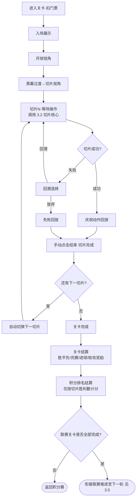

#### 界面原型

- 赛前对阵页：[output/prototypes/match-preview.html](prototypes/match-preview.html) —— 对阵双方（队名/星级/名次/立绘）+ 射门机会(切片数)/胜利/平局阈值数据卡 + 哨子/回溯/瞄准道具槽 + 积分榜/赛程入口 + 返回/开球(消耗门票)。
- 结算页：[output/prototypes/level-settlement.html](prototypes/level-settlement.html)
- 关键交互要点：顶部切片完成进度条（绿=胜/红=负）+ 胜利切片计数；中部胜平负大字结果；奖励列表（完赛/进球/助攻/知名度）；底部"查看积分排名"进入排名结算。关卡进行中的切片视角复用 [3.2] 原型。

#### 数据结构 / 配置表

**关卡配置表 `level_config`**

| 字段 | 类型 | 说明 | 取值范围 |
|------|------|------|----------|
| level_id | int | 关卡ID | ≥1 |
| is_tutorial | bool | 是否引导关（固定脚本） | 默认 false |
| slice_list | int 数组 | 组成本关的切片实例ID序列 | 引用 slice_instance |
| ai_profile_id | int | 关卡AI难度档位 | 引用 ai_profile_config |
| win_threshold | int | 胜利所需切片胜利数 | ≥0，逐关配置 |
| draw_threshold | int | 平局所需切片胜利数 | ≥0，逐关配置 |
| ticket_cost | int | 进入消耗门票数 | ≥1，TODO 数值 |

**关卡AI档位表 `ai_profile_config`**

| 字段 | 类型 | 说明 | 取值范围 |
|------|------|------|----------|
| ai_profile_id | int | AI档位ID | ≥1 |
| difficulty | enum | 难度等级 | easy/normal/hard… TODO |
| param_overrides | json | 对切片权重参数的覆盖（门将权重/跑位模板等） | TODO |

**关卡结算结果 `level_result`**

| 字段 | 类型 | 说明 | 取值范围 |
|------|------|------|----------|
| level_id | int | 关卡ID | 引用 level_config |
| attempt_id | string | 本次进入唯一标识（奖励幂等键） | 非空 |
| outcome | enum | 胜平负 | win/draw/lose |
| goals | int | 进球数 | ≥0 |
| assists | int | 助攻数 | ≥0 |
| slice_wins | int | 切片胜利数（用于排名积分） | ≥0 |
| rewards | json | 完赛/进球/助攻奖励明细 | TODO 数值 |

### 3.4 球星养成

#### 规则与逻辑

主角球星的成长核心，由三条等级线和合同体系构成，连接关卡产出与球队升级。

- **知名度等级**：
  - 来源：每场比赛的**胜负 + 进球 + 助攻数据，并结合当前球队星级**共同决定获得量；此外**提升生活等级时一次性获得**知名度。
  - 升级效果：一次性奖励 + 更高合同待遇 + 允许加入更高星级球队。
- **训练等级**：
  - 来源：完成**训练关卡**获得训练星（规则见下「训练关卡」）。
  - 升级效果：提升主角评分 + 允许加入更高星级球队。
- **训练关卡**（养成来源，主界面独立入口，不单列为顶层系统）：
  - **入口与开放**：主界面常驻入口，创角试训完成后开放；训练关卡列表**顺序解锁**（通关上一个解锁下一个）。
  - **不消耗门票**：独立于积分赛，进入只受**每日次数上限**约束（TODO 数值），不扣门票。
  - **切片复用**：完全复用 [3.2 切片操作核心]，由 `slice_instance` 配置实例；操作模式锁定规则同正式关卡（首个非守门切片锁定整关）。
  - **产出**：通关按 `training_level_config.star_reward` 发放**训练星**；训练星累计达阈值提升训练等级（升级效果见上）。
  - **失败 / 重试**：训练关卡**失败不扣次数惩罚之外无额外损失**，可在每日次数内**重复挑战**；同一关**重复通关是否再发训练星由 `repeatable_reward` 控制**（默认首通发星、重复通关不发，仅练手）。
  - **结算**：通关结算只发训练星，不计入积分/排名/进球榜。
- **生活等级**：
  - 来源：直接花费**金币**提升。
  - 升级效果：获得全局 buff —— 门票恢复速度、门票上限、免费回溯次数、比赛额外奖励；并一次性获得知名度。
- **合同体系**：
  - 发放时机：**每个大关卡（联赛轮次）完成时**收到新合同。
  - 合同等级与收益：由**玩家当前各养成等级（知名度/训练）共同决定**——养成水平越高，发放的合同球队星级越高、待遇越好。**非玩家主动换队，而是赛季末按养成水平自动给对应档次新合同**。
  - 合同内容：球队（含星级）、待遇（完赛/进球/助攻奖励）、球队赛季目标（排名达标、进球数）、赛季目标奖励。
- **货币体系（全局定义，跨系统引用）**：
  - **金币**：养成货币，用于提升生活等级（关卡完赛奖励等产出）。
  - **门票**：用于参加积分赛（进入关卡消耗，见 [3.3]）。
  - **竞猜币**：用于参与竞猜（见 [3.7]）。
- **关系**：消费 [3.3] 关卡结算产出；驱动 [3.5] 积分赛的合同发放与球队升级。

#### 流程图

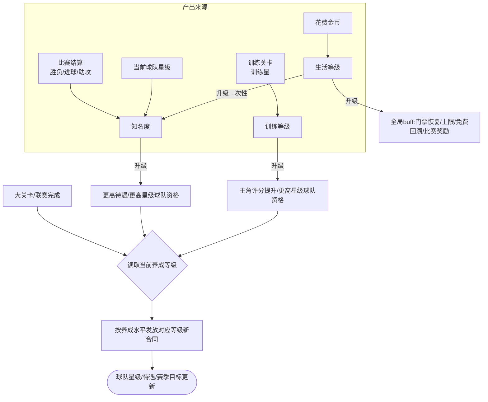

#### 界面原型

- 原型文件：[output/prototypes/player-growth.html](prototypes/player-growth.html)
- 关键交互要点：顶部全局货币栏（金币/门票/竞猜币）；主角卡显示国籍、球队星级、合同待遇；三条养成线各一卡片（知名度/训练显示进度与来源，生活带"花金币升级"按钮 + buff 说明）；底部训练关卡与合同详情入口。

#### 数据结构 / 配置表

**货币表 `currency`（全局）**

| 字段 | 类型 | 说明 | 取值范围 |
|------|------|------|----------|
| currency_id | enum | 货币类型 | gold/ticket/bet_coin |
| usage | string | 用途 | 金币=生活升级；门票=积分赛；竞猜币=竞猜 |

**养成等级表 `growth_level`**

| 字段 | 类型 | 说明 | 取值范围 |
|------|------|------|----------|
| growth_type | enum | 养成线 | fame/training/life |
| level | int | 当前等级 | ≥1 |
| exp / star | int | 当前经验或训练星 | ≥0 |
| level_up_reward | json | 升级一次性奖励（生活含知名度） | TODO 数值 |
| level_up_effect | json | 升级效果（待遇/评分/buff/球队星级门槛） | TODO 数值 |

**知名度获取规则 `fame_gain_rule`**

| 字段 | 类型 | 说明 | 取值范围 |
|------|------|------|----------|
| from_outcome | int | 胜/平/负各自知名度 | TODO 数值 |
| from_goal | int | 每进球知名度 | TODO 数值 |
| from_assist | int | 每助攻知名度 | TODO 数值 |
| team_star_factor | float | 球队星级系数 | TODO 数值 |

**训练关卡配置 `training_level_config`**

| 字段 | 类型 | 说明 | 取值范围 |
|------|------|------|----------|
| training_level_id | int | 训练关卡ID | ≥1 |
| slice_list | int 数组 | 组成的切片实例序列 | 引用 slice_instance |
| ai_profile_id | int | 难度档位 | 引用 ai_profile_config |
| unlock_prev | int | 前置训练关（顺序解锁） | training_level_id 或 0 |
| star_reward | int | 首通发放训练星 | ≥1，TODO 数值 |
| repeatable_reward | bool | 重复通关是否再发星 | 默认 false |
| daily_attempt_limit | int | 每日可挑战次数 | ≥1，TODO 数值 |

**训练关卡进度 `training_progress`**

| 字段 | 类型 | 说明 | 取值范围 |
|------|------|------|----------|
| player_id | int | 玩家 | ≥1 |
| unlocked_training_id | int | 已解锁到的训练关 | 引用 training_level_config |
| cleared_ids | int 数组 | 已通关训练关（用于首通判定） | 列表 |
| today_attempts | json | 各训练关今日已挑战次数 | ≤ daily_attempt_limit |
| total_star | int | 累计训练星（折算训练等级） | ≥0 |

**合同表 `contract`**

| 字段 | 类型 | 说明 | 取值范围 |
|------|------|------|----------|
| contract_id | int | 合同ID | ≥1 |
| team_id | int | 球队 | 引用 team_config |
| team_star | int | 球队星级 | ≥1 |
| pay_finish / pay_goal / pay_assist | int | 完赛/进球/助攻待遇 | ≥0，TODO 数值 |
| season_goal | json | 赛季目标：{type:rank/goal, threshold, settle_at:absolute_on_finish/season_settle} | TODO 数值 |
| season_reward | json | 赛季目标奖励 | TODO 数值 |
| grant_level_req | json | 发放该合同所需的养成等级门槛 | TODO 数值 |

**球队配置表 `team_config`**

| 字段 | 类型 | 说明 | 取值范围 |
|------|------|------|----------|
| team_id | int | 球队ID | ≥1 |
| name | string | 球队名 | 非空 |
| star | int | 星级 | ≥1 |
| region | enum | 所属地区 | 关联 nationality_config |

### 3.5 积分赛

#### 规则与逻辑

活动主线 PVE 玩法，由基础关卡组织成联赛结构，是养成与合同的主驱动。

- **结构**：分 **N 个大关卡**，每个大关卡内含**多个小关卡**。
  - 1 个大关卡 = **1 轮联赛**；1 个小关卡 = 1 个 [3.3 基础关卡]（对阵一个对手，消耗门票）。
  - 打完一个大关卡的所有小关卡 = 完成一轮联赛。
- **解锁**：小关卡**顺序解锁**（通关上一个才解锁下一个）；大关卡随联赛轮次顺序推进。
- **积分与排名**：
  - 积分 = **本赛季（大关卡）内所有小关卡切片胜利数的累计**（口径与 [3.3] 排名结算一致，非胜3平1负0）。
  - 排名 = **所有玩家横向排名**（个人数据榜），**按赛季（大关卡）独立结算**，每个大关卡各自一套榜（详见 [3.8]），非联赛内 AI 竞争名次。
- **合同发放**：每完成一个大关卡（联赛轮次）**固定获得一次新合同**，合同等级与收益按玩家当前养成等级决定（见 [3.4]）。
- **赛季目标结算（口径已定，区分两类目标）**：
  - **绝对类目标（如进球数）**：玩家在大关卡内**所有小关卡完成时即可判定**，达成立即发奖（数据不再受他人影响）。
  - **排名达标类目标**：以**该赛季全服结算时刻的最终排名**为准，**不在玩家完成大关卡时立即发放**；玩家完成大关卡只标记"待赛季结算"，赛季（大关卡）全服统一结算时按最终名次发放排名达标奖。这样避免后完成的玩家改变全服排名导致先发奖不稳定。
- **关系**：调用 [3.3] 作为小关卡内容；消耗 [3.4] 门票；触发 [3.4] 合同发放；积分汇入 [3.8] 排名。

#### 流程图

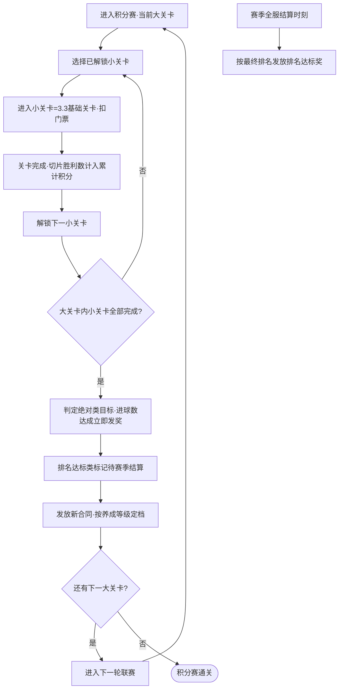

#### 界面原型

- 原型文件：[output/prototypes/league.html](prototypes/league.html)
- 关键交互要点：3D 关卡路径地图（编号节点沿曲线排列、带年份；已通关✓/当前节点站玩家立绘+高亮/未解锁🔒，顺序解锁）；顶部联赛+球队标（如 ESP-L3 / Madrid C.）+ 门票余量；底部回放/统计/退出。

#### 数据结构 / 配置表

**大关卡（联赛轮次）表 `season_config`**

| 字段 | 类型 | 说明 | 取值范围 |
|------|------|------|----------|
| season_id | int | 大关卡/赛季ID | 1–N |
| sub_level_ids | int 数组 | 包含的小关卡ID（顺序） | 引用 level_config |
| contract_on_finish | bool | 完成后发放新合同 | 默认 true |
| unlock_prev_season | int | 解锁所需前置赛季 | season_id 或 0 |

**积分赛进度 `league_progress`**

| 字段 | 类型 | 说明 | 取值范围 |
|------|------|------|----------|
| current_season | int | 当前大关卡 | 1–N |
| unlocked_sub_level | int | 已解锁到的小关卡 | 引用 level_config |
| total_slice_wins | int | 累计切片胜利数（=排名积分） | ≥0 |
| total_goals | int | 累计进球（用于赛季目标判定） | ≥0 |

**积分赛排名条目 `league_rank_entry`（汇入 3.8）**

| 字段 | 类型 | 说明 | 取值范围 |
|------|------|------|----------|
| player_id | int | 玩家ID | ≥1 |
| score | int | 累计切片胜利数 | ≥0 |
| rank | int | 全服名次 | ≥1 |

### 3.6 淘汰赛

#### 规则与逻辑

独立活动页签，主题活动**中后期开放**；积分赛达到第 L 关的玩家可参加。多人组队的 PVP，结果由系统演算，分**组队期、海选阶段、单淘汰阶段**三阶段。

- **开放条件**：积分赛进度达到第 L 关（TODO 数值）。
- **组队期（固定时间）**：玩家发起组队，盟友/好友可加入；发起者命名球队名与队标；需 1–M 名玩家（M=队伍人数上限），**组队期结束时人数不满的位置由系统球员补位**。
- **海选阶段（固定时间）**：参赛队伍可能很多，先海选筛出 **64 强**。
  - **分组**：组队期结束后，将全部参赛队伍**按评分蛇形均分为 G 组（G=16–32，TODO 配置）**，每组队伍数尽量均等。
  - **晋级名额**：每组取前 `K` 名晋级，`K = 64 / G`（16 组取前 4、32 组取前 2），合计晋级 **64 强**。
  - **组内赛制**：组内队伍两两按演算模型（同下，见 `match_simulation_rule`）对战，按**胜场→进球数→总评**排出组内名次；允许轮空。
  - **限制**：海选阶段**不开放竞猜**（[3.7]）；玩家**只能查看自己队伍的对局与本组排名**，看不到其他组与全局对阵。
  - **未晋级**：海选淘汰的队伍发放安慰奖励（仅道具）。
- **单淘汰阶段（固定时间，单败淘汰）**：64 强进入单败淘汰树（R=6 轮），系统匹配对手，**所有比赛同时统一结算**，允许轮空。结果在结算时刻已确定；随后生成的**模拟切片回放与赛后简报仅供玩家事后观看**（类似录像回放），不影响已定结果。本阶段**开放竞猜**（[3.7]）。
- **演算模型**（海选与单淘汰共用，公式先拍、后期数值策划定，完整口径见数据表 `match_simulation_rule`）：
  - 单主角评分 = f(知名度等级, 训练等级, 生活等级)。
  - 队伍总评 = 队内所有成员评分**累加**；队内**最高评分**单独参与运算。
  - 切片数量 = 由**双方各自最高评分**决定（双方切片数可不同）。
  - 每个切片成功期望 = **己方总评 /（双方总评之和）**；逐切片按期望判定成功，**成功切片数即该队进球数 = 最终比分**。
  - **双方切片数不同时**：各自按自己的切片数累计进球，直接比进球数（不归一化）。
  - **平局破法**：先比队伍总评高者胜；总评再相同比最高评分；仍相同按报名先后（更早者胜），保证唯一晋级方。
  - **轮空**：直接晋级，`winner` = 该队、`score` 记 `bye`、`replay_data` 为空，不生成回放。
  - 系统补位球员评分 = **固定常量**（TODO 数值）。
- **名次与奖励**：单淘汰树天然产出名次（冠/亚/四强/八强…按出局轮次定档）；按名次发放**外观 + 道具**；海选淘汰与报名失败安慰奖**仅道具**。**淘汰赛不参与排名**（[3.8]）。
- **关系**：消费 [3.4] 养成等级换算评分；单淘汰阶段开放竞猜（见 [3.7]）。

#### 流程图

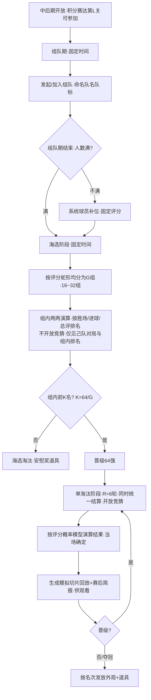

#### 界面原型

- 原型文件：[output/prototypes/knockout.html](prototypes/knockout.html)
- 关键交互要点：顶部当前阶段（组队/海选/单淘汰）+ 结算倒计时；**海选阶段只展示本组排名表与自己队伍的对局**（无全局树、无竞猜入口）；单淘汰阶段显示对阵树、对阵卡（双方总评与最高评分）；结算后显示晋级结果、模拟比分、"观看模拟回放"与"赛后简报"入口；底部标注名次奖励，**竞猜入口仅单淘汰阶段开放**。

#### 数据结构 / 配置表

**淘汰赛配置 `knockout_config`**

| 字段 | 类型 | 说明 | 取值范围 |
|------|------|------|----------|
| open_league_level | int | 开放所需积分赛关卡 L | ≥1，TODO |
| team_size_max | int | 队伍人数上限 M | ≥1，TODO |
| qualifier_group_count | int | 海选分组数 G | 16–32，TODO |
| qualify_per_group | int | 每组晋级名额 K=64/G | 16组=4 / 32组=2 |
| max_rounds | int | 单淘汰轮次 R（64强=6 轮） | 默认 6 |
| team_phase_time / qualifier_phase_time / knockout_phase_time | datetime | 组队/海选/单淘汰各阶段固定时间 | TODO |
| bot_player_rating | int | 系统补位球员固定评分 | 常量，TODO |

**队伍 `knockout_team`**

| 字段 | 类型 | 说明 | 取值范围 |
|------|------|------|----------|
| team_id | int | 队伍ID | ≥1 |
| name / emblem | string | 队名 / 队标 | 非空 |
| member_ids | int 数组 | 成员玩家ID（不足补 bot） | 长度 ≤ team_size_max |
| total_rating | int | 队伍总评（成员评分累加） | ≥0 |
| max_rating | int | 队内最高评分 | ≥0 |

**对阵与结果 `knockout_match`**

| 字段 | 类型 | 说明 | 取值范围 |
|------|------|------|----------|
| match_id | int | 对阵ID | ≥1 |
| phase | enum | 所属阶段 | qualifier（海选）/ knockout（单淘汰） |
| group_id | int | 海选组号（仅 qualifier，knockout 为0） | 0 或 1–G |
| round | int | 单淘汰轮次（仅 knockout） | 1–R |
| team_a / team_b | int | 双方队伍 | 引用 knockout_team |
| slice_count_a / slice_count_b | int | 各自切片数（由最高评分定，可不同） | ≥0 |
| score_a / score_b | int | 演算比分（=各自成功切片数；轮空记 bye） | ≥0 |
| winner | int | 晋级方（轮空=该队；平局按破法判定） | team_id |
| replay_data | json | 模拟切片回放+简报数据（仅展示；轮空为空） | 结算时生成 |

**海选组排名 `qualifier_group_standing`（每组一套，玩家仅可见己组）**

| 字段 | 类型 | 说明 | 取值范围 |
|------|------|------|----------|
| group_id | int | 组号 | 1–G |
| team_id | int | 队伍 | 引用 knockout_team |
| wins | int | 组内胜场 | ≥0 |
| goals | int | 组内累计进球（破平用） | ≥0 |
| group_rank | int | 组内名次（胜场→进球→总评） | ≥1 |
| qualified | bool | 是否晋级64强（前 K 名） | group_rank ≤ K |

**演算规则 `match_simulation_rule`（闭环口径，系数 TODO）**

| 项 | 规则 |
|----|------|
| 切片数 | `slice_count = g(max_rating)`，双方各自按己方最高评分计算，可不同 |
| 单切片成功 | `p = own_total /(own_total + opp_total)`，逐切片独立判定 |
| 比分映射 | 成功切片数即该队进球数；`score = 成功切片数` |
| 胜负 | 直接比双方进球数（各自按自己切片数累计，不归一化） |
| 平局破法 | 总评高者胜 → 仍平比最高评分 → 再平报名更早者胜（保证唯一晋级） |
| 轮空 | 直接晋级，`winner`=该队，`score`=bye，`replay_data` 空 |
| 名次 | 按出局轮次定档（冠/亚/四强/八强…），冠军=最后晋级方 |
| 奖励档位 | 各名次档发外观+道具；报名失败安慰奖仅道具（TODO 数值） |

**评分公式占位 `rating_formula`（TODO 后期数值定）**

| 项 | 说明 |
|----|------|
| single_rating = f(fame_lv, training_lv, life_lv) | 单主角评分，系数 TODO |
| team_total = Σ member_rating | 队伍总评 |
| slice_success_p = own_total /(own_total + opp_total) | 切片成功期望 |

### 3.7 竞猜

#### 规则与逻辑

依附于 [3.6 淘汰赛] 的下注玩法，使用竞猜币押注比赛晋级方。

- **竞猜对象**：淘汰赛**单淘汰阶段每一场非轮空比赛**（海选阶段不开放竞猜）。
- **下注窗口**：从**明确对手后**开放，到**该场比赛结算前**关闭。窗口期内对**已下注的比赛可修改下注（金额/晋级方）或取消下注**（取消全额退回投注）。
- **每日下注上限**：每位玩家**每日同时持有的下注场次有上限，暂定 8 场**（取消下注会释放名额）；达上限后需先取消或等结算才能下注新场。
- **下注内容**：仅猜胜负，即**选择晋级方**；可押注**自己参赛的队伍**（参赛后组队不可变更）。
- **结算派彩**：比赛结算后，押中晋级方者按**下注量 × 赔率**获得竞猜币；**押错退回投注的 80%**（损失 20%，非全损）。
- **赔率**：采用其他项目组现成赔率计算方式（**TODO**，接入时对接）。
- **竞猜币来源**：每日发放免费竞猜币；礼包（[3.11]）也投放竞猜币。
- **消耗去向**：竞猜币用于下注；亦可在 [3.10 兑换商店]（即"竞猜币兑换商店"，不单列）兑换局外道具。
- **排名数据**：本系统统计每位玩家的**命中次数**与**总收益**，排名榜在 [3.8] 统一处理。
- **关系**：数据源自 [3.6] 对阵；货币定义见 [3.4]；兑换见 [3.10]；排名见 [3.8]。

#### 流程图

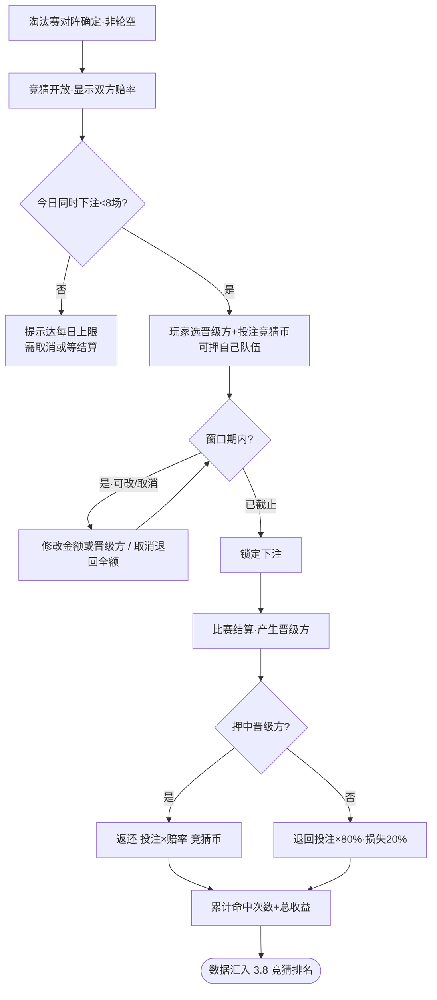

#### 界面原型

- 原型文件：[output/prototypes/betting.html](prototypes/betting.html)
- 关键交互要点：顶部竞猜币余额 + **今日下注 x/8** 名额；每场对阵一张竞猜卡，双方按钮显示赔率（自己队伍标注"含我的队伍"），下方投注额输入 + 下注按钮，提示"猜中得 投注×赔率·猜错退80%"；**已下注卡显示"修改/取消"按钮（窗口期内）**；已结算条目显示命中/收益；底部每日免费币领取状态 + 竞猜排名入口。

#### 数据结构 / 配置表

**竞猜场次 `bet_match`**

| 字段 | 类型 | 说明 | 取值范围 |
|------|------|------|----------|
| bet_match_id | int | 竞猜场ID | ≥1 |
| knockout_match_id | int | 对应淘汰赛对阵 | 引用 knockout_match（非轮空） |
| odds_a / odds_b | float | 双方赔率 | TODO（接现成算法） |
| open_time / close_time | datetime | 开放/截止（截止=结算前） | TODO |
| status | enum | 状态 | open/closed/settled |

**下注记录 `bet_record`**

| 字段 | 类型 | 说明 | 取值范围 |
|------|------|------|----------|
| bet_id | int | 下注ID | ≥1 |
| player_id | int | 玩家 | ≥1 |
| bet_match_id | int | 竞猜场 | 引用 bet_match |
| pick_team | int | 押注的晋级方 | team_id |
| stake | int | 投注竞猜币 | ≥1 |
| status | enum | 下注状态 | active（窗口期可改/取消）/ locked / settled / canceled |
| payout | int | 派彩（命中=stake×odds；未中=stake×0.8；取消=stake 全退） | ≥0 |
| hit | bool | 是否命中 | - |

**竞猜统计（汇入 3.8）`bet_stats`**

| 字段 | 类型 | 说明 | 取值范围 |
|------|------|------|----------|
| player_id | int | 玩家 | ≥1 |
| hit_count | int | 命中次数 | ≥0 |
| total_profit | int | 总收益（派彩-投注累计） | 可为负 |

**竞猜币日常来源 `bet_coin_source`**

| 字段 | 类型 | 说明 | 取值范围 |
|------|------|------|----------|
| daily_free | int | 每日免费竞猜币 | ≥0，TODO |
| gift_grant | int | 礼包投放（见 3.11） | ≥0，TODO |

**竞猜全局配置 `bet_config`**

| 字段 | 类型 | 说明 | 取值范围 |
|------|------|------|----------|
| daily_active_limit | int | 每日同时持有的下注场次上限 | 暂定 8，可调 |
| lose_refund_rate | float | 押错退回比例 | 0.8（损失 20%） |
| editable_in_window | bool | 窗口期内可改/取消下注 | true |


#### 规则与逻辑

通用活动，汇总各系统产出数据形成四个榜单，按名次段位发奖。

- **四个榜单**：
  - **赛季积分榜**：按**赛季（大关卡）单独排名**，数据=该赛季累计切片胜利数（源自 [3.5]）。
  - **赛季进球榜**：按**赛季单独排名**，**仅统计积分赛进球**（淘汰赛为演算、不参与排名）。
  - **竞猜命中榜**：按**整个活动周期**排名，数据=竞猜命中次数（源自 [3.7]）。
  - **竞猜收益榜**：按**整个活动周期**排名，数据=竞猜总收益（源自 [3.7]）。
- **结算粒度**：积分/进球榜随**每个大关卡（赛季）各自结算**；该赛季结算时刻的最终排名**同时作为合同「排名达标」赛季目标的判定依据**（见 [3.5]）。竞猜两榜在**活动周期结束**结算。
- **奖励**：**按名次段位发奖**（如 1名 / 2–10名 / 11–100名…，分段 TODO），奖励为**外观 + 局外道具**。
- **展示**：活动主界面有独立"排名"页签（四榜切换）；此外**赛季积分榜与进球榜也同时显示在积分赛页签内**。
- **关系**：数据源 [3.5] 积分赛、[3.7] 竞猜；奖励发放局外道具与外观。

#### 流程图

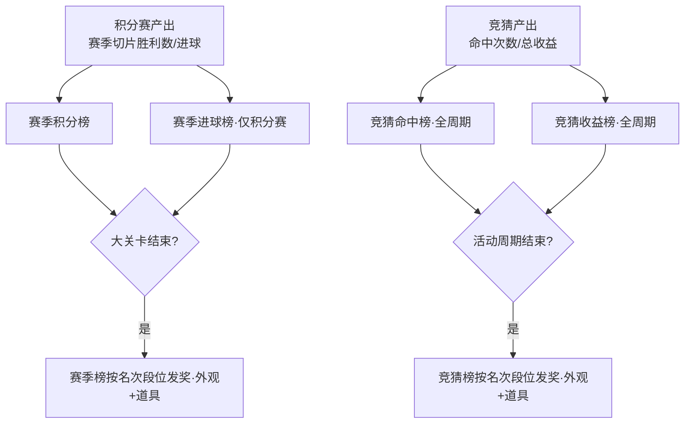

#### 界面原型

- 原型文件：[output/prototypes/ranking.html](prototypes/ranking.html)
- 关键交互要点：顶部四榜切换 tab（赛季积分/赛季进球/竞猜命中/竞猜收益）；榜单说明标注结算粒度与段位发奖；列表前三高亮；底部固定显示"我的名次"与当前段位奖励提示。

#### 数据结构 / 配置表

**排行榜定义 `rank_board`**

| 字段 | 类型 | 说明 | 取值范围 |
|------|------|------|----------|
| board_id | enum | 榜单 | season_score/season_goal/bet_hit/bet_profit |
| scope | enum | 结算范围 | season（赛季）/ activity（全周期） |
| data_source | string | 数据来源 | 3.5 / 3.7 对应字段 |

**榜单条目 `rank_entry`**

| 字段 | 类型 | 说明 | 取值范围 |
|------|------|------|----------|
| board_id | enum | 所属榜单 | rank_board |
| season_id | int | 赛季（仅赛季榜，全周期榜为0） | ≥0 |
| player_id | int | 玩家 | ≥1 |
| value | int | 排名数值（积分/进球/命中/收益） | 收益可为负 |
| rank | int | 名次 | ≥1 |

**名次段位奖励 `rank_reward_tier`**

| 字段 | 类型 | 说明 | 取值范围 |
|------|------|------|----------|
| board_id | enum | 所属榜单 | rank_board |
| rank_min / rank_max | int | 段位名次区间 | ≥1，分段 TODO |
| reward | json | 外观 + 局外道具 | TODO 数值 |

### 3.9 BP 通行证

#### 规则与逻辑

通用活动，**免费轨 + 付费轨**双轨通行证。

- **升级**：通过**活跃度**提升 BP 等级；活跃度由**每日任务**获得。
- **双轨奖励**：每个等级有免费轨与付费轨各一份奖励。免费轨默认可领。
- **付费轨解锁**：购买后**解锁付费轨所有已达等级的奖励**（可立即补领），并可领取**后续新达到等级**的付费奖励。
- **奖励内容**：外观、比赛道具、生活养成货币（金币）。
- **关系**：金币流入 [3.4] 养成；外观/道具为局外资产；每日任务系统提供活跃度（任务细节 TODO）。

#### 流程图

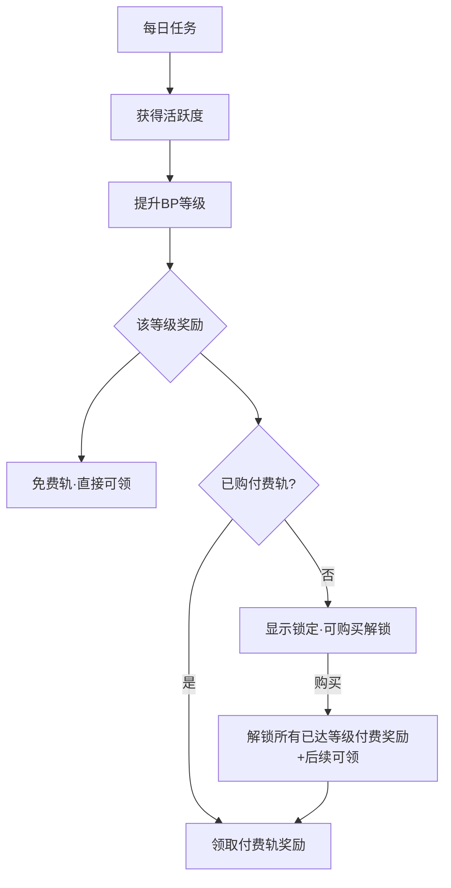

#### 界面原型

- 原型文件：[output/prototypes/bp-shop-gift.html](prototypes/bp-shop-gift.html)（BP 页签）
- 关键交互要点：顶部活跃度等级 + "解锁付费轨"按钮；等级行分免费轨/付费轨两列展示奖励，付费轨未购买显示锁定。

#### 数据结构 / 配置表

**BP 配置 `bp_config`**

| 字段 | 类型 | 说明 | 取值范围 |
|------|------|------|----------|
| bp_level | int | BP等级 | ≥1 |
| activity_required | int | 升级所需活跃度 | ≥0，TODO |
| free_reward | json | 免费轨奖励（外观/道具/金币） | TODO |
| paid_reward | json | 付费轨奖励 | TODO |

**BP 玩家状态 `bp_player`**

| 字段 | 类型 | 说明 | 取值范围 |
|------|------|------|----------|
| player_id | int | 玩家 | ≥1 |
| current_level | int | 当前BP等级 | ≥1 |
| activity_point | int | 累计活跃度 | ≥0 |
| paid_unlocked | bool | 是否已购付费轨 | 默认 false |
| claimed_free / claimed_paid | int 数组 | 已领取的免费/付费等级 | 等级列表 |

**每日任务 `daily_task`**

| 字段 | 类型 | 说明 | 取值范围 |
|------|------|------|----------|
| task_id | int | 任务ID | ≥1 |
| desc | string | 任务描述 | TODO |
| activity_reward | int | 完成给活跃度 | ≥0，TODO |

### 3.10 兑换商店

#### 规则与逻辑

通用活动，使用**竞猜币**兑换局外道具（即 [3.7] 提到的"竞猜币兑换商店"）。

- **货币**：竞猜币（来源见 [3.7]）。
- **兑换内容**：局外道具（及外观券等）。
- **限制**：每个商品**限购**；商店**周期刷新**（刷新后限购次数重置）。
- **关系**：消耗 [3.7] 竞猜币产出；提供局外道具。

#### 流程图

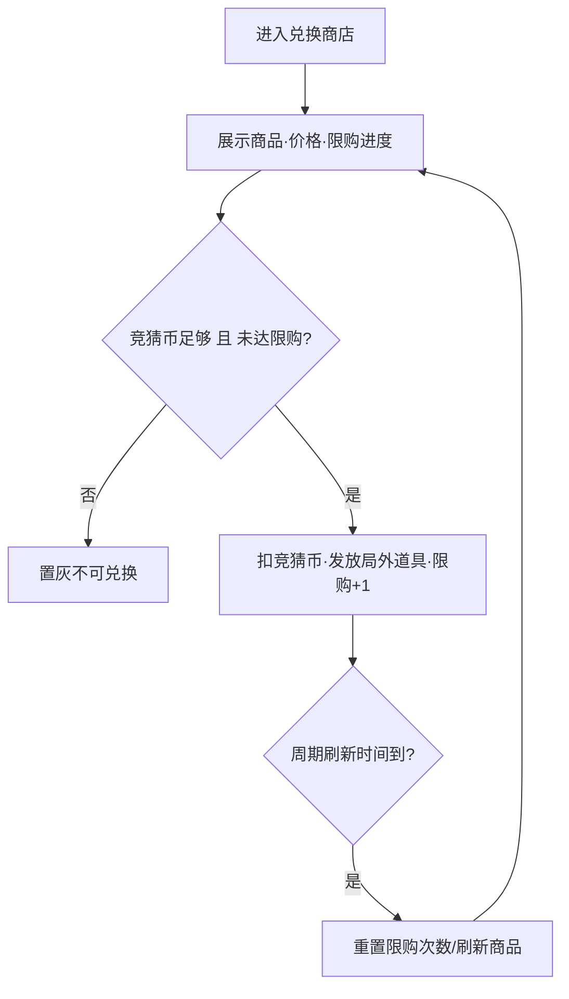

#### 界面原型

- 原型文件：[output/prototypes/bp-shop-gift.html](prototypes/bp-shop-gift.html)（兑换商店页签）
- 关键交互要点：商品网格，每项显示图标、名称、竞猜币价格、限购进度（如 2/3）；达限购或币不足置灰；顶部显示刷新倒计时。

#### 数据结构 / 配置表

**商店商品 `shop_item`**

| 字段 | 类型 | 说明 | 取值范围 |
|------|------|------|----------|
| item_id | int | 商品ID | ≥1 |
| reward | json | 兑换获得（局外道具/外观券） | TODO |
| cost_bet_coin | int | 竞猜币价格 | ≥1，TODO |
| purchase_limit | int | 单周期限购次数 | ≥1，TODO |
| refresh_cycle | enum | 刷新周期 | daily/weekly/… TODO |

**玩家兑换记录 `shop_purchase`**

| 字段 | 类型 | 说明 | 取值范围 |
|------|------|------|----------|
| player_id | int | 玩家 | ≥1 |
| item_id | int | 商品 | 引用 shop_item |
| bought_count | int | 当前周期已购次数 | ≤ purchase_limit |
| cycle_key | string | 周期标识（用于重置） | - |

### 3.11 礼包

#### 规则与逻辑

可选通用活动，**付费充值礼包 + 免费活动礼包**两类并存。

- **类型**：免费活动礼包（直接领取）与付费充值礼包（付费购买）。
- **投放内容**：生活养成货币（金币）、比赛道具、竞猜币。
- **限制**：**限购 + 限时**。
- **关系**：金币流入 [3.4]、竞猜币流入 [3.7]、比赛道具为局内/局外道具。

#### 流程图

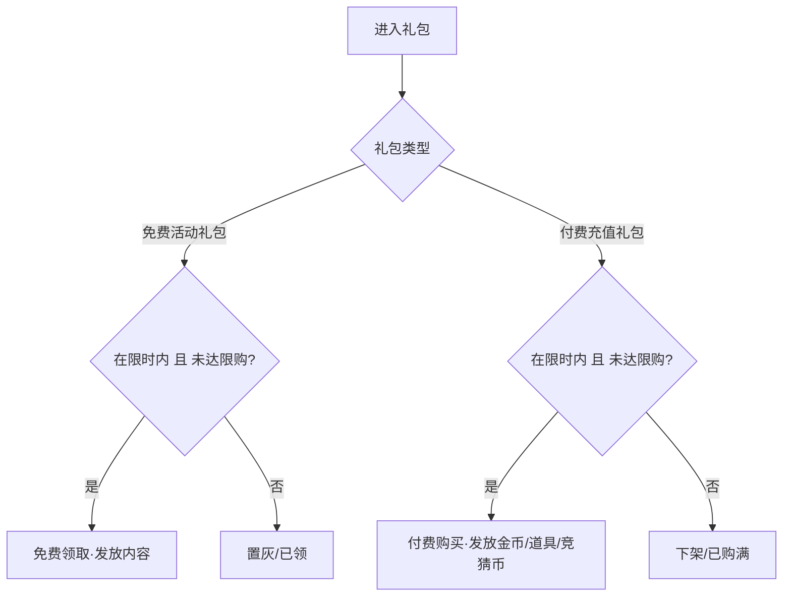

#### 界面原型

- 原型文件：[output/prototypes/bp-shop-gift.html](prototypes/bp-shop-gift.html)（礼包页签）
- 关键交互要点：礼包列表，免费礼包显示"免费领"按钮，付费礼包显示价格按钮；每项标注限时倒计时与限购进度；内容物图标预览。

#### 数据结构 / 配置表

**礼包配置 `gift_pack`**

| 字段 | 类型 | 说明 | 取值范围 |
|------|------|------|----------|
| pack_id | int | 礼包ID | ≥1 |
| pack_type | enum | 类型 | free/paid |
| price | int | 价格（paid为充值额，free为0） | ≥0 |
| contents | json | 内容（金币/比赛道具/竞猜币） | TODO |
| purchase_limit | int | 限购次数 | ≥1，TODO |
| start_time / end_time | datetime | 限时区间 | TODO |

**玩家礼包记录 `gift_purchase`**

| 字段 | 类型 | 说明 | 取值范围 |
|------|------|------|----------|
| player_id | int | 玩家 | ≥1 |
| pack_id | int | 礼包 | 引用 gift_pack |
| bought_count | int | 已购/已领次数 | ≤ purchase_limit |

## 4. Checklist

### 4.1 系统交付清单

每个系统需完成：规则确认 / 流程图 / 界面原型 / 数据表，并通过联调。

- [ ] **3.1 创角与新手引导**：规则✓ 流程图✓ 原型✓ 数据表✓ — 4角色仅外观/国籍影响首签/试训3切片(模式可逐切片切换·锁定唯一例外)/1星合同
- [ ] **3.2 切片操作核心**：规则✓ 流程图✓ 原型✓ 数据表✓ — 划线/弹弓·守门强制划线·首个非守门切片锁定整关/6类切片/3道具/回溯重置·三层配置(type_def/preset/instance)+objectives/modifiers正交·叠加优先级固定
- [ ] **3.3 基础关卡**：规则✓ 流程图✓ 原型✓ 数据表✓ — 切片实例组关·逐关配胜平负/进入即扣门票·不存进度·attempt_id幂等·断线作废/AI难度档/助攻/引导关固定脚本
- [ ] **3.4 球星养成**：规则✓ 流程图✓ 原型✓ 数据表✓ — 知名度/训练/生活三线·训练关卡(独立入口·复用切片·训练星·首通发奖)·合同按养成定档·货币(金币/门票/竞猜币)
- [ ] **3.5 积分赛**：规则✓ 流程图✓ 原型✓ 数据表✓ — 大关卡=联赛轮次·小关卡顺序解锁·赛季独立排名·绝对目标即时/排名目标赛季结算·完成发合同
- [ ] **3.6 淘汰赛**：规则✓ 流程图✓ 原型✓ 数据表✓ — 中后期开放·组队/海选(均分G组取前K=64强·不开竞猜·仅见己组)/单淘汰(64强R=6轮)·演算闭环(切片→比分/平局破法/轮空/名次)·回放仅展示·不参与排名
- [ ] **3.7 竞猜**：规则✓ 流程图✓ 原型✓ 数据表✓ — 单淘汰非轮空场·选晋级方·可押己队·窗口期可改/取消·每日上限8场·猜错退80%·赔率TODO·产出命中/收益
- [ ] **3.8 排名**：规则✓ 流程图✓ 原型✓ 数据表✓ — 4榜·积分/进球赛季独立·竞猜命中/收益全周期·名次段位发奖
- [ ] **3.9 BP 通行证**：规则✓ 流程图✓ 原型✓ 数据表✓ — 免费+付费双轨·活跃度(每日任务)升级·付费补领已达等级
- [ ] **3.10 兑换商店**：规则✓ 流程图✓ 原型✓ 数据表✓ — 竞猜币兑换·限购·周期刷新
- [ ] **3.11 礼包**：规则✓ 流程图✓ 原型✓ 数据表✓ — 付费+免费·限购·限时·投放金币/道具/竞猜币

### 4.2 待数值策划确认的 TODO 清单

> 关卡进度/扣票/幂等/断线、操作模式锁定、赛季排名结算时机、淘汰赛演算闭环均已在正文定为设计规则，下列仅剩**数值**待配。

- [ ] **门票**：上限、恢复速度、各关消耗（受生活等级 buff 影响）
- [ ] **三条养成线**：各等级经验曲线、升级奖励与效果、球队星级门槛
- [ ] **训练关卡**：各关切片实例、首通训练星、每日挑战次数、训练星→训练等级折算
- [ ] **知名度获取公式**：胜负/进球/助攻系数 + 球队星级系数
- [ ] **合同**：各档待遇数值、赛季目标阈值(含type/threshold/settle_at)、发放等级门槛
- [ ] **淘汰赛**：开放关卡L、队伍人数M、海选分组数G(16~32)及每组晋级K、各阶段时间、补位球员固定评分、评分/切片数/演算公式系数
- [ ] **竞猜**：赔率算法（对接其他项目组现成系统）、每日免费币、礼包投放量
- [ ] **排名**：四榜名次段位划分与各段奖励
- [ ] **BP**：各等级活跃度需求、免费/付费轨奖励、付费价格、每日任务配置
- [ ] **兑换商店**：商品价格、限购、刷新周期
- [ ] **礼包**：各礼包内容、价格、限购、限时

### 4.3 跨系统联调要点

- [ ] 货币闭环：金币(养成产出↔生活升级)、门票(恢复↔积分赛消耗)、竞猜币(每日/礼包↔竞猜↔兑换商店)
- [ ] 数据流：关卡结算→养成(知名度)→合同发放→评分→淘汰赛→竞猜→排名
- [ ] 切片核心(3.2)被基础关卡(3.3)与训练关卡(3.4)复用一致，均以 slice_instance 配置实例
- [ ] 排名数据源(3.5积分赛/3.7竞猜)与展示(3.8/积分赛页签)口径一致
- [ ] 赛季排名结算时刻同时驱动合同「排名达标」目标判定(3.5↔3.8)，避免先发奖不稳定
