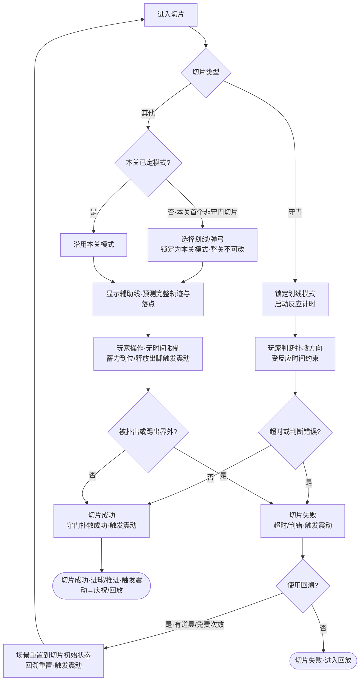
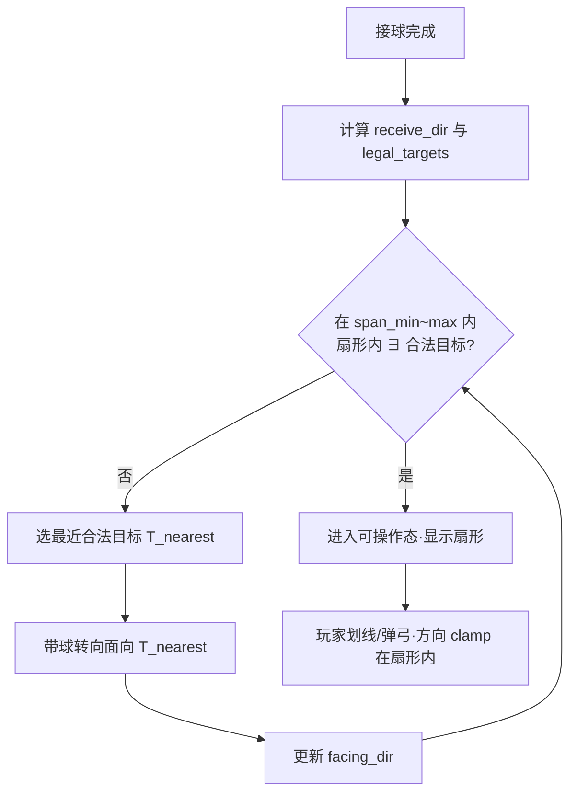
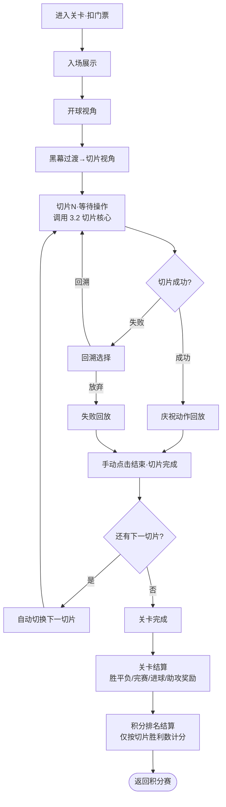
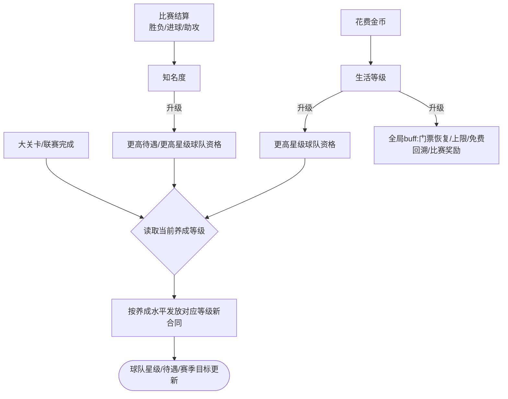
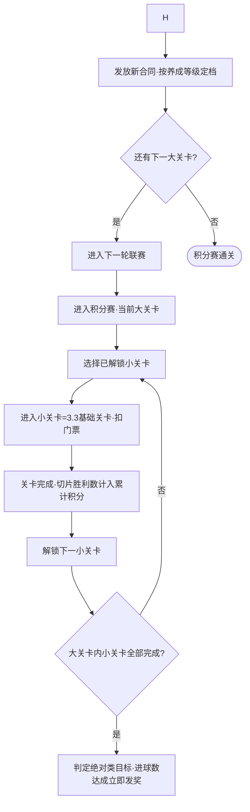
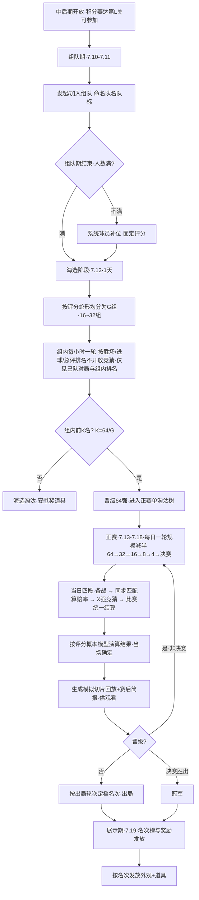
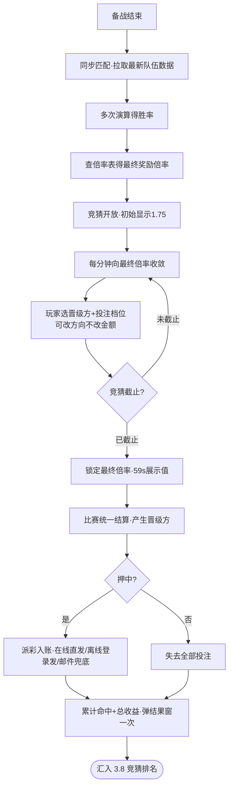

# 2026世界杯主题活动 开发文档
> 目标平台：移动端（iOS / Android，竖屏单手操作） \| 参考对标：足球生涯养成 \+ 切片休闲操作类 \| 生成日期：2026-06-01 \| 最近修订：2026-06-09

## 1\. 概述
- **一句话定位**：世界杯期间上线的限时主题活动，以「足球切片小游戏 \+ 球星生涯养成 \+ 配套活动」三层结构，借赛事热点提升活跃与付费，并验证划线/弹弓两种操作模式。
- **核心玩法**：以"切片"为最小单位完成单次足球操作（进攻/任意球/点球/角球/界外球/守门），多个切片组成一个关卡；外层是球星生涯养成（知名度/生活三条等级线 \+ 合同）；再外层是积分赛、淘汰赛、竞猜、排名、BP、商店等配套活动。
- **参考游戏对标**：足球生涯养成类（签约、试训、赛季目标）\+ 切片式休闲操作（单次进攻/守门手动操作）。竞猜规则**完整复用** X1 项目组「冠军比赛（带竞猜）」模块（[源文档](https://alidocs.dingtalk.com/i/nodes/ydxXB52LJq7Plo6Phvzmg47lWqjMp697)），仅将胜率输入改为本活动 \[3.6\] 淘汰赛演算模型。
- **目标平台**：移动端，竖屏单手操作，作为主游戏内的限时活动模块。

## 2\. 核心玩法机制
- **玩法循环**：创角签约 → 进入积分赛关卡 → 消耗门票 → 逐切片手动操作（划线/弹弓）→ 切片成功/失败（失败可回溯）→ 关卡结算（胜平负/进球/助攻奖励）→ 积分排名 → 养成提升（知名度/生活）→ 解锁更高星级球队/新合同 → 中后期开放淘汰赛与竞猜 → 配套活动（排名/BP/商店）消耗产出。
- **全局规则**： 
    - 切片是最小操作单元；关卡由多切片组成；胜平负由关卡配置（通常按进球数/切片数比例）判定。
    - 积分赛单次消耗**门票**，门票有上限与恢复速度（受生活等级 buff 影响）。
    - 操作模式（划线/弹弓）两种均需开发。**正式关卡：首个非守门切片选定模式后，整关锁定不可更改；守门切片强制划线，不占用也不改变锁定**。**试训为唯一例外，每个切片可自主切换以触发对应教学**。失败回溯后沿用本关已锁定模式。
    - 局内道具：哨子（\+1 非守门切片，默认生效）、回溯（切片失败重来，有免费次数）、瞄准/辅助线（默认生效）。
    - 积分排名规则与真实足球不同：仅按切片胜利数量计分，非胜3平1负0。
- **数值框架**：门票上限/恢复速度、各等级经验曲线、合同待遇、AI 难度档位等均为待配置数值；竞猜赔率**公式与倍率表已复用 X1 定稿**，仅演算次数、每日免费领取量等待配。本文档在各系统数据表中**预留字段并标注 TODO**（见各系统）。

## 3\. 系统设计

### 3.1 创角与新手引导

#### 规则与逻辑

首次进入活动的一次性流程，结束后进入活动主界面。
- **开场视频：**timeline或者视频，展示球星经典射门（参考游戏是C罗世界杯任意球）
- **选角**：固定 **4 个角色，仅外观差异、无数值差异**，后续可修改。选角界面点选角色 → 拉近镜头 → 显示战力 → 弹出**国籍选择**弹窗，可随时返回重选。
- **国籍**：仅影响**首次签约时系统提供的球队选项**（决定球队所属地区），不影响角色属性、外观或其他系统。
- **试训**：固定包含**进攻、任意球、点球**三类切片教学，**顺序执行**。试训是操作模式锁定规则的**唯一例外**——每个切片玩家可自主切换划线/弹弓两种操作模式，并触发对应模式的教学（操作细节见 \[3.2 切片操作核心\]）。
- **首次签约**：试训完成后收到球队合同，进入选择球队。默认提供 **1 个 1 星球队**，并按国籍**动态生成 2 个对应地区球队**；三者**仅名字与国籍区别**，星级同为 1 星。小游戏不要求输入名字，默认用玩家名。
- **签约亮相**：确认签约后展示亮相动画（独立模块「签约亮相」并入此处），进入活动主界面，强引导指向第一关。
    - 第一关还有一个队友游标和滑动视角的教学
    - 第一关本身的新手引导归属 \[3.3 基础关卡\]（未通关重进会重复触发），签约亮相这段仅负责到"进入主界面 \+ 强引导指向第一关"。

#### 流程图


#### 界面原型
- 选择角色/选择国籍


| 图中元素 | 规则说明 |
|------------|------------|
| 4 个低模球员站在球场中央 | 固定 4 角色，仅外观差异；点击角色后应进入选中态/拉近镜头。 |
| 底部蓝色按钮/提示“请选择你的角色” | 未选择时作为提示；选中角色后应切换为确认/下一步态，或自动弹出国籍选择。 |
| 球场、教学楼、球门背景 | 仅表现，不参与逻辑；可作为创角场景背景资源。 |
| 当前角色被拉近到屏幕中央 | 表示已选角色；背景仍显示其他角色，不能误认为可同时选多人。 |
| 国旗网格：中、德、巴、葡、阿、比、西、波、瑞、法等 | 国籍为单选；选中后高亮；国籍只影响首签球队池。 |
| 底部左侧蓝色 X、右侧金色确认按钮 | X 返回选角；确认写入国籍并进入试训。未选国籍时确认应置灰。 |
- 试训关卡（划线/弹弓）


| 图中元素 | 规则说明 |
|------------|------------|
| 右上角暂停按钮 | 试训和正式局内均需有暂停入口；暂停不影响试训进度。 |
| 巨型白色手势 \+ 白色轨迹线 | 划线模式教学：玩家按手势绘制球路，系统展示预测轨迹。 |
| 黄色扇形/夹角线 | 表示可操作角度范围；超出范围应被限制或修正。 |
| 虚线目标区域、绿色箭头、训练小门/目标框 | 表示命中目标；目标区域和箭头应来自切片配置。 |
| 底部蓝色教学文案框 | 图中有“通过拖动来选择踢球方向和力量”“将球踢进白色线框内，力量控制在65%左右”等文案；按切片步骤配置。 |
| 力量百分比，如 49%、65% | 弹弓/力度教学需要实时显示力量值；教学目标可要求落在指定范围。 |
| 人墙、门将、目标点 | 任意球/点球/进攻教学按切片类型摆位；试训中允许每个切片独立教学，不锁整关模式。 |
- 初始合同


| 图中元素 | 规则说明 |
|------------|------------|
| 弹窗标题“试训完成” | 完成全部试训切片后出现。 |
| 文案“球队给你发来了邀请，挑选一支作为职业生涯起点” | 点击确认后进入球队选择。 |
| 队伍选择页标题“请选择队伍” | 展示 3 个候选球队。 |
| 球队卡：队服图标、国家/联赛标识、球队名、星级、右箭头 | 点击卡片进入合同详情；星级展示固定 1 星起步。 |
| 合同详情“我的合同”弹窗 | 显示国家/联赛、球队名、星级、待遇、球队目标、奖励、签名输入框。 |
| 合同详情中的 X/确认按钮 | X 返回球队选择；确认签约。签名输入如果只是表现，可默认玩家名。 |
- 签约（可以没有）与主界面


| 图中元素 | 规则说明 |
|------------|------------|
| 球员举球衣、背景墙 MINI SOCCER STAR | 签约亮相动画/过场，可跳过与否待定。 |
| 主界面顶部：等级/经验、钻石、金币、体力、设置 | 顶部资源栏需全局复用；体力显示当前/上限。 |
| 主界面左侧：每日任务、起始礼包、存钱罐、自定义 | 分别映射任务、礼包、付费/储蓄、外观修改入口。 |
| 主界面右侧：目标、评分、进球、助攻、职业生涯 | 显示当前目标和核心统计；职业生涯进入成长/合同相关页。 |
| 底部主导航：商店、奖杯/比赛、开始、赛程、排名 | 中间“开始”是主线入口；红点表示可领取/待处理。 |
| 大按钮“下一场比赛” | 点击进入战前页或当前小关卡。 |

#### 数据结构 / 配置表

**角色配置表** `**character_config**`

| 字段 | 类型 | 说明 | 取值范围 |
|------|------|------|------------|
| character\_id | int | 角色ID | 1–4 |
| appearance\_key | string | 外观资源键 | 非空 |
| display\_power | int | 展示用战力（仅表现，无数值差异） | ≥0，TODO 数值 |

**国籍配置表** `**nationality_config**`

| 字段 | 类型 | 说明 | 取值范围 |
|------|------|------|------------|
| nationality\_id | int | 国籍ID | ≥1 |
| name | string | 国籍名称 | 非空 |
| region | enum | 所属地区（决定首签球队选项） | 枚举，TODO 列表 |
| team\_pool | int 数组 | 该国籍可动态生成的球队池ID | 引用 team\_config |

**试训配置表** `**tutorial_config**`

| 字段 | 类型 | 说明 | 取值范围 |
|------|------|------|------------|
| step\_index | int | 试训步骤序号 | 1–3 |
| slice\_type | enum | 切片类型 | attack/free\_kick/penalty |
| forced\_order | bool | 是否强制顺序 | true |

**玩家创角存档** `**player_profile**`**（创角相关字段）**

| 字段 | 类型 | 说明 | 取值范围 |
|------|------|------|------------|
| player\_name | string | 玩家名（默认即角色名） | 非空 |
| character\_id | int | 选定角色 | 1–4 |
| nationality\_id | int | 选定国籍 | 引用 nationality\_config |
| signed\_team\_id | int | 首签球队 | 引用 team\_config |
| tutorial\_done | bool | 是否完成新手引导 | 默认 false |
| haptic\_enabled | bool | 震动总开关（设置内，见 \[3.2\] 震动模块） | 默认 true |

### 3.2 切片操作核心

#### 规则与逻辑

单次足球操作的核心引擎，被所有关卡切片调用。
- **操作模式**： 
    - **划线**：忽略力度和高度，玩家确定落点和弧度，系统做自动轨迹修正。
    - **弹弓**：忽略高度和弧度，玩家确定方向和力度。
    - **守门切片只能用划线**（强制，不触发锁定、也不受锁定影响）；其余切片（进攻/任意球/点球/角球/界外球）的模式由**本关第一个非守门切片选定后锁定整关**，关卡内不可更改，失败回溯后仍沿用锁定模式。
    - **唯一例外是试训**（\[3.1\]）：试训每个切片可单独切换模式，不锁定，用于教学两种操作。
- **6 类切片核心参数**（见数据表）：进攻、任意球、点球、角球、界外球、守门。
- **球员职责**：摆位 `players_init` 中每个球员须配置 `duty`（见 `player_ai_duty`）；我方一律前锋，对方分门将/后卫两档。职责用于 AI 行为匹配、动画状态查找与合法目标筛选（对方球员不算合法传球目标）。
- **成功/失败判定**： 
    - 非守门切片：玩家操作结果（落点/方向/力度）与切片参数（门将权重、可操作夹角等）做命中计算。**失败 = 被门将扑出，或被对方球员出球并踢出界外**；否则进球/推进视为成功。
    - 守门切片：有**反应时间**，**超时失败**；判断扑救方向错误失败。
- **瞄准辅助线**：默认生效。划线与弹弓两种模式下，辅助线均**准确标出足球完整运行轨迹与落点**。
- **操作夹角约束**（非守门切片）： 
    - **总则**：进入可操作态前，系统生成可操作夹角扇形 `[θ_min, θ_max]`（水平面，以控球球员为顶点）。扇形**以接球方向为锚**，宽度在 `angle_span_min` ~ `angle_span_max` 内调整；玩家划线/弹弓方向超出扇形时** clamp 到边界**（或修正为最近合法方向，二选一，MVP 建议 clamp）。 
    - **合法目标**：本切片内可作为出脚方向的**合法目标**包括——**球门**（有效得分区中心或配置 scoring 点）、**我方其他球员**（`players_init` 中同队且非当前控球者，瞄准点为其脚下或跑位点）。对方球员、场外点、纯 UI 装饰箭头**不算**合法目标。 
    - **覆盖判定**：扇形内须**至少存在一个合法目标**（不要求包含全部合法目标，也不要求必须对准当前 objective 的指定点）。多个合法目标时，只要**任意一个**落在扇形内即满足进入可操作态的前置条件。 
    - **接球方向 `receive_dir`**：上一脚为队友传球时 = 传球者→接球者水平方向；否则取 `ball_vector` 或控球球员初始 `facing`。 
    - **扇形生成**：以 `receive_dir` 为初始中心，在 `[receive_dir ± angle_max_center_shift]` 内搜索中心角 `θ_center`；对每个候选中心取满足「扇形内 ∃ 合法目标」的**最小** span，再 clamp 到 `[angle_span_min, angle_span_max]`；若有多个可行解，取 span **最小**者（难度最高）。 
    - **带球调整 `dribble_realign`**：若在 `span = angle_span_max` 且中心已扫完允许偏移范围后，扇形内仍**不存在任何合法目标**，则**不进入可操作态**，自动执行带球：控球球员转向**最近的合法目标**（`argmin |angle_diff(t, facing_dir)|`），更新 `facing_dir` 后**重新生成扇形**；重复直至扇形内存在合法目标，再进入可操作态。**带球调整无次数上限**；调整期间不可操作，与等待操作同样暂停计时；不改变 objective、不额外消耗切片。 
    - **与 objective 的关系**：扇形覆盖保证「有路可走」（射或传至少一个方向在扇形内）；切片**成功/失败**仍由当前 `objectives` 独立判定（如 `pass_to` 必须传给指定队友、`score` 必须进球）。 
    - **回溯**：回溯重置后，面向、扇形与 `realign_count` 一并回到切片 `players_init` 初始状态。 
    - **守门切片**：不适用本规则（守门为方向判断，无操作夹角扇形）。
- **操作时间**：仅守门切片有反应时间限制；其余切片等待操作时**纯暂停、无时间限制**。
- **局内道具**： 
    - **哨子**：增加 1 次非守门切片，默认生效。
    - **回溯**：切片失败时可选使用，**将场景重置到该切片最初状态**（足球与所有球员位置从配置初始位置重新加载）；有免费次数，携带道具时优先用免费次数。
    - **瞄准**：提供辅助线，默认生效。
- **震动反馈（手机震动模块）**： 
    - **覆盖范围**：仅在**关键结果**与**核心操作**两类离散事件触发，操作等待过程（蓄力拖动、划线绘制中）**不持续震动**，与「等待操作纯暂停、无时间限制」规则不冲突。 
        - 核心操作事件（本系统产生）：**蓄力到位/落点锁定**、**释放出脚**。 
        - 关键结果事件：**切片成功（进球/推进）**、**被门将扑出**、**踢出界外**、**守门超时失败**、**守门判断错误**、**守门扑救成功**、**击中门框**、**回溯重置**。 
    - **分级与图案**：震动由**强度档（轻/中/重 `light/medium/heavy`）× 图案（短促/双击/连续 `tick/double/continuous`）** 两个维度组合表达，不同事件映射不同组合（见数据表 `haptic_config`）；例如进球=重+双击、被扑出=中+短促、回溯重置=轻+连续。 
    - **全局开关**：设置内提供「震动」总开关，**新玩家默认开启**，玩家选择写入 `player_profile.haptic_enabled` 持久化；关闭时所有事件**静默跳过**，不影响任何切片判定。 
    - **配置归属**：震动配置独立于切片三层摆位（`slice_type_def/preset/instance`），统一挂在**全局事件→震动映射表** `haptic_config`，按事件类型生效，策划改一处即全局生效，与切片摆位解耦。 
    - **平台与降级（不阻塞主逻辑）**：iOS 用 Core Haptics / `UIFeedbackGenerator`（`light/medium/heavy` 与 success/warning/error），Android 用 `VibrationEffect`(API 26+) 预定义效果（`EFFECT_TICK/CLICK/HEAVY_CLICK/DOUBLE_CLICK`）与 waveform；**无马达或不支持振幅控制的设备**退化为固定时长震动或静默；震动调用失败仅记录、**不阻断切片流程**；连续触发（如失败连点回溯）需做**最小间隔节流**，避免马达过热。
- **关系**：被 \[3.3 基础关卡\] 的每个切片调用；道具携带与库存见 \[3.4 球星养成\] 与局外道具系统；震动开关读 \[3.1\] `player_profile`，事件映射全局复用（淘汰赛回放等其他系统亦可引用 `haptic_config`）。

#### 流程图



**操作夹角与带球调整流程**（非守门切片，进入可操作态前）：



#### 数据结构 / 配置表

**操作模式枚举** `**operation_mode**`：`draw_line`（划线）/ `slingshot`（弹弓）

切片配置采用**三层 \+ 两个正交模块**，兼顾配置便捷（preset 复用）、扩展性（加数据不加列）与趣味性（机制/目标可插拔）。
```
L1 slice_type_def   类型固有规则(只读, 程序定)
L2 slice_preset     可复用摆位预设(策划90%引用)
L3 slice_instance   关卡里的一个切片 = preset + override + 目标 + 机制
       ├─ objectives  目标/胜负判定(正交)
       └─ modifiers   玩法机制(正交, 可插拔, 数据驱动)
```

**叠加优先级（必须固定）**：`preset 基线 → instance.overrides → ai_profile(关卡难度) → modifiers(机制)`；后者覆盖前者，modifiers 最后生效。

**L1 切片类型定义** `**slice_type_def**`**（只读，程序定，新增类型加一行不动下游）**

| 字段 | 类型 | 说明 | 取值范围 |
|------|------|------|------------|
| slice\_type | enum | 切片类型 | attack/free\_kick/penalty/corner/throw\_in/goalkeep |
| allowed\_modes | enum 数组 | 允许的操作模式 | 守门=仅 draw\_line；其余=draw\_line 与 slingshot |
| judge\_fn | string | 判定函数键（程序实现） | 非空 |
| payload\_schema | json | 该类型 `type&#95;payload` 字段定义与校验 | 见各类型 |
| default\_camera | json | 默认相机 | - |

各类型 `payload_schema` 字段（preset/instance 的 `type_payload` 按此填）：

| 切片类型 | type\_payload 字段 |
|------------|--------------------|
| 进攻 attack | 默认目的地、门将权重、可操作夹角 |
| 任意球 free\_kick | 罚球点位、墙体站位、可操作夹角、门将权重 |
| 点球 penalty | 点球点、门将扑救方向权重、反应时间 |
| 角球 corner | 角球发球位、禁区跑位模板、第一落点权重 |
| 界外球 throw\_in | 发球位、接应跑位、二次进攻模板 |
| 守门 goalkeep | 对手射门方向权重、反应时间（超时失败）、判断错误失败 |

**L2 摆位预设** `**slice_preset**`**（可复用、可独立预览的完整摆位，策划资产）**

| 字段 | 类型 | 说明 | 取值范围 |
|------|------|------|------------|
| preset\_id | int | 预设ID（被 instance 引用） | ≥1 |
| slice\_type | enum | 所属类型 | 引用 slice\_type\_def |
| name | string | 预设名（如"右路单刀"） | 非空 |
| tags | string 数组 | 检索标签（side/distance/difficulty…） | 可空 |
| ball\_pos | vec3 | 足球初始位置 | 公共摆位 |
| ball\_vector | vec3 | 足球初始向量 | 公共摆位 |
| ball\_owner | int | 初始控球球员索引 | 守门可空 |
| players\_init | json 数组 | 双方球员初始站位与职责，元素结构见下表 | 公共摆位 |

**`players_init` 元素** `SoccerPlayerInit_V`：

| 字段 | 类型 | 说明 | 取值范围 |
|------|------|------|----------|
| team | enum | 所属阵营 | home 我方 / away 对方 |
| idx | int | 同队球员序号 | ≥0，与 ball\_owner 索引规则一致 |
| duty | int | 球员 AI 职责 | 1=守门员；2=后卫（对方除门将外）；3=前锋（我方含玩家） |
| pos | vec3 | 初始站位 | 球场坐标 |
| facing | float | 初始朝向（°，可选） | 可空，默认由 pos/球向推导 |

职责约定：**我方所有球员（含守门切片中的玩家）均为前锋(3)**；**对方仅门将(1)与其余后卫(2)** 两档。`duty` 与摆位 `pos` 共同决定切片初始态；运行时 AI 行为树、FSM 动画映射均按 `duty` 匹配。

**球员 AI 职责枚举** `**player_ai_duty**`**（程序侧 `PlayerAiDuty`，配置表 `player_ai_duty_enum`）**

| 值 | 枚举名 | 说明 |
|----|--------|------|
| 1 | Goalkeeper | 守门员（对方门将；移动门将机制不改变职责） |
| 2 | Defender | 后卫（对方除门将外所有球员：拦截、人墙、守门切片射门等） |
| 3 | Forward | 前锋（我方所有球员，含玩家操控角色与守门切片中的玩家站位） |

`players_init` 配置示例（右路单刀）：

```json
[
  {"team":"home","idx":0,"duty":3,"pos":{"x":12,"y":0,"z":35}},
  {"team":"home","idx":1,"duty":3,"pos":{"x":10,"y":0,"z":30}},
  {"team":"away","idx":0,"duty":1,"pos":{"x":12,"y":0,"z":55}},
  {"team":"away","idx":1,"duty":2,"pos":{"x":8,"y":0,"z":48}}
]
```

| camera | json | 默认视角 | instance 可 override |
| target\_point | vec3 | 默认目标点/落点 | 守门可空 |
| operable\_angle | float | 默认可操作夹角总宽度（兼容字段，= angle\_span\_max 默认） | 非守门 |
| angle\_span\_min | float | 可操作夹角宽度下限（°） | 非守门，TODO 数值 |
| angle\_span\_max | float | 可操作夹角宽度上限（°） | 非守门，TODO 数值 |
| angle\_max\_center\_shift | float | 扇形中心相对接球方向最大偏移（°） | 非守门，TODO 数值 |
| angle\_margin | float | 合法目标贴边余量（°） | 默认 3–5，TODO 数值 |
| type\_payload | json | 类型差异参数**默认值**（按 L1 schema，自包含可预览） | - |
| recommended\_modes | enum 数组 | 建议操作模式（仅提示，不强制） | 可空 |

**L3 切片实例** `**slice_instance**`**（一次关卡使用 = 装配单，被 level\_config 引用）**

| 字段 | 类型 | 说明 | 取值范围 |
|------|------|------|------------|
| slice\_instance\_id | int | 实例ID | ≥1 |
| slice\_type | enum | 引用类型 | slice\_type\_def |
| preset\_id | int | 引用摆位预设 | slice\_preset，可空=纯手填 |
| overrides | json | 覆盖 preset 的局部字段（小改不必新建 preset） | 可空 |
| type\_payload | json | 覆盖 preset 的类型参数 | 可空=用 preset 默认 |
| objectives | json 数组 | 目标/胜负判定（见下） | ≥1 |
| modifiers | json 数组 | 挂载的玩法机制（见下） | 可空 |
| ai\_override | json | 实例级 AI 微调（叠在关卡 AI 档之上） | 可空 |

**目标定义** `**objective_def**`**（正交，决定"这一关要玩家做成什么"）**

| objective type | 成功条件 | params |
|--------------|------------|------|
| score | 进球 | - |
| pass\_to | 传给指定队友（计助攻） | target |
| hit\_zone | 命中指定区域 | zone |
| keep\_possession | 护球不被断 | duration |
| survive | 守门撑过反应时间且方向正确 | - |

**机制定义** `**modifier_def**`**（正交、可插拔，新玩法加一行不动引擎 → 趣味\+扩展核心）**

| modifier\_id | 效果 | params |
|------------|------|------|
| wind | 球轨横向偏移 | direction, strength |
| moving\_keeper | 门将左右移动 | speed, range |
| shrink\_goal | 球门变窄 | scale |
| no\_aim\_line | 关闭辅助线 | - |
| multi\_target | 多得分区，分值不同 | zones 数组 |
| time\_pressure | 非守门切片加倒计时 | ms |
| combo\_required | 须前一切片成功才解锁 | prev\_slice |
> 实例示例：右路单刀 preset(33) \+ `overrides:{operable_angle:28}` \+ `objectives:[{score}]` \+ `modifiers:[{moving_keeper},{no_aim_line}]`，即"复用单刀摆位、微调夹角、要求射门、门将会动且无辅助线"。   

**FSM / BT / 敌人 AI**（与切片三层正交；测试配置见 `output/test-config/ActivitySoccer.xlsx`）

参数叠加优先级（与正文一致）：`preset → instance.overrides → ai_profile(关卡难度) → slice_ai(单切片) → modifiers(机制)`；AI 难度档主要控制成功率，死角球不可扑（`dead_corner_can_save=0`）。

**关卡 AI 档位表** `**ai_profile_config**`**（关卡级，引用自 `level_config.ai_profile_id`）**

| 字段 | 类型 | 说明 | 取值范围 |
|------|------|------|----------|
| ai\_profile\_id | int | AI 档位 ID | ≥1 |
| difficulty | enum | 难度标签 | easy / normal / hard |
| goalkeeper\_save\_rate | int | 门将扑救成功率（%） | 0–100 |
| defender\_success\_rate | int | 防守成功率（%） | 0–100 |
| shooter\_success\_rate | int | 对方射门成功率（%） | 0–100 |
| dead\_corner\_can\_save | int | 死角可扑 | 固定 0 |
| reaction\_time\_ms | int | 默认反应时间（ms） | ≥0 |

**敌人 AI 配置表** `**enemy_ai_config**`**

| 字段 | 类型 | 说明 | 取值范围 |
|------|------|------|----------|
| enemy\_ai\_id | int | 配置 ID | ≥1 |
| duty | int | 球员 AI 职责 | 引用 `player_ai_duty` |
| save\_weight / left\_weight / right\_weight / up\_weight | int | 门将扑救方向权重 | duty=1 时使用 |
| intercept\_weight / clearance\_weight | int | 拦截 / 解围权重 | duty=2 时使用 |
| keeper\_catch\_fail / out\_of\_bounds\_fail | int | 特殊失败开关 | 0/1 |
| animation\_key | string | 默认表现动作 | 引用动作资源 |

**单切片 AI 配置表** `**slice_ai_config**`**（按 `slice_instance_id` 绑定）**

| 字段 | 类型 | 说明 | 取值范围 |
|------|------|------|----------|
| slice\_ai\_id | int | 配置 ID | ≥1 |
| slice\_id | int | 切片实例 | 引用 `slice_instance` |
| ai\_profile\_id | int | 难度档 | 引用 `ai_profile_config` |
| goalkeeper\_ai\_id | int | 门将 AI | 引用 `enemy_ai_config`，duty=1 |
| defender\_ai\_id | int | 后卫 AI | 引用 `enemy_ai_config`，duty=2 |
| shooter\_ai\_id | int | 对方后卫射门 AI | 引用 `enemy_ai_config`，duty=2；仅守门切片等需对方出脚场景使用，字段名保留兼容 |
| modifier\_id | int | 切片级机制 | 引用 `ai_modifier_config`（如 moving\_keeper） |
| is\_guide\_ai | bool | 引导关 AI | 默认 false |
| rewind\_random | bool | 回溯后重随机 | 默认 true |
| override\_reaction\_time\_ms | int | 覆盖反应时间 | 0=用档位默认 |

**AI 机制表** `**ai_modifier_config**`**

| modifier\_type | 效果 | 典型 params |
|----------------|------|-------------|
| moving\_keeper | 门将左右移动 | speed, range, start\_offset |
| no\_aim\_line | 关闭辅助线 | enabled |
| fixed\_wall | 任意球固定人墙 | enabled |

**切片流程表** `**slice_flow_config**`**（按切片类型读 FSM 流程）**

| 字段 | 类型 | 说明 |
|------|------|------|
| slice\_type | enum | 切片类型 |
| force\_operation\_mode | enum | 强制操作模式（守门=draw\_line） |
| wait\_input\_time\_ms | int | 等待限时（守门有值，其余 0=无限） |
| need\_replay\_click | bool | 回放需手动结束 |
| enable\_rewind | bool | 允许回溯 |
| success\_replay\_key / fail\_replay\_key | string | 成功/失败回放状态键 |

**角色状态→动画映射表** `**character_state_config**`**

| 字段 | 类型 | 说明 |
|------|------|------|
| state\_key | string | FSM 状态（Idle/Run/Kick/SaveLeft…） |
| duty | int | 职责；匹配 `player_ai_duty`；场景过渡可用 0（非枚举，仅本表） |
| anim\_key | string | 美术动作 key |
| mirror\_from\_id | int | 左右镜像来源 |
| need\_event / event\_key | bool / string | 关键帧事件（出球、扑救接触等） |

**局内道具表** `**in_match_item_config**`

| 字段 | 类型 | 说明 | 取值范围 |
|------|------|------|------------|
| item\_id | enum | 道具 | whistle/rewind/aim |
| effect | string | 效果 | 哨子\+1非守门切片/回溯重置切片/瞄准辅助线 |
| default\_active | bool | 是否默认生效 | 哨子=true,瞄准=true,回溯=false |
| free\_count | int | 免费次数（仅回溯） | ≥0，TODO 数值 |

**切片运行时状态** `**slice_runtime**`

| 字段 | 类型 | 说明 | 取值范围 |
|------|------|------|------------|
| slice\_id | int | 切片实例ID | ≥1 |
| locked\_mode | enum | 本关锁定的操作模式 | operation\_mode |
| receive\_dir | float | 接球方向（°） | 运行时计算 |
| operable\_angle\_center | float | 最终扇形中心角（°） | 运行时计算 |
| operable\_angle\_min / max | float | 最终可操作角边界（°） | 运行时计算 |
| realign\_count | int | 已执行带球调整次数 | ≥0，无上限 |
| legal\_targets\_resolved | json | 参与覆盖判定的合法目标列表 | 运行时 |
| reaction\_time\_ms | int | 反应时间（仅守门/点球） | ≥0，TODO 数值 |
| result | enum | 切片结果 | success/fail |
| fail\_reason | enum | 失败原因 | saved/out\_of\_bounds/timeout/wrong\_judge |

**震动事件映射表** `**haptic_config**`**（全局，事件→震动；与切片三层摆位解耦，跨系统可引用）**

| 字段 | 类型 | 说明 | 取值范围 |
|------|------|------|------------|
| event\_id | enum | 触发事件 | charge\_locked/ball\_released/slice\_success/saved/out\_of\_bounds/gk\_timeout/gk\_wrong\_judge/gk\_save/hit\_post/rewind\_reset |
| category | enum | 事件分类 | core\_operation（核心操作）/ key\_result（关键结果） |
| intensity | enum | 强度档 | light/medium/heavy |
| pattern | enum | 震动图案 | tick（短促）/ double（双击）/ continuous（连续） |
| duration\_ms | int | 持续时长（连续/退化设备用） | ≥0，TODO 数值 |
| min\_interval\_ms | int | 同事件最小触发间隔(节流，防连点过热) | ≥0，TODO 数值 |
| enabled\_default | bool | 该事件是否默认参与震动 | 默认 true |

> 映射示例（强度/图案为设计基线，最终手感由数值/体验确认）：进球 `slice_success`=heavy+double；被扑出 `saved`=medium+tick；踢出界外 `out_of_bounds`=medium+tick；守门超时 `gk_timeout`=heavy+tick；守门判断错误 `gk_wrong_judge`=medium+double；守门扑救成功 `gk_save`=heavy+double；击中门框 `hit_post`=medium+double；蓄力到位 `charge_locked`=light+tick；释放出脚 `ball_released`=medium+tick；回溯重置 `rewind_reset`=light+continuous。   

> 平台落地：iOS 映射 `UIImpactFeedbackGenerator(.light/.medium/.heavy)` 与 `UINotificationFeedbackGenerator(.success/.warning/.error)`；Android 映射 `VibrationEffect`(API 26+) 的 `EFFECT_TICK/CLICK/HEAVY_CLICK/DOUBLE_CLICK` 或 `createWaveform`；低端机无振幅控制时按 `duration_ms` 退化为单段震动，无马达则静默。受 `player_profile.haptic_enabled` 总开关控制，关闭即全部静默。   

### 3.3 基础关卡

#### 规则与逻辑

关卡是切片的容器，定义胜负判定、流程编排与结算。被 \[3.5 积分赛\] 作为轮次内容调用。
- **关卡结构**：一个关卡由多个切片组成（切片类型见 \[3.2\]）。**胜平负由每个关卡单独配置**（通常按进球数/切片数比例，如 2/3 胜、1/3 平、0 球负——仅为示例，逐关配置）。
- **门票消耗与进度（MVP 规则，已定）**： 
    - **进入关卡即扣门票**（开始扣，失败也已扣，不在结算时扣）。
    - **中途退出不保存切片进度**：重进 = 重新进入、再次扣门票、从第一个切片重来。
    - **奖励幂等**：每次进入生成 `attempt_id`，结算奖励按 `attempt_id` 入账且**同一 attempt 只发一次**；重复进入是新 attempt、可再次正常结算（不存在"重复领同一份奖励"）。
    - **断线 / 杀进程 / 后台超时**：未走到结算的 attempt 一律**作废**（门票不退、不发奖），重进按新 attempt 处理；不做断线续局。
- **关卡 AI**：预设多套 AI，作为**关卡级难度档位**，作用到该关各切片的权重参数（门将权重、跑位模板等），控制难度与体验。
- **助攻机制**：玩家扮演球星，场上有系统队友。当**主角传球给队友、队友射门成功**，计为主角助攻（对应"传球给队友"类切片成功）。
- **关卡流程**：入场展示 → 开球视角 → 切片视角（切换均用黑幕过渡）→ 进入第一个切片停留等待操作 → 每切片成功/失败后进入**回放**：成功=庆祝动作展示，失败=回溯选择（消耗道具/免费次数或放弃，见 \[3.2\]）→ 回放需**手动点击结束**视为该切片完成 → 自动切下一切片 → 所有切片完成=关卡完成 → 依次弹出**关卡结算**与**积分排名结算**。→ 如果联赛所有关卡都完成，回到关卡界面后需要衔接联赛关卡推进至下一关的流程
- **关卡结算**：胜平负结果、完赛奖励、进球数奖励、助攻数奖励。
- **排名结算**：与真实足球

积分规则（胜3平1负0）不同，**仅按切片胜利数量算积分**。
- **引导关**：第一关为**固定脚本**引导关；未通关时重进会重复触发引导（S1 创角只负责引导指向第一关，引导关本身属本系统）。
- **关卡道具**：允许携带哨子/回溯/瞄准进入关卡（局内行为见 \[3.2\]）。

#### 流程图



#### 界面原型
- 活动主界面/小关卡战前界面/联赛关卡界面


| 图中元素 | 规则说明 |
|------------|------------|
| 标题 CHN-L2 第1/17轮 或 ESP-L3 第13/19轮 | 展示当前联赛、轮次。 |
| 双方球队名、角色模型、星级、排名 | 展示对阵信息；排名和星级只展示，不由前端计算。对手星级取自 `level_config.opponent_team_star`，与 `team_config` 无关。 |
| 中部信息条：射门机会、胜利、平 | 进入前展示本关切片/胜平负目标，例如射门机会 2/3、胜利 2、平 1。 |
| 小按钮：队服/装备、积分榜、赛程 | 队服/装备用于展示或更换；积分榜/赛程打开弹窗。 |
| 三个 \+ 道具槽 | 携带局内道具；空槽点开选择道具。 |
| 返回按钮、黄色“开球”按钮 | 开球按钮消耗体力/门票；需防连点。 |
| 3D 路线节点，节点标号 1-16 和年份 2019-2033 | 大关卡/赛季路径展示；当前节点用角色和绿色光圈表示。 |
| 巴西旗、训练道具、场景装饰 | 可作为赛季主题/节点装饰，不影响解锁逻辑。 |
| 底部“回放 / 统计 / 退出” | 回放查看过往表现；统计打开数据；退出返回主界面。 |
- 入场表演/开球/切片操作


| 图中元素 | 规则说明 |
|------------|------------|
| 球队横向入场镜头 | 关卡开场表现，结束后进入开球/切片。 |
| 俯视中圈开球镜头 | 开球过场，通常不可操作。 |
| 局内切片：主角脚下黄色光圈、底部手势、黄色方向线 | 表示当前可操作球员和操作起点。 |
| 绿色箭头 / 白色落点 | 表示推荐目标点或队友跑位目标。 |
| 右侧圆形相机/视角图标 | 可触发相机说明或视角切换。 |
| 底部教学文案 | 第一关教学专用；未通关重进应重复。 |
- 回溯弹窗/浮标提醒/视角提醒


| 图中元素 | 规则说明 |
|------------|------------|
| 蓝色气泡“这个标志表示在这个方向上有你的队友” | 队友方向标识教学；点击“明白了”关闭。 |
| 上半屏左右箭头 \+ 摄像机图标 \+ 手势 | 视角滑动教学；提示“在屏幕上半部分左右滑动移动相机”。 |
| 回溯弹窗“重试” | 切片失败后出现。 |
| 圆形回溯按钮 \+ “免费” | 免费次数优先；用完后消耗道具或货币。 |
| 提示“错过这次机会你将无法取得胜利” | 回溯失败后果文案；应按关卡结果规则动态生成。 |
| “倒带以重试”按钮/文字 | 确认回溯后重置到该切片初始状态。 |
- 切片完成/关卡结算/排名结算


| 图中元素 | 规则说明 |
|------------|------------|
| 底部蓝色状态栏：胜利 0/2、平 0/1 | 局内实时显示当前胜平目标进度。 |
| 底部按钮：回放、分享/传递、下一步 | 切片结束后手动继续；下一步进入下一切片或结算。 |
| 结算弹窗标题“平” | 胜/平/负标题按关卡配置结果。 |
| 奖励行：周薪、进球、助攻，对应金币数 | 结算奖励分项展示。 |
| 紫色 VIP 确认按钮 | 可能是确认/加倍奖励入口；如果保留 VIP 逻辑需明确是否付费加成。 |
| 排名结算弹窗：W/L/D/PTS 表格 | 展示本轮后积分榜；当前玩家行高亮。注意图中 PTS 是传统积分，需改成本文档定义的“切片胜利数积分”或重命名。 |

#### 数据结构 / 配置表

**关卡配置表** `**level_config**`

| 字段 | 类型 | 说明 | 取值范围 |
|------|------|------|------------|
| level\_id | int | 关卡ID | ≥1 |
| is\_tutorial | bool | 是否引导关（固定脚本） | 默认 false |
| slice\_list | int 数组 | 组成本关的切片实例ID序列 | 引用 slice\_instance |
| ai\_profile\_id | int | 关卡AI难度档位 | 引用 ai\_profile\_config |
| win\_threshold | int | 胜利所需切片胜利数 | ≥0，逐关配置 |
| draw\_threshold | int | 平局所需切片胜利数 | ≥0，逐关配置 |
| ticket\_cost | int | 进入消耗门票数 | ≥1，TODO 数值 |
| opponent\_team\_id | int | 对手球队（队名/队服/队标/地区） | 引用 team\_config |
| opponent\_team\_star | int | 对手球队星级 | ≥1；**关卡内对手球员属性按此星级计算**，不读取 team\_config.star |

**关卡 AI 档位表** `**ai_profile_config**`（字段明细见 \[3.2\] FSM/BT/敌人 AI）

关卡通过 `ai_profile_id` 引用档位；单切片 AI 微调在 `slice_ai_config` 按实例绑定，移动门将等机制挂在 `modifier_id`。

**关卡结算结果** `**level_result**`

| 字段 | 类型 | 说明 | 取值范围 |
|------|------|------|------------|
| level\_id | int | 关卡ID | 引用 level\_config |
| attempt\_id | string | 本次进入唯一标识（奖励幂等键） | 非空 |
| outcome | enum | 胜平负 | win/draw/lose |
| goals | int | 进球数 | ≥0 |
| assists | int | 助攻数 | ≥0 |
| slice\_wins | int | 切片胜利数（用于排名积分） | ≥0 |
| rewards | json | 完赛/进球/助攻奖励明细 | TODO 数值 |

### 3.4 球星养成

#### 规则与逻辑

主角球星的成长核心，由三条等级线和合同体系构成，连接关卡产出与球队升级。
- **知名度等级**： 
    - 来源：每场比赛的**胜负 \+ 进球 \+ 助攻数据，并结合当前球队星级**共同决定获得量；此外**提升生活等级时一次性获得**知名度。
    - 升级效果：
        - 一次性资源奖励 
        - 更高合同待遇 
        - 允许加入更高星级球队
        - 提升球员评分属性
- **生活等级**： 
    - 来源：直接花费**金币**提升。
    - 升级效果：
        - 获得全局 buff —— 门票恢复速度、门票上限、免费回溯次数、比赛额外奖励
        - 一次性获得知名度
        - 允许加入更高星级球队
        - 提升球员评分属性
- **合同体系**： 
    - 发放时机：**每个大关卡（联赛轮次）完成时**收到新合同。
    - 合同等级与收益：由**玩家当前各养成等级（知名度/生活）共同决定**——养成水平越高，发放的合同球队星级越高、待遇越好。**非玩家主动换队，而是赛季末按养成水平自动给对应档次新合同**。
    - 合同内容：球队（含星级）、待遇（完赛/进球/助攻奖励）、球队赛季目标（排名达标、进球数）、赛季目标奖励。
- **成就体系**：
    - 统计类型：禁区内进球、远射进球、头球进球、任意球进球、点球进球、助攻数
    - 数据展示：场均进球、射门成功率、任意球成功率、点球成功率、最远进球距离、击中门框次数、最高连胜、最高连续进球场次
- **货币体系（全局定义，跨系统引用）**： 
    - **金币**：养成货币，用于提升生活等级。
    - **门票**：用于参加积分赛。
    - **竞猜币**：用于参与竞猜和兑换商店。

#### 流程图



#### 界面原型
- 知名度等级/生活等级


- 合同/成就


#### 数据结构 / 配置表

**货币表** `**currency**`**（全局）**

| 字段 | 类型 | 说明 | 取值范围 |
|------|------|------|------------|
| currency\_id | enum | 货币类型 | gold/ticket/bet\_coin |
| usage | string | 用途 | 金币=生活升级；门票=积分赛；竞猜币=竞猜 |

**养成等级表** `**growth_level**`

| 字段 | 类型 | 说明 | 取值范围 |
|------|------|------|------------|
| growth\_type | enum | 养成线 | fame/life |
| level | int | 当前等级 | ≥1 |
| exp / star | int | 当前经验 | ≥0 |
| level\_up\_reward | json | 升级一次性奖励（生活含知名度） | TODO 数值 |
| level\_up\_effect | json | 升级效果（待遇/评分/buff/球队星级门槛） | TODO 数值 |

**知名度获取规则** `**fame_gain_rule**`

| 字段 | 类型 | 说明 | 取值范围 |
|------|------|------|------------|
| from\_outcome | int | 胜/平/负各自知名度 | TODO 数值 |
| from\_goal | int | 每进球知名度 | TODO 数值 |
| from\_assist | int | 每助攻知名度 | TODO 数值 |
| team\_star\_factor | float | 球队星级系数 | TODO 数值 |

**合同表** `**contract**`

| 字段 | 类型 | 说明 | 取值范围 |
|------|------|------|------------|
| contract\_id | int | 合同ID | ≥1 |
| team\_id | int | 球队 | 引用 team\_config |
| team\_star | int | 球队星级 | ≥1 |
| pay\_finish / pay\_goal / pay\_assist | int | 完赛/进球/助攻待遇 | ≥0，TODO 数值 |
| season\_goal | json | 赛季目标： | TODO 数值 |
| season\_reward | json | 赛季目标奖励 | TODO 数值 |
| grant\_level\_req | json | 发放该合同所需的养成等级门槛 | TODO 数值 |

**球队配置表** `**team_config**`

| 字段 | 类型 | 说明 | 取值范围 |
|------|------|------|------------|
| team\_id | int | 球队ID | ≥1 |
| name | string | 球队名 | 非空 |
| star | int | 星级（合同/签约档位） | ≥1；**不用于关卡对手属性**，对手属性见 level\_config.opponent\_team\_star |
| region | enum | 所属地区 | 关联 nationality\_config |

### 3.5 积分赛

#### 规则与逻辑

活动主线 PVE 玩法，由基础关卡组织成联赛结构，是养成与合同的主驱动。
- **结构**：分 **N 个大关卡**，每个大关卡内含**多个小关卡**。 
    - 1 个大关卡 = **1 轮联赛**；1 个小关卡 = 1 个 \[3.3 基础关卡\]（对阵一个对手，消耗门票）。
    - 打完一个大关卡的所有小关卡 = 完成一轮联赛。
- **解锁**：小关卡**顺序解锁**（通关上一个才解锁下一个）；大关卡随联赛轮次顺序推进。
- **积分与排名**： 
    - 积分 = **所有小关卡切片胜利数的累计**。
    - 排名 = **所有玩家积分横向排名**，关卡结算时展示的同联赛大关卡内的排名，外部排行榜是统计全局排名
- **合同发放**：每完成一个大关卡（联赛轮次）**固定获得一次新合同**，合同等级与收益按玩家当前养成等级决定（见 \[3.4\]）。
- **赛季目标结算）**： 
    - **绝对类目标（如进球数）**：玩家在大关卡内**所有小关卡完成时即可判定**，达成立即发奖（数据不再受他人影响）。
- **关系**：调用 \[3.3\] 作为小关卡内容；消耗 \[3.4\] 门票；触发 \[3.4\] 合同发放；积分汇入 \[3.8\] 排名。

#### 流程图



#### 界面原型
- 赛季关卡/小关卡/赛程


| 图中元素 | 规则说明 |
|------------|------------|
| 赛程弹窗“赛程” | 列出每轮对阵，已完成项显示“胜利”，未完成项为空。 |
- 积分榜/射手榜/助攻榜


| 图中元素 | 规则说明 |
|------------|------------|
| 积分榜弹窗 ESP-L3，列 P/W/D/L/PTS | 展示联赛排名；如果规则仍是切片胜利数，应避免使用传统 W/D/L 造成误解。 |
| 射手榜 / 助攻榜弹窗 | 标题分别为“射手榜”“助攻榜”，行内含球队、球员名、数值。 |
| 第一名/前三名奖牌图标 | 前三名特殊视觉；普通名次用数字。 |
| 关闭 X | 弹窗关闭返回战前页。 |

#### 数据结构 / 配置表

**大关卡（联赛轮次）表** `**season_config**`

| 字段 | 类型 | 说明 | 取值范围 |
|------|------|------|------------|
| season\_id | int | 大关卡/赛季ID | 1–N |
| sub\_level\_ids | int 数组 | 包含的小关卡ID（顺序） | 引用 level\_config |
| contract\_on\_finish | bool | 完成后发放新合同 | 默认 true |
| unlock\_prev\_season | int | 解锁所需前置赛季 | season\_id 或 0 |

**积分赛进度** `**league_progress**`

| 字段 | 类型 | 说明 | 取值范围 |
|------|------|------|------------|
| current\_season | int | 当前大关卡 | 1–N |
| unlocked\_sub\_level | int | 已解锁到的小关卡 | 引用 level\_config |
| total\_slice\_wins | int | 累计切片胜利数（=排名积分） | ≥0 |
| total\_goals | int | 累计进球（用于赛季目标判定） | ≥0 |

**积分赛排名条目** `**league_rank_entry**`**（汇入 3.8）**

| 字段 | 类型 | 说明 | 取值范围 |
|------|------|------|------------|
| player\_id | int | 玩家ID | ≥1 |
| score | int | 累计切片胜利数 | ≥0 |
| rank | int | 全服名次 | ≥1 |

### 3.6 淘汰赛

#### 规则与逻辑

独立活动页签，主题活动**中后期开放**；积分赛达到第 L 关的玩家可参加。多人组队的 PVP，结果由系统演算，分**组队期、海选阶段、正赛（单淘汰）、展示期**四阶段，各阶段日期由活动配置固定下发（见下方「赛程时间轴」）。

**赛程时间轴**（日期为示例配置，以 `knockout_config` 下发为准）

> 源排期表中 7.16 后跳至 7.18（缺 7.17），经确认为笔误，正赛 6 个比赛日按**连续日期**排布。

| 日期 | 周几 | 阶段 | 当日内容 |
|------|------|------|----------|
| 7.10 | 周五 | **组队期**（横跨 2 天） | 发起/加入组队、命名队名队标、审批 |
| 7.11 | 周六 | **组队期** | 同上；当日结束时人数不满由系统球员补位 |
| 7.12 | 周日 | **海选** | 1 天内筛出 64 强 |
| 7.13 | 周一 | 正赛·第 1 轮（**64 强**） | 备战 → 64 强下注 → 比赛（64→32） |
| 7.14 | 周二 | 正赛·第 2 轮（**32 强**） | 备战 → 32 强下注 → 比赛（32→16） |
| 7.15 | 周三 | 正赛·第 3 轮（**16 强**） | 备战 → 16 强下注 → 比赛（16→8） |
| 7.16 | 周四 | 正赛·第 4 轮（**8 强**） | 备战 → 8 强下注 → 比赛（8→4） |
| 7.17 | 周五 | 正赛·第 5 轮（**4 强 / 半决赛**） | 备战 → 4 强下注 → 比赛（4→2） |
| 7.18 | 周六 | 正赛·第 6 轮（**决赛**） | 备战 → 决赛下注 → 比赛（2→1，决出冠军） |
| 7.19 | 周日 | **展示期** | 冠军/名次结算与荣誉展示，无对局 |

- **开放条件**：积分赛进度达到第 L 关（TODO 数值）。
- **组队期（7.10–7.11，固定 2 天）**：
    - 发起者命名球队名与队服（队标）；
    - 玩家发起组队后，呈现在组队列表中，盟友/好友可申请加入，发起者可通过审批列表统一同意或拒绝；
    - 已经加入队伍的成员，发起者可踢出；
    - 需 1–M名玩家（M=队伍人数上限-1），**组队期结束时人数不满的位置由系统球员补位**。
- **海选阶段（7.12，固定 1 天）**：参赛队伍可能很多，先海选筛出 **64 强**。
    - **分组**：组队期结束后，将全部参赛队伍**按评分蛇形均分为 G 组（G=16–32，TODO 配置）**，每组队伍数尽量均等。
    - **晋级名额**：每组取前 `K` 名晋级，`K = 64 / G`（16 组取前 4、32 组取前 2），合计晋级 **64 强**。
    - **组内赛制**：组内队伍两两按演算模型（同下，见 `match_simulation_rule`）对战，按**胜场→进球数→总评**排出组内名次；允许轮空。
    - **赛程**：海选赛仅持续 1 天，根据组内队伍数量决定轮次，每小时一轮（胜者进入下一轮），直到决出最终 K 只队伍。
    - **限制**：海选阶段**不开放竞猜**（\[3.7\]）；玩家**只能查看自己队伍的对局与本组排名**，看不到其他组与全局对阵。
    - **未晋级**：海选淘汰的队伍发放安慰奖励（仅道具）。
- **正赛 / 单淘汰阶段（7.13–7.18，固定 6 个比赛日，单败淘汰）**：
    - **赛制**：64 强进入**一棵标准单败淘汰树**，**每日一轮、规模减半**：64→32→16→8→4→决赛，共 **R=6 轮**（轮次 `round` 与日期一一对应）。系统匹配对手，**当日所有对阵统一结算**，允许轮空。
    - **每个比赛日固定四段流程**（复用 X1 二期优化）：**① 备战** → **② 同步匹配** → **③ 当轮下注** → **④ 比赛结算**。
        - **备战**：当日比赛开始前的准备窗口；参赛玩家可调整携带道具/阵容；非参赛玩家可浏览赛程。备战阶段**不展示对手、不计算赔率**（首场比赛备战期显示缺省态）。
        - **同步匹配**：备战结束后短暂窗口；服务端**同步参赛队伍最新养成数值**，并据此**首次计算本轮竞猜胜率与赔率**（见 \[3.7\]）；UI 状态文案为「{轮次}匹配中」（如「32 强匹配中」）。
        - **当轮下注**：开放本轮竞猜，按轮次显示文案「64 强竞猜中 / 32 强竞猜中 / … / 决赛竞猜中」；规则见 \[3.7\]。
        - **比赛结算**：到固定结算时刻统一演算出胜负，胜者进入次日下一轮，败者按本轮定档名次出局。
    - **决赛日（7.18）**：是否同场加打**季军赛（3/4 名）**，TODO 待确认（默认只打冠亚军决赛）。
    - **回放**：结算后生成的**模拟切片回放与赛后简报仅供玩家事后观看**（类似录像回放），不影响已定结果。
    - 本阶段**开放竞猜**（\[3.7\]）。
- **展示期（7.19，固定 1 天）**：正赛全部结束后的收尾阶段，展示冠军与最终名次榜、发放名次奖励，无新对局、不开放下注。
- **演算模型**（海选与单淘汰共用，公式先拍、后期数值策划定，完整口径见数据表 `match_simulation_rule`）： 
    - 单主角评分 = f(知名度等级, 生活等级)。
    - 队伍总评 = 队内所有成员评分**累加**；队内**最高评分**单独参与运算。
    - 切片数量 = 由**双方各自最高评分**决定（双方切片数可不同）。
    - 每个切片成功期望 = **己方总评 /（双方总评之和）**；逐切片按期望判定成功，**成功切片数即该队进球数 = 最终比分**。
    - **双方切片数不同时**：各自按自己的切片数累计进球，直接比进球数（不归一化）。
    - **平局破法**：先比队伍总评高者胜；总评再相同比最高评分；仍相同按报名先后（更早者胜），保证唯一晋级方。
    - **轮空**：直接晋级，`winner` = 该队、`score` 记 `bye`、`replay_data` 为空，不生成回放。
    - 系统补位球员评分 = **固定常量**（TODO 数值）。
- **名次与奖励**：单淘汰树天然产出名次（冠/亚/四强/八强…按出局轮次定档）；按名次发放**外观 \+ 道具**；海选淘汰与报名失败安慰奖**仅道具**。**淘汰赛不参与排名**（\[3.8\]）。
- **关系**：消费 \[3.4\] 养成等级换算评分；单淘汰阶段开放竞猜（见 \[3.7\]）。

#### 流程图



#### 界面原型
- 组队/创建队伍/加入队伍


- 队伍管理/审批


- 海选/淘汰赛/历史比赛/开赛弹窗


| 图中元素 | 规则说明 |
|------------|------------|
| 顶部阶段轴：组队、海选赛、争霸赛及日期 | 映射为组队期(7.10–7.11)、海选(7.12)、正赛单淘汰(7.13–7.18)、展示期(7.19)；日期由活动配置下发。 |
| 底部按钮“加入”“创建/管理队伍” | 未入队显示加入/创建；已建队后进入管理。 |
| 编辑球队信息页：队服网格、队名输入、创建/修改按钮 | 创建者选择队服和队名；队名需校验。 |
| 队伍列表：队伍总评分、成员位 \+、确认按钮、人数 1/2 | 加入队伍入口；人数满或非组队期置灰。 |
| 我的队伍页：我的队伍 4/5、成员卡、踢出按钮、加号空位 | 队长可踢人；组队结束后锁定。 |
| 入队审批页：申请人卡片、同意/拒绝按钮 | 仅队长可操作；操作后刷新列表。 |
| 淘汰赛树/海选图：阶段倒计时、分组下拉、对阵节点、WIN 标识、录像图标 | 展示海选/单淘汰进度；录像仅查看，不影响结果。 |
| 开赛弹窗 CHAMPIONSHIP GAME、倒计时、Go to view | 阶段开始通知；可跳转到淘汰赛主界面。 |

#### 数据结构 / 配置表

**淘汰赛配置** `**knockout_config**`

| 字段 | 类型 | 说明 | 取值范围 |
|------|------|------|------------|
| open\_league\_level | int | 开放所需积分赛关卡 L | ≥1，TODO |
| team\_size\_max | int | 队伍人数上限 M | ≥1，TODO |
| qualifier\_group\_count | int | 海选分组数 G | 16–32，TODO |
| qualify\_per\_group | int | 每组晋级名额 K=64/G | 16组=4 / 32组=2 |
| max\_rounds | int | 正赛单淘汰轮次 R（64强→决赛，每日一轮） | 默认 6 |
| team\_phase\_start / team\_phase\_end | datetime | 组队期起止（示例 7.10–7.11） | TODO |
| qualifier\_date | datetime | 海选日（示例 7.12，固定 1 天） | TODO |
| match\_day\[6\] | datetime 数组 | 正赛 6 个比赛日（示例 7.13–7.18，连续；源表 7.17 缺口为笔误已修正） | 长度=R |
| daily\_prep\_open / daily\_bet\_open / daily\_settle\_time | time | 每个比赛日「备战 / 下注 / 比赛结算」的固定时刻 | TODO |
| show\_date | datetime | 展示期（示例 7.19，固定 1 天） | TODO |
| bot\_player\_rating | int | 系统补位球员固定评分 | 常量，TODO |

**队伍** `**knockout_team**`

| 字段 | 类型 | 说明 | 取值范围 |
|------|------|------|------------|
| team\_id | int | 队伍ID | ≥1 |
| name / emblem | string | 队名 / 队标 | 非空 |
| member\_ids | int 数组 | 成员玩家ID（不足补 bot） | 长度 ≤ team\_size\_max |
| total\_rating | int | 队伍总评（成员评分累加） | ≥0 |
| max\_rating | int | 队内最高评分 | ≥0 |

**对阵与结果** `**knockout_match**`

| 字段 | 类型 | 说明 | 取值范围 |
|------|------|------|------------|
| match\_id | int | 对阵ID | ≥1 |
| phase | enum | 所属阶段 | qualifier（海选）/ knockout（单淘汰） |
| group\_id | int | 海选组号（仅 qualifier，knockout 为0） | 0 或 1–G |
| round | int | 正赛轮次（仅 knockout，1=64强…6=决赛，对应比赛日） | 1–R |
| team\_a / team\_b | int | 双方队伍 | 引用 knockout\_team |
| slice\_count\_a / slice\_count\_b | int | 各自切片数（由最高评分定，可不同） | ≥0 |
| score\_a / score\_b | int | 演算比分（=各自成功切片数；轮空记 bye） | ≥0 |
| winner | int | 晋级方（轮空=该队；平局按破法判定） | team\_id |
| replay\_data | json | 模拟切片回放\+简报数据（仅展示；轮空为空） | 结算时生成 |

**海选组排名** `**qualifier_group_standing**`**（每组一套，玩家仅可见己组）**

| 字段 | 类型 | 说明 | 取值范围 |
|------|------|------|------------|
| group\_id | int | 组号 | 1–G |
| team\_id | int | 队伍 | 引用 knockout\_team |
| wins | int | 组内胜场 | ≥0 |
| goals | int | 组内累计进球（破平用） | ≥0 |
| group\_rank | int | 组内名次（胜场→进球→总评） | ≥1 |
| qualified | bool | 是否晋级64强（前 K 名） | group\_rank ≤ K |

**演算规则** `**match_simulation_rule**`**（闭环口径，系数 TODO）**

| 项 | 规则 |
|---|------|
| 切片数 | `slice&#95;count = g(max&#95;rating)`，双方各自按己方最高评分计算，可不同 |
| 单切片成功 | `p = own&#95;total /(own&#95;total + opp&#95;total)`，逐切片独立判定 |
| 比分映射 | 成功切片数即该队进球数；`score = 成功切片数` |
| 胜负 | 直接比双方进球数（各自按自己切片数累计，不归一化） |
| 平局破法 | 总评高者胜 → 仍平比最高评分 → 再平报名更早者胜（保证唯一晋级） |
| 轮空 | 直接晋级，`winner`=该队，`score`=bye，`replay&#95;data` 空 |
| 名次 | 按出局轮次定档（冠/亚/四强/八强…），冠军=最后晋级方 |
| 奖励档位 | 各名次档发外观\+道具；报名失败安慰奖仅道具（TODO 数值） |

**评分公式占位** `**rating_formula**`**（TODO 后期数值定）**

| 项 | 说明 |
|---|------|
| single\_rating = f(fame\_lv, training\_lv, life\_lv) | 单主角评分，系数 TODO |
| team\_total = Σ member\_rating | 队伍总评 |
| slice\_success\_p = own\_total /(own\_total \+ opp\_total) | 切片成功期望 |

### 3.7 竞猜

> **复用说明**：本节规则对齐 X1「冠军比赛（带竞猜）」及「[冠军比赛二期优化](https://alidocs.dingtalk.com/i/nodes/r1R7q3QmWe7wMo6whBezmbgbJxkXOEP2)」中的竞猜相关优化。世界杯活动仅替换**胜率数据源**（改用 \[3.6\] `match_simulation_rule` 多次演算）与**赛程阶段命名**（64 强 / 32 强 / … / 决赛）；赔率公式、投注档位、动态展示、派彩与 UI 交互优化保持一致。

#### 规则与逻辑

依附于 \[3.6 淘汰赛\] 的下注玩法，使用竞猜币押注比赛晋级方。

**参与资格**
- 活动入口解锁后，**无论是否参赛**均可竞猜（未入围淘汰赛的玩家引导至竞猜页）。

**竞猜对象与窗口**
- **对象**：淘汰赛**单淘汰阶段每一场非轮空比赛**（海选阶段不开放竞猜，见 \[3.6\]）。
- **窗口**：对应当日「当轮下注」阶段——从**同步匹配结束、赔率计算完成**开放，到**本轮比赛统一结算前**关闭（与 \[3.6\] 备战 → 同步匹配 → 下注 → 结算四段流程对齐）。
- **赔率计算时机**（二期优化）：备战结束后进入**同步匹配**阶段，服务端拉取最新队伍评分/阵容后再跑多次演算；**不在备战期提前算赔率**。
- **场次选择**：玩家可在本轮任意一场可下注对决中下注；每场仅选**一方**晋级。

**阶段状态文案**（二期优化，荣誉大厅/竞猜页顶部）
- 格式：**{轮次} + {状态}**，例如「32 强准备中」「8 强竞猜中」「决赛比赛中」；同步阶段显示「32 强匹配中」。
- 倒计时字号与状态文案一致放大；展示期显示「已结束」，无倒计时。

**下注与修改**
- **内容**：仅猜胜负（选晋级方）；可押注**自己参赛的队伍**。
- **投注档位**（固定 6 档，复用 X1）：**免费**、50、100、150、200、300 竞猜币；余额不足时不可选该档。
- **免费档**：不消耗竞猜币；命中后**固定获得 5** 竞猜币（与 X1 一致）。
- **未下注**：双方均显示「下注」按钮，点击弹出投注界面。
- **已下注**：已选方显示投注额，另一方下注按钮隐藏；中间显示「更改」按钮。
- **更改投注方**：竞猜截止前允许；弹出二次确认「确认更改投注方为 {队伍名} 吗？投注数量将保持不变」；**仅可改方向，不可改金额**。
- **截止后**：不可更改或撤回；进入「比赛中」状态，隐藏下注按钮。

**胜率与最终奖励倍率（赔率核心，复用 X1）**
1. **同步匹配阶段**，服务端按 \[3.6\] `match_simulation_rule` 基于**最新同步后的队伍数据** **多次模拟**对阵，统计双方胜率 `win_rate_a` / `win_rate_b`（`win_rate_a + win_rate_b = 1`）。
2. 按胜率查 **`bet_multiplier_table`**，取最接近的一行，得到双方【最终奖励倍率】`mult_a` / `mult_b`。
3. 公式（与 X1 一致）：
   - `mult = min(constraint_return_rate / win_rate, max_odds)`
   - **约束返奖率常数** `constraint_return_rate` = **120%**（1.2）
   - **最大赔率常数** `max_odds` = **50**
   - 胜率为 0 时取 `max_odds`
4. 表设计目标：整体返还率 **< 1**，抑制竞猜币膨胀（见下表）。

**奖励倍率对照表** `bet_multiplier_table`（复用 X1，配置只读）

| A 胜率 | A 奖励倍率 | B 胜率 | B 奖励倍率 | 返还率 |
|--------|-----------|--------|-----------|--------|
| 98% | 1.02 | 2% | 50 | 0.999608 |
| 97% | 1.03 | 3% | 37.72 | 1.002622 |
| 95% | 1.04 | 5% | 19 | 0.986028 |
| 92% | 1.05 | 8% | 12.75 | 0.970109 |
| 90% | 1.07 | 10% | 9.63 | 0.963 |
| 88% | 1.09 | 12% | 7.75 | 0.9556 |
| 85% | 1.11 | 15% | 6.5 | 0.948095 |
| 83% | 1.13 | 17% | 5.61 | 0.940549 |
| 81% | 1.15 | 19% | 4.94 | 0.932841 |
| 79% | 1.17 | 21% | 4.42 | 0.925116 |
| 75% | 1.22 | 25% | 3.66 | 0.915 |
| 71% | 1.27 | 29% | 3.14 | 0.904263 |
| 67% | 1.33 | 33% | 2.75 | 0.896446 |
| 64% | 1.39 | 36% | 2.46 | 0.888156 |
| 60% | 1.46 | 40% | 2.23 | 0.882331 |
| 50% | 1.75 | 50% | 1.75 | 0.875 |

**竞猜阶段动态赔率展示（复用 X1）**
- **初始展示**：竞猜阶段开始时，双方奖励倍率均显示 **1.75**。
- **逐分钟收敛**：倒计时每过 **1 分钟**，向【最终奖励倍率】变化一次（数字滚动动画）。
- **档位数 ≤ 剩余分钟数**：每次变化 **1 个倍率档次**（沿表中倍率递增/递减，趋势与终值一致）。
- **档位数 > 剩余分钟数**：按差值分配变化次数；每次随机变化档数（上限 = 档次差 − 剩余变化次数）；**最后 1 分钟**直接跳到最终倍率。
- **中间值**：在初始倍率与最终倍率之间随机插值，保证单调向终值靠拢。
- **截止锁定**：**最后 59 秒**起展示并锁定【最终奖励倍率】；派彩以该锁定值为准。
- **体验扰动**（可选，读配置）：每轮可随机选 **1 场**对决（优先 ~50% 胜率场次），在最终倍率基础上随机 **±1~3 档**（受倍率上下限约束），制造意外感。

**结算派彩**
- **时机**：本轮比赛统一结算后（\[3.6\] 演算产出晋级方）。
- **命中**：`payout = stake × locked_multiplier`（免费档命中 = 5）；`stake` 为投注额，`locked_multiplier` 为截止锁定的奖励倍率。
- **未命中**：**失去全部投注竞猜币**（不返还，与 X1 一致）。
- **发放方式**（二期优化，取代逐场邮件）：
  - **在线**：结果确定后**直接入账**竞猜币。
  - **本轮离线后上线**：玩家于**本轮内**再次登录时**登录即入账**。
  - **整轮未上线**：至**下轮备战开始前**，未领取部分通过**邮件补发**（避免邮件轰炸）。
- **统计**：累计 **命中次数** `hit_count`、**总收益** `total_profit`（派彩累计 − 投注累计，可为负），汇入 \[3.8\]。

**爆冷局**
- 定义：`赢方奖励倍率 / 输方奖励倍率 ≥ 2` 时，本场为**爆冷局**；结算 UI 对爆冷场次增加特效标识。

**竞猜币经济**
- **来源**：每日活动页**手动领取**免费竞猜币（UTC 0 点恢复，可领取时页签红点）；礼包（\[3.11\]）额外投放。
- **快捷购买**（二期优化）：竞猜币资产条右上角 **绿色「+」** → 弹出通用购买窗；单次购买上限读配置 `bet_coin_purchase_limit`。
- **消耗**：下注扣减（免费档除外）；\[3.10 兑换商店\] 兑换局外道具。
- **持久性**：竞猜币在服务器「翻天」时**不清空**（跨日保留余额）。

**轮次结算弹窗**（二期优化细化）
- **弹出条件**：本场竞猜结果已确定，且玩家**参与了本场**竞猜。
- **触发时机**：玩家**首次进入竞猜页**或**已处于竞猜页**时弹出。
- **频次**：**每场比赛仅弹一次**，且只展示**刚结束的那场**结果（非历史汇总）。
- **内容**：每条下注标记赢 / 输 / 未下注；爆冷场次特效；可跳转回放或继续进入本轮竞猜。
- **下轮预告**：非最后一轮时可展示「下一轮即将开始」；最后一轮用「决赛开始」文案。

**红点规则**（二期优化）
- 每日免费竞猜币可领 → 活动页签红点。
- 每轮进入**竞猜阶段** → 竞猜页签 + 底部「竞猜」导航**数字红点**（推送一次，进入后消）。
- 每轮进入**备战阶段** → 有资格参赛玩家推送一次阵容调整红点（见 \[3.6\]）。

**投注信息窗口**（二期优化，原「盟友投注」升级）
- 入口：场次卡「{N} 人已投注」。
- 标题：**投注信息**；两个切页：
  - **全部投注**：展示对该队伍下注的所有玩家。
  - **盟友投注**：展示同联盟盟友的下注（无盟友时空状态提示）。

**单局场次卡 UI 状态**（二期优化）
- 五种状态：**待竞猜** / **已竞猜（等待结果）** / **猜中** / **猜错** / **未竞猜（已出结果）**。
- **优化原则**：弱化整卡背景色跳变（避免大面积绿/红/黄/灰）；优先保留对局信息（双方、实力、赔率、投注人数），用**边框/角标/收益数字**表达下注方与猜中猜错，避免与「比赛胜负」语义混淆。

**支持模块**：当前可下注场次、已下注未结算、历史下注、「我的竞猜」列表（UI 条目与竞猜页复用）。

**关系**：对阵与胜率源自 \[3.6\]；货币见 \[3.4\]；兑换见 \[3.10\]；排名见 \[3.8\]。

#### 流程图



#### 界面原型
- 下注弹窗/可下注场次/历史下注/下注场次


- 竞猜奖励/竞猜奖励


| 图中元素 | 规则说明 |
|------------|------------|
| 页签：Hall of Honor / My Game / Guess | 映射为荣誉/我的比赛/竞猜。 |
| 顶部状态：Quarterfinals · in progress | 二期格式「{轮次}{状态}」+ 放大倒计时，如「8 强竞猜中」。 |
| 场次卡：双方、赔率、投注人数 | 五种单局状态（待竞猜/已竞猜/猜中/猜错/未竞猜）；弱化背景色，用边框角标区分。 |
| 双方信息、赔率 1.33 / 1.45、排名 #1/#2、投注人数 | 赔率动态下发；点击投注人数打开「投注信息」双切页窗。 |
| Betting 按钮 / Change 按钮 | 未下注双方均可下注；已下注仅显示「更改」（改晋级方，金额不变，二次确认）。截止后置灰。 |
| 竞猜币资产条 + 绿色加号 | 点击弹出通用购买窗；单次上限读配置。 |
| 下注弹窗 Betting options | 显示双方、当前选择、赔率、投注人数、竞猜倒计时。 |
| 选项选中效果 | 按钮变黄 + 外框高亮（二期补充）。 |
| 投注额按钮：免费、50、100、150、200、300 | 固定 6 档；**未选档位前投注按钮置灰**；余额不足档位仍显示白色（不标红，引导购买）。 |
| Corresponding rewards +133 | 预计收益 = 投注额 × 当前展示倍率（随分钟变化）。 |
| 竞猜结果弹窗 | 仅参与本场者弹；每局一次；展示刚结束场次赢/输/未下注。 |
| 结果卡：VICTORY、播放按钮、+13,330、Continue | 命中展示收益；爆冷特效；继续关闭。 |
| 底部导航：shop、Historical Matches、My guess、Profit ranking | 竞猜阶段数字红点同步至「竞猜」导航。 |

#### 数据结构 / 配置表

**竞猜全局常量** `**bet_odds_config**`（复用 X1）

| 字段 | 类型 | 说明 | 默认值 |
|------|------|------|--------|
| constraint\_return\_rate | float | 约束返奖率 | 1.2（120%） |
| max\_odds | float | 最大赔率 | 50 |
| initial\_display\_odds | float | 竞猜初始展示倍率 | 1.75 |
| experience\_tweak\_tiers | int\[\] | 体验扰动随机档数 | \[1,2,3\] |
| sim\_count | int | 演算次数（得胜率） | TODO |
| bet\_coin\_purchase\_limit | int | 单次购买竞猜币上限 | TODO |
| sync\_phase\_duration\_sec | int | 同步匹配阶段时长（秒） | TODO |

**奖励倍率表** `**bet_multiplier_table**`：见上文对照表（A/B 胜率 ↔ 奖励倍率 ↔ 返还率），配置只读。

**竞猜场次** `**bet_match**`

| 字段 | 类型 | 说明 | 取值范围 |
|------|------|------|------------|
| bet\_match\_id | int | 竞猜场ID | ≥1 |
| knockout\_match\_id | int | 对应淘汰赛对阵 | 引用 knockout\_match（非轮空） |
| win\_rate\_a / win\_rate\_b | float | 演算胜率 | 0\~1，和为1 |
| mult\_a / mult\_b | float | 最终奖励倍率 | 查表+公式 |
| display\_mult\_a / display\_mult\_b | float | 当前展示倍率 | 动态，每分钟更新 |
| open\_time / close\_time | datetime | 开放/截止 | 对齐当轮下注窗口 |
| is\_upset | bool | 是否爆冷局 | 结算后写回 |
| phase | enum | 当日子阶段 | prepare/sync/betting/settled |
| status | enum | 竞猜状态 | open/closed/settled |
| bettor\_count\_a / bettor\_count\_b | int | 各方投注人数 | ≥0 |

**下注记录** `**bet_record**`

| 字段 | 类型 | 说明 | 取值范围 |
|------|------|------|------------|
| bet\_id | int | 下注ID | ≥1 |
| player\_id | int | 玩家 | ≥1 |
| bet\_match\_id | int | 竞猜场 | 引用 bet\_match |
| pick\_team | int | 押注的晋级方 | team\_id |
| stake\_tier | enum | 投注档位 | free/50/100/150/200/300 |
| stake | int | 投注竞猜币 | 免费档=0 |
| locked\_mult | float | 截止锁定倍率 | 派彩用 |
| payout | int | 派彩 | 命中=stake×locked\_mult 或免费+5 |
| hit | bool | 是否命中 | - |
| payout\_status | enum | 发放状态 | granted/on\_login/mail\_pending |
| result\_popup\_shown | bool | 结果弹窗已展示 | 每局一次 |

**竞猜统计（汇入 3.8）**`**bet_stats**`

| 字段 | 类型 | 说明 | 取值范围 |
|------|------|------|------------|
| player\_id | int | 玩家 | ≥1 |
| hit\_count | int | 命中次数 | ≥0 |
| total\_profit | int | 总收益（派彩-投注累计） | 可为负 |

**竞猜币日常来源** `**bet_coin_source**`

| 字段 | 类型 | 说明 | 取值范围 |
|------|------|------|------------|
| daily\_free | int | 每日免费竞猜币 | ≥0，TODO |
| gift\_grant | int | 礼包投放（见 3.11） | ≥0，TODO |

### 3.8 排名

#### 规则与逻辑

通用活动，汇总各系统产出数据形成四个榜单，按名次段位发奖，仅处理同赛季跨服榜。

**四个榜单**： 

**积分榜**：活动累计切片胜利数（源自 \[3.5\]）,**仅统计积分赛**（淘汰赛不参与排名）。

**进球榜**：活动累计进球数，**仅统计积分赛进球**（淘汰赛不参与排名）。

**竞猜命中榜**：竞猜命中次数（源自 \[3.7\]）。

**竞猜收益榜**：竞猜总收益（源自 \[3.7\]）。

**结算粒度**：**活动周期结束**结算。

### 3.9 BP 通行证

#### 规则与逻辑

通用活动，**免费轨\+ 付费**双轨通行证。
- **升级**：通过**活跃度**提升 BP 等级；活跃度由**每日任务**获得。
- **双轨奖励**：每个等级有免费轨与付费轨各一份奖励。免费轨默认可领。
- **付费轨解锁**：购买后**解锁付费轨所有已达等级的奖励**（可立即补领），并可领取**后续新达到等级**的付费奖励。
- **奖励内容**：外观、比赛道具、生活养成货币（金币）。

### 3.10 兑换商店

#### 规则与逻辑

通用活动，使用**竞猜币**兑换局外道具
- **货币**：竞猜币（来源见 \[3.7\]）。
- **兑换内容**：局外道具（及外观券等）。
- **限制**：每个商品**限购**；商店**周期刷新**（刷新后限购次数重置）。

### 3.11 礼包

#### 规则与逻辑

通用礼包活动
- **类型**：免费活动礼包（直接领取）与付费充值礼包（付费购买）。
- **投放内容**：生活养成货币（金币）、比赛道具、竞猜币。
- **限制**：**限购 \+ 限时**。

## 4\. Checklist

### 4.1 系统交付清单
- [ ] **3.1 创角与新手引导**：4角色仅外观/国籍影响首签/试训3切片(模式可逐切片切换·锁定唯一例外)/1星合同
- [ ] **3.2 切片操作核心**： 划线/弹弓·守门强制划线·首个非守门切片锁定整关/6类切片/3道具/回溯重置·三层配置(type\_def/preset/instance)\+objectives/modifiers正交·**players\_init含duty(前锋/后卫/守门员)**·FSM/BT/敌人AI(slice\_ai/enemy\_ai/character\_state)·叠加优先级固定·**震动模块(关键结果+核心操作·分级强度×图案·全局映射表haptic\_config·总开关默认开·平台降级不阻塞)**
- [ ] **3.3 基础关卡**： 切片实例组关·逐关配胜平负/进入即扣门票·不存进度·attempt\_id幂等·断线作废/AI难度档/助攻/引导关固定脚本
- [ ] **3.4 球星养成**： 知名度/生活双线·合同按养成定档·货币(金币/门票/竞猜币)
- [ ] **3.5 积分赛**： 大关卡=联赛轮次·小关卡顺序解锁·赛季独立排名·绝对目标即时/排名目标赛季结算·完成发合同
- [ ] **3.6 淘汰赛**： 中后期开放·四阶段赛程(组队7.10–7.11/海选7.12/正赛单淘汰6轮7.13–7.18/展示期7.19)·海选均分G组取前K=64强(不开竞猜·仅见己组)·正赛每日一轮规模减半64→32→16→8→4→决赛·每日四段(备战→同步匹配算赔率→X强竞猜→比赛统一结算)·演算闭环(切片→比分/平局破法/轮空/名次)·回放仅展示·不参与排名
- [ ] **3.7 竞猜**： 复用X1+二期优化·同步后算赔率·6档投注·动态倍率·派彩直发/登录发/邮件兜底·购买快捷入口·投注信息双切页·单局五态UI·结果弹窗每局一次·竞猜红点
- [ ] **3.8 排名**： 4榜·积分/进球赛季独立·竞猜命中/收益全周期·名次段位发奖
- [ ] **3.9 BP 通行证**： 免费\+付费双轨·活跃度(每日任务)升级·付费补领已达等级
- [ ] **3.10 兑换商店**： 竞猜币兑换·限购·周期刷新
- [ ] **3.11 礼包**： 付费\+免费·限购·限时·投放金币/道具/竞猜币

### 4.2 待数值策划确认的 TODO 清单
> 关卡进度/扣票/幂等/断线、操作模式锁定、赛季排名结算时机、淘汰赛演算闭环均已在正文定为设计规则，下列仅剩**数值**待配。   
- [ ] **门票**：上限、恢复速度、各关消耗（受生活等级 buff 影响）
- [ ] **震动手感**：各事件 `haptic_config` 的强度档×图案最终映射、连续/退化设备 `duration_ms`、防过热 `min_interval_ms` 节流值
- [ ] **两条养成线**：各等级经验曲线、升级奖励与效果、球队星级门槛
- [ ] **知名度获取公式**：胜负/进球/助攻系数 \+ 球队星级系数
- [ ] **合同**：各档待遇数值、赛季目标阈值(含type/threshold/settle\_at)、发放等级门槛
- [ ] **淘汰赛**：开放关卡L、队伍人数M、海选分组数G(16~32)及每组晋级K、各阶段时间、补位球员固定评分、评分/切片数/演算公式系数
- [ ] **竞猜**：演算次数 `sim_count`、同步阶段时长、每日免费领取量、单次购买上限、礼包投放量、体验扰动触发概率
- [ ] **排名**：四榜名次段位划分与各段奖励
- [ ] **BP**：各等级活跃度需求、免费/付费轨奖励、付费价格、每日任务配置
- [ ] **兑换商店**：商品价格、限购、刷新周期
- [ ] **礼包**：各礼包内容、价格、限购、限时

### 4.3 跨系统联调要点
- [ ] 货币闭环：金币(养成产出↔生活升级)、门票(恢复↔积分赛消耗)、竞猜币(每日/礼包↔竞猜↔兑换商店)
- [ ] 数据流：关卡结算→养成(知名度)→合同发放→评分→淘汰赛→竞猜→排名
- [ ] 切片核心(3.2)被基础关卡(3.3)复用一致，均以 slice\_instance 配置实例
- [ ] 排名数据源(3.5积分赛/3.7竞猜)与展示(3.8/积分赛页签)口径一致
- [ ] 赛季排名结算时刻同时驱动合同「排名达标」目标判定(3.5↔3.8)，避免先发奖不稳定

## 5\. 美术需求

### 5.1 角色资产

| 资产 | 数量 | 用途 | 优先级 | 备注 |
|------|------|------|---------|------|
| 可选球星角色立绘/模型 | 4 | 创角选角主展示 | P0 | 仅外观差异，无数值差异 |
| 角色头像 | 4 | 创角底部切换、排行榜头像、玩家信息 | P0 | 需要选中态/未选中态 |
| 球星半身像/卡面 | 1 套基础模板 | 球星养成主卡、合同展示 | P1 | 可复用角色头像与立绘 |

### 3.2 国籍与球队资产

| 资产 | 数量 | 用途 | 优先级 | 备注 |
|------|------|------|---------|------|
| 国籍/地区图标 | 待定 | 创角国籍弹窗 | P0 | 当前原型示例含巴西、阿根廷、法国、西班牙、德国 |
| 球队徽章 | 待定 | 首次签约、合同、积分赛、淘汰赛 | P0 | 至少支持默认球队 \+ 按国籍动态生成球队 |
| 球队队标编辑素材 | 1 套 | 淘汰赛发起者命名球队/选择队标 | P1 | 包括底形、图案、配色 |
| 球队星级标识 | 1-5 星 | 合同、养成、球队展示 | P0 | 需支持不同星级清晰区分 |

### 3.3 球场与比赛资产

| 资产 | 数量 | 用途 | 优先级 | 备注 |
|------|------|------|---------|------|
| 竖屏球场场景 | 1-2 | 切片操作主画面 | P0 | 必须适配竖屏，留出 HUD 和底部道具栏 |
| 球门 | 1 | 进攻/任意球/点球/守门 | P0 | 需要与门将、球轨迹层级清楚 |
| 足球 | 1 | 所有切片操作 | P0 | 小尺寸下必须高识别 |
| 控球球员标识 | 1 套 | 切片操作 | P0 | 可先用简化 2D token，后续替换角色 |
| 球场辅助线 | 1 套 | 瞄准轨迹、可操作夹角、落点 | P0 | 虚线弧线、落点圆点、方向线、力度线 |

### 3.4 切片球员模型与动作

切片玩法的核心可先采用“轻量 3D 模型 \+ 少量关键动作 \+ UI 轨迹辅助”的方案，不追求完整足球比赛模拟。动作以服务切片结果表达为主，优先保证读秒、出脚、扑救、成功/失败反馈清楚。

#### 3.4.1 模型需求

| 模型 | 数量 | 用途 | 优先级 | 备注 |
|------|------|------|---------|------|
| 主角球员模型 | 4 | 创角展示、控球球员、签约亮相、庆祝 | P0 | 与 4 个角色外观一致，可共用骨骼 |
| 通用队友球员模型 | 1-2 | 助攻、接应、跑位、禁区站位 | P0 | 可通过球衣颜色/号码区分 |
| 通用对手球员模型 | 1-2 | 防守、出球、界外球干扰 | P0 | 可与队友共骨骼换材质 |
| 门将模型 | 1 | 任意球、点球、守门切片 | P0 | 需要明显区别普通球员 |

模型制作建议：
- 所有球员优先共用同一套人形骨骼，减少动作制作和运行时成本。
- 主角 4 个外观只影响视觉，不绑定数值差异。
- 队友/对手优先通过球衣主色、号码、队徽贴图区分。
- 移动端竖屏中角色多为中远景，面部细节可简化，动作轮廓必须清楚。
- 模型需要支持左右镜像或朝向旋转，避免为左右脚/左右扑救重复制作大量资源。

#### 3.4.2 P0 动作清单

| 动作 | 适用对象 | 用途 | 优先级 | 备注 |
|------|------------|------|---------|------|
| 待机 | 全部球员 | 切片等待操作、结算前站位 | P0 | 轻微呼吸/重心变化 |
| 起跑/短跑 | 主角、队友、对手 | 进攻推进、接应跑位 | P0 | 可循环 |
| 停球/控球 | 主角、队友 | 控球等待、传球前状态 | P0 | 需要能和待机衔接 |
| 射门 | 主角、队友 | 进攻、任意球、点球成功/失败判定前表现 | P0 | 可先做 1 套通用出脚 |
| 传球 | 主角、队友 | 助攻、界外球二次进攻 | P0 | 和射门可共用部分动作 |
| 进球庆祝 | 主角、队友 | 切片成功回放、关卡胜利反馈 | P0 | 1 套通用即可 |
| 失败沮丧 | 主角、队友 | 被扑出/出界/失败回放 | P0 | 可用于回溯前状态 |
| 门将待机 | 门将 | 射门前准备、守门切片等待 | P0 | 与普通待机不同 |
| 门将左扑/右扑 | 门将 | 点球、任意球、守门方向判断 | P0 | 需读得出方向 |
| 门将扑救成功 | 门将 | 非守门切片失败反馈 | P0 | 抱球/挡出二选一 |
| 超时/判断错误反馈 | 门将/主角 | 守门切片失败 | P0 | 可用动作 \+ UI 文字补足 |

#### 3.4.3 P1 动作清单

| 动作 | 适用对象 | 用途 | 优先级 | 备注 |
|------|------------|------|---------|------|
| 角球开球 | 主角/队友 | 角球切片 | P1 | 可由射门动作改造 |
| 界外球掷球 | 主角/队友 | 界外球切片 | P1 | 与其他动作差异较大 |
| 人墙防守 | 对手/人墙 | 任意球墙体 | P1 | 固定站姿 \+ 闪避/跳起可后置 |
| 对手解围 | 对手 | 被对方球员出球并踢出界外 | P1 | 用于失败原因表达 |
| 签约亮相 | 主角 | 首次签约展示 | P1 | 可用待机 \+ 挥手/举球衣 |
| 晋级/淘汰表现 | 主角/队伍 | 淘汰赛结果展示 | P1 | 可用简短胜负姿态 |

#### 3.4.4 P2 动作清单

| 动作 | 适用对象 | 用途 | 优先级 | 备注 |
|------|------------|------|---------|------|
| 多套进球庆祝 | 主角 | 外观/稀有奖励、长期表现差异 | P2 | 可作为商业化外观 |
| 花式射门 | 主角 | 高级反馈、活动宣传 | P2 | 不影响判定 |
| 受击/碰撞反应 | 球员 | 更真实的足球反馈 | P2 | MVP 可不做 |
| 观众/替补席庆祝 | 场景角色 | 氛围包装 | P2 | 可用粒子/贴片替代 |

#### 3.4.5 技术交付要求
- 模型需提供统一缩放标准和脚底原点，便于关卡切片按配置摆放。
- 动作需提供可循环标记，例如待机、短跑。
- 射门、传球、扑救动作需要标记关键帧事件点，用于同步足球发射、碰撞、扑救结果和镜头反馈。
- 回溯会重置球员和足球位置，模型状态需要能快速回到切片初始 pose。
- 切片配置已拆为 `slice_type_def / slice_preset / slice_instance` 三层；美术摆位预览应优先按 `slice_preset` 制作可复用画面，`slice_instance` 只做局部覆盖。
- 若引擎支持状态机，建议动作按 `idle / run / control / kick / pass / save / celebrate / fail` 分组；映射表按 `state_key + duty` 查找动画（`duty` 见 `player_ai_duty`，我方=前锋、对方门将=守门员、对方其余=后卫）。
- 若 3D 成本过高，MVP 可用 2D token \+ 少量序列帧替代，但接口命名仍按模型/动作需求预留。

### 3.5 道具

| 道具 | 图标/表现 | 用途 | 优先级 |
|------|-------------|------|---------|
| 哨子 | 哨子图标 \+ 生效角标 | 增加 1 次非守门切片 | P0 |
| 回溯 | 回转箭头/时钟图标 \+ 次数 | 切片失败后重置切片 | P0 |
| 瞄准 | 准星图标 \+ ON/OFF 状态 | 显示辅助线 | P0 |
| 世界杯主题头像框/铭牌/聊天气泡三选一 | 活动标配 | BP奖励 | P0 |
| 世界杯主题城堡皮肤/行军皮肤二选一 | 活动标配 | 排名奖励 | P0 |
| 世界杯主题聊天表情 | 活动标配 | 兑换商店 | P0 |

需要提供：正常态、选中态、置灰态、数量角标、获得弹窗小图标。

### 3.6 货币与奖励资产

| 资产 | 用途 | 优先级 | 备注 |
|------|------|---------|------|
| 金币图标 | 生活等级升级、关卡奖励、礼包 | P0 | 当前原型用黄色金币 |
| 门票图标 | 积分赛消耗、恢复上限显示 | P0 | 需区别于竞猜币 |
| 竞猜币图标 | 竞猜、兑换商店、礼包 | P0 | 当前原型用硬币符号 |

### 3.7 动效与反馈

| 动效 | 用途 | 优先级 | 备注 |
|------|------|---------|------|
| 开场视频/开场动画 | 首次进入活动 | P2 | 可先降级为静态开场图 |
| 选角镜头拉近 | 创角点选角色 | P1 | 文档明确需要拉近镜头 |
| 国籍弹窗出现 | 创角流程 | P1 | 半屏弹窗 |
| 签约亮相动画 | 首次签约后 | P1 | 可用角色 \+ 队徽 \+ 聚光效果 |
| 进球成功反馈 | 切片成功 | P0 | 庆祝动作/文字/镜头反馈 |
| 切片失败反馈 | 被扑出/出界/超时/判断错误 | P0 | 失败原因需要可辨识 |
| 回溯重置反馈 | 使用回溯道具 | P0 | 时间倒流/闪白/场景复位 |
| 震动反馈（手机震动） | 切片关键结果+核心操作（进球/被扑/出界/守门判定/击中门框/蓄力/出脚/回溯） | P1 | 按 \[3.2\] `haptic_config` 分级强度×图案；受设置总开关控制(默认开)；iOS/Android 各自映射并对低端机降级，不阻塞主逻辑 |
| 排名奖励领取 | 排名/BP/淘汰赛 | P1 | 奖励飞入背包或弹窗 |
| 竞猜命中/未命中 | 竞猜结算 | P1 | 命中收益、未命中损失清晰 |

## 6\. 修订记录

### 2026-06-09

1. **球员 AI 职责枚举**（`player_ai_duty`）：收敛为三档——守门员(1)、后卫(2)、前锋(3)。约定：我方所有球员（含玩家与守门切片站位）均为前锋；对方除门将外均为后卫（含人墙、拦截、守门切片射门）。
2. **切片摆位 `players_init`**：`SoccerPlayerInit_V` 新增 `duty` 字段，与 `team/idx/pos` 一并配置；测试表 `ActvSoccerSlicePresetCfg` 四条预设已补全多球员站位与职责。
3. **敌人 AI / 动画映射**：`enemy_ai_config` 由字符串 `ai_type` 改为整型 `duty`；`character_state_config` 由 `actor_type` 改为 `duty`（场景过渡行可用 duty=0，非枚举）。
4. **FSM/BT/AI 配置表入文档**：补充 `ai_profile_config`、`enemy_ai_config`、`slice_ai_config`、`ai_modifier_config`、`slice_flow_config`、`character_state_config` 结构与叠加优先级；测试配置见 `output/test-config/generate_activity_soccer_test_config.py` → `ActivitySoccer.xlsx`。
