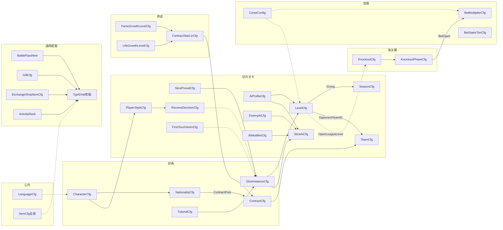

# 2026世界杯主题活动 · 配置表结构（数值策划填表）

> **定位**：仅描述数值/关卡/活动策划在 **`ActivitySoccer.xlsx`**（及语言表）中**需要填写**的配置表字段。  
> **规则依据**：主策划案 `system-design-doc-samples/2026世界杯主题活动.md`。  
> **列级 SSOT**：以 `output/test-config/ActivitySoccer.xlsx` 页签表头为准（当前 **25** 个策划页签，含程序侧新增接球决策配置需求）；本文由 `generate_config_tables_doc.py` 自动生成字段表。
> **生成时间**：脚本随测试配置同步更新。

---

## 文档边界

### 本文档包含

- 活动玩法、关卡、养成、淘汰赛赛程等**可配数值**。
- 活动本地化（`ActvSoccerLanguageCfg`）。
- **附录**：局内道具枚举、玩法常量（含竞猜 `ActvSoccer_bet_*` 系数）、合并 `dataconfig/ConstConfig.xlsx`。

### 本文档不包含（由程序/服务端在开发阶段定义）

| 类型 | 示例 | 说明 |
|------|------|------|
| 玩家存档 | `player_profile`、`current_contract_id`、`tutorial_done` | 运行时持久化，不进策划表 |
| 局内/关卡运行时 | `slice_runtime`、`attempt_id`、`level_result` | 服务端/客户端内存态 |
| 联赛/排行运行时 | `league_progress`、`league_rank_entry` | 服务端计算与存储 |
| 淘汰赛运行时 | `knockout_team`、`knockout_match`、`qualifier_group_standing` | 组队/对阵/结果由服务生成 |
| 竞猜运行时 | `bet_record`、`bet_stats`、动态 `win_rate`/`display_mult` | 下注与派彩过程数据 |
| 程序只读枚举/类型 | `slice_type_def`（L1）、`operation_mode`、`player_ai_duty` | 程序定类型与判定；策划在 preset/instance 引用类型名 |
| 客户端状态枚举 | `character_state_config`（`ActvSoccerCharacterStateCfg`） | FSM 状态 key 由客户端+美术维护；第一脚动作表现表仅引用 StateKey/AnimKey |
| 知名度结算 | 独立 `fame_gain_rule` 表 | 由 `ContractCfg` 的 `PayFinish`/`PayGoal`/`PayAssist`/`PayFame` 按比赛结果结算 |
| 淘汰赛演算 | `ActvSoccerMatchSimulationCfg` | 算法口径 `match_simulation_rule` 写在主策划案规则节；可调系数走 KnockoutCfg（如 `BotPlayerRating`） |
| 竞猜币投放 | `ActvSoccerBetCoinSourceCfg` | 礼包走**通用** `GiftCfg.Reward`；每日免费见附录 `ActvSoccer_bet_daily_free_amount` |
| 竞猜场次运行时 | `ActvSoccerBetMatchCfg` | 对阵/胜率/展示倍率由服务端按赛程生成 |
| 接口/协议/DB | 字段名、proto、API | 技术派生文档 |

**不进策划 xlsx 的程序/运行时页签**（共 4 个）：`ActvSoccerSliceTypeDefCfg`、`ActvSoccerPlayerAiDutyEnumCfg`、`ActvSoccerBetMatchCfg`、`ActvSoccerCharacterStateCfg`。

**走项目通用配套表**（不在 `ActivitySoccer.xlsx` 重复维护）：`ActvSoccerBattlePassCfg` → `BattlePassNew / ActivityBattlePass`、`ActvSoccerExchangeShopCfg` → `ExchangeShopItemCfg`、`ActvSoccerGiftCfg` → `GiftCfg / D2GiftCfg`、`ActvSoccerRankSectionCfg` → `ActivityRank / ActvRankSectionCfg`。

**附录列举、不成活动页签**（共 2 项）：`ActvSoccerInMatchItemCfg`、`ActvSoccerGlobalConstCfg`。

抽样/演算**算法**（如联赛换约权重、淘汰赛比分演算）写在主策划案规则节；本文只列**可调系数**所在配置表。

---

## 配置表概览

### 配置文件清单

| 文件 | 说明 | 策划维护 |
|------|------|----------|
| `ActivitySoccer.xlsx` | 活动玩法主配置（26 个策划页签） | 数值 / 关卡 / 活动 |
| `ActivitySoccerLanguage.xlsx` | 活动本地化 `ActvSoccerLanguageCfg` | 数值 + 本地化 |
| `dataconfig/ConstConfig.xlsx` | 玩法全局常量（见本文附录） | 数值 |

### 公共 / 外部依赖（非本活动 xlsx 内页签）

| 类型 | 典型表 / 机制 | 本活动用法 | 策划动作 |
|------|----------------|------------|----------|
| **全局常量** | `dataconfig/ConstConfig.xlsx` → `ConstConfigCfg` | 门票默认、夹角、换约份数等 | 填附录常量表，合并全局 ConstConfig |
| **通行证** | `BattlePassNew` / `ActivityBattlePass` | 活跃度升级、双轨奖励 | 在通用 BP 表按活动 ID 配置 |
| **兑换商店** | `ExchangeShopItemCfg` | 竞猜币兑换外观/道具 | 在通用商店表配置消耗与奖励 |
| **礼包** | `GiftCfg` / `D2GiftCfg` | 免费/付费礼包、竞猜币投放 | 在通用礼包表配置 Reward |
| **排名奖励** | `ActivityRank` / `ActvRankSectionCfg` | 四榜段位与发奖 | 在通用排名表配置 RankType 与奖励 |
| **奖励结构** | `TypIDVal_P_cspb`（proto） | BP/排名/商店/礼包/合同等 `ext[]` | 填 `typ`+`id`+`val` |
| **全局道具** | `dataconfig/ItemCfg` | 兑换商店、BP 付费轨等 | **引用已有道具 ID** |
| **活动内货币** | 项目通用货币体系 | 金币/门票/竞猜币 | 货币类型走通用货币 SSOT，本活动 xlsx 不维护 |
| **本地化** | `ActvSoccerLanguageCfg` | 所有 `*LcKey` | 业务表只写 key，中文进语言表 |
| **竞猜赔率** | `ActvSoccerBetMultiplierCfg` + 附录 `ActvSoccer_bet_*` | 胜率→倍率查表+公式 | 填对照表与常量 |
| **投注档位** | `ActvSoccerBetStakeTierCfg` | 免费+50/100/150/200/300 | 填档位与免费派彩 |
| **邮件补发** | 全局邮件模块 | 竞猜离线派彩、排名发奖 | 主案定规则 |
| **活动入口** | 项目活动框架表 | 限时开关、活动 ID | 本活动 xlsx **不含**入口表 |
| **每日任务→BP** | 项目 DailyTask / Quest 表 | BP 升级来源 | 通用 BP 表只配等级与奖励 |

### 活动专用表一览

| 页签 | 用途 | 主要关联 | 填表 |
|------|------|----------|------|
| `ActvSoccerCharacterCfg` | 4 角色外观与展示战力 | → 创角流程 | 数值 |
| `ActvSoccerNationalityCfg` | 国籍与首签候选合同池 | ContractPool→ContractCfg；NameLcKey→Language | 数值 |
| `ActvSoccerTutorialCfg` | 试训三步与切片实例 | SliceInstanceID→SliceInstanceCfg | 关卡 |
| `ActvSoccerSlicePresetCfg` | 切片摆位预设（L2 主资产） | SliceType；被 SliceInstanceCfg.PresetID 引用 | 关卡 |
| `ActvSoccerSliceInstanceCfg` | 切片实例装配（L3） | ←Preset；→LevelCfg.SliceList、TutorialCfg | 关卡 |
| `ActvSoccerHapticCfg` | 震动事件强度/图案 | 全局事件映射 | 体验/数值 |
| `ActvSoccerReceiveDecisionCfg` | 接球决策主配置 | PlayerStyleCfg.ReceiveDecisionCfgID；按球员风格/兜底读取 | 数值+体验 |
| `ActvSoccerPlayerStyleCfg` | 球员风格倾向 | CharacterCfg.PlayerStyleCfgID；ReceiveDecisionCfgID→ReceiveDecisionCfg | 数值 |
| `ActvSoccerFirstTouchAnimCfg` | 第一脚触球表现选择 | 引用 CharacterStateCfg.StateKey 与美术 AnimKey | 体验/表现 |
| `ActvSoccerLevelCfg` | 关卡：切片序列、胜平阈值、门票、对手 | SliceList→Instance；AiProfileID→Profile；SeasonID→Season | 关卡+数值 |
| `ActvSoccerAiProfileCfg` | 关卡 AI 难度档 | ←LevelCfg；→SliceAiCfg | 数值 |
| `ActvSoccerEnemyAiCfg` | 门将/后卫 AI 权重 | ←SliceAiCfg（Goalkeeper/Defender/Shooter） | 数值 |
| `ActvSoccerSliceAiCfg` | 单切片 AI 绑定 | SliceID→Instance；引用 Profile/EnemyAi/Modifier | 关卡 |
| `ActvSoccerAiModifierCfg` | 切片机制（移动门将等） | ←SliceAiCfg.ModifierID | 关卡 |
| `ActvSoccerSliceFlowCfg` | 各切片类型 FSM 流程参数 | 按 SliceType 读取 | 关卡 |
| `ActvSoccerCurrencyCfg` | ~~活动内货币类型说明~~（已下线，走项目通用货币 SSOT） | — | — |
| `ActvSoccerFameGrowthLevelCfg` | 知名度等级、许可、主角评分 | PlayerRating→淘汰赛主角评分；档位可拆细；ContractStarLicReward→ContractStarLicCfg | 数值 |
| `ActvSoccerLifeGrowthLevelCfg` | 生活等级、门票 buff、许可 | TicketCap/Recover 与附录常量叠加；不参与主角评分 | 数值 |
| `ActvSoccerTeamCfg` | 球队展示（队名/队服/队标） | ←ContractCfg.TeamID；←LevelCfg.OpponentTeamID | 数值+美术 |
| `ActvSoccerContractStarLicCfg` | 联赛换约星级权重 | ←Growth 两线 ContractStarLicReward | 数值 |
| `ActvSoccerContractCfg` | 合同待遇、赛季目标、发放场景 | TeamID→Team；首签←Nationality；换约←StarLic | 数值 |
| `ActvSoccerSeasonCfg` | 联赛轮次、NextSeason 链 | ID=LevelCfg.SeasonID | 数值 |
| `ActvSoccerKnockoutCfg` | 淘汰赛开放、人数、分组、补位分 | OpenLeagueLevel→Level；→Phase/Simulation | 数值+活动 |
| `ActvSoccerKnockoutPhaseCfg` | 赛程阶段日期与当日内容 | ←KnockoutCfg；BetOpen控制竞猜 | 活动 |
| `ActvSoccerBetMultiplierCfg` | 胜率×战力比→赔率二维网格(=程序ChampionOddsCfg) | 同步匹配后按(winRate_int, powerRate_int)查行；oddsLeft/oddsRight 万分值 | 数值 |
| `ActvSoccerBetStakeTierCfg` | 投注档位(免费+5档) | 下注弹窗选项；免费档HitPayout=5 | 数值 |
| `ActvSoccerAchieveCfg` | 活动成就(类型/计数/品质/图标/奖励) | NameLcKey/DescLcKey→Language；Reward→ItemCfg/VM | 数值 |
| `ActvSoccerLanguageCfg` | 活动文案 | 被所有 `*LcKey` 引用 | 本地化 |

### 核心引用关系（简图）

### 典型引用链（策划填表时按链检查）

| 链路 | 路径 |
|------|------|
| 创角→首签 | `NationalityCfg.ContractPool` → `ContractCfg`（`GrantScene=first_sign`）→ `TeamCfg` |
| 试训→切片 | `TutorialCfg.SliceInstanceID` → `SliceInstanceCfg` → `SlicePresetCfg` |
| 关卡组装 | `LevelCfg.SliceList[]` → `SliceInstanceCfg`；`SliceAiCfg.SliceID` 对齐实例 |
| 接球决策 | `CharacterCfg.PlayerStyleCfgID` → `PlayerStyleCfg` → `ReceiveDecisionCfg`；未配置则按角色兜底 |
| 第一脚表现 | 接球决策输出 Action + 来球/身体/压力分类 → `FirstTouchAnimCfg` → `CharacterStateCfg.StateKey` / 美术 `AnimKey` |
| 联赛轮次 | `SeasonCfg.ID` = `LevelCfg.SeasonID`；`NextSeason` 链 |
| 联赛换约 | `Growth.ContractStarLicReward` → `ContractStarLicCfg` → `ContractCfg`（`league_finish`） |
| 待遇/知名度结算 | 比赛胜负/进球/助攻 → `ContractCfg` `PayFinish`/`PayGoal`/`PayAssist`/`PayFame` |
| 淘汰赛→竞猜 | `KnockoutPhaseCfg.BetOpen` 排期 → 服务端 `bet_match`；演算胜率 → `BetMultiplierCfg` + `bet_*` 常量 |
| 竞猜币来源 | 通用 `GiftCfg.Reward` + 附录 `bet_daily_free_amount`；消耗于下注与 `ExchangeShopItemCfg` |
| 奖励发放 | 各表 `*Reward` / `TypIDVal` → `ItemCfg` 或活动 `vm` 货币 ID |

---

## 填表约定（K1 测试配置）

| 约定 | 说明 |
|------|------|
| 首列 ID | 所有策划 sheet 首列 `ID`/`id` |
| ext / ext[] | 第 5 行 proto 必填；空值 `{}` / `[]` |
| 单参数 | 拆独立列，不包 JSON |
| *LcKey | 业务表 string，中文进 `ActvSoccerLanguageCfg` |
| 读取端 | 第 1 行 `c`/`s`/`cs`；`Remark` 留空 |
| 参数叠加 | `preset → instance → ai_profile → modifier` |
| LcKey 格式 | `ActvSoccer_{category}_{semantic}_{seq}` |

### ext proto 对照

| proto | 字段 |
|-------|------|
| `TypIDVal_P_cspb` | SeasonReward, SignReward, FreeReward, PaidReward, Reward |
| `PositionTuple_P` | BallPos, BallVector, TargetPoint |
| `SoccerTypePayload_V` | TypePayload |
| `SoccerObjective_V` | ExtraObjectives |
| `SoccerModifier_V` | Modifiers |
| `SoccerPlayerInit_V` | PlayersInit(team,idx,duty,pos,facing) |
| `SoccerSeasonGoal_V` | SeasonGoal |

### ID 段交叉引用

| 对象 | 段/说明 |
|------|--------|
| AiProfile | 1001-1010=tier1-10难度档(easy/normal/hard),单调递增,DeadCorner固定0 |
| PlayerAiDuty | 1=Goalkeeper守门员,2=Defender后卫(对方非门将),3=Forward前锋(我方含玩家) |
| EnemyAi | 2001-2003=band1(tier1-3);20X1/20X2/20X3=bandX门将/后卫/射手(X=2,3,4) |
| SliceAi | 3001-3006=试训/引导切片101-203;3100+=库实例(每库实例一行) |
| Modifier | 4001/4002/4005=移动门将(普通/困难/极限),4003=无辅助线,4004=固定人墙,4006=收窄夹角,4007=随机扑救 |
| ReceiveDecision | 5001-5004=接球决策风格(Balanced/Playmaker/Dribbler/TargetMan) |
| PlayerStyle | 5101-5104=球员风格(Balanced/Playmaker/Dribbler/TargetMan) |
| FirstTouchAnim | 5201+=第一脚触球表现映射(Action×BallHeight×Direction×Pressure) |
| SliceInstance | 库实例id=tier*100+type*10+variant(type1-6,variant1-2);101-203=试训/引导 |
| Level | 1-500=50轮×10关;SeasonID=轮次;第1关=引导关;淘汰赛round15起(level141)开放 |
| Season | 1-50轮单group=1;NextSeason链推进;总轮次=count(同group) |
| BetMultiplier | 385行=程序ChampionOddsCfg二维网格;按(winRate_int, powerRate_int)查行→oddsLeft/oddsRight万分值 |
| BetStakeTier | 6档:free(命中+5)+50/100/150/200/300 |
| Achievement | 6001+=活动成就;按类型连续编号(参与类6001-/进度类6101-/收集类6201-/竞猜类6301-) |

---

## 创角与引导

### ActvSoccerCharacterCfg

- **用途**：4 角色外观与展示战力  
- **关联**：→ 创角流程  
- **填表**：数值

| 字段 | 类型 | 读取端 | 说明 | proto/示例 |
|------|------|--------|------|------------|
| ID | int | cs | 角色ID character_id | — |
| AppearanceKey | string | c | 外观资源键(prefab 路径) | `Assets/k1/K1D1/Res/Models/Soccer/Footballplayer_X.prefab` |
| DisplayPower | int | c | 展示战力(仅表现) | — |

> **说明**：`PlayerStyleCfgID` 字段当前未在 CharacterCfg 落地;接球决策按角色兜底(MID=Playmaker / FWD=Dribbler / DEF=Balanced),后续如需具体球员可配再扩列。

### ActvSoccerNationalityCfg

- **用途**：国籍与首签候选合同池  
- **关联**：ContractPool→ContractCfg；NameLcKey→Language  
- **填表**：数值

| 字段 | 类型 | 读取端 | 说明 | proto/示例 |
|------|------|--------|------|------------|
| ID | int | cs | 国籍ID | — |
| NameLcKey | string | c | 国籍名称→ActvSoccerLanguageCfg | — |
| Region | string | cs | 所属地区 | — |
| ContractPool | int[] | s | 首签合同池(关联contract_id) | — |

### ActvSoccerTutorialCfg

- **用途**：试训三步与切片实例  
- **关联**：SliceInstanceID→SliceInstanceCfg  
- **填表**：关卡

| 字段 | 类型 | 读取端 | 说明 | proto/示例 |
|------|------|--------|------|------------|
| ID | int | c | 试训步骤序号 | — |
| SliceType | string | c | 切片类型 | — |
| SliceInstanceID | int | cs | 关联切片实例(测试用) | — |
| ForcedOrder | bool | c | 强制顺序 | — |
| DescLcKey | string | c | 步骤描述→ActvSoccerLanguageCfg | — |

## 切片与关卡

三层配置：**L1 slice_type（程序只读）→ L2 SlicePresetCfg → L3 SliceInstanceCfg**。  
叠加优先级：`preset → instance.override → ai_profile → slice_ai.modifier`。  
局内道具（哨子/回溯/瞄准）见**附录 A**，不在活动 xlsx 维护。

### ActvSoccerSlicePresetCfg

- **用途**：切片摆位预设（L2 主资产）  
- **关联**：SliceType；被 SliceInstanceCfg.PresetID 引用  
- **填表**：关卡

| 字段 | 类型 | 读取端 | 说明 | proto/示例 |
|------|------|--------|------|------------|
| ID | int | cs | preset_id | — |
| SliceType | string | cs | 切片类型 | — |
| NameLcKey | string | c | 预设名→ActvSoccerLanguageCfg | — |
| Tags | string[] | c | 标签 | — |
| BallPos | ext | c | 球位置 | PositionTuple_P |
| BallVector | ext | c | 球方向 | PositionTuple_P |
| BallOwner | int | c | 控球球员索引 | — |
| PlayersInit | ext[] | c | 球员站位+duty+朝向(1=Goalkeeper,2=Defender,3=Forward) | SoccerPlayerInit_V |
| CameraFov | float | c | 相机FOV | — |
| TargetPoint | ext | c | 目标点 | PositionTuple_P |
| OperableAngle | float | cs | 可操作夹角(兼容字段=AngleSpanMax默认) | — |
| AngleSpanMin | float | c | 可操作夹角宽度下限(°) | — |
| AngleSpanMax | float | c | 可操作夹角宽度上限(°) | — |
| AngleMaxCenterShift | float | c | 扇形中心相对接球方向最大偏移(°) | — |
| AngleMargin | float | c | 合法目标贴边余量(°) | — |
| TypePayload | ext | cs | type_payload默认 | SoccerTypePayload_V |
| RecommendedModes | string[] | c | 建议模式 | — |

### ActvSoccerSliceInstanceCfg

- **用途**：切片实例装配（L3）  
- **关联**：←Preset；→LevelCfg.SliceList、TutorialCfg  
- **填表**：关卡

| 字段 | 类型 | 读取端 | 说明 | proto/示例 |
|------|------|--------|------|------------|
| ID | int | cs | slice_instance_id | — |
| SliceType | string | cs | 切片类型 | — |
| PresetID | int | cs | preset_id | — |
| OverrideOperableAngle | float | c | 覆盖可操作夹角(0=不覆盖) | — |
| ObjectiveType | string | cs | 单一胜利目标(score/survive等) | — |
| ExtraObjectives | ext[] | cs | 复合胜利目标 | SoccerObjective_V |
| Modifiers | ext[] | cs | 切片机制 | SoccerModifier_V |

### ActvSoccerHapticCfg

- **用途**：震动事件强度/图案  
- **关联**：全局事件映射  
- **填表**：体验/数值

| 字段 | 类型 | 读取端 | 说明 | proto/示例 |
|------|------|--------|------|------------|
| ID | int | c | 编号 | — |
| EventID | string | c | 事件 | — |
| Category | string | c | core_operation/key_result | — |
| Intensity | string | c | light/medium/heavy | — |
| Pattern | string | c | tick/double/continuous | — |
| DurationMs | int | c | 时长ms | — |
| MinIntervalMs | int | c | 节流ms | — |
| EnabledDefault | bool | c | 默认开启 | — |

### ActvSoccerReceiveDecisionCfg

- **用途**：接球决策主配置，控制球飞行中第一脚触球规划的时间窗、空间探测、压力判断、动作权重与评分权重
- **关联**：←PlayerStyleCfg.ReceiveDecisionCfgID；被接球决策系统按球员风格读取
- **填表**：数值+体验

| 字段 | 类型 | 读取端 | 说明 | proto/示例 |
|------|------|--------|------|------------|
| ID | int | cs | 接球决策配置ID | — |
| Style | string | cs | 默认球员风格 | Balanced/Playmaker/Dribbler/TargetMan |
| DecisionMinMs | int | cs | 最早决策时间；预计触球前多少毫秒开始允许生成决策 | 建议300 |
| DecisionMaxMs | int | cs | 最晚决策时间；预计触球前多少毫秒内必须已有决策 | 建议1000 |
| SafeDistance | int | cs | 安全距离；最近防守人大于该距离视为低压(mm) | — |
| HighPressureDistance | int | cs | 高压距离；最近防守人小于该距离视为高压(mm) | — |
| ForwardProbeDistance | int | cs | 前方空间探测距离(mm) | — |
| SideProbeDistance | int | cs | 左右空间探测距离(mm) | — |
| BackwardProbeDistance | int | cs | 身后空间探测距离(mm) | — |
| HighBallHeight | int | c | 高空球高度阈值；超过后表现层优先胸停/头球类动作(mm) | — |
| FastBallSpeed | int | cs | 高速来球速度阈值；超过后提高停球权重(mm/s) | — |
| StopWeight | int | cs | 停球权重 | 100=标准 |
| PushForwardWeight | int | cs | 顺势向前领球权重 | 100=标准 |
| PushSideWeight | int | cs | 左右领球权重 | 100=标准 |
| HalfTurnWeight | int | cs | 半转身权重 | 100=标准 |
| ShieldWeight | int | cs | 护球权重 | 100=标准 |
| OneTouchPassWeight | int | cs | 一脚传球权重；玩家可操作接球点不自动出球 | 100=标准 |
| OneTouchShotWeight | int | cs | 一脚射门权重；玩家可操作接球点不自动出球 | 100=标准 |
| SpaceGainWeight | int | cs | 评分项：空间收益权重 | 100=标准 |
| GoalProgressWeight | int | cs | 评分项：向球门推进权重 | 100=标准 |
| SafetyWeight | int | cs | 评分项：安全性权重 | 100=标准 |
| FlowWeight | int | cs | 评分项：是否利于下一步动作 | 100=标准 |
| StyleBonusWeight | int | cs | 评分项：球员风格加成 | 100=标准 |
| Remark | string | - | 策划备注 | — |

**初始建议行**

| ID | Style | DecisionMinMs | DecisionMaxMs | SafeDistance | HighPressureDistance | ForwardProbeDistance | SideProbeDistance | BackwardProbeDistance | HighBallHeight | FastBallSpeed | StopWeight | PushForwardWeight | PushSideWeight | HalfTurnWeight | ShieldWeight | OneTouchPassWeight | OneTouchShotWeight | SpaceGainWeight | GoalProgressWeight | SafetyWeight | FlowWeight | StyleBonusWeight | Remark |
|---|---|---:|---:|---:|---:|---:|---:|---:|---:|---:|---:|---:|---:|---:|---:|---:|---:|---:|---:|---:|---:|---:|---|
| 1 | Balanced | 300 | 1000 | 3500 | 1600 | 5000 | 3500 | 2500 | 900 | 16000 | 100 | 100 | 100 | 100 | 100 | 100 | 100 | 100 | 100 | 100 | 100 | 100 | 通用默认 |
| 2 | Playmaker | 300 | 1000 | 3500 | 1700 | 4500 | 3500 | 2500 | 900 | 16000 | 90 | 90 | 90 | 100 | 80 | 140 | 100 | 90 | 110 | 100 | 130 | 130 | 组织核心，倾向一脚传球 |
| 3 | Dribbler | 300 | 1000 | 3200 | 1500 | 5500 | 4000 | 2500 | 900 | 16000 | 80 | 140 | 130 | 120 | 90 | 80 | 110 | 130 | 120 | 90 | 120 | 130 | 突破手，倾向顺势领球 |
| 4 | TargetMan | 300 | 1000 | 3000 | 1400 | 4000 | 3000 | 3000 | 900 | 15000 | 120 | 80 | 80 | 110 | 150 | 100 | 120 | 80 | 100 | 140 | 110 | 130 | 支点，倾向护球和背身处理 |

### ActvSoccerPlayerStyleCfg

- **用途**：球员风格配置，定义 Balanced / Playmaker / Dribbler / TargetMan 的传球、领球、护球、射门和风险倾向
- **关联**：CharacterCfg.PlayerStyleCfgID→本表；ReceiveDecisionCfgID→ActvSoccerReceiveDecisionCfg
- **填表**：数值

| 字段 | 类型 | 读取端 | 说明 | proto/示例 |
|------|------|--------|------|------------|
| ID | int | cs | 球员风格配置ID | — |
| Style | string | cs | 风格枚举 | Balanced/Playmaker/Dribbler/TargetMan |
| ReceiveDecisionCfgID | int | cs | 接球决策配置→ActvSoccerReceiveDecisionCfg | — |
| PassBias | int | cs | 传球倾向 | 100=标准 |
| DribbleBias | int | cs | 盘带/领球倾向 | 100=标准 |
| ShieldBias | int | cs | 护球倾向 | 100=标准 |
| ShotBias | int | cs | 射门倾向 | 100=标准 |
| RiskBias | int | cs | 风险倾向；越高越敢做高收益低安全动作 | 100=标准 |
| Remark | string | - | 策划备注 | — |

**初始建议行**

| ID | Style | ReceiveDecisionCfgID | PassBias | DribbleBias | ShieldBias | ShotBias | RiskBias | Remark |
|---|---|---:|---:|---:|---:|---:|---:|---|
| 1 | Balanced | 1 | 100 | 100 | 100 | 100 | 100 | 通用 |
| 2 | Playmaker | 2 | 140 | 90 | 80 | 100 | 105 | 德布劳内/莫德里奇类 |
| 3 | Dribbler | 3 | 80 | 140 | 90 | 110 | 120 | 梅西/姆巴佩类 |
| 4 | TargetMan | 4 | 100 | 80 | 150 | 120 | 90 | 哈兰德/凯恩类 |

**角色兜底**

| 角色 | 默认风格 |
|------|----------|
| MID | Playmaker |
| FWD | Dribbler |
| DEF | Balanced |
| GK | 不参与普通接球决策 |

### ActvSoccerFirstTouchAnimCfg

- **用途**：第一脚触球表现选择配置，P1；让逻辑动作不直接绑定固定动画
- **关联**：接球决策输出 Action；StateKey→ActvSoccerCharacterStateCfg；AnimKey→美术动作资源
- **填表**：体验/表现

| 字段 | 类型 | 读取端 | 说明 | proto/示例 |
|------|------|--------|------|------------|
| ID | int | c | 表现配置ID | — |
| Action | string | c | 第一脚逻辑动作 | Stop/PushForward/PushLeft/PushRight/HalfTurnLeft/HalfTurnRight/Shield/OneTouchPass/OneTouchShot |
| BallHeightType | string | c | 来球高度分类 | Ground/High |
| BallDirectionType | string | c | 来球方向分类 | Front/Left/Right/Back |
| BodyDirectionType | string | c | 身体朝向分类 | FaceBall/BackToBall/SideToBall |
| PressureLevel | string | c | 压力等级 | Low/Medium/High/Any |
| StateKey | string | c | 对应 ActvSoccerCharacterStateCfg.StateKey | Control/Pass/Kick/Stop/TurnLeft/TurnRight |
| AnimKey | string | c | 美术动作Key；优先匹配已有动作表 | — |
| Priority | int | c | 多条命中时取优先级高的 | — |
| Remark | string | - | 策划备注 | — |

**初始建议行**

| ID | Action | BallHeightType | BallDirectionType | BodyDirectionType | PressureLevel | StateKey | AnimKey | Priority | Remark |
|---|---|---|---|---|---|---|---|---:|---|
| 1 | Stop | Ground | Front | FaceBall | Any | Control | B01_ReceiveBall | 100 | 地面正面停球 |
| 2 | Stop | High | Front | FaceBall | Any | Control | B03_ReceiveAir | 100 | 高空球停球，可复用 B01 |
| 3 | PushForward | Ground | Front | FaceBall | Low | Control | B02_DribbleTouch | 110 | 顺势领球推进 |
| 4 | PushLeft | Ground | Front | FaceBall | Low | Control | B02_DribbleTouch | 100 | 左侧领球，表现可镜像 |
| 5 | PushRight | Ground | Front | FaceBall | Low | Control | B02_DribbleTouch | 100 | 右侧领球，表现可镜像 |
| 6 | HalfTurnLeft | Ground | Back | BackToBall | Medium | TurnLeft | A05_TurnLeft | 100 | 背身半转身 |
| 7 | HalfTurnRight | Ground | Back | BackToBall | Medium | TurnRight | A06_TurnRight | 100 | 背身半转身镜像 |
| 8 | Shield | Ground | Back | BackToBall | High | Control | B01_ReceiveBall | 120 | 高压背身护球，后续可替换专用护球动作 |
| 9 | OneTouchPass | Ground | Front | FaceBall | Low | Pass | C03_OneTouchPass | 120 | 一脚传球 |
| 10 | OneTouchShot | Ground | Front | FaceBall | Low | Kick | D01_Shoot | 100 | 一脚射门，可复用射门动作 |
| 11 | OneTouchShot | High | Front | FaceBall | Any | Kick | D05_Volley | 110 | 高空球一脚处理，后续可扩展头球/倒挂金钩 |

### ActvSoccerLevelCfg

- **用途**：关卡：切片序列、胜平阈值、门票、对手  
- **关联**：SliceList→Instance；AiProfileID→Profile；SeasonID→Season  
- **填表**：关卡+数值

| 字段 | 类型 | 读取端 | 说明 | proto/示例 |
|------|------|--------|------|------------|
| ID | int | cs | level_id | — |
| IsTutorial | bool | cs | 引导关 | — |
| SliceList | int[] | cs | 切片实例序列 | — |
| AiProfileID | int | cs | AI档位 | — |
| WinThreshold | int | cs | 胜利阈值 | — |
| DrawThreshold | int | cs | 平局阈值 | — |
| TicketCost | int | cs | 门票消耗 | — |
| OpponentTeamID | int | cs | 对手球队(队名/队服/队标) | — |
| OpponentTeamStar | int | cs | 对手球队星级(球员属性计算依据) | — |
| SeasonID | int | cs | 所属联赛轮次(=SeasonCfg.ID) | — |

### ActvSoccerAiProfileCfg

- **用途**：关卡 AI 难度档  
- **关联**：←LevelCfg；→SliceAiCfg  
- **填表**：数值

| 字段 | 类型 | 读取端 | 说明 | proto/示例 |
|------|------|--------|------|------------|
| ID | int | cs | AI难度档ID | — |
| Difficulty | string | cs | easy/normal/hard | — |
| GoalkeeperSaveRate | int | cs | 门将扑救成功率% | — |
| DefenderSuccessRate | int | cs | 防守成功率% | — |
| ShooterSuccessRate | int | cs | 对手射门成功率% | — |
| DeadCornerCanSave | int | cs | 死角可扑(固定0) | — |
| ReactionTimeMs | int | cs | 默认反应时间ms | — |

### ActvSoccerEnemyAiCfg

- **用途**：门将/后卫 AI 权重  
- **关联**：←SliceAiCfg（Goalkeeper/Defender/Shooter）  
- **填表**：数值

| 字段 | 类型 | 读取端 | 说明 | proto/示例 |
|------|------|--------|------|------------|
| ID | int | cs | 敌人AI配置ID | — |
| Duty | int | cs | 球员AI职责(程序枚举PlayerAiDuty) | 1=Goalkeeper,2=Defender,3=Forward |
| SaveWeight | int | cs | 扑救权重 | — |
| LeftWeight | int | cs | 左方向权重 | — |
| RightWeight | int | cs | 右方向权重 | — |
| UpWeight | int | cs | 上方向权重 | — |
| InterceptWeight | int | cs | 拦截权重 | — |
| ClearanceWeight | int | cs | 解围出界权重 | — |
| KeeperCatchFail | int | cs | 门将接球直接失败 | — |
| OutOfBoundsFail | int | cs | 踢出界外失败 | — |
| AnimationKey | string | c | 默认表现动作 | — |

### ActvSoccerSliceAiCfg

- **用途**：单切片 AI 绑定  
- **关联**：SliceID→Instance；引用 Profile/EnemyAi/Modifier  
- **填表**：关卡

| 字段 | 类型 | 读取端 | 说明 | proto/示例 |
|------|------|--------|------|------------|
| ID | int | cs | 单切片AI配置ID | — |
| SliceID | int | cs | 切片实例ID→ActvSoccerSliceInstanceCfg | — |
| AiProfileID | int | cs | 难度档→ActvSoccerAiProfileCfg | — |
| GoalkeeperAiID | int | cs | 门将AI | — |
| DefenderAiID | int | cs | 防守AI | — |
| ShooterAiID | int | cs | 射手AI | — |
| ModifierID | int | cs | 机制→ActvSoccerAiModifierCfg | — |
| IsGuideAi | bool | cs | 引导关AI | — |
| RewindRandom | bool | cs | 回溯后重随机 | — |
| OverrideReactionTimeMs | int | cs | 覆盖反应时间(0=默认) | — |

### ActvSoccerAiModifierCfg

- **用途**：切片机制（移动门将等）  
- **关联**：←SliceAiCfg.ModifierID  
- **填表**：关卡

| 字段 | 类型 | 读取端 | 说明 | proto/示例 |
|------|------|--------|------|------------|
| ID | int | cs | 机制ID | — |
| ModifierType | string | cs | 机制类型 | — |
| Param1Key | string | cs | 参数1键 | — |
| Param1Value | string | cs | 参数1值 | — |
| Param2Key | string | cs | 参数2键 | — |
| Param2Value | string | cs | 参数2值 | — |
| Param3Key | string | cs | 参数3键 | — |
| Param3Value | string | cs | 参数3值 | — |

### ActvSoccerSliceFlowCfg

- **用途**：各切片类型 FSM 流程参数  
- **关联**：按 SliceType 读取  
- **填表**：关卡

| 字段 | 类型 | 读取端 | 说明 | proto/示例 |
|------|------|--------|------|------------|
| ID | int | c | 切片流程ID | — |
| SliceType | string | c | 切片类型 | — |
| ForceOperationMode | string | c | 强制操作模式 | — |
| WaitInputTimeMs | int | c | 等待限时(0=无限) | — |
| NeedReplayClick | bool | c | 回放需手动结束 | — |
| EnableRewind | bool | c | 允许回溯 | — |
| SuccessReplayKey | string | c | 成功回放key | — |
| FailReplayKey | string | c | 失败回放key | — |

## 养成与合同

主角评分**仅由知名度等级表** `ActvSoccerFameGrowthLevelCfg.PlayerRating` 投放；生活等级保持小量级、不参与评分。知名度 `Level` 后续可拆分为更细档位。

### ActvSoccerCurrencyCfg（已下线）

> 活动内货币类型说明已合入项目通用货币 SSOT，本活动 xlsx 不再单独维护此页签。原字段（`CurrencyKey`/`Usage`）由通用货币表承载，业务表通过 `vm.id` 间接引用。

### ActvSoccerFameGrowthLevelCfg

- **用途**：知名度等级、许可、主角评分  
- **关联**：PlayerRating→淘汰赛主角评分；档位可拆细；ContractStarLicReward→ContractStarLicCfg  
- **填表**：数值

| 字段 | 类型 | 读取端 | 说明 | proto/示例 |
|------|------|--------|------|------------|
| ID | int | cs | 编号 | — |
| Level | int | cs | 知名度等级 | — |
| ExpRequired | int | cs | 升级所需知名度经验 | — |
| ContractStarLicReward | int | cs | 合同星级许可奖励(0=无,2-5=license_id) | — |
| PlayerRating | int | cs | 主角评分(仅知名度线投放) | — |
| TitleLcKey | string | c | 称号→ActvSoccerLanguageCfg | — |

### ActvSoccerLifeGrowthLevelCfg

- **用途**：生活等级、门票 buff、许可  
- **关联**：TicketCap/Recover 与附录常量叠加；不参与主角评分  
- **填表**：数值

| 字段 | 类型 | 读取端 | 说明 | proto/示例 |
|------|------|--------|------|------------|
| ID | int | cs | 编号 | — |
| Level | int | cs | 生活等级 | — |
| ExpRequired | int | cs | 升级消耗金币 | — |
| RewardFame | int | cs | 升级奖励知名度(0=无) | — |
| ContractStarLicReward | int | cs | 合同星级许可奖励(0=无,2-5=license_id) | — |
| TicketCap | int | cs | 门票上限 | — |
| TicketRecoverMin | int | cs | 门票恢复间隔分钟 | — |
| FreeRewind | int | cs | 免费回溯次数 | — |
| ExtraRound | int | cs | 额外联赛轮次 | — |
| QualityShow | int | c | 品质等级展示(配合UI色块) | — |

### ActvSoccerTeamCfg

- **用途**：球队展示（队名/队服/队标）  
- **关联**：←ContractCfg.TeamID；←LevelCfg.OpponentTeamID  
- **填表**：数值+美术

| 字段 | 类型 | 读取端 | 说明 | proto/示例 |
|------|------|--------|------|------------|
| ID | int | cs | team_id | — |
| NameLcKey | string | c | 球队名→ActvSoccerLanguageCfg | — |
| Region | string | cs | 地区(纯展示) | — |
| KitKey | string | c | 队服资源 | — |
| BadgeKey | string | c | 队标资源 | — |

### ActvSoccerContractStarLicCfg

- **用途**：联赛换约星级权重  
- **关联**：←Growth 两线 ContractStarLicReward  
- **填表**：数值

| 字段 | 类型 | 读取端 | 说明 | proto/示例 |
|------|------|--------|------|------------|
| ID | int | s | license_id(=最高可出星级) | — |
| AllowedTeamStars | int[] | s | 允许出现的合同星级列表 | — |
| StarWeights | int[] | s | 与AllowedTeamStars等长、按下标对应权重 | — |

### ActvSoccerContractCfg

- **用途**：合同待遇、赛季目标、发放场景  
- **关联**：TeamID→Team；首签←Nationality；换约←StarLic  
- **填表**：数值

| 字段 | 类型 | 读取端 | 说明 | proto/示例 |
|------|------|--------|------|------------|
| ID | int | cs | contract_id | — |
| TeamID | int | cs | 关联展示球队→TeamCfg | — |
| TeamStar | int | cs | 合同星级(唯一生效星级) | — |
| PayFinish | int | cs | 周薪/完赛待遇 | — |
| PayGoal | int | cs | 进球待遇 | — |
| PayAssist | int | cs | 助攻待遇 | — |
| PayFame | int | cs | 名气待遇 | — |
| SeasonGoal | ext[] | cs | 赛季目标 | SoccerSeasonGoal_V |
| SeasonReward | ext[] | cs | 目标奖励 | TypIDVal_P_cspb |
| SignReward | ext[] | cs | 签约即时奖励 | TypIDVal_P_cspb |
| GrantFameLevel | int | cs | 抽样门槛-知名度等级 | — |
| GrantLifeLevel | int | cs | 抽样门槛-生活等级 | — |
| GrantScene | string | cs | first_sign/league_finish | — |

## 积分赛

### ActvSoccerSeasonCfg

- **用途**：联赛轮次、NextSeason 链  
- **关联**：ID=LevelCfg.Group  
- **填表**：数值

| 字段 | 类型 | 读取端 | 说明 | proto/示例 |
|------|------|--------|------|------------|
| ID | int | cs | season_id | — |
| LeagueNameLcKey | string | c | 联赛名称→ActvSoccerLanguageCfg | — |
| NextSeason | int | cs | 后置联赛(0=系列结束) | — |
| ContractOfferCount | int | cs | 换约候选份数(0=读全局常量) | — |

## 淘汰赛与赛程

### ActvSoccerKnockoutCfg

- **用途**：淘汰赛开放、人数、分组、补位分  
- **关联**：OpenLeagueLevel→Level；→Phase/Simulation  
- **填表**：数值+活动

| 字段 | 类型 | 读取端 | 说明 | proto/示例 |
|------|------|--------|------|------------|
| ID | int | s | 编号 | — |
| OpenLeagueLevel | int | s | 开放所需积分赛关卡L | — |
| TeamSizeMax | int | s | 队伍人数上限M | — |
| QualifierGroupCount | int | s | 海选分组数G | — |
| QualifyPerGroup | int | s | 每组晋级K | — |
| KnockoutGroupCount | int | s | 单淘汰分组数(8组) | — |
| MaxRounds | int | s | 单淘汰轮次R | — |
| BotPlayerRating | int | s | 补位球员评分 | — |
| ReadyTime | string | s | 每日开赛前准备时长(支持 `Nh`/`Nm` 后缀) | `30m` |
| BetTime | string | s | 每日竞猜窗口时长 | `23h` |
| MatchTime | string | s | 每日比赛时长 | `30m` |

### ActvSoccerKnockoutPhaseCfg

- **用途**：赛程阶段日期与当日内容  
- **关联**：←KnockoutCfg；BetOpen控制竞猜  
- **填表**：活动

| 字段 | 类型 | 读取端 | 说明 | proto/示例 |
|------|------|--------|------|------------|
| ID | int | s | 编号 | — |
| PhaseLcKey | string | cs | 阶段名→ActvSoccerLanguageCfg | — |
| PhaseKey | string | cs | 阶段键 | — |
| StartTime | string | s | 开始UTC | — |
| EndTime | string | s | 结束UTC | — |
| DayContentLcKey | string | c | 当日内容→ActvSoccerLanguageCfg | — |
| BetOpen | bool | cs | 开放竞猜 | — |

## 竞猜

赔率公式：`mult = min(ActvSoccer_bet_constraint_return_rate / win_rate, ActvSoccer_bet_max_odds)`；胜率为 0 取 `max_odds`。  
`ActvSoccerBetMultiplierCfg` 即程序 `ChampionOddsCfg`,采用 `winRate × powerRate` 二维网格(385 行 = 11 档胜率 × 35 档战力比),复用 X1 表结构与万分值。  
程序万分值与策划 Val 换算：`程序值 / 10000`（如 17500→1.75，500000→50）。胜率/战力比也按万分值存储(`winRate_int=5000` 表示 50%)。

### ActvSoccerBetMultiplierCfg

- **用途**：胜率×战力比→赔率二维网格(=程序ChampionOddsCfg)  
- **关联**：同步匹配后按 `(winRate_int, powerRate_int)` 查行;配合附录 `bet_*` 常量  
- **填表**：数值

| 字段 | 类型 | 读取端 | 说明 | proto/示例 |
|------|------|--------|------|------------|
| ID | int | cs | 编号(行序按 powerRate × winRate 升序) | — |
| winRate_int | int | cs | 主队胜率万分值(0..10000) | — |
| powerRate_int | int | cs | 主队/客队战力比万分值(3000..20000) | — |
| oddsLeft_int | int | cs | 主队赔率万分值 | — |
| oddsRight_int | int | cs | 客队赔率万分值 | — |

### ActvSoccerBetStakeTierCfg

- **用途**：投注档位(免费+5档)  
- **关联**：下注弹窗选项；免费档HitPayout=5  
- **填表**：数值

| 字段 | 类型 | 读取端 | 说明 | proto/示例 |
|------|------|--------|------|------------|
| ID | int | cs | 编号 | — |
| TierKey | string | cs | 档位键(free/stake_N) | — |
| Stake | int | cs | 投注竞猜币(免费=0) | — |
| HitPayout | int | cs | 命中固定派彩(0=按倍率) | — |
| Sort | int | cs | 排序 | — |

## 成就

### ActvSoccerAchieveCfg

- **用途**：活动成就配置；定义类型、计数目标、文案、品质、图标与奖励
- **关联**：NameLcKey / DescLcKey → ActvSoccerLanguageCfg；Reward → ItemCfg/VM；Type 与服务端事件埋点一一对应
- **填表**：数值

| 字段 | 类型 | 读取端 | 说明 | proto/示例 |
|------|------|--------|------|------------|
| ID | int | cs | 成就ID(段位 6001+，按 Type 分段) | — |
| Type | string | cs | 成就类型(对应服务端事件) | match_play / level_pass / contract_collect / bet_win / season_finish |
| TargetCount | int | cs | 计数目标值；累计达到即解锁 | — |
| NameLcKey | string | c | 成就名 → ActvSoccerLanguageCfg | — |
| DescLcKey | string | c | 成就描述 → ActvSoccerLanguageCfg；含 `{0}` 占位时由客户端替换为 TargetCount | — |
| Quality | int | cs | 品质(1=白/2=绿/3=蓝/4=紫/5=橙/6=红)；驱动 UI 边框与图标底色 | — |
| IconKey | string | c | 图标资源 key；优先复用项目通用 ItemCfg.icon 命名规范 | — |
| Reward | ext[] | cs | 解锁奖励 | TypIDVal_P_cspb |
| Sort | int | c | 列表排序(同 Type 内升序) | — |
| Remark | string | — | 策划备注 | — |

**初始建议行（占位，待数值定 TargetCount/Reward）**

| ID | Type | TargetCount | NameLcKey | DescLcKey | Quality | IconKey | Sort | Remark |
|---|---|---:|---|---|---:|---|---:|---|
| 6001 | match_play | 1 | ActvSoccer_achv_first_match_name | ActvSoccer_achv_first_match_desc | 1 | achv_match_white | 1 | 首次完成一场比赛 |
| 6002 | match_play | 30 | ActvSoccer_achv_match_30_name | ActvSoccer_achv_match_30_desc | 3 | achv_match_blue | 2 | 累计完成30场比赛 |
| 6101 | level_pass | 50 | ActvSoccer_achv_level_50_name | ActvSoccer_achv_level_50_desc | 4 | achv_level_purple | 1 | 通关50关 |
| 6201 | contract_collect | 10 | ActvSoccer_achv_contract_10_name | ActvSoccer_achv_contract_10_desc | 3 | achv_contract_blue | 1 | 收集10份合同 |
| 6301 | bet_win | 5 | ActvSoccer_achv_bet_win_5_name | ActvSoccer_achv_bet_win_5_desc | 3 | achv_bet_blue | 1 | 竞猜命中5次 |

> **填表约定**
> - Type 须与服务端埋点 key 一致；新增 Type 前与程序对齐。
> - 同一 Type 多档成就（如 30/100/300 场）按 ID 段连续编号、Quality 递增；TargetCount 单调递增。
> - 奖励统一走 `TypIDVal_P_cspb`，引用 `Item.xlsx / ItemCfg` 与 `VM.xlsx / VmCfg` 的现有 ID，不新建专用道具。
> - `IconKey` 与 `Quality` 解耦：低品质成就也允许配高品质专属图标，由 UI 优先取 IconKey。

## 本地化

### ActvSoccerLanguageCfg

- **用途**：活动文案  
- **关联**：被所有 *LcKey 引用  
- **填表**：本地化

| 字段 | 类型 | 读取端 | 说明 | proto/示例 |
|------|------|--------|------|------------|
| ID | string | cs | 本地化唯一ID(英文+数字) | — |
| Cn | string | cs | 简体中文 | — |
| Source | string | — | 引用来源(测试追溯) | — |

---

## 附录 A · 局内道具（`ActvSoccerInMatchItemCfg`）

固定三项，程序按 `ItemKey`/`Effect` 读取；`FreeCount` 与生活等级 `FreeRewind` 等 buff 叠加。

| ID | ItemKey | Effect | DefaultActive | FreeCount | 说明 |
|----|---------|--------|---------------|-----------|------|
| 1 | `whistle` | `add_non_gk_slice` | 1 | 0 | 哨子 |
| 2 | `rewind` | `reset_slice` | 0 | 1 | 回溯 |
| 3 | `aim` | `aim_line` | 1 | 0 | 瞄准 |

---

## 附录 B · 玩法常量（合并 `ConstConfigCfg`）

共 **42** 项，字段对齐 `ConstConfigCfg`（`CfgID | Comment | Constant | Val | Array | Effects | requirement`）。  
CfgID 段：`10135601-10135642`；合并目标：`dataconfig/ConstConfig.xlsx / ConstConfigCfg`。

| CfgID | Constant | Val | Array | 说明 |
|-------|----------|-----|-------|------|
| 10135601 | `ActvSoccer_ticket_cap_default` | 250 | [] | 主界面门票上限(测试) |
| 10135602 | `ActvSoccer_ticket_recover_minutes` | 30 | [] | 门票恢复间隔(分钟) |
| 10135603 | `ActvSoccer_knockout_open_level` | 141 | [] | 淘汰赛开放关卡(round15起=level141) |
| 10135604 | `ActvSoccer_default_character_count` | 4 | [] | 可选角色数 |
| 10135605 | `ActvSoccer_first_sign_contract_star` | 1 | [] | 首签固定合同星级 |
| 10135606 | `ActvSoccer_ai_random_seed_formula` | 0 | [] | SeededRng种子组成(attempt_id+slice_id+ai_profile_id+rewind_count) |
| 10135607 | `ActvSoccer_dead_corner_can_save` | 0 | [] | 死角不可扑(策划确认) |
| 10135608 | `ActvSoccer_config_overlay_order` | 0 | [] | 参数叠加顺序 preset->instance->ai_profile->modifier |
| 10135609 | `ActvSoccer_move_speed_idle` | 0 | [] | 待机移动速度(固定值,单位m/s TODO) |
| 10135610 | `ActvSoccer_move_speed_walk` | 2.5 | [] | 慢走移动速度(固定值,单位m/s TODO) |
| 10135611 | `ActvSoccer_move_speed_run_min` | 4 | [] | 跑动速度下限;run=lerp(能力值,min,max) |
| 10135612 | `ActvSoccer_move_speed_run_max` | 8 | [] | 跑动速度上限;run=lerp(能力值,min,max) |
| 10135613 | `ActvSoccer_move_speed_ratio_idle` | 0 | [] | 待机倍率;0=读MoveSpeedIdle,不乘run |
| 10135614 | `ActvSoccer_move_speed_ratio_walk` | 0 | [] | 慢走倍率;0=读MoveSpeedWalk,不乘run |
| 10135615 | `ActvSoccer_move_speed_ratio_run` | 0 | [] | 正常跑倍率;0=读能力值映射run速度 |
| 10135616 | `ActvSoccer_move_speed_ratio_jog` | 0.75 | [] | 慢跑跑位-队友/对手;相对run倍率 |
| 10135617 | `ActvSoccer_move_speed_ratio_sprint` | 1.25 | [] | 冲刺-主角/对手;相对run倍率 |
| 10135618 | `ActvSoccer_move_speed_ratio_dribble` | 0.85 | [] | 带球推进-控球者;相对run倍率 |
| 10135619 | `ActvSoccer_move_speed_ratio_press` | 1.1 | [] | 逼抢-对手;相对run倍率 |
| 10135620 | `ActvSoccer_move_speed_ratio_keeper_lateral` | 0.9 | [] | 门将横移;相对run倍率,moving_keeper再乘params.speed |
| 10135621 | `ActvSoccer_kick_force_min` | 10 | [] | 出球力量下限 |
| 10135622 | `ActvSoccer_kick_force_max` | 25 | [] | 出球力量上限 |
| 10135623 | `ActvSoccer_ball_control_distance` | 1.2 | [] | 停球/控球距离(m TODO) |
| 10135624 | `ActvSoccer_operable_angle_span_min` | 20 | [] | 可操作夹角宽度下限(°) |
| 10135625 | `ActvSoccer_operable_angle_span_max` | 70 | [] | 可操作夹角宽度上限(°) |
| 10135626 | `ActvSoccer_contract_offer_count` | 3 | [] | 联赛换约候选合同份数 |
| 10135627 | `ActvSoccer_bet_constraint_return_rate` | 1.2 | [] | 约束返奖率=ChampionMinOdds(程序12000) |
| 10135628 | `ActvSoccer_bet_max_odds` | 50 | [] | 最大赔率=ChampionMaxOdds(程序500000) |
| 10135629 | `ActvSoccer_bet_initial_display_odds` | 1.75 | [] | 默认/初始展示倍率=ChampionDefaultOdds(程序17500) |
| 10135630 | `ActvSoccer_bet_min_odds` | 1.2 | [] | 赔率下限(程序ChampionMinOdds同值1.2) |
| 10135631 | `ActvSoccer_bet_power_ratio_max` | 2 | [] | 战力比上限=ChampionPowerRatioMax(程序20000=200%) |
| 10135632 | `ActvSoccer_bet_power_ratio_min` | 0.3 | [] | 战力比下限=ChampionPowerRatioMin(程序3000=30%) |
| 10135633 | `ActvSoccer_bet_sim_count` | 10 | [] | 单场演算批次=oneMatchPreFightTimes |
| 10135634 | `ActvSoccer_bet_max_prefight_battles_per_tick` | 50 | [] | 每tick最多开战场次=maxPreFightBattlesPerTick |
| 10135635 | `ActvSoccer_bet_round_fight_interval_sec` | 1 | [] | 演算批次间隔秒=roundFightInterval |
| 10135636 | `ActvSoccer_bet_prefight_timeout_sec` | 30 | [] | 单场演算超时秒=preFightTimeout |
| 10135637 | `ActvSoccer_bet_sync_phase_duration_sec` | 30 | [] | 同步匹配阶段时长秒(活动排期,近preFightTimeout) |
| 10135638 | `ActvSoccer_bet_coin_purchase_limit` | 5000 | [] | 单次购买竞猜币上限(TODO) |
| 10135639 | `ActvSoccer_bet_free_hit_payout` | 5 | [] | 免费档命中固定派彩 |
| 10135640 | `ActvSoccer_bet_daily_free_amount` | 100 | [] | 每日免费领取竞猜币(TODO) |
| 10135641 | `ActvSoccer_bet_odds_lock_before_settle_sec` | 59 | [] | 截止前锁定最终倍率(秒) |
| 10135642 | `ActvSoccer_bet_display_odds_tick_sec` | 60 | [] | 展示倍率逐分钟收敛间隔(秒) |

---

## 附录 C · 竞猜常量程序对照（ConstCommon / controller）

| 程序键 | 活动附录 Constant / 说明 |
|--------|-------------------------|
| `ChampionDefaultOdds` | ActvSoccer_bet_initial_display_odds (17500→1.75) |
| `ChampionMaxOdds` | ActvSoccer_bet_max_odds (500000→50) |
| `ChampionMinOdds` | ActvSoccer_bet_min_odds / bet_constraint_return_rate (12000→1.2) |
| `ChampionPowerRatioMax` | ActvSoccer_bet_power_ratio_max (20000→2.0) |
| `ChampionPowerRatioMin` | ActvSoccer_bet_power_ratio_min (3000→0.3) |
| `ChampionOddsCfg` | ActvSoccerBetMultiplierCfg（同表） |
| `oneMatchPreFightTimes` | ActvSoccer_bet_sim_count (=10) |
| `maxPreFightBattlesPerTick` | ActvSoccer_bet_max_prefight_battles_per_tick (=50) |
| `roundFightInterval` | ActvSoccer_bet_round_fight_interval_sec (=1) |
| `preFightTimeout` | ActvSoccer_bet_prefight_timeout_sec (=30) |

**待补项**：
- 爆冷规则(ChampionBaseOdds/UpSet*/体验扰动): 本期暂不接入,无活动配置
- bet_coin_purchase_limit / bet_daily_free_amount: 活动经济,程序ConstCommon无对应
- bet_display_odds_tick_sec: 主案UI动态展示,程序controller无直接键

---

## 数值策划 TODO 清单（待填项汇总）

- 门票上限/恢复/各关 TicketCost；生活等级 buff 对门票的影响列
- 两条养成线等级曲线、ContractStarLicReward
- Contract 待遇（PayFinish/PayGoal/PayAssist/PayFame）、SeasonGoal 阈值、Grant 门槛
- ContractStarLic 各档 StarWeights
- Knockout 开放关卡、人数、分组、阶段时刻、BotPlayerRating（演算公式见主案规则）
- 通用 GiftCfg 竞猜币投放（`Reward` 含 `typ:vm` 竞猜币 ID）
- 通用 ActivityRank 段位划分与奖励
- 通用 BP / 商店 / 礼包各档数值
- 切片摆位 AngleSpan* 基线、AI 难度档曲线
- 附录常量合并进 `dataconfig/ConstConfig.xlsx`（含 `ActvSoccer_bet_*`）
- BetMultiplier(=ChampionOddsCfg) 16 行、BetStakeTier 6 档投注

---

## 测试配置与正式表

- 测试生成脚本：`output/test-config/generate_activity_soccer_test_config.py`
- 派生文档脚本：`output/test-config/generate_config_tables_doc.py`
- 汇总索引：`output/test-config/test-config-summary.json`
- 合并正式 `dataconfig/` 前见 **config-table-editor** skill
