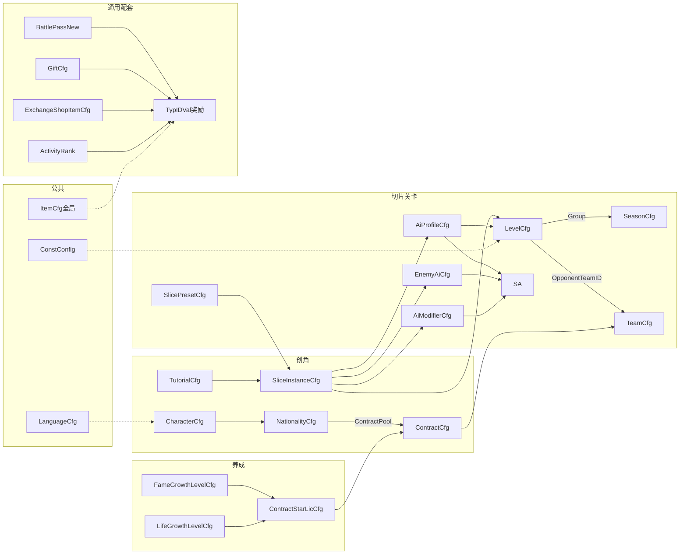

# 2026世界杯主题活动 · 配置表结构（数值策划填表）

> **定位**：仅描述数值/关卡/活动策划在 **`ActivitySoccer_preview.xlsx`**（及语言表）中**需要填写**的配置表字段。
> **规则依据**：主策划案 `system-design-doc-samples/2026世界杯主题活动.md`。
> **列级 SSOT**：以 `output/test-config/ActivitySoccer_preview.xlsx` 页签表头为准（当前 **25** 个策划页签）；本文由 `generate_config_tables_doc.py` 自动生成字段表。
> **生成时间**：脚本随测试配置同步更新。

---

## 配置表概览

### 配置文件清单

| 文件 | 说明 | 策划维护 |
|------|------|----------|
| ActivitySoccer＿preview.xlsx | 活动玩法主配置（25 个策划页签） | 数值 / 关卡 / 活动 |
| ActivitySoccerLanguage.xlsx | 活动本地化 ActvSoccerLanguageCfg | 数值 + 本地化 |
| dataconfig/ConstConfig.xlsx | 玩法全局常量（见本文附录） | 数值 |

### 公共 / 外部依赖（非本活动 xlsx 内页签）

| 类型 | 典型表 / 机制 | 本活动用法 | 策划动作 |
|------|----------------|------------|----------|
| 全局常量 | dataconfig/ConstConfig.xlsx → ConstConfigCfg | 门票默认、夹角、换约份数等 | 填附录常量表，合并全局 ConstConfig |
| 通行证 | BattlePassNew / ActivityBattlePass | 活跃度升级、双轨奖励 | 在通用 BP 表按活动 ID 配置 |
| 兑换商店 | ExchangeShopItemCfg | 竞猜币兑换外观/道具 | 在通用商店表配置消耗与奖励 |
| 礼包 | GiftCfg / D2GiftCfg | 免费/付费礼包、竞猜币投放 | 在通用礼包表配置 Reward |
| 排名奖励 | ActivityRank / ActvRankSectionCfg | 四榜段位与发奖 | 在通用排名表配置 RankType 与奖励 |
| 奖励结构 | TypIDVal＿P＿cspb（proto） | BP/排名/商店/礼包/合同等 ext array | 填 typ + id + val |
| 全局道具 | dataconfig/ItemCfg | 兑换商店、BP 付费轨等 | 引用已有道具 ID |
| 活动内货币 | ActvSoccerCurrencyCfg | 金币/门票/竞猜币 | 待遇、价格、消耗在本活动表填数值 |
| 本地化 | ActvSoccerLanguageCfg | 所有 ＊LcKey | 业务表只写 key，中文进语言表 |
| 竞猜赔率 | ActvSoccerBetMultiplierCfg + 附录 ActvSoccer＿bet＿＊ | 胜率→倍率查表+公式 | 填对照表与常量 |
| 投注档位 | ActvSoccerBetStakeTierCfg | 免费+50/100/150/200/300 | 填档位与免费派彩 |
| 邮件补发 | 全局邮件模块 | 竞猜离线派彩、排名发奖 | 主案定规则 |
| 活动入口 | 项目活动框架表 | 限时开关、活动 ID | 本活动 xlsx 不含入口表 |
| 每日任务→BP | 项目 DailyTask / Quest 表 | BP 升级来源 | 通用 BP 表只配等级与奖励 |

### 活动专用表一览

| 页签 | 用途 | 主要关联 | 填表 |
|------|------|----------|------|
| ActvSoccerCharacterCfg | 4 角色外观与展示战力 | → 创角流程 | 数值 |
| ActvSoccerNationalityCfg | 国籍与首签候选合同池 | ContractPool→ContractCfg；NameLcKey→Language | 数值 |
| ActvSoccerAchieveCfg | 活动成就(类型/计数/品质/图标/奖励) | NameLcKey/DescLcKey→Language；Reward→ItemCfg/VM | 数值 |
| ActvSoccerSlicePresetCfg | 切片摆位预设（L2 主资产） | SliceType；被 SliceInstanceCfg.PresetID 引用 | 关卡 |
| ActvSoccerSliceInstanceCfg | 切片实例装配（L3） | ←Preset；→LevelCfg.SliceList、TutorialCfg | 关卡 |
| ActvSoccerHapticCfg | 震动事件强度/图案 | 全局事件映射 | 体验/数值 |
| ActvSoccerLevelCfg | 关卡：切片序列、胜平阈值、门票、对手 | SliceList→Instance；AiProfileID→Profile；Group→Season | 关卡+数值 |
| ActvSoccerAiProfileCfg | 关卡 AI 难度档 | ←SliceInstanceCfg.AiProfileID | 数值 |
| ActvSoccerEnemyAiCfg | 门将/后卫/射手 AI 权重 | ←SliceInstanceCfg（Goalkeeper/Defender/Shooter） | 数值 |
| ActvSoccerAiModifierCfg | 切片机制（移动门将等） | ←SliceInstanceCfg.ModifierID | 关卡 |
| ActvSoccerSliceFlowCfg | 各切片类型 FSM 流程参数 | 按 SliceType 读取 | 关卡 |
| ActvSoccerFameGrowthLevelCfg | 知名度等级、许可、主角评分 | PlayerRating→淘汰赛主角评分；档位可拆细；ContractStarLicReward→ContractStarLicCfg | 数值 |
| ActvSoccerLifeGrowthLevelCfg | 生活等级、门票 buff、许可 | TicketCap/Recover 与附录常量叠加；不参与主角评分 | 数值 |
| ActvSoccerTeamCfg | 球队展示（队名/队服/队标） | ←ContractCfg.TeamID；←LevelCfg.OpponentTeamID | 数值+美术 |
| ActvSoccerContractStarLicCfg | 联赛换约星级权重 | ←Growth 两线 ContractStarLicReward | 数值 |
| ActvSoccerContractCfg | 合同待遇、赛季目标、发放场景 | TeamID→Team；首签←Nationality；换约←StarLic | 数值 |
| ActvSoccerSeasonCfg | 联赛轮次、NextSeason 链 | ID=LevelCfg.Group | 数值 |
| ActvSoccerKnockoutCfg | 淘汰赛开放、人数、分组、补位分 | OpenLeagueLevel→Level；→Phase/Simulation | 数值+活动 |
| ActvSoccerKnockoutPhaseCfg | 赛程阶段日期与当日内容 | ←KnockoutCfg；BetOpen控制竞猜 | 活动 |
| ActvSoccerBetMultiplierCfg | 胜率→奖励倍率对照表(=程序ChampionOddsCfg) | 同步匹配后查最近WinRatePctA；配合附录bet＿＊常量 | 数值 |
| ActvSoccerBetStakeTierCfg | 投注档位(免费+5档) | 下注弹窗选项；免费档HitPayout=5 | 数值 |
| ActvSoccerMatchRewardCfg | 淘汰赛晋级/出局奖励与邮件 | 淘汰赛结果→Reward/MailID | 数值+活动 |
| ActvSoccerReceiveDecisionCfg | 接球决策风格参数 | PlayerStyleCfg.ReceiveDecisionCfgID→ReceiveDecisionCfg | 数值 |
| ActvSoccerPlayerStyleCfg | 球员风格与行为权重 | CharacterCfg.PlayerStyleCfgID→PlayerStyleCfg；ReceiveDecisionCfgID→ReceiveDecisionCfg | 数值 |
| ActvSoccerReplayCfg | 回放表现 key | SliceFlowCfg.SuccessReplayKey/FailReplayKey→ReplayCfg | 体验/关卡 |
| ActvSoccerLanguageCfg | 活动文案 | 被所有 ＊LcKey 引用 | 本地化 |

### 核心引用关系（简图）

### 典型引用链（策划填表时按链检查）

| 链路 | 路径 |
|------|------|
| 创角→首签 | NationalityCfg.ContractPool → ContractCfg（GrantScene=first＿sign）→ TeamCfg |
| 试训→切片 | TutorialCfg.SliceInstanceID → SliceInstanceCfg → SlicePresetCfg |
| 关卡组装 | LevelCfg.SliceList array → SliceInstanceCfg；AI 字段已并入实例表 |
| 联赛轮次 | SeasonCfg.ID = LevelCfg.Group；NextSeason 链 |
| 联赛换约 | Growth.ContractStarLicReward → ContractStarLicCfg → ContractCfg（league＿finish） |
| 待遇/知名度结算 | 比赛胜负/进球/助攻 → ContractCfg PayFinish/PayGoal/PayAssist/PayFame |
| 淘汰赛→竞猜 | KnockoutPhaseCfg.BetOpen 排期 → 服务端 bet＿match；演算胜率 → BetMultiplierCfg + bet＿＊ 常量 |
| 竞猜币来源 | 通用 GiftCfg.Reward + 附录 bet＿daily＿free＿amount；消耗于下注与 ExchangeShopItemCfg |
| 奖励发放 | 各表 ＊Reward / TypIDVal → ItemCfg 或活动 vm 货币 ID |

---

## 填表约定（K1 测试配置）

| 约定 | 说明 |
|------|------|
| 首列 ID | 所有策划 sheet 首列 ID/id |
| ext / ext array | 第 5 行 proto 必填；空值 ｛｝ / 空数组 |
| 单参数 | 拆独立列，不包 JSON |
| ＊LcKey | 业务表 string，中文进 ActvSoccerLanguageCfg |
| 读取端 | 第 1 行 c/s/cs；Remark 留空 |
| 参数叠加 | preset → instance → ai＿profile → modifier |
| LcKey 格式 | ActvSoccer＿｛category｝＿｛semantic｝＿｛seq｝ |

### ext proto 对照

| proto | 字段 |
|-------|------|
| TypIDVal＿P＿cspb | SeasonReward, SignReward, FreeReward, PaidReward, Reward |
| PositionTuple＿P | BallPos, BallVector, TargetPoint |
| SoccerTypePayload＿V | TypePayload |
| SoccerModifier＿V | Modifiers |
| SoccerPlayerInit＿V | PlayersInit(team,idx,duty,pos,facing) |
| SoccerSeasonGoal＿V | SeasonGoal |

### ID 段交叉引用

| 对象 | 段/说明 |
|------|--------|
| AiProfile | 1001-1010=tier1-10难度档(easy/normal/hard),单调递增,DeadCorner固定0 |
| PlayerAiDuty | 1=Goalkeeper守门员,2=Defender后卫(对方非门将),3=Forward前锋(我方含玩家) |
| EnemyAi | 2001-2003=band1(tier1-3);20X1/20X2/20X3=bandX门将/后卫/射手(X=2,3,4) |
| Modifier | 4001/4002/4005=移动门将(普通/困难/极限),4003=无辅助线,4004=固定人墙,4006=收窄夹角,4007=随机扑救 |
| ReceiveDecision | 5001-5004=接球决策风格(Balanced/Playmaker/Dribbler/TargetMan) |
| PlayerStyle | 5101-5104=球员风格(Balanced/Playmaker/Dribbler/TargetMan);CharacterCfg.PlayerStyleCfgID引用 |
| FirstTouchAnim | 5201+=第一脚触球表现映射(Action×BallHeight×Direction×Pressure) |
| SliceInstance | 库实例id=tier＊100+type＊10+variant(type1-6,variant1-3);101-203=试训/引导;AI字段已并入本表 |
| Level | 1-500=50轮×10关;Group=轮次;第1关=引导关;淘汰赛round15起(level141)开放 |
| Season | 1-50轮单group=1;NextSeason链推进;总轮次=count(同group) |
| BetMultiplier | 385行=程序ChampionOddsCfg二维网格;按(winRate＿int, powerRate＿int)查行→oddsLeft/oddsRight万分值 |
| BetStakeTier | 6档:free(命中+5)+50/100/150/200/300 |

---

## 创角与引导

### ActvSoccerCharacterCfg

- **用途**：4 角色外观与展示战力
- **关联**：→ 创角流程
- **填表**：数值

| 字段 | 类型 | 读取端 | 说明 | proto/示例 |
|------|------|--------|------|------------|
| ID | int | cs | 角色ID character＿id | — |
| AppearanceKey | string | c | 外观资源键 | — |
| Body | string | c | 球衣 | — |
| Number | int | c | 号码 | — |

### ActvSoccerNationalityCfg

- **用途**：国籍与首签候选合同池
- **关联**：ContractPool→ContractCfg；NameLcKey→Language
- **填表**：数值

| 字段 | 类型 | 读取端 | 说明 | proto/示例 |
|------|------|--------|------|------------|
| ID | int | cs | 国籍ID | — |
| NameLcKey | string | c | 国籍名称→ActvSoccerLanguageCfg | — |
| Region | string | cs | 所属地区 | — |
| ContractPool | int array | s | 首签合同池(关联contract＿id) | — |

### ActvSoccerTutorialCfg

- **用途**：试训三步与切片实例
- **关联**：SliceInstanceID→SliceInstanceCfg
- **填表**：关卡

## 切片与关卡

三层配置：**L1 slice_type（程序只读）→ L2 SlicePresetCfg → L3 SliceInstanceCfg**。
叠加优先级：`preset → instance.override → ai_profile → slice_ai.modifier`。
局内道具（哨子/回溯/瞄准）见**附录 A**，不在活动 xlsx 维护。

### ActvSoccerSlicePresetCfg

- **用途**：切片摆位预设（L2 主资产）
- **关联**：SliceType；被 SliceInstanceCfg.PresetID 引用
- **填表**：关卡

| 字段 | 类型 | 读取端 | 说明 | proto/示例 |
|------|------|--------|------|------------|
| ID | int | c | preset＿id | — |
| SliceType | string | c | 切片类型 | — |
| NameLcKey | string | c | 预设名→ActvSoccerLanguageCfg | — |
| Tags | string array | c | 标签 | — |
| BallPos | ext | c | 球位置 | PositionTuple＿P |
| BallVector | ext | c | 球方向 | PositionTuple＿P |
| BallOwner | int | c | 控球球员索引 | — |
| PlayersInit | ext array | c | 球员站位+duty+朝向(1=Goalkeeper,2=Defender,3=Forward) | SoccerPlayerInit＿V |
| CameraFov | float | c | 相机FOV | — |
| TargetPoint | ext | c | 目标点 | PositionTuple＿P |
| OperableAngle | float | c | 可操作夹角(兼容字段=AngleSpanMax默认) | — |
| AngleSpanMin | float | c | 可操作夹角宽度下限(°) | — |
| AngleSpanMax | float | c | 可操作夹角宽度上限(°) | — |
| AngleMaxCenterShift | float | c | 扇形中心相对接球方向最大偏移(°) | — |
| AngleMargin | float | c | 合法目标贴边余量(°) | — |
| TypePayload | ext | c | type＿payload默认 | SoccerTypePayload＿V |
| RecommendedModes | string array | c | 建议模式 | — |

### ActvSoccerSliceInstanceCfg

- **用途**：切片实例装配（L3）
- **关联**：←Preset；→LevelCfg.SliceList、TutorialCfg
- **填表**：关卡

| 字段 | 类型 | 读取端 | 说明 | proto/示例 |
|------|------|--------|------|------------|
| ID | int | c | slice＿instance＿id | — |
| SliceType | string | c | 切片类型 | — |
| PresetID | int | c | preset＿id | — |
| OverrideOperableAngle | float | c | 覆盖可操作夹角(0=不覆盖) | — |
| ObjectiveType | string | c | 单一胜利目标(score/survive等) | — |
| ExtraObjectives | ext array | c | 复合胜利目标 | SoccerObjective＿V |
| Modifiers | ext array | c | 切片机制 | SoccerModifier＿V |
| AiProfileID | int | cs | 难度档→ActvSoccerAiProfileCfg | — |
| GoalkeeperAiID | int | cs | 门将AI | — |
| DefenderAiID | int | cs | 防守AI | — |
| ShooterAiID | int | cs | 射手AI | — |
| ModifierID | int | cs | 机制→ActvSoccerAiModifierCfg | — |
| IsGuideAi | bool | cs | 引导关AI | — |
| RewindRandom | bool | cs | 回溯后重随机 | — |
| OverrideReactionTimeMs | int | cs | 覆盖反应时间(0=默认) | — |

### ActvSoccerHapticCfg

- **用途**：震动事件强度/图案
- **关联**：全局事件映射
- **填表**：体验/数值

| 字段 | 类型 | 读取端 | 说明 | proto/示例 |
|------|------|--------|------|------------|
| ID | int | c | 编号 | — |
| EventID | string | c | 事件 | — |
| Category | string | c | core＿operation/key＿result | — |
| Intensity | string | c | light/medium/heavy | — |
| Pattern | string | c | tick/double/continuous | — |
| DurationMs | int | c | 时长ms | — |
| MinIntervalMs | int | c | 节流ms | — |
| EnabledDefault | bool | c | 默认开启 | — |

### ActvSoccerReceiveDecisionCfg

- **用途**：接球决策风格参数
- **关联**：PlayerStyleCfg.ReceiveDecisionCfgID→ReceiveDecisionCfg
- **填表**：数值

| 字段 | 类型 | 读取端 | 说明 | proto/示例 |
|------|------|--------|------|------------|
| ID | int | cs | 接球决策配置ID | — |
| Style | string | c | 默认球员风格 | Balanced/Playmaker/Dribbler/TargetMan |
| DecisionMinMs | int | c | 最早决策时间;预计触球前多少ms开始允许生成决策 | — |
| DecisionMaxMs | int | c | 最晚决策时间;预计触球前多少ms内必须已有决策 | — |
| SafeDistance | int | c | 安全距离;最近防守人大于该距离视为低压(mm) | — |
| HighPressureDistance | int | c | 高压距离;最近防守人小于该距离视为高压(mm) | — |
| ForwardProbeDistance | int | c | 前方空间探测距离(mm) | — |
| SideProbeDistance | int | c | 左右空间探测距离(mm) | — |
| BackwardProbeDistance | int | c | 身后空间探测距离(mm) | — |
| HighBallHeight | int | c | 高空球高度阈值;超过后表现层优先胸停/头球(mm) | — |
| FastBallSpeed | int | c | 高速来球速度阈值;超过后提高停球权重(mm/s) | — |
| StopWeight | int | c | 停球权重(100=标准) | — |
| PushForwardWeight | int | c | 顺势向前领球权重(100=标准) | — |
| PushSideWeight | int | c | 左右领球权重(100=标准) | — |
| HalfTurnWeight | int | c | 半转身权重(100=标准) | — |
| ShieldWeight | int | c | 护球权重(100=标准) | — |
| OneTouchPassWeight | int | c | 一脚传球权重;玩家可操作接球点不自动出球(100=标准) | — |
| OneTouchShotWeight | int | c | 一脚射门权重;玩家可操作接球点不自动出球(100=标准) | — |
| SpaceGainWeight | int | c | 评分项:空间收益权重(100=标准) | — |
| GoalProgressWeight | int | c | 评分项:向球门推进权重(100=标准) | — |
| SafetyWeight | int | c | 评分项:安全性权重(100=标准) | — |
| FlowWeight | int | c | 评分项:是否利于下一步动作(100=标准) | — |
| StyleBonusWeight | int | c | 评分项:球员风格加成(100=标准) | — |

### ActvSoccerPlayerStyleCfg

- **用途**：球员风格与行为权重
- **关联**：CharacterCfg.PlayerStyleCfgID→PlayerStyleCfg；ReceiveDecisionCfgID→ReceiveDecisionCfg
- **填表**：数值

| 字段 | 类型 | 读取端 | 说明 | proto/示例 |
|------|------|--------|------|------------|
| ID | int | cs | 球员风格配置ID | — |
| Style | string | c | 风格枚举 | Balanced/Playmaker/Dribbler/TargetMan |
| ReceiveDecisionCfgID | int | c | 接球决策配置→ActvSoccerReceiveDecisionCfg | — |
| PassBias | int | c | 传球倾向(100=标准) | — |
| DribbleBias | int | c | 盘带/领球倾向(100=标准) | — |
| ShieldBias | int | c | 护球倾向(100=标准) | — |
| ShotBias | int | c | 射门倾向(100=标准) | — |
| RiskBias | int | c | 风险倾向;越高越敢做高收益低安全动作(100=标准) | — |

### ActvSoccerReplayCfg

- **用途**：回放表现 key
- **关联**：SliceFlowCfg.SuccessReplayKey/FailReplayKey→ReplayCfg
- **填表**：体验/关卡

| 字段 | 类型 | 读取端 | 说明 | proto/示例 |
|------|------|--------|------|------------|
| ID | int | s | 配置ID | — |
| Key | string | s | 回放数据key | — |

### ActvSoccerLevelCfg

- **用途**：关卡：切片序列、胜平阈值、门票、对手
- **关联**：SliceList→Instance；AiProfileID→Profile；Group→Season
- **填表**：关卡+数值

| 字段 | 类型 | 读取端 | 说明 | proto/示例 |
|------|------|--------|------|------------|
| ID | int | cs | level＿id | — |
| IsTutorial | bool | cs | 引导关 | — |
| SliceList | int array | cs | 切片实例序列 | — |
| AiProfileID | int | cs | AI档位 | — |
| WinThreshold | int | cs | 胜利阈值 | — |
| DrawThreshold | int | cs | 平局阈值 | — |
| TicketCost | int | cs | 门票消耗 | — |
| OpponentTeamID | int | cs | 对手球队(队名/队服/队标) | — |
| OpponentTeamStar | int | cs | 对手球队星级(球员属性计算依据) | — |
| SeasonID | int | cs | 所属联赛轮次(=SeasonCfg.ID) | — |

### ActvSoccerAiProfileCfg

- **用途**：关卡 AI 难度档
- **关联**：←SliceInstanceCfg.AiProfileID
- **填表**：数值

| 字段 | 类型 | 读取端 | 说明 | proto/示例 |
|------|------|--------|------|------------|
| ID | int | c | AI难度档ID | — |
| Difficulty | string | c | easy/normal/hard | — |
| GoalkeeperSaveRate | int | c | 门将扑救成功率% | — |
| DefenderSuccessRate | int | c | 防守成功率% | — |
| ShooterSuccessRate | int | c | 对手射门成功率% | — |
| DeadCornerCanSave | int | c | 死角可扑(固定0) | — |
| ReactionTimeMs | int | c | 默认反应时间ms | — |

### ActvSoccerEnemyAiCfg

- **用途**：门将/后卫/射手 AI 权重
- **关联**：←SliceInstanceCfg（Goalkeeper/Defender/Shooter）
- **填表**：数值

| 字段 | 类型 | 读取端 | 说明 | proto/示例 |
|------|------|--------|------|------------|
| ID | int | c | 敌人AI配置ID | — |
| Duty | int | c | 球员AI职责(程序枚举PlayerAiDuty) | 1=Goalkeeper,2=Defender,3=Forward |
| SaveWeight | int | c | 扑救权重 | — |
| LeftWeight | int | c | 左方向权重 | — |
| RightWeight | int | c | 右方向权重 | — |
| UpWeight | int | c | 上方向权重 | — |
| InterceptWeight | int | c | 拦截权重 | — |
| ClearanceWeight | int | c | 解围出界权重 | — |
| KeeperCatchFail | int | c | 门将接球直接失败 | — |
| OutOfBoundsFail | int | c | 踢出界外失败 | — |
| AnimationKey | string | c | 默认表现动作 | — |

### ActvSoccerAiModifierCfg

- **用途**：切片机制（移动门将等）
- **关联**：←SliceInstanceCfg.ModifierID
- **填表**：关卡

| 字段 | 类型 | 读取端 | 说明 | proto/示例 |
|------|------|--------|------|------------|
| ID | int | c | 机制ID | — |
| ModifierType | string | c | 机制类型 | — |
| Param1Key | string | c | 参数1键 | — |
| Param1Value | string | c | 参数1值 | — |
| Param2Key | string | c | 参数2键 | — |
| Param2Value | string | c | 参数2值 | — |
| Param3Key | string | c | 参数3键 | — |
| Param3Value | string | c | 参数3值 | — |

### ActvSoccerSliceFlowCfg

- **用途**：各切片类型 FSM 流程参数
- **关联**：按 SliceType 读取
- **填表**：关卡

| 字段 | 类型 | 读取端 | 说明 | proto/示例 |
|------|------|--------|------|------------|
| ID | int | c | 切片流程ID | — |
| SliceType | string | c | 切片类型 | — |
| ForceOperationMode | string | c | 强制操作模式 | — |
| WaitInputTimeMs | int | c | 等待限时(0=无限) | — |
| NeedReplayClick | bool | c | 回放需手动结束 | — |
| EnableRewind | bool | c | 允许回溯 | — |
| SuccessReplayKey | string | c | 成功回放key | — |
| FailReplayKey | string | c | 失败回放key | — |

## 养成与合同

主角评分**仅由知名度等级表** `ActvSoccerFameGrowthLevelCfg.PlayerRating` 投放；生活等级保持小量级、不参与评分。知名度 `Level` 后续可拆分为更细档位。

### ActvSoccerCurrencyCfg

- **用途**：活动内货币类型说明
- **关联**：被待遇/价格/奖励 vm.id 间接引用
- **填表**：数值

### ActvSoccerFameGrowthLevelCfg

- **用途**：知名度等级、许可、主角评分
- **关联**：PlayerRating→淘汰赛主角评分；档位可拆细；ContractStarLicReward→ContractStarLicCfg
- **填表**：数值

| 字段 | 类型 | 读取端 | 说明 | proto/示例 |
|------|------|--------|------|------------|
| ID | int | cs | 编号 | — |
| Level | int | cs | 知名度等级 | — |
| ExpRequired | int | cs | 升级所需知名度经验 | — |
| ContractStarLicReward | int | cs | 合同星级许可奖励(0=无,2-5=license＿id) | — |
| PlayerRating | int | cs | 主角评分(仅知名度线投放) | — |
| TitleLcKey | string | c | 称号→ActvSoccerLanguageCfg | — |

### ActvSoccerLifeGrowthLevelCfg

- **用途**：生活等级、门票 buff、许可
- **关联**：TicketCap/Recover 与附录常量叠加；不参与主角评分
- **填表**：数值

| 字段 | 类型 | 读取端 | 说明 | proto/示例 |
|------|------|--------|------|------------|
| ID | int | cs | 编号 | — |
| Level | int | cs | 生活等级 | — |
| ExpRequired | int | cs | 升级消耗金币 | — |
| RewardFame | int | cs | 升级奖励知名度(0=无) | — |
| ContractStarLicReward | int | cs | 合同星级许可奖励(0=无,2-5=license＿id) | — |
| TicketCap | int | cs | 门票上限 | — |
| TicketRecoverMin | int | cs | 门票恢复间隔分钟 | — |
| FreeRewind | int | cs | 免费回溯次数 | — |
| ExtraRound | int | cs | 额外联赛轮次 | — |
| QualityShow | int | c | 展示品质 | — |

### ActvSoccerTeamCfg

- **用途**：球队展示（队名/队服/队标）
- **关联**：←ContractCfg.TeamID；←LevelCfg.OpponentTeamID
- **填表**：数值+美术

| 字段 | 类型 | 读取端 | 说明 | proto/示例 |
|------|------|--------|------|------------|
| ID | int | cs | team＿id | — |
| NameLcKey | string | c | 球队名→ActvSoccerLanguageCfg | — |
| Region | string | cs | 地区(纯展示) | — |
| KitKey | string | c | 队服资源 | — |
| BadgeKey | string | c | 队标资源 | — |

### ActvSoccerContractStarLicCfg

- **用途**：联赛换约星级权重
- **关联**：←Growth 两线 ContractStarLicReward
- **填表**：数值

| 字段 | 类型 | 读取端 | 说明 | proto/示例 |
|------|------|--------|------|------------|
| ID | int | s | license＿id(=最高可出星级) | — |
| AllowedTeamStars | int array | s | 允许出现的合同星级列表 | — |
| StarWeights | int array | s | 与AllowedTeamStars等长、按下标对应权重 | — |

### ActvSoccerContractCfg

- **用途**：合同待遇、赛季目标、发放场景
- **关联**：TeamID→Team；首签←Nationality；换约←StarLic
- **填表**：数值

| 字段 | 类型 | 读取端 | 说明 | proto/示例 |
|------|------|--------|------|------------|
| ID | int | cs | contract＿id | — |
| TeamID | int | cs | 关联展示球队→TeamCfg | — |
| TeamStar | int | cs | 合同星级(唯一生效星级) | — |
| PayFinish | int | cs | 周薪/完赛待遇 | — |
| PayGoal | int | cs | 进球待遇 | — |
| PayAssist | int | cs | 助攻待遇 | — |
| PayFame | int | cs | 名气待遇 | — |
| SeasonGoal | ext array | cs | 赛季目标 | SoccerSeasonGoal＿V |
| SeasonReward | ext array | cs | 目标奖励 | TypIDVal＿P＿cspb |
| SignReward | ext array | cs | 签约即时奖励 | TypIDVal＿P＿cspb |
| GrantFameLevel | int | cs | 抽样门槛-知名度等级 | — |
| GrantLifeLevel | int | cs | 抽样门槛-生活等级 | — |
| GrantScene | string | cs | first＿sign/league＿finish | — |
| Body | string | c | 球衣 | — |

## 积分赛

### ActvSoccerSeasonCfg

- **用途**：联赛轮次、NextSeason 链
- **关联**：ID=LevelCfg.Group
- **填表**：数值

| 字段 | 类型 | 读取端 | 说明 | proto/示例 |
|------|------|--------|------|------------|
| ID | int | cs | season＿id | — |
| LeagueNameLcKey | string | c | 联赛名称→ActvSoccerLanguageCfg | — |
| NextSeason | int | cs | 后置联赛(0=系列结束) | — |
| ContractOfferCount | int | cs | 换约候选份数(0=读全局常量) | — |

## 淘汰赛与赛程

### ActvSoccerKnockoutCfg

- **用途**：淘汰赛开放、人数、分组、补位分
- **关联**：OpenLeagueLevel→Level；→Phase/Simulation
- **填表**：数值+活动

| 字段 | 类型 | 读取端 | 说明 | proto/示例 |
|------|------|--------|------|------------|
| ID | int | s | 编号 | — |
| OpenLeagueLevel | int | s | 开放所需积分赛关卡L | — |
| TeamSizeMax | int | s | 队伍人数上限M | — |
| QualifierGroupCount | int | s | 海选分组数G | — |
| QualifyPerGroup | int | s | 每组晋级K | — |
| KnockoutGroupCount | int | s | 单淘汰分组数(8组) | — |
| MaxRounds | int | s | 单淘汰轮次R | — |
| BotPlayerRating | int | s | 补位球员评分 | — |
| ReadyTime | string | s | 备战时长分钟 | — |
| BetTime | string | s | 下注时长分钟 | — |
| MatchTime | string | s | 比赛时长分钟(3段时间必须保证为24小时) | — |

### ActvSoccerKnockoutPhaseCfg

- **用途**：赛程阶段日期与当日内容
- **关联**：←KnockoutCfg；BetOpen控制竞猜
- **填表**：活动

| 字段 | 类型 | 读取端 | 说明 | proto/示例 |
|------|------|--------|------|------------|
| ID | int | s | 编号 | — |
| PhaseLcKey | string | cs | 阶段名→ActvSoccerLanguageCfg | — |
| PhaseKey | string | cs | 阶段键 | — |
| StartTime | string | s | 开始UTC | — |
| EndTime | string | s | 结束UTC | — |
| DayContentLcKey | string | c | 当日内容→ActvSoccerLanguageCfg | — |
| BetOpen | bool | cs | 开放竞猜 | — |

### ActvSoccerMatchRewardCfg

- **用途**：淘汰赛晋级/出局奖励与邮件
- **关联**：淘汰赛结果→Reward/MailID
- **填表**：数值+活动

| 字段 | 类型 | 读取端 | 说明 | proto/示例 |
|------|------|--------|------|------------|
| ID | int | cs | 编号 | — |
| Turn | int | cs | KnockoutPhaseID | — |
| RiseReward | int | cs | 晋级奖励 | — |
| OutReward | int | s | 淘汰奖励 | — |
| RiseMailID | int | s | 晋级邮件ID | — |
| OutMailID | int | s | 淘汰邮件ID | — |

## 竞猜

赔率公式：`mult = min(ActvSoccer_bet_constraint_return_rate / win_rate, ActvSoccer_bet_max_odds)`；胜率为 0 取 `max_odds`。
`ActvSoccerBetMultiplierCfg` 即程序 `ChampionOddsCfg`（胜率→倍率对照，16 行复用 X1）。
程序万分值与策划 Val 换算：`程序值 / 10000`（如 17500→1.75，500000→50）。

### ActvSoccerBetMultiplierCfg

- **用途**：胜率→奖励倍率对照表(=程序ChampionOddsCfg)
- **关联**：同步匹配后查最近WinRatePctA；配合附录bet_*常量
- **填表**：数值

| 字段 | 类型 | 读取端 | 说明 | proto/示例 |
|------|------|--------|------|------------|
| ID | int | cs | 编号 | — |
| WinRate | int | cs | 左边胜率万分比 | — |
| PowerRate | int | cs | 左边玩家和右边玩家战力比万分比 | — |
| OddsLeft | int | cs | 左边赔率万分比 | — |
| OddsRight | int | cs | 右边赔率万分比 | — |

### ActvSoccerBetStakeTierCfg

- **用途**：投注档位(免费+5档)
- **关联**：下注弹窗选项；免费档HitPayout=5
- **填表**：数值

| 字段 | 类型 | 读取端 | 说明 | proto/示例 |
|------|------|--------|------|------------|
| ID | int | cs | 编号 | — |
| TierKey | string | cs | 档位键(free/stake＿N) | — |
| Stake | int | cs | 投注竞猜币(免费=0) | — |
| HitPayout | int | cs | 命中固定派彩(0=按倍率) | — |
| Sort | int | cs | 排序 | — |

## 成就

### ActvSoccerAchieveCfg

- **用途**：活动成就(类型/计数/品质/图标/奖励)
- **关联**：NameLcKey/DescLcKey→Language；Reward→ItemCfg/VM
- **填表**：数值

| 字段 | 类型 | 读取端 | 说明 | proto/示例 |
|------|------|--------|------|------------|
| ID | int | cs | 成就ID | — |
| Type | int | sc | 类型 | 1禁区进球 2远射进球 3头球进球 4任意球进球 5点球进球 6助攻 |
| Count | int | sc | 计数 | — |
| QualityShow | int | c | 成就品质 | — |
| Icon | string | c | 图标 | — |
| Title | string | c | 标题 | — |
| Des | string | c | 描述 | — |

## 本地化

### ActvSoccerLanguageCfg

- **用途**：活动文案
- **关联**：被所有 *LcKey 引用
- **填表**：本地化

| 字段 | 类型 | 读取端 | 说明 | proto/示例 |
|------|------|--------|------|------------|
| ID | string | cs | 本地化唯一ID(英文+数字) | — |
| Cn | string | cs | 简体中文 | — |
| Source | string | — | 引用来源(测试追溯) | — |

---

## 附录 A · 局内道具（`ActvSoccerInMatchItemCfg`）

固定三项，程序按 `ItemKey`/`Effect` 读取；`FreeCount` 与生活等级 `FreeRewind` 等 buff 叠加。

| ID | ItemKey | Effect | DefaultActive | FreeCount | 说明 |
|----|---------|--------|---------------|-----------|------|
| 1 | whistle | add＿non＿gk＿slice | 1 | 0 | 哨子 |
| 2 | rewind | reset＿slice | 0 | 1 | 回溯 |
| 3 | aim | aim＿line | 1 | 0 | 瞄准 |

---

## 附录 B · 玩法常量（合并 `ConstConfigCfg`）

共 **42** 项，字段对齐 `ConstConfigCfg`（`CfgID | Comment | Constant | Val | Array | Effects | requirement`）。
CfgID 段：`10135601-10135642`；合并目标：`dataconfig/ConstConfig.xlsx / ConstConfigCfg`。

### 常量 1-16

| CfgID | Constant | Val | Array | 说明 |
|-------|----------|-----|-------|------|
| 10135601 | ActvSoccer＿ticket＿cap＿default | 250 | array | 主界面门票上限(测试) |
| 10135602 | ActvSoccer＿ticket＿recover＿minutes | 30 | array | 门票恢复间隔(分钟) |
| 10135603 | ActvSoccer＿knockout＿open＿level | 141 | array | 淘汰赛开放关卡(round15起=level141) |
| 10135604 | ActvSoccer＿default＿character＿count | 4 | array | 可选角色数 |
| 10135605 | ActvSoccer＿first＿sign＿contract＿star | 1 | array | 首签固定合同星级 |
| 10135606 | ActvSoccer＿ai＿random＿seed＿formula | 0 | array | SeededRng种子组成(attempt＿id+slice＿id+ai＿profile＿id+rewind＿count) |
| 10135607 | ActvSoccer＿dead＿corner＿can＿save | 0 | array | 死角不可扑(策划确认) |
| 10135608 | ActvSoccer＿config＿overlay＿order | 0 | array | 参数叠加顺序 preset->instance->ai＿profile->modifier |
| 10135609 | ActvSoccer＿move＿speed＿idle | 0 | array | 待机移动速度(固定值,单位m/s) |
| 10135610 | ActvSoccer＿move＿speed＿walk | 2.5 | array | 慢走移动速度(固定值,单位m/s TODO) |
| 10135611 | ActvSoccer＿move＿speed＿run＿min | 4 | array | 跑动速度下限;run=lerp(能力值,min,max) |
| 10135612 | ActvSoccer＿move＿speed＿run＿max | 8 | array | 跑动速度上限;run=lerp(能力值,min,max) |
| 10135613 | ActvSoccer＿move＿speed＿ratio＿idle | 0 | array | 待机倍率;0=读MoveSpeedIdle,不乘run |
| 10135614 | ActvSoccer＿move＿speed＿ratio＿walk | 0 | array | 慢走倍率;0=读MoveSpeedWalk,不乘run |
| 10135615 | ActvSoccer＿move＿speed＿ratio＿run | 0 | array | 正常跑倍率;0=读能力值映射run速度 |
| 10135616 | ActvSoccer＿move＿speed＿ratio＿jog | 0.75 | array | 慢跑跑位-队友/对手;相对run倍率 |

### 常量 17-32

| CfgID | Constant | Val | Array | 说明 |
|-------|----------|-----|-------|------|
| 10135617 | ActvSoccer＿move＿speed＿ratio＿sprint | 1.25 | array | 冲刺-主角/对手;相对run倍率 |
| 10135618 | ActvSoccer＿move＿speed＿ratio＿dribble | 0.85 | array | 带球推进-控球者;相对run倍率 |
| 10135619 | ActvSoccer＿move＿speed＿ratio＿press | 1.1 | array | 逼抢-对手;相对run倍率 |
| 10135620 | ActvSoccer＿move＿speed＿ratio＿keeper＿lateral | 0.9 | array | 门将横移;相对run倍率,moving＿keeper再乘params.speed |
| 10135621 | ActvSoccer＿kick＿force＿min | 10 | array | 出球力量下限 |
| 10135622 | ActvSoccer＿kick＿force＿max | 25 | array | 出球力量上限 |
| 10135623 | ActvSoccer＿ball＿control＿distance | 0.5 | array | 停球/控球距离(m) |
| 10135624 | ActvSoccer＿operable＿angle＿span＿min | 20 | array | 可操作夹角宽度下限(°) |
| 10135625 | ActvSoccer＿operable＿angle＿span＿max | 70 | array | 可操作夹角宽度上限(°) |
| 10135626 | ActvSoccer＿contract＿offer＿count | 3 | array | 联赛换约候选合同份数 |
| 10135627 | ActvSoccer＿bet＿constraint＿return＿rate | 1.2 | array | 约束返奖率=ChampionMinOdds(程序12000) |
| 10135628 | ActvSoccer＿bet＿max＿odds | 50 | array | 最大赔率=ChampionMaxOdds(程序500000) |
| 10135629 | ActvSoccer＿bet＿initial＿display＿odds | 1.75 | array | 默认/初始展示倍率=ChampionDefaultOdds(程序17500) |
| 10135630 | ActvSoccer＿bet＿min＿odds | 1.2 | array | 赔率下限(程序ChampionMinOdds同值1.2) |
| 10135631 | ActvSoccer＿bet＿power＿ratio＿max | 2 | array | 战力比上限=ChampionPowerRatioMax(程序20000=200%) |
| 10135632 | ActvSoccer＿bet＿power＿ratio＿min | 0.3 | array | 战力比下限=ChampionPowerRatioMin(程序3000=30%) |

### 常量 33-42

| CfgID | Constant | Val | Array | 说明 |
|-------|----------|-----|-------|------|
| 10135633 | ActvSoccer＿bet＿sim＿count | 10 | array | 单场演算批次=oneMatchPreFightTimes |
| 10135634 | ActvSoccer＿bet＿max＿prefight＿battles＿per＿tick | 50 | array | 每tick最多开战场次=maxPreFightBattlesPerTick |
| 10135635 | ActvSoccer＿bet＿round＿fight＿interval＿sec | 1 | array | 演算批次间隔秒=roundFightInterval |
| 10135636 | ActvSoccer＿bet＿prefight＿timeout＿sec | 30 | array | 单场演算超时秒=preFightTimeout |
| 10135637 | ActvSoccer＿bet＿sync＿phase＿duration＿sec | 30 | array | 同步匹配阶段时长秒(活动排期,近preFightTimeout) |
| 10135638 | ActvSoccer＿bet＿coin＿purchase＿limit | 5000 | array | 单次购买竞猜币上限(TODO) |
| 10135639 | ActvSoccer＿bet＿free＿hit＿payout | 5 | array | 免费档命中固定派彩 |
| 10135640 | ActvSoccer＿bet＿daily＿free＿amount | 100 | array | 每日免费领取竞猜币(TODO) |
| 10135641 | ActvSoccer＿bet＿odds＿lock＿before＿settle＿sec | 59 | array | 截止前锁定最终倍率(秒) |
| 10135642 | ActvSoccer＿bet＿display＿odds＿tick＿sec | 60 | array | 展示倍率逐分钟收敛间隔(秒) |

---

## 附录 C · 竞猜常量程序对照（ConstCommon / controller）

| 程序键 | 活动附录 Constant / 说明 |
|--------|-------------------------|
| ChampionDefaultOdds | ActvSoccer＿bet＿initial＿display＿odds (17500→1.75) |
| ChampionMaxOdds | ActvSoccer＿bet＿max＿odds (500000→50) |
| ChampionMinOdds | ActvSoccer＿bet＿min＿odds / bet＿constraint＿return＿rate (12000→1.2) |
| ChampionPowerRatioMax | ActvSoccer＿bet＿power＿ratio＿max (20000→2.0) |
| ChampionPowerRatioMin | ActvSoccer＿bet＿power＿ratio＿min (3000→0.3) |
| ChampionOddsCfg | ActvSoccerBetMultiplierCfg（同表） |
| oneMatchPreFightTimes | ActvSoccer＿bet＿sim＿count (=10) |
| maxPreFightBattlesPerTick | ActvSoccer＿bet＿max＿prefight＿battles＿per＿tick (=50) |
| roundFightInterval | ActvSoccer＿bet＿round＿fight＿interval＿sec (=1) |
| preFightTimeout | ActvSoccer＿bet＿prefight＿timeout＿sec (=30) |

**待补项**：
- 爆冷规则(ChampionBaseOdds/UpSet*/体验扰动): 本期暂不接入,无活动配置
- bet_coin_purchase_limit / bet_daily_free_amount: 活动经济,程序ConstCommon无对应
- bet_display_odds_tick_sec: 主案UI动态展示,程序controller无直接键

---

## 数值策划 TODO 清单（待填项汇总）

- 门票上限/恢复/各关 TicketCost；生活等级 buff 对门票的影响列
- 两条养成线等级曲线、ContractStarLicReward
- Contract 待遇（PayFinish/PayGoal/PayAssist/PayFame）、SeasonGoal 阈值、Grant 门槛
- ContractStarLic 各档 StarWeights
- Knockout 开放关卡、人数、分组、阶段时刻、BotPlayerRating（演算公式见主案规则）
- 通用 GiftCfg 竞猜币投放（`Reward` 含 `typ:vm` 竞猜币 ID）
- 通用 ActivityRank 段位划分与奖励
- 通用 BP / 商店 / 礼包各档数值
- 切片摆位 AngleSpan* 基线、AI 难度档曲线
- 附录常量合并进 `dataconfig/ConstConfig.xlsx`（含 `ActvSoccer_bet_*`）
- BetMultiplier(=ChampionOddsCfg) 16 行、BetStakeTier 6 档投注

---

## 测试配置与正式表

- 测试生成脚本：`output/test-config/generate_activity_soccer_test_config.py`
- 派生文档脚本：`output/test-config/generate_config_tables_doc.py`
- 汇总索引：`output/test-config/test-config-summary.json`
- 合并正式 `dataconfig/` 前见 **config-table-editor** skill
