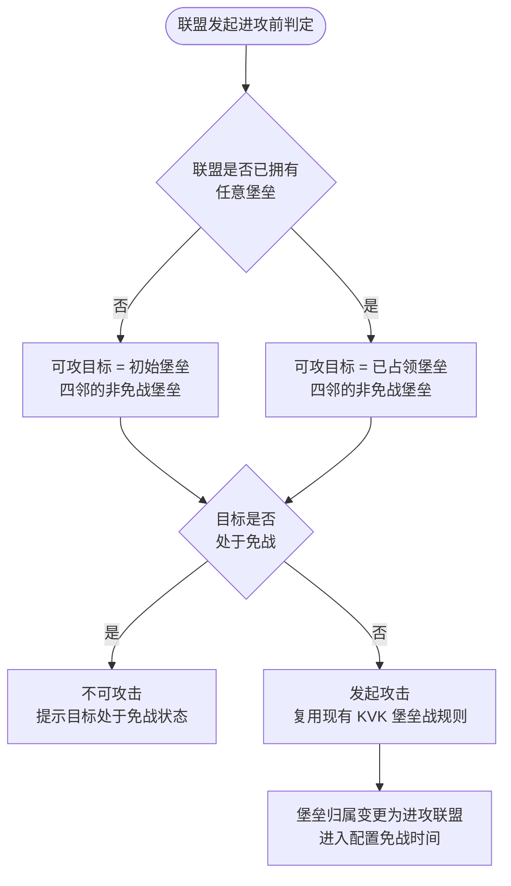
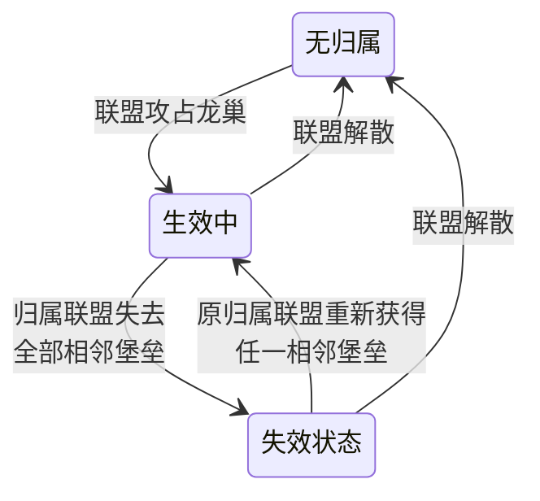

# 变更记录

| 版本 | 变更类型 | 变更内容 | 经办人 | 时间 |
|------|------------|------------|---------|------|
| v1.0 | 新建 | 基于输入草案整理为功能开发策划案 | 蒋镇宇 | 2026-07-10 |
| v1.1 | 修订 | 终审定案：统一火龙巢与龙巢术语、补充领土保护与联盟科技龙巢上限说明、更正转服口径与章节引用 | 蒋镇宇 | 2026-07-13 |

# 简介
- **设计目的**
    - 降低大地图参与难度和联盟管理成本
    - 强化联盟间的战略边界、争夺焦点和玩家早期目标感
- **功能简述**
    - **地图结构重构**：将新服原服大地图调整为 7200x7200 的方格化地图，划分 4 个出生区、中间圈、中心圈和中心王座区。
    - **堡垒占领扩张**：联盟不再通过方尖碑扩张领地，改为占领相邻堡垒方格，联盟领地由已占领堡垒方格集合决定。
    - **龙巢与圣坛重定义**：龙巢位于多个堡垒交叉点，独立争夺；圣坛嵌入指定堡垒，占领堡垒后自动获得圣坛加成。
    - **迷雾进度开放**：全服共享迷雾按开服进度逐层开放，形成 D0、D8、D15、D21 的新服节奏
    - **联盟系统适配**：新服模板关闭方尖碑、中心堡垒、远征堡垒入口，保留联盟主干能力并调整领地判定。
    - **活动任务替换**：依赖旧地图结构的任务、成就、活动排行计数需要替换为堡垒、龙巢、圣坛、王座等新目标。
    - **对标要点**：借用 KVK 的方格、堡垒、中心王座和多阶段区域推进，但保留原服商业化、联盟主干与 KVK 参战规则。 
        - 不重构 KVK 玩法本身。
        - 不改造老服大地图。
        - 不重构联盟系统主干规则，例如报名、退出、弹劾、机器人、盟主竞选、联盟科技主干。
        - 不重构商业化模型。
        - 不引入 KVK 阵营、跨服匹配、天气、女神等完整 KVK 活动机制。

# 关键决策

| 维度 | 决策 | 关键约束/备注 |
|------|------|-------------------|
| 地图形态 | 新服原服地图改为方格化战略地图 | 逻辑仍是原服，不是 KVK 战场 |
| 相邻拓扑 | 堡垒方格采用四邻规则 | 仅上、下、左、右提供相邻关系和攻击资格，对角方格不相邻 |
| 领地扩张 | 联盟通过占领相邻堡垒扩张 | 取消新服模板中的方尖碑、中心堡垒、远征堡垒建造链路 |
| 出生区 | 从 9 区改为 4 个出生区 | 只作出生分流，不代表阵营 |
| 初始扩张锚点 | 使用初始共享堡垒提供公共起点 | 初始共享堡垒永久中立，不可被联盟占领 |
| 龙巢归属 | 龙巢作为交叉点独立争夺 | 不随相邻堡垒自动归属；失去全部相邻堡垒后进入失效状态。对象类型、显示、战斗和占领规则复用既有龙巢实现，新地图仅重新配置实体、点位与相邻堡垒关系 |
| 圣坛归属 | 圣坛嵌入堡垒方格 | 占领带圣坛的堡垒即获得圣坛加成 |
| 王座规则 | 复用 K1 现有王座战规则 | 仅适配入口、开放时间、位置和地图可达性 |
| 迷雾开放 | 首版采用纯时间驱动 | 灰度后如需时间 \+ 全服进度的混合驱动，作为后续版本另行设计与配置 |
| KVK 兼容 | KVK 报名、进入、回归不变 | 原服堡垒归属在 KVK 期间保留，但原服地图不冻结 |
| 活动任务 | 依赖旧地图结构的计数必须替换 | 方尖碑、中心堡垒、远征堡垒、旧龙巢连接相关目标不得在新服模板中继续要求 |
| 数据兼容 | 新服模板与旧服模板隔离 | 低版本客户端、旧服任务链以及无法识别迷雾或新配置参数的客户端必须有拦截或降级策略 |

# 详细规则

## 地图结构
- **地图尺寸**：新服大地图尺寸保持 7200x7200，便于复用现有大地图和 KVK 地图技术基础。
- **方格化划分**：24x24 的基础格子结构。实际可用堡垒方格需扣除中心王座区、和特殊阻挡区。
- **相邻拓扑**：采用四邻规则，只以上、下、左、右相接的方格作为相邻方格；对角接触不提供攻击资格。
- **堡垒方格**：堡垒是联盟领地的最小归属单位。可以配置归属、类型、等级、迷雾块、相邻关系、是否附属圣坛、是否邻接龙巢等信息。
- **公共战略点**：龙巢显示在多个堡垒交界处；圣坛显示在指定堡垒方格内；王座独立显示在中心区域。
- **缩略地图**：复用现在kvk的领土界面，用于查看全局战略点位和联盟染色情况
    - 堡垒区域染色不再按阵营区分，改为用联盟区分（需要更多颜色）
    - 无级缩放到最高lod自动呼出缩略地图，也支持hud按钮直接打开

## 出生分配
- **出生区数量**：新服从 9 个出生区改为 4 个出生区。
- **出生区含义**：只用于出生分流和早期空间分布，不是敌对阵营。
- **分配方式**：玩家首次进入大地图时由系统分配位置，复用现有规则。
- **联盟归属限制**：联盟成员不要求来自同出生区，加盟和迁城可跨区域，仅保留迷雾区域限制。

## 堡垒占领
- **联盟领地定义**：联盟领地等于该联盟已占领的堡垒方格集合。

- **相邻扩张**： 
    - 联盟可攻击目标由两部分组成： 
        - 已经拥有任意堡垒：已占领堡垒相邻的非免战堡垒
        - 尚未拥有任意堡垒：初始堡垒相邻的非免战堡垒。
    - 相邻关系采用四邻，只认上、下、左、右，不认对角相邻。
    - 攻击与占领规则：复用现有kvk堡垒规则
    - 占领成功后，该堡垒进入配置免战时间。
    - 堡垒与联盟其他领地断开后形成飞地时，归属与加成不变；飞地仍属于联盟领地，也可以继续作为相邻扩张的起点。
- **进行中战斗与并发结算**： 
    - 允许多个联盟同时攻击同一堡垒。防守方面对所有进攻方；某个进攻方战斗胜利后成为新的防守方，后续战斗继续按现有堡垒战规则处理。
    - 进攻过程中，若提供本次攻击资格的起点堡垒被其他联盟夺取，本场战斗仍继续结算；进攻方即使战斗胜利，部队也在结算后立即返回，不增加目标堡垒的占领时间。
    - 多场并发战斗结算导致联盟占领堡垒数超过科技上限时，系统拦截结算更晚的战斗所对应堡垒。
- **初始堡垒：**
    - 初始堡垒永久中立，不可被任何联盟占领。
    - 初始堡垒作为所有尚未占领任意堡垒的联盟的公共扩张锚点。
- **归属规则**： 
    - 堡垒归联盟，不归个人。
    - 联盟解散后，所属堡垒转为中立。
- **免战规则**： 
    - 免战中的堡垒不可被其他联盟攻击。
    - 免战触发时参考王座结算时的规则：立即遣返所有堡垒中的部队，后续到达的部队自动返回。
- **放弃堡垒**：允许管理者放弃以占领的普通堡垒，放弃需要一定时间（如果不需要可配0）
    - 放弃堡垒后需要处理相邻性兼容：唯一相邻的龙巢失效、正在占领的结算
- 占领限制：当联盟剩余可占领堡垒数量不足x时，对新的堡垒的攻击/集结只能由联盟管理者发起
    - 普通发起攻击/集结时会告知剩余数量不足联系管理者
    - 一旦联盟有部队在堡垒中则不受限制

## 地图对象
- **龙巢**
    - **术语说明**：项目内「火龙巢」与「龙巢」为同一对象，本案统一使用「龙巢」，不单独设计火龙巢规则。
    - **位置规则**： 
        - 龙巢沿用项目既有龙巢对象类型，不新增地图单位类型。
        - 龙巢位于多个相邻堡垒的交叉区域，不位于单个堡垒方格内部。
    - **占领规则**： 
        - 占领与攻击权限：原初始堡垒和方尖碑联通规则改为占领任一相邻普通堡垒
        - 战斗与占领规则：复用现有龙巢规则
    - **失效状态**： 
        - 当龙巢归属联盟失去全部相邻堡垒时，龙巢进入失效状态。
        - 失效状态保留原归属，但暂停加成生效。
        - 原归属联盟重新获得任一相邻堡垒，且龙巢未被其他联盟打下时，龙巢恢复生效。
        - 失效状态可被其他联盟攻击，无法进入龙巢参与防守。
    - **加成规则**：复用现有规则。

- **圣坛**
    - **位置规则**：圣坛嵌入指定堡垒方格内，作为该堡垒的附属战略资源。
    - **占领规则**：联盟占领带圣坛的堡垒后，自动获得该圣坛加成。
    - **争夺规则**：圣坛不作为独立占领目标；圣坛归属随堡垒归属变化
    - **加成规则**：复用现有规则。
- **王座**：复用现有规则。
- **普通野怪**：1-50级首杀，不会被城堡等级突破等级限制，逐级挑战
- **泰坦**：保留现有等级区分，每个等级有首杀，逐级挑战
- **黑暗祭祀/恶魔守卫**：暂不刷新

## 迷雾系统
- **迷雾视角**：迷雾为服务器共享状态，不是玩家个人探索视野。
- **层级划分**： 
    - 层级0：出生区，默认开放，兼容迷雾调整可按4区域独立设置迷雾开关。
    - 层级 1：中间圈，开服 D8 开放。
    - 层级 2：核心圈，开服 D15 开放。
    - 层级 3：王座，开服 D21 开放。
    - **调整内容**：原本仅区分1-9分区迷雾，现在需要将迷雾细分到各个堡垒和王座，按堡垒与王座所属层级开放
- **迷雾表现**： 
    - 迷雾覆盖区域内的堡垒、龙巢、圣坛和王座保留美术形象，玩家可以提前识别战略对象的分布。
    - 隐藏对象的数据层内容，包括铭牌、LOD 信息、归属、类型和战斗状态。
    - 屏蔽迷雾区域内对象的点击与详情交互；部队和城堡不可进入迷雾覆盖的方格。
    - 迷雾开放后恢复对象数据层展示、点击交互和正常通行。
- **解锁方式**：按开服时间累计自动全服解锁。

## 联盟系统
- **保留不变**：联盟报名、退出、弹劾、盟主竞选、联盟公告、投票、聊天、官员、阶级、机器人接管、联盟礼物、联盟成就、联盟挑战、自动踢人、联盟转服、联盟帮助、KVK 联盟礼物分配等主干能力保持不变。
- **领土保护**：状态变化等沿用现有规则；仅领土范围判定变更，由已建造的联盟堡垒和方尖碑范围合集，改为已占领的普通堡垒范围合集
- **关闭入口**： 
    - 新服模板下关闭方尖碑建造入口。
    - 新服模板下关闭中心堡垒、远征堡垒建造入口。
    - 与上述旧建筑直接绑定的任务、活动、引导和红点不得继续触发。
- **联盟领土**： 
    - 堡垒列表
    - 龙巢列表
- **联盟迁城**： 
    - 联盟迁城落点必须在联盟领地方格内。
    - 与盟主城堡距离限制沿用现有规则。
    - 首次迁城到联盟领地不作为首战前置条件，新联盟可先通过首战规则获得堡垒。
- **联盟解散**： 
    - 联盟解散后，堡垒\\圣坛\\龙巢归属进入中立。
- **联盟科技**
    - 新增联盟科技节点，用于限制联盟可同时占领的堡垒以及龙巢数量。
- **联盟商店**
    - 调整投放内容，增加橙色英雄等高价值物品

## KVK 兼容
- **报名规则**：玩家和联盟报名 KVK 的规则完全不变。
- **进入规则**：报名后进入 KVK 战场的方式完全不变。
- **期间状态**： 
    - 玩家在 KVK 战场作战时，原服堡垒、联盟领地、龙巢、圣坛、王座归属数据保留。
    - 原服地图在 KVK 期间不冻结，仍可发生堡垒争夺和迷雾开放。
    - 原服普通堡垒和龙巢占领所需时间可按固定倍率延长。
    - 联盟冻结保持现状
- **结束规则**：KVK 结束不触发原服堡垒、龙巢、圣坛、王座归属重置；除非这些对象在 KVK 期间已被其他联盟按原服规则打下。

## 计数与排行

**计数替换原则**

所有依赖旧地图结构的目标都必须替换为新地图目标。替换时优先保持玩家目标价值等价，而不是名称一一对应。

| 旧目标/旧计数 | 新目标/新计数 |
|-------------------|-------------------|
| 建造方尖碑 | 占领普通堡垒 |
| 修建或升级联盟中心堡垒 | 取消 |
| 修建或升级远征堡垒 | 取消 |
| 连接龙巢 | 占领龙巢相邻堡垒 / 攻击并占领龙巢 |
| 占领龙巢 | 占领交叉点龙巢 |
| 占领圣坛 | 占领圣坛 |
| 王座相关目标 | 参与王座战、占领王座、获得王座积分 |
| 联盟领地面积 | 联盟占领堡垒方格数 |
| 联盟建筑战斗 | 堡垒战 / 龙巢战 / 王座战 |
- **任务与成就**
    - **主线任务**：删除或替换方尖碑、连接龙巢、建造联盟堡垒类目标。
    - **联盟任务**：新增或替换为首次占领堡垒、占领指定数量堡垒、参与堡垒战、占领龙巢、占领带圣坛堡垒、进入中间圈或中心圈等目标。
    - **成就**：新增或替换联盟扩张类成就，计数按堡垒、龙巢、王座、圣坛和领地方格数计算。
    - **引导**：新手联盟引导需要解释"初始共享堡垒 -\> 相邻堡垒 -\> 龙巢交叉点 -\> 中心圈 -\> 王座"的路径。
- **活动与排行**
    - **最强领主/联盟排行类活动**：若原计数包含联盟建筑、方尖碑、龙巢连接，需映射为堡垒、龙巢、王座相关计数。
    - **王座战活动**：战斗、重置、奖励、buff 复用现有规则；仅适配地图入口、开放时间和位置。
    - **PVE 活动**：野怪、泰坦、采集等基础计数保持不变；若活动要求特定区域或怪物等级，需结合迷雾层级调整。
    - **排行指标**：可新增或替换为联盟占领堡垒数、龙巢数、王座积分、领地方格数等指标。
- **其他相关内容**
    - **新手引导步骤**：盘点新手引导中提示建造方尖碑、连接龙巢等步骤的图文与跳转，替换为「初始共享堡垒 -\> 相邻堡垒 -\> 龙巢交叉点 -\> 中心圈 -\> 王座」路径下的对应步骤
    - **红点触发源**：盘点方尖碑、联盟中心堡垒、远征堡垒相关的红点触发条件，替换为堡垒可攻击、龙巢可攻击、迷雾开放、王座开放等新触发源；新服模板下旧建筑红点必须关闭，不得空跳转。
    - **多语言文案中引用旧地图概念处**：盘点任务描述、活动规则说明、引导文案中出现的"方尖碑""联盟中心堡垒""远征堡垒""连接龙巢"等措辞，逐条替换或新增对应新地图概念的文案 key。

## 边界情况处理

| 场景 | 处理 |
|------|------|
| 联盟没有任何堡垒 | 只显示初始共享堡垒相邻第一圈的非免战普通堡垒为可攻目标 |
| 首战目标处于免战 | 不可攻击，提示目标处于免战状态 |
| 首战成功后继续进攻 | 后续按普通相邻扩张规则； |
| 多个联盟同时攻击同一堡垒 | 允许并发进攻；战斗胜利方成为新的防守方，后续战斗继续按现有堡垒战规则结算 |
| 进攻资格对应的起点堡垒在战斗中被夺 | 当前战斗继续结算；进攻方胜利后部队立即返回，且不增加目标堡垒占领时间 |
| 多场并发战斗结算后超过科技上限 | 拦截结算更晚的战斗所对应堡垒，该堡垒不加入进攻方占领集合 |
| 联盟解散 | 所属堡垒、圣坛、龙巢转为中立；随堡垒变化；按失去相邻堡垒规则处理 |
| 玩家退盟 | 不影响原联盟堡垒、龙巢、圣坛归属；玩家失去该联盟领地相关权限 |
| 玩家加入新联盟 | 按新联盟当前堡垒、龙巢、圣坛归属获得权限，不继承个人历史占领贡献 |
| 堡垒占领上限已满 | 不可发起新的堡垒占领，提示联盟堡垒占领数量已达上限 |
| 龙巢占领上限已满 | 可按项目规则提示无法占领或需放弃旧龙巢；具体处理由配置与既有龙巢规则决定 |
| 龙巢归属联盟失去全部相邻堡垒 | 龙巢进入失效状态，加成暂停，保留原归属并可被符合资格的联盟争夺 |
| 圣坛所在堡垒被攻下 | 圣坛加成立即随堡垒归属转移 |
| 迷雾未开放 | 显示区域对象的美术形象；隐藏铭牌、LOD、归属、类型和战斗状态，屏蔽点击，部队和城堡不可进入 |
| 迷雾开放时玩家在线 | 地图状态刷新后恢复对象数据层、点击与通行；必要时弹出系统提示或入口红点 |
| 旧任务指向方尖碑或旧堡垒 | 新服模板下不得投放；若已投放，需热更替换或隐藏并补偿 |

## 数据兼容与高风险自检

对照项目《高兼容性风险修改项自检》及本功能特有的兼容场景，统一梳理如下：

| 编号 | 风险维度 | 是否涉及 | 应对方式 |
|------|------------|------------|------------|
| 1 | 肉鸽关卡数值变更 | 不涉及 | 本功能不改动肉鸽玩法 |
| 2 | 大地图 battle 相关变更 | 涉及 | 堡垒战、龙巢战、王座战均在新地图模板下发起并复用既有战斗规则；测试需覆盖新实体配置、四邻攻击资格和并发结算，低于最低版本的客户端不得进入新地图战斗流程 |
| 3 | 大地图跨场景变更 | 涉及 | 新旧地图模板并存，玩家在原服与 KVK 战场间往返须保证跨场景数据一致；测试须覆盖参战与回归两个方向 |
| 4 | 新增大地图对象需配默认模型 | 不涉及新增对象类型 | 龙巢、圣坛、堡垒、王座均复用既有对象类型和既有显示规则，仅在新地图模板中重新配置实体；迷雾属于地图表现与通行能力，不作为新增地图对象处理 |
| 5 | 聊天/通知新增类型 | 视具体实现 | 若迷雾开放、堡垒归属变更等场景新增系统通知类型，需按项目通知兼容规范验证老客户端可正常忽略未知通知 |
| 6 | 任务/成就类型变更 | 涉及 | 依赖旧地图目标的任务、成就、活动排行按《计数与排行》章节的完整替换表执行；不得在新服模板下投放旧目标 |
| 7 | 新增字段需拷线上数据回归 | 视技术实现 | 本案不要求新增龙巢、圣坛、堡垒、王座对象类型；若研发为新地图关系、迷雾状态或四邻拓扑扩展共享实体字段，测试阶段必须使用线上真实数据执行回归，验证默认值不影响旧服与 KVK |
| 8 | 新增多语言文案的占位符兼容 | 涉及 | 堡垒、龙巢、圣坛、王座相关新增提示文案如包含 `{0}` 等参数占位符，须在多语言测试阶段逐条核对占位符数量与顺序，避免老版本语言包缺失参数导致崩溃或显示异常 |
| 9 | 服务器范围隔离 | 涉及 | 本功能仅对新开服务器启用；旧服务器继续使用旧大地图模板 |
| 10 | 客户端最低版本拦截 | 涉及 | 需设定最低客户端版本；低于最低版本的客户端不得进入新地图 |
| 11 | 热更与配表重算 | 涉及 | 地图对象、任务目标、活动计数和排行榜口径热更时，进行中状态按服务器当前模板重算；已完成奖励不回收 |
| 12 | 转服迁移 | 不涉及 | 支持新旧地图模板服务器互转，复用现有转服流程，不涉及数据兼容处理；转入后按目标服务器地图模板规则参与玩法 |
| 13 | 联盟变更（退盟/加盟/解散）对归属的影响 | 涉及 | 退盟、加盟、解散只影响后续归属和可操作资格；已归属堡垒、龙巢、圣坛按各模块规则处理 |
| 14 | KVK 往返数据一致性 | 涉及 | 玩家进入或返回 KVK 不改变原服堡垒、龙巢、圣坛、王座归属；原服地图进度按服务器时间继续推进 |

# 配置表

主功能案只定义配置表用途，不维护字段类型和表头。字段结构见[配置表结构](https://alidocs.dingtalk.com/i/nodes/XPwkYGxZV3R4Xdz4C9Y3QrrBWAgozOKL?utm_scene=team_space)
。

| 配置模块 | 用途 |
|------------|------|
| 地图基础配置 | 定义地图尺寸、方格大小、可用方格、区域与迷雾层级 |
| 堡垒配置 | 定义堡垒类型、等级、坐标、四邻关系、是否初始共享、是否附属圣坛 |
| 龙巢配置 | 定义龙巢坐标、相邻堡垒、类型、等级、守卫与加成引用 |
| 圣坛配置 | 定义圣坛类型、所在堡垒、加成引用 |
| 迷雾配置 | 定义层级、开放时间 |
| 出生分配配置 | 定义出生区容量与系统自动分配规则 |
| 占领规则配置 | 定义占领时间、免战、KVK 期间倍率、上限判定 |
| 联盟科技配置 | 定义堡垒占领上限和龙巢占领上限分支 |
