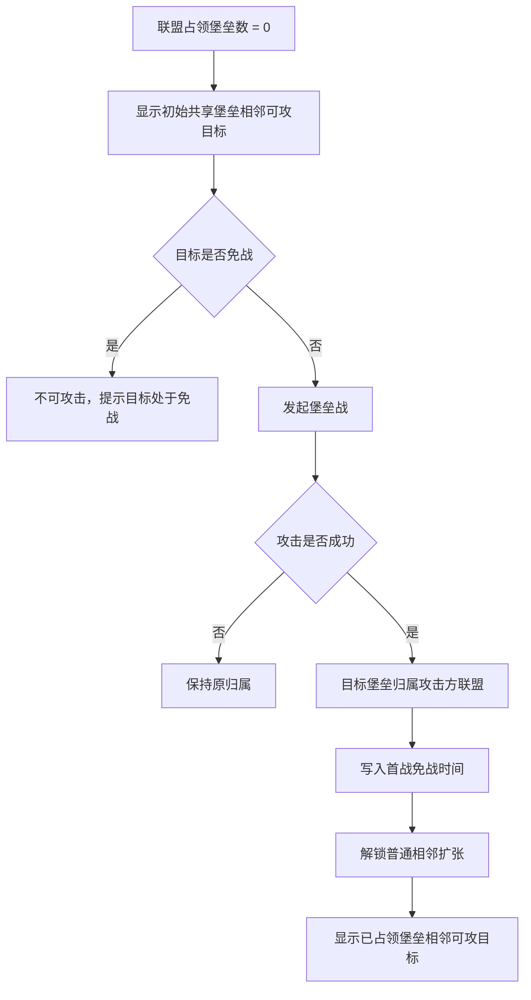

# 变更记录

| 版本 | 变更类型 | 变更内容 | 经办人 | 时间 |
|------|----------|----------|--------|------|
| v1.0 | 新建 | 基于输入草案整理为可评审功能策划案，明确新服大地图结构、堡垒占领、龙巢与圣坛、迷雾进度、KVK 兼容、活动任务替换和配置表边界 | Codex | 2026-07-02 |
| v1.1 | 修订 | 根据审核意见补齐 P0 项：新增风险登记章节、补充数据兼容 8 项自检挂钩表、细化活动任务成就排行引导 FAQ 完整替换表 | Kiro | 2026-07-03 |
| v1.2 | 修订 | 根据代码交叉核对审核（审核文档第十一节）修订：新增待技术确认项章节（KVK 地图实例、龙巢技术形态、配置表承载能力）；明确龙巢为新增独立地图实体而非复用现有龙巢线；标注迷雾系统为全新开发并补充风险 R10-R12；KVK 兼容章节标注前置技术假设；补充术语与代码命名对照；落地遗留 P1 项（21 天赛季定位叙事、迷雾表现三档、联盟解散转中立与科技初始灰度默认值、KVK 扇形尺寸复用说明）；新增灰度观测指标章节 | Claude | 2026-07-10 |
| v1.3 | 修订 | 根据最新审核定案补齐堡垒四邻拓扑、进攻起点失守结算、同目标多联盟并发、飞地扩张和并发超过科技上限规则；取消“重建联盟”概念与限制；统一龙巢、圣坛、堡垒、王座为既有对象类型在新地图重新配置实体，显示、战斗和占领规则复用既有实现 | Codex | 2026-07-10 |

# 简介

## 设计目的

当前新服大地图以平原自由落城和方尖碑扩张为核心，联盟之间的战略边界、争夺焦点和玩家早期目标感偏弱。新服大地图重构的目标，是把玩家从开服第一天就放入一个有天然战略结构的世界：出生区、堡垒方格、龙巢交叉点、圣坛、中心王座和逐层开放的迷雾共同形成新服赛季节奏。

本功能借用 K1 KVK 中玩家已经熟悉的方格化地图骨架与部分占领认知，但逻辑上仍属于原服大地图，不引入完整 KVK 阵营、跨服匹配、天气、女神等玩法。设计重点是降低新手理解门槛、强化联盟扩张路径，并为后续 KVK 参战建立认知衔接。

从产品定位看，新服进程对标 KVK 三周节奏（D8 中间圈开放 / D15 中心圈开放 / D21 王座开放），但省掉 KVK 前 7 天报名匹配流程，让玩家从 D0 直接进入有结构的赛季体验。这一「21 天赛季」叙事同时作为运营与市场对齐的统一口径。

## 功能简述

- **地图结构重构**：将新服原服大地图调整为 7200x7200 的方格化地图，划分 4 个扇形出生区、中间圈、中心圈和中心王座区。
- **堡垒占领扩张**：联盟不再通过方尖碑扩张领地，改为占领相邻堡垒方格，联盟领地由已占领堡垒方格集合决定。
- **龙巢与圣坛重定义**：龙巢位于多个堡垒交叉点，独立争夺；圣坛嵌入指定堡垒，占领堡垒后自动获得圣坛加成。
- **迷雾进度开放**：全服共享迷雾按开服进度逐层开放，形成 D0、D8、D15、D21 的新服节奏。
- **联盟系统适配**：新服模板关闭方尖碑、中心堡垒、远征堡垒入口，保留联盟主干能力并调整领地判定。
- **KVK 兼容**：KVK 报名、进入、回归规则保持不变；新服地图作为新的原服形态承接 KVK 前后状态。
- **活动任务替换**：依赖旧地图结构的任务、成就、活动排行计数需要替换为堡垒、龙巢、圣坛、王座等新目标。

## 目标与对标

- **所属项目**：K1
- **适用范围**：仅新开服务器；老服不迁移、不兼容本地图形态。
- **参考玩法**：K1 KVK 地图骨架与堡垒占领认知。
- **对标要点**：借用 KVK 的方格、堡垒、中心王座和多阶段区域推进，但保留原服商业化、联盟主干与 KVK 参战规则。

## 非目标

- 不重构 KVK 玩法本身。
- 不改造老服大地图。
- 不重构联盟系统主干规则，例如报名、退出、弹劾、机器人、盟主竞选、联盟科技主干。
- 不重构商业化模型。
- 不引入 KVK 阵营、跨服匹配、天气、女神等完整 KVK 活动机制。

# 关键决策

| 维度 | 决策 | 关键约束/备注 |
|------|------|----------------|
| 文档粒度 | 本功能作为一份完整主功能案 | 地图结构、占领、迷雾、联盟适配、KVK 兼容和任务替换均属于同一功能闭环；配置字段另拆派生文档 |
| 地图形态 | 新服原服地图改为方格化战略地图 | 逻辑仍是原服，不是 KVK 战场 |
| 相邻拓扑 | 堡垒方格采用四邻规则 | 仅上、下、左、右提供相邻关系和攻击资格，对角方格不相邻 |
| 领地扩张 | 联盟通过占领相邻堡垒扩张 | 取消新服模板中的方尖碑、中心堡垒、远征堡垒建造链路 |
| 出生区 | 从 9 区改为 4 个扇形出生区 | 扇形只作出生分流，不代表阵营 |
| 初始扩张锚点 | 使用初始共享堡垒提供公共起点 | 初始共享堡垒永久中立，不可被联盟占领 |
| 龙巢归属 | 龙巢作为交叉点独立争夺 | 不随相邻堡垒自动归属；失去全部相邻堡垒后进入失效状态。对象类型、显示、战斗和占领规则复用既有龙巢实现，新地图仅重新配置实体、点位与相邻堡垒关系 |
| 圣坛归属 | 圣坛嵌入堡垒方格 | 占领带圣坛的堡垒即获得圣坛加成 |
| 王座规则 | 复用 K1 现有王座战规则 | 仅适配入口、开放时间、位置和地图可达性 |
| 迷雾开放 | 推荐纯时间驱动 | 灰度后可切换为时间 + 全服进度的混合驱动 |
| KVK 兼容 | KVK 报名、进入、回归不变 | 原服堡垒归属在 KVK 期间保留，但原服地图不冻结。**该决策基于「KVK 战场与原服地图为独立地图实例」的未验证假设**，见《待技术确认项》TC1，确认前不作为定案依据 |
| 活动任务 | 依赖旧地图结构的计数必须替换 | 方尖碑、中心堡垒、远征堡垒、旧龙巢连接相关目标不得在新服模板中继续要求 |
| 数据兼容 | 新服模板与旧服模板隔离 | 低版本客户端、旧服任务链以及无法识别迷雾或新配置参数的客户端必须有拦截或降级策略 |

# 详细规则

## 全局玩法机制

- **核心循环**：玩家出生在 4 个扇形区之一，加入或创建联盟后，通过初始共享堡垒相邻的普通堡垒完成首战，占领堡垒后继续沿相邻堡垒扩张，逐步接近龙巢、圣坛、中间圈、中心圈和王座。
- **地图目标层级**：出生区承担新手落地和低强度 PVE；中间圈承担第一阶段联盟争夺；中心圈承担高级资源、龙巢与王座前置争夺；王座承担本服顶级联盟目标。
- **规则复用原则**：已有成熟规则优先复用，包括野怪/泰坦刷新、龙巢战斗、圣坛加成、王座战、KVK 参战与回归、联盟主干功能。
- **差异化原则**：新服原服地图与 KVK 结构相似，但不强求规则完全等价。凡涉及原服商业化、联盟常驻生态和新手成长节奏，以原服体验为优先。
- **配置边界**：地图坐标、堡垒数量、龙巢数量、圣坛分布、迷雾开放时间、占领时间倍率、联盟科技数值、PVE 等级和刷新周期均由配置表定义，字段见派生文档。

## 术语与代码命名对照

为避免评审和开发对接时的概念歧义，本案术语与现有代码命名对照如下：

| 本案术语 | 服务器命名 | 客户端命名 | 说明 |
|----------|-----------|-----------|------|
| 堡垒 | `Fort`（`wildmap/melem/mcity/fort.go`、`unionfort/`） | `Fortress`（`UIAllianceWarFortress` 等） | 两端命名不同，属同一概念，非新起名 |
| 龙巢 | `DragonNest` 线（`UnionTerritoryCfg.DragonNestLv`、`ActivityDragonNestWar`） | 同 | 本案指 `DragonNest` 线；与 `gvg_dragon/`（GVG 龙战）是完全不同的系统，沟通时须明确区分 |
| 圣坛 | `Altar`（`mcity.Altar`、`ctl_altar.go`） | `AltarBuilding` | 与「怪物神殿」（`Shrine`/`MonsterShrine`）是完全不同的既有系统，本案与怪物神殿无关 |
| 王座 | `kingwar/` 包 | `UI/ThroneWar/` | 复用现有王座战模块 |
| 迷雾 | 无现有代码 | 无现有代码 | 全新系统，见《迷雾系统》实现量级说明 |

龙巢、圣坛、堡垒、王座均属于项目既有对象类型。本功能会在新地图模板中重新配置这些对象的实体、坐标和关联关系，但不新增对象类型；其既有显示、战斗和占领规则继续复用。迷雾是本功能唯一明确按全新地图能力评估的模块。

## 数据兼容总则

| 条目 | 约定 |
|------|------|
| 服务器范围 | 本功能仅对新开服务器启用；旧服务器继续使用旧大地图模板 |
| 客户端版本 | 新服启用前需设定最低客户端版本；低于最低版本的客户端不得进入新地图玩法，或按项目统一策略强更 |
| 老客户端降级 | 龙巢、圣坛、堡垒、王座沿用既有对象类型与显示规则，不需要为其新增默认模型；低于新服地图最低版本的客户端不得进入新地图并按项目统一策略提示更新，避免因迷雾、任务类型或新配置参数缺失导致误操作 |
| 热更与配表 | 地图对象、任务目标、活动计数和排行榜口径热更时，进行中状态按服务器当前模板重算；已完成奖励不回收 |
| 转服 | 本期不支持老服迁入新地图模板；如后续开放转服，需要单独定义城堡落点、联盟归属、堡垒归属和任务进度迁移 |
| 联盟变更 | 退盟、加盟、解散只影响后续归属和可操作资格；已归属堡垒、龙巢、圣坛按各模块规则处理 |
| KVK 往返 | 玩家进入或返回 KVK 不改变原服堡垒、龙巢、圣坛、王座归属；原服地图进度按服务器时间继续推进 |
| 幂等处理 | 占领结算、归属变更、奖励发放、任务计数和排行刷新必须按唯一战斗/事件结果处理，重复请求不得重复结算 |

## 高兼容性风险自检挂钩

对照项目《高兼容性风险修改项自检》，本功能涉及的兼容风险项及应对方式如下；未涉及项标注不适用：

| 编号 | 自检项 | 是否涉及 | 应对方式 |
|------|--------|----------|----------|
| 1 | 肉鸽关卡数值变更 | 不涉及 | 本功能不改动肉鸽玩法 |
| 2 | 大地图 battle 相关变更 | 涉及 | 堡垒战、龙巢战、王座战均在新地图模板下发起并复用既有战斗规则；测试需覆盖新实体配置、四邻攻击资格和并发结算，低于最低版本的客户端不得进入新地图战斗流程 |
| 3 | 大地图跨场景变更 | 涉及 | 新旧地图模板并存，玩家在原服与 KVK 战场间往返须保证跨场景数据一致；测试须覆盖参战与回归两个方向 |
| 4 | 新增大地图对象需配默认模型 | 不涉及新增对象类型 | 龙巢、圣坛、堡垒、王座均复用既有对象类型和既有显示规则，仅在新地图模板中重新配置实体；迷雾属于地图表现与通行能力，不作为新增地图对象处理 |
| 5 | 聊天/通知新增类型 | 视具体实现 | 若迷雾开放、堡垒归属变更等场景新增系统通知类型，需按项目通知兼容规范验证老客户端可正常忽略未知通知 |
| 6 | 任务/成就类型变更 | 涉及 | 依赖旧地图目标的任务、成就、活动排行按《活动、任务、成就、排行与商业化》章节的完整替换表执行；不得在新服模板下投放旧目标 |
| 7 | 实体新增字段需拷线上数据回归 | 视技术实现 | 本案不要求新增龙巢、圣坛、堡垒、王座对象类型；若研发为新地图关系、迷雾状态或四邻拓扑扩展共享实体字段，测试阶段必须使用线上真实数据执行回归，验证默认值不影响旧服与 KVK |
| 8 | 新增多语言文案的参数占位符兼容 | 涉及 | 堡垒、龙巢、圣坛、王座相关新增提示文案如包含 `{0}` 等参数占位符，须在多语言测试阶段逐条核对占位符数量与顺序，避免老版本语言包缺失参数导致崩溃或显示异常 |

## 地图结构

- **地图尺寸**：新服大地图尺寸保持 7200x7200，便于复用现有大地图和 KVK 地图技术基础。
- **方格化划分**：地图按 300x300 方格划分，形成 24x24 的基础格子结构。实际可用堡垒方格需扣除中心王座区、边界不可用区和特殊阻挡区。
- **相邻拓扑**：堡垒方格采用四邻规则，只以上、下、左、右相接的方格作为相邻方格；对角接触不提供攻击资格。地图配置可关闭被阻挡方向的通路，但不得把非四邻方格配置为相邻攻击目标。
- **区域构成**：
  - 扇形出生区：位于 4 个角落，用于玩家出生和早期 PVE。
  - 中间圈：位于出生区和中心圈之间，承接第一层迷雾开放后的联盟扩张。
  - 中心圈：位于地图中心周边，承接第二层迷雾开放后的高级争夺。
  - 王座方格：位于地图正中心，按现有王座战规则进行开放、争夺和重置。
- **堡垒方格**：堡垒是联盟领地的最小归属单位。每个可用堡垒方格可以配置归属、类型、PVE 强度、迷雾层级、相邻关系、是否附属圣坛、是否邻接龙巢等信息。
- **公共战略点**：龙巢显示在多个堡垒交界处；圣坛显示在指定堡垒方格内；王座独立显示在中心区域。

## 出生分配

- **出生区数量**：新服从 9 个出生区改为 4 个扇形出生区。
- **扇形尺寸**：扇形出生区直接复用 KVK 现有扇形尺寸，无需扩大扇形面积，降低地图编辑成本。
- **出生区含义**：扇形区只用于出生分流和早期空间分布，同服玩家不因扇形不同而变成敌对阵营。
- **开服自由选择期**：开服前期玩家可在 4 个扇形区中自由选择落城区域。自由选择持续天数由配置表定义，建议初始按 7 天灰度。
- **自由选择期结束后**：新玩家自动分配到当前人数最少或落城密度最低的扇形区，避免头部联盟或大批新玩家集中到单一区域。
- **联盟归属限制**：联盟成员不要求来自同一扇形区；联盟迁城可跨扇形，但落点必须满足联盟领地与迁城规则。
- **新玩家保护**：新玩家出生后继续享受原服新手保护罩。保护期间，即使城堡所在方格已被联盟占领，也不可被攻击。
- **容量处理**：当某扇形区落城密度接近上限时，系统不再向该扇形自动分配新玩家，直到密度恢复到可分配范围。

## 堡垒占领规则

- **联盟领地定义**：联盟领地等于该联盟已占领的堡垒方格集合。
- **相邻扩张**：联盟可攻击目标由两部分组成：已占领堡垒的相邻普通堡垒，以及初始共享堡垒相邻的首战可攻击堡垒。
  - 相邻关系采用四邻，只认上、下、左、右，不认对角相邻。
- **首战规则**：
  - 当联盟占领堡垒数为 0 时，可攻击任一初始共享堡垒相邻第一圈的非免战普通堡垒。
  - 目标可以是中立堡垒，也可以是已被其他联盟占领但免战已结束的堡垒。
  - 目标处于免战中时不可攻击，免战优先级高于首战资格。
  - 首次占领成功后，该堡垒进入首战免战时间；时长由配置表定义。
- **普通扩张**：
  - 联盟占领任意堡垒后，后续只能攻击自身已占领堡垒相邻的可攻击堡垒。
  - 扩张不允许跳跃，不允许跨未占领方格直接攻击远端目标。
  - 攻击成功后目标堡垒归属变更为攻击方联盟，原占领方失去该堡垒。
  - 堡垒与联盟其他领地断开后形成飞地时，归属与加成不变；飞地仍属于联盟领地，也可以继续作为相邻扩张的起点。
- **进行中战斗与并发结算**：
  - 允许多个联盟同时攻击同一堡垒。防守方面对所有进攻方；某个进攻方战斗胜利后成为新的防守方，后续战斗继续按现有堡垒战规则处理。
  - 进攻过程中，若提供本次攻击资格的起点堡垒被其他联盟夺取，本场战斗仍继续结算；进攻方即使战斗胜利，部队也在结算后立即返回，不增加目标堡垒的占领时间。
  - 多场并发战斗结算导致联盟占领堡垒数超过科技上限时，系统拦截结算更晚的战斗所对应堡垒，该堡垒不加入进攻方的占领集合。上述并发战斗过程复用现有规则，本案不重新定义战斗队列与底层结算机制。
- **归属规则**：
  - 堡垒归联盟，不归个人；占领贡献者退盟不改变堡垒归属。
  - 联盟解散后，所属堡垒进入解散处理流程，并在配置时间后转为中立。
  - 王座方格不按普通堡垒永久归属处理，始终以王座战重置规则为准。
- **免战规则**：
  - 免战中的堡垒不可被其他联盟攻击。
  - 首战免战只保护首个占领堡垒，不保护该联盟其他堡垒。
  - 是否因免战联盟主动进攻而提前解除免战，由配置表控制并需策划拍板。

### 堡垒扩张流程

## 初始共享堡垒

- **性质**：初始共享堡垒永久中立，不可被任何联盟占领。
- **作用**：初始共享堡垒作为所有联盟的公共扩张锚点，解决新联盟没有领地时无法启动扩张的问题。
- **分布**：每个扇形出生区配置若干初始共享堡垒，均匀分布在出生区内。具体数量与坐标由配置表定义。
- **玩家表达**：玩家侧不展示“冷启动”概念，只展示当前联盟可攻击的堡垒目标。
- **长期有效**：初始共享堡垒相邻第一圈的首战属性长期有效，后续新建联盟仍可通过该规则获得首个可攻目标。

## 龙巢与圣坛

### 龙巢

- **位置规则**：龙巢位于多个相邻堡垒的交叉区域，不位于单个堡垒方格内部。
- **攻击资格**：占领任一相邻堡垒的联盟，可对该龙巢发起攻击。
- **占领规则**：
  - 龙巢占领是独立战斗行为，不随堡垒自动归属。
  - 龙巢归属独立于相邻堡垒归属。
  - 同一龙巢最多由多个方向的相邻堡垒提供攻击资格。
- **失效状态**：
  - 当龙巢归属联盟失去全部相邻堡垒时，龙巢进入失效状态。
  - 失效状态保留原归属，但暂停加成生效。
  - 原归属联盟重新获得任一相邻堡垒，且龙巢未被其他联盟打下时，龙巢恢复生效。
  - 其他联盟占有相邻堡垒时，可按龙巢攻击规则发起争夺。
- **加成规则**：龙巢加成数值复用现有规则，具体加成内容和数量上限由配置表或既有联盟科技决定。
- **分布原则**：龙巢主要分布在中间圈和中心圈，出生区不放置龙巢。
- **技术形态说明（重要，排期评估依据）**：
  - 龙巢沿用项目既有龙巢对象类型，不新增地图单位类型。
  - 新地图模板为龙巢重新配置实体记录、交叉点坐标和相邻堡垒关系，用于表达新的点位与攻击资格。
  - 龙巢的既有显示、守卫战斗、占领与加成规则继续复用；本功能只适配新地图中的实体配置、相邻资格与失去相邻堡垒后的生效状态。
  - 程序评估时按“既有对象类型的新地图适配”口径核对配置承载能力，不按“新建龙巢对象类型”估工，见《待技术确认项》TC2。

### 圣坛

- **位置规则**：圣坛嵌入指定堡垒方格内，作为该堡垒的附属战略资源。
- **占领规则**：联盟占领带圣坛的堡垒后，自动获得该圣坛加成。
- **争夺规则**：圣坛不作为独立占领目标；圣坛归属随堡垒归属变化。
- **加成规则**：圣坛类型和加成复用现有规则，具体类型、数量和坐标由配置表定义。
- **信息表达**：地图上应区分“龙巢是交叉点独立目标”和“圣坛是堡垒附属资源”，降低玩家对归属关系的误解。

## 王座

- **位置**：王座位于地图正中心，属于独立王座方格。
- **开放条件**：王座所在区域需等中心圈迷雾开放后可见，首次可攻击/可占领时间由配置表定义，建议以开服 D21 作为灰度初始值。
- **战斗规则**：完全复用 K1 现有王座战或跨服王座战规则，不重新设计战斗、占领、重置、奖励与 buff。
- **地图适配**：本功能仅负责王座入口、位置、开放时间、迷雾可达性和与周边堡垒通路的适配。
- **归属与重置**：王座归属、重置周期和奖励结算以现有王座战规则为准，不受普通堡垒永久归属规则影响。

## 迷雾系统

- **迷雾视角**：迷雾为服务器共享状态，不是玩家个人探索视野。
- **付费限制**：任何个人付费行为不得提前解锁全服迷雾。
- **层级划分**：
  - 迷雾层级 0：常开区域，包含 4 个扇形出生区和初始共享堡垒。
  - 迷雾层级 1：中间圈，建议开服 D8 开放。
  - 迷雾层级 2：中心圈，建议开服 D15 开放。
  - 王座可攻击：建议开服 D21 开放。
- **迷雾表现**：迷雾覆盖区域内对象可见性分三档，需策划拍板（已列入待拍板项）：
  - 档一：完全不可见，迷雾区域为纯遮罩。
  - 档二：仅展示方格轮廓或占位，不展示对象 icon。
  - 档三（**建议默认，与历史讨论稿口径一致**）：方格、堡垒、龙巢、圣坛 icon 可见，但不展示归属、类型、战斗状态等详细信息。
  - 无论哪一档：部队和城堡不可进入迷雾覆盖的方格；迷雾开放后区域内对象按正常规则展示并可交互。
- **触发方式**：推荐纯时间驱动，按服务器创建时间累计自动全服解锁。若灰度数据证明纯时间节奏不理想，再切换为时间 + 全服进度的混合驱动。
- **KVK 期间处理**：玩家或联盟参战 KVK 不暂停原服迷雾时钟。玩家返回原服后，可能看到原服已有新区域开放，视为正常服务器进度。
- **实现量级说明（重要，排期评估依据）**：迷雾系统在服务器与客户端**均无现成代码可复用**（代码勘察 Fog/迷雾关键词零命中），属于纯新功能。全服共享状态的服务器同步机制、方格级迷雾遮罩渲染、部队/城堡进入迷雾方格的移动拦截均为核心逻辑代码，不是配置表字段能覆盖的范围。开发周期须按「新系统」而非「配置调整」单独评估，对应风险 R10。

## PVE 强度分布

- **整体原则**：PVE 强度随地图圈层递进，出生区最低，中间圈中等，中心圈最高。
- **野怪与泰坦**：
  - 刷新逻辑复用现有原服野怪/泰坦规则。
  - 等级范围按分区配置。
  - 集结、自动集结、宝箱奖励等规则保持不变。
- **火龙巢**：
  - 火龙巢按新地图强度重新配置等级梯度。
  - 火龙巢位置与龙巢一致，位于多个堡垒交叉区域。
  - 占领任一相邻堡垒的联盟可发起攻击。
- **恶魔守卫**:
  - 恶魔守卫作为地图中立 NPC，主要分布在中间圈和中心圈。
  - 所有玩家均可攻击，不绑定联盟占领资格。
  - 击败后按配置周期在原坐标刷新。
- **龙巢守卫**：
  - 龙巢守卫属于龙巢战斗流程的一部分，不作为地图中立 NPC 单独显示。
  - 攻击龙巢时需按现有龙巢战斗流程击败守卫后完成占领。

## 联盟科技新分支

- **堡垒占领数上限**：
  - 新增联盟科技分支，用于限制联盟可同时占领的堡垒数量。
  - 初始上限、每级提升值和满级上限由配置表定义；灰度建议默认值：初始上限 2，每级提升 +2~+5，满级上限结合总方格数在 30-60 内确定。
  - 该分支用于防止头部联盟无限扩张，也为联盟成长提供长期目标。
- **龙巢占领数上限**：
  - 新增或复用联盟科技分支，用于限制联盟可同时生效的龙巢数量。
  - 灰度建议默认值：初始上限 1，满级上限 8（复用现有龙巢上限）。
- **与现有科技关系**：
  - 新分支独立于现有联盟科技主干，不改变捐献规则、宝石捐献、无限科技等主干规则。
  - 领地保护科技保留，但触发条件从“方尖碑覆盖区域”改为“城堡所在方格属于自己联盟”。

## 联盟系统适配

- **保留不变**：联盟报名、退出、弹劾、盟主竞选、联盟公告、投票、聊天、官员、阶级、机器人接管、联盟礼物、联盟商店、联盟成就、联盟挑战、自动踢人、联盟转服、联盟帮助、KVK 联盟礼物分配等主干能力保持不变。
- **关闭入口**：
  - 新服模板下关闭方尖碑建造入口。
  - 新服模板下关闭中心堡垒、远征堡垒建造入口。
  - 与上述旧建筑直接绑定的任务、活动、引导和红点不得继续触发。
- **新增或替换入口**：
  - 堡垒占领指令。
  - 龙巢占领指令。
  - 火龙巢占领指令。
- **联盟迁城**：
  - 联盟迁城落点必须在联盟领地方格内。
  - 与盟主城堡距离限制沿用现有规则。
  - 首次迁城到联盟领地不作为首战前置条件，新联盟可先通过首战规则获得堡垒。
- **联盟解散**：
  - 联盟解散后，堡垒归属按配置时间进入中立；灰度建议默认值 24 小时。
  - 龙巢与圣坛按其归属依赖处理：圣坛随堡垒变化；龙巢在失去相邻堡垒后进入失效或可争夺状态。

## KVK 兼容

> **前置技术假设（未验证，开发启动前必须确认）**：本章全部规则基于「KVK 战场与原服大地图为两个独立运行的地图实例」这一假设。代码勘察仅能确认 KVK 存在 `wmap.Config.IsKvkWar()` 模式标记式写法，无法确认运行时是否为独立实例。若实际为同一地图实例切换模式，「原服归属保留、地图不冻结」需要额外的状态隔离或双缓冲方案，工作量与复杂度将显著增加，本章规则须重新评估。确认责任与时间要求见《待技术确认项》TC1；确认前本章按假设标注，不作为排期与定案依据。

- **报名规则**：玩家和联盟报名 KVK 的规则完全不变。
- **进入规则**：报名后进入 KVK 战场的方式完全不变。
- **期间状态**：
  - 玩家在 KVK 战场作战时，原服堡垒、联盟领地、龙巢、圣坛、王座归属数据保留。
  - 原服地图在 KVK 期间不冻结，仍可发生堡垒争夺和迷雾开放。
  - 为降低参战期间原服被快速翻盘的压力，原服普通堡垒占领所需时间可按固定倍率延长。倍率由配置表定义，全服生效，不按联盟参战比例拆分。
  - 王座方格不适用普通堡垒占领时间延长，以现有王座战规则为准。
- **回归规则**：玩家从 KVK 回归原服时，按现有回归规则回到新服地图；原服地图状态以服务器当前状态为准。
- **结束规则**：KVK 结束不触发原服堡垒、龙巢、圣坛、王座归属重置；除非这些对象在 KVK 期间已被其他联盟按原服规则打下。

## 活动、任务、成就、排行与商业化

### 计数替换原则

所有依赖旧地图结构的目标都必须替换为新地图目标。替换时优先保持玩家目标价值等价，而不是名称一一对应。

| 旧目标/旧计数 | 新目标/新计数 |
|---|---|
| 建造方尖碑 | 占领普通堡垒 |
| 修建或升级联盟中心堡垒 | 占领堡垒总数 / 联盟领地方格数 |
| 修建或升级远征堡垒 | 占领中间圈或中心圈堡垒 |
| 连接龙巢 | 占领龙巢相邻堡垒 / 攻击并占领龙巢 |
| 占领龙巢 | 占领交叉点龙巢 |
| 占领圣坛 | 占领带圣坛的堡垒方格 |
| 王座相关目标 | 参与王座战、占领王座、获得王座积分 |
| 联盟领地面积 | 联盟占领堡垒方格数 |
| 联盟建筑战斗 | 堡垒战 / 龙巢战 / 王座战 |

### 任务与成就

- **主线任务**：删除或替换方尖碑、连接龙巢、建造联盟堡垒类目标。
- **联盟任务**：新增或替换为首次占领堡垒、占领指定数量堡垒、参与堡垒战、占领龙巢、占领带圣坛堡垒、进入中间圈或中心圈等目标。
- **成就**：新增或替换联盟扩张类成就，计数按堡垒、龙巢、王座、圣坛和领地方格数计算。
- **引导**：新手联盟引导需要解释“初始共享堡垒 -> 相邻堡垒 -> 龙巢交叉点 -> 中心圈 -> 王座”的路径。

### 活动与排行

- **最强领主/联盟排行类活动**：若原计数包含联盟建筑、方尖碑、龙巢连接，需映射为堡垒、龙巢、王座相关计数。
- **王座战活动**：战斗、重置、奖励、buff 复用现有规则；仅适配地图入口、开放时间和位置。
- **PVE 活动**：野怪、泰坦、采集等基础计数保持不变；若活动要求特定区域或怪物等级，需结合迷雾层级调整。
- **排行指标**：可新增或替换为联盟占领堡垒数、龙巢数、王座积分、领地方格数等指标。

### 商业化

- 商业化模型不重构。
- 迁城、保护罩、加速、赛季卡、联盟相关权益需要校验是否受新领地定义影响。
- 若某付费权益与方尖碑、联盟建筑、龙巢连接直接绑定，需要改描述或替换生效条件。
- 任何个人付费权益不得提前解锁服务器共享迷雾。

### 完整替换表覆盖范围

活动策划在上线前须逐条盘点下列七类交付物，产出到配置表派生文档的 `TaskCounterMapping` 页签（多语言与 FAQ 除外，见下方说明），逐条覆盖，不得遗漏未使用到的旧目标：

- **主线 / 支线任务**：盘点所有引用方尖碑建造、联盟中心堡垒、远征堡垒、龙巢连接的任务条目，逐条替换为堡垒占领、龙巢占领、圣坛堡垒等新目标。
- **联盟任务 / 联盟成就 / 联盟挑战**：盘点联盟维度的建筑类、领地类计数条目，替换为堡垒数、龙巢数、领地方格数等新计数。
- **最强领主 / 联盟排行类活动**：盘点排行榜与限时活动中依赖旧地图计数的榜单条目，替换为新地图计数或明确保留原计数（如纯 PVE 类不受影响）。
- **新手引导步骤**：盘点新手引导中提示建造方尖碑、连接龙巢等步骤的图文与跳转，替换为「初始共享堡垒 -> 相邻堡垒 -> 龙巢交叉点 -> 中心圈 -> 王座」路径下的对应步骤。
- **红点触发源**：盘点方尖碑、联盟中心堡垒、远征堡垒相关的红点触发条件，替换为堡垒可攻击、龙巢可攻击、迷雾开放、王座开放等新触发源；新服模板下旧建筑红点必须关闭，不得空跳转。
- **多语言文案中引用旧地图概念处**：由本地化或对应模块负责人盘点任务描述、活动规则说明、引导文案中出现的“方尖碑”“联盟中心堡垒”“远征堡垒”“连接龙巢”等措辞，逐条替换或新增对应新地图概念的文案 key；新建 key 按 K1 项目多语言规范命名并查重，本文档不假定已查重。
- **客服 FAQ 常见问法**：由客服/运营负责人在上线前更新常见问法清单，至少覆盖“领地判定标准”“龙巢连接/占领方式”“方尖碑去哪了”“堡垒免战规则”“联盟解散后堡垒归属”五类高频问题；FAQ 清单本身不进入 `TaskCounterMapping`，作为独立交付物在上线材料中提交。

上述七类清单均须在开发启动前完成盘点并列入排期，作为「上线前必须完成」的强制交付物；`TaskCounterMapping` 页签中每条记录的 `affected_system` 字段用于标识条目所属类别（主线、联盟任务、成就、活动、排行、引导、红点），便于按类别检查覆盖完整性。

## 边界情况处理

| 场景 | 处理 |
|------|------|
| 联盟没有任何堡垒 | 只显示初始共享堡垒相邻第一圈的非免战普通堡垒为可攻目标 |
| 首战目标处于免战 | 不可攻击，提示目标处于免战状态 |
| 首战成功后继续进攻 | 后续按普通相邻扩张规则；是否提前解除首战免战由配置控制 |
| 玩家解散联盟后再次创建联盟 | 不识别“重建联盟”；新创建的联盟均作为新联盟处理，占领堡垒数为 0 时可正常使用首战规则 |
| 联盟解散 | 所属堡垒在配置时间后转为中立；圣坛随堡垒变化；龙巢按失去相邻堡垒规则处理 |
| 玩家退盟 | 不影响原联盟堡垒、龙巢、圣坛归属；玩家失去该联盟领地相关权限 |
| 玩家加入新联盟 | 按新联盟当前堡垒、龙巢、圣坛归属获得权限，不继承个人历史占领贡献 |
| 堡垒占领上限已满 | 不可发起新的堡垒占领，提示联盟堡垒占领数量已达上限 |
| 龙巢占领上限已满 | 可按项目规则提示无法占领或需放弃旧龙巢；具体处理由配置与既有龙巢规则决定 |
| 龙巢归属联盟失去全部相邻堡垒 | 龙巢进入失效状态，加成暂停，保留原归属并可被符合资格的联盟争夺 |
| 圣坛所在堡垒被攻下 | 圣坛加成立即随堡垒归属转移 |
| 迷雾未开放 | 区域对象只显示可见轮廓或占位，不显示归属/类型详情，部队和城堡不可进入 |
| 迷雾开放时玩家在线 | 地图状态刷新后显示新区域对象；必要时弹出系统提示或入口红点 |
| KVK 期间原服堡垒被攻下 | 玩家回归原服后看到最新归属，系统不回滚 |
| 王座战与普通堡垒规则冲突 | 王座战规则优先，王座方格不套用普通堡垒永久归属和占领时间延长 |
| 旧任务指向方尖碑或旧堡垒 | 新服模板下不得投放；若已投放，需热更替换或隐藏并补偿 |
| 重复战斗结算请求 | 以服务器确认的唯一战斗结果为准，重复请求不重复变更归属或发奖励 |
| 配表热更调整迷雾时间 | 已开放区域不回退；未开放区域按新配置计算后续开放时间 |

# 风险登记

以下风险需要在灰度和上线前持续跟踪，缓解措施随配置项拍板逐步细化；风险等级和缓解措施如有变化，须在变更记录中更新本表。

| ID | 风险 | 等级 | 缓解措施 |
|----|------|------|----------|
| R1 | 王座 buff 周期内头部联盟持续挤压其他联盟通路 | 中 | 复用现有王座战 2 周重置周期；中心圈保留足够方格数量；预留公共通路方格不计入联盟领地 |
| R2 | D8 前地图太小导致新联盟无处扩张，D21 后扩张停滞 | 中 | 灰度期可调整 D8/D15/D21 具体时间；迷雾触发方式保留切换为「时间 + 全服进度」混合驱动的能力 |
| R3 | 玩家反复创建新联盟触发首战规则，增加初始共享堡垒周边争夺频率 | 中 | 产品规则不识别“重建联盟”，所有新联盟统一按零堡垒首战规则处理；通过首战目标仅限共享堡垒第一圈、免战优先和单堡垒免战控制影响 |
| R4 | 零堡垒联盟攻击已被占领的堡垒引发公平性争议 | 中 | 进攻前展示目标当前占领联盟与战力概况；提供战报提示；设置免战时长上限 |
| R5 | 地图 UI 信息密度过高，新玩家难以理解归属与目标层级 | 中 | 分层展示归属颜色与关键图标；详情通过点击弹窗查看；新手引导讲解路径 |
| R6 | 首个 KVK 周期内新服地图兼容未经实测验证 | 高 | 灰度覆盖至少一个完整 KVK 周期，重点验证回归后迷雾层级、堡垒归属、占领时间倍率是否正确 |
| R7 | 头部联盟垄断中心圈，封锁王座周边通路 | 中 | 中心圈可用堡垒方格建议不少于 30-40 个；预留不计入联盟领地的中立通路方格 |
| R8 | 旧任务/活动/成就在新服模板下无法完成或指向失效目标 | 高 | 上线前产出完整替换表；新服模板下不投放旧目标；若已投放需热更替换或隐藏并补偿 |
| R9 | 新旧客户端或新旧地图模板之间出现兼容性问题 | 高 | 模板隔离；对照高兼容性风险修改项自检逐项验证；测试环节使用线上数据回归 |
| R10 | 迷雾系统无现成代码基础，服务器与客户端均为全新开发，开发周期易被按「配置调整」低估 | 高 | 按「新系统」口径单独评估开发周期；配置表派生文档标注迷雾模块需新增的服务器/客户端逻辑接口；排期评估前完成技术方案预评估 |
| R11 | 龙巢虽复用既有对象类型，但新地图中的交叉点配置、四邻攻击资格与失效关系可能超出现有配置承载能力 | 中 | 按「既有对象类型的新地图适配」核对配置字段与关系映射；显示、战斗、占领规则不重复开发；评审会上明确本案龙巢指 `DragonNest` 线、与 `gvg_dragon/` 无关 |
| R12 | KVK 战场与原服地图是否为独立地图实例未经代码证据确认，若为同一实例切换模式，KVK 兼容章节整体规则需返工 | 高 | 列入《待技术确认项》TC1，开发启动前、且早于详细排期由服务端程序确认；确认前 KVK 兼容章节按假设标注 |

# 灰度观测指标

以下指标在首批灰度新服开启前写入立项材料或 BI 需求，用于验证方案方向与风险登记中的假设：

| 指标 | 观测目的 | 关联风险 |
|------|----------|----------|
| 新服 D1/D3/D7 留存 | 验证方案对新玩家理解门槛与留存的正向作用 | — |
| 开服 72 小时内联盟创建率、首次堡垒战参与率 | 验证首战链路是否顺畅、初始共享堡垒锚点是否有效 | R4 |
| D8 前后流失变化 | 验证「D8 前地图太小」风险是否成立，决定是否调整迷雾节奏 | R2 |
| 迁城/保护罩付费转化对比同 cohort 旧服 | 验证商业化权益是否受新领地定义负面影响 | — |
| 首个完整 KVK 周期客诉量（归属/迷雾/任务类） | 验证 KVK 兼容与任务替换的实际质量 | R6、R8、R12 |

灰度覆盖要求：首批新服须覆盖至少一个完整 KVK 周期后复盘，再决定是否全量推广。

# 界面设计

> 用户尚未提供截图或 UI 稿，本案不写控件级标注和多语言 key。后续如需界面标注，应按“供图 -> 标号 -> 用户审核 -> 写入界面标注派生文档”的流程处理。

## 子界面清单

| 模块 | 界面 ID | 界面名 | 状态 |
|------|---------|--------|------|
| 大地图 | `NewServerMap_Main` | 新服大地图主界面 | 待收图 |
| 堡垒 | `NewServerMap_FortressDetail` | 堡垒详情弹窗 | 待收图 |
| 龙巢 | `NewServerMap_DragonNestDetail` | 龙巢详情弹窗 | 待收图 |
| 圣坛 | `NewServerMap_AltarDetail` | 圣坛详情弹窗 | 待收图 |
| 迷雾 | `NewServerMap_FogUnlock` | 迷雾开放提示 | 待收图 |
| 联盟 | `Alliance_NewMapCommands` | 联盟地图指令入口 | 待收图 |
| 王座 | `NewServerMap_ThroneEntry` | 王座入口与状态 | 待收图 |

## 界面规则占位

- 大地图需要支持归属颜色、堡垒状态、龙巢、圣坛、王座、迷雾层级、免战状态等信息的分层展示。
- 缩略视图优先展示归属颜色和关键图标，详情信息通过点击方格或战略点查看。
- 方尖碑、中心堡垒、远征堡垒相关入口在新服模板下隐藏。
- 红点规则后续按具体 UI 链路补充；迷雾开放、可攻目标变化、王座开放、可领取奖励属于潜在红点触发来源。

# 配置表

主功能案只定义配置表用途，不维护字段类型和表头。字段结构见 [K1新服大地图重构功能策划案-配置表结构.md](K1新服大地图重构功能策划案-配置表结构.md)。

| 配置模块 | 用途 |
|----------|------|
| 地图基础配置 | 定义地图尺寸、方格大小、可用方格、区域与迷雾层级 |
| 堡垒配置 | 定义堡垒类型、坐标、四邻关系、PVE 强度、是否初始共享、是否附属圣坛 |
| 龙巢配置 | 定义龙巢坐标、相邻堡垒、类型、等级、守卫与加成引用 |
| 圣坛配置 | 定义圣坛类型、所在堡垒、加成引用 |
| 迷雾配置 | 定义层级、开放时间、开放表现与是否灰度。**注意：迷雾模块不只是数值配置**，全服共享状态同步、遮罩渲染、移动拦截均为需新增的服务器/客户端逻辑（见《迷雾系统》实现量级说明），派生文档须标注对应逻辑接口 |
| 出生分配配置 | 定义自由选择期、扇形容量、自动分配规则 |
| 占领规则配置 | 定义占领时间、首战免战、KVK 期间倍率、上限判定 |
| 联盟科技配置 | 定义堡垒占领上限和龙巢占领上限分支 |
| 活动任务映射配置 | 定义旧计数到新计数的替换关系 |

**配置表承载能力核对**：本地 `K1gdconfig` checkout 缺失大地图相关表，无法据此验证上述模块能否在现有表结构上扩展。配置表派生文档定稿前，须由配置表负责人对照服务器代码中实际引用的 `Cfg` 结构体完整字段（如 `UnionTerritoryCfg`、`RandomMapUnitCfg`、`KingWarBuildingCfg`），确认现有表结构承载能力，见《待技术确认项》TC3。

# 待拍板项

以下项需要策划或项目负责人在正式立项前拍板。未拍板前不影响本功能案规则框架，但会影响配置表落地和排期评估。

| 项目 | 建议口径 | 待拍板方 |
|------|----------|----------|
| 每个扇形出生区初始共享堡垒数量与坐标 | 每区 4-8 个，按落城密度调整 | 玩法策划 |
| 全地图可用堡垒方格总数与坐标 | 约 400-500 个，以地图编辑结果为准 | 关卡/地图策划 |
| 龙巢总数与交叉点坐标 | 主要投放中间圈和中心圈 | 玩法策划 |
| 圣坛总数、类型与分布坐标 | 复用现有 5 类圣坛，按圈层投放 | 玩法策划 |
| 迷雾层级 1 / 2 开放时间 | 初始 D8 / D15 | 玩法策划 |
| 首次本服王座开放时间 | 初始 D21 | 玩法策划 |
| 堡垒占领数科技满级上限 | 建议 30-60，结合总方格数确定 | 数值策划 |
| 联盟科技初始值与成长值 | 灰度建议：堡垒占领上限初始 2、每级 +2~+5；龙巢占领上限初始 1、满级 8 | 数值策划 |
| 迷雾覆盖区域对象可见性档位 | 三档见《迷雾系统》；建议默认档三（icon 可见、无归属详情） | 玩法策划 |
| 联盟解散后堡垒转中立时间 | 灰度建议默认 24 小时 | 玩法策划 |
| 新联盟首战是否有战力加成 | 默认不新增，避免首战滥用 | 玩法策划 |
| 首战资格判定 | 默认仅按联盟占领堡垒数 = 0 | 玩法策划 |
| 首战免战时间 | 建议 12-24 小时 | 玩法策划 |
| 免战期间主动进攻是否解除免战 | 建议灰度前明确 | 玩法策划 |
| KVK 期间原服普通堡垒占领时间倍率 | 建议 2-3 倍 | 数值策划 |
| 出生自由选择期 | 建议 7 天 | 玩法策划 |
| 扇形容量「接近上限」判定阈值算法 | 建议按扇形可落城格数占用比例（如 85%）触发停止分配 | 玩法策划 |
| PVE 强度梯度 | 出生区 1-3，中间圈 3-5，中心圈 5-6 | 数值策划 |
| 恶魔守卫刷新周期 | 建议 7-14 天 | 数值策划 |
| 活动/任务/成就/排行/引导/红点/多语言/FAQ 完整替换表 | 按《活动、任务、成就、排行与商业化》章节七类覆盖范围逐条产出，上线前必须完成 | 活动策划（多语言由本地化负责人配合，FAQ 由客服/运营负责人配合） |

# 待技术确认项

以下事项与待拍板项不同：不是策划决策，而是**本案部分规则赖以成立的技术前提**，需由程序在指定阶段给出结论。确认结果如推翻假设，对应章节规则须重新评估，不得按当前文本直接开发。评审时优先向程序确认 TC1。

| 编号 | 事项 | 影响范围 | 确认方 | 确认时限 |
|------|------|----------|--------|----------|
| TC1 | KVK 战场与原服大地图在运行时是否为两个独立地图实例（现有证据仅 `IsKvkWar()` 模式标记）。若为同一实例切换模式，需评估状态隔离或双缓冲方案 | 《KVK 兼容》整章、关键决策「KVK 兼容」行、边界情况表 KVK 相关条目、风险 R12 | 服务端程序 | 开发启动前，且早于详细排期 |
| TC2 | 按「既有龙巢对象类型的新地图适配」核对交叉点实体配置、四邻堡垒引用和失效关系能否由现有配置与关系结构承载；显示、战斗和占领规则按复用口径评估 | 《龙巢与圣坛》、风险 R11、配置表派生文档 | 服务端/客户端程序、配置表负责人 | 配置表派生文档定稿前 |
| TC3 | 对照服务器 `UnionTerritoryCfg`、`RandomMapUnitCfg`、`KingWarBuildingCfg` 等结构体完整字段，确认配置表 9 个模块在现有表结构上的承载能力（本地 tsv 目录不可作为依据） | 配置表派生文档 | 配置表负责人 | 配置表派生文档定稿前 |
| TC4 | 迷雾系统技术方案预评估：全服共享状态同步、方格级遮罩渲染、移动拦截的实现方案与周期 | 《迷雾系统》、风险 R10、开发排期 | 服务端/客户端程序 | 策划定稿前 |

# 派生文档说明

- **配置表结构**：[K1新服大地图重构功能策划案-配置表结构.md](K1新服大地图重构功能策划案-配置表结构.md)
- **界面标注**：当前未产出；待 UI 截图或设计稿提供后再生成。
- **开发 Checklist / 技术方案 / QA 用例 / BI 日志**：不属于本主功能案正文，按项目需要另行派生。
