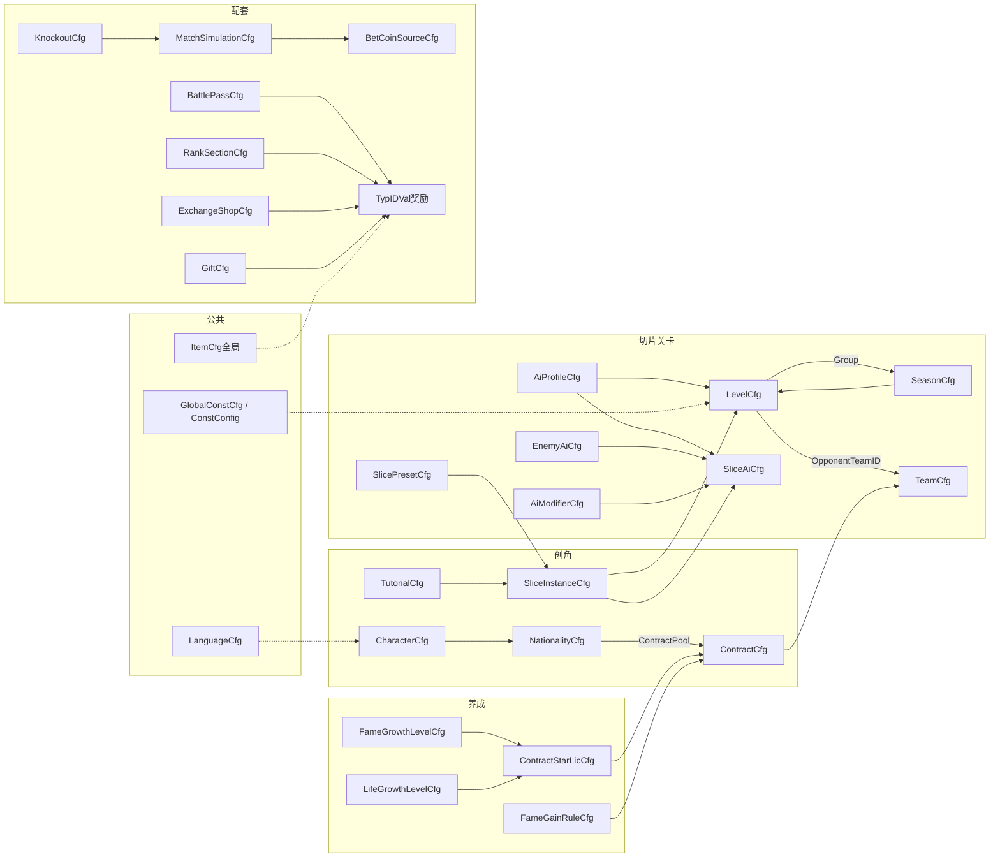

# 2026世界杯主题活动 · 配置表结构（数值策划填表）

> **定位**：仅描述数值/关卡/活动策划在 **`ActivitySoccer.xlsx`**（及 `ConstConfig_ActvSoccer.xlsx`、语言表）中**需要填写**的配置表字段。  
> **规则依据**：主策划案 `2026世界杯主题活动.md`。  
> **列级 SSOT**：以 `output/test-config/ActivitySoccer.xlsx` 页签表头为准；本文说明表用途与策划填表要点。

---

## 文档边界

### 本文档包含

- 活动玩法、关卡、养成、淘汰赛赛程、竞猜投放、BP/商店/礼包、排名段位等**可配数值与投放**。
- 全局常量（`ActvSoccerGlobalConstCfg` / `ConstConfig` 补丁）。

### 本文档不包含（由程序/服务端在开发阶段定义）

| 类型 | 示例 | 说明 |
|------|------|------|
| 玩家存档 | `player_profile`、`current_contract_id`、`tutorial_done` | 运行时持久化，不进策划表 |
| 局内/关卡运行时 | `slice_runtime`、`attempt_id`、`level_result` | 服务端/客户端内存态 |
| 联赛/排行运行时 | `league_progress`、`league_rank_entry` | 服务端计算与存储 |
| 淘汰赛运行时 | `knockout_team`、`knockout_match`、`qualifier_group_standing` | 组队/对阵/结果由服务生成 |
| 竞猜运行时 | `bet_record`、`bet_stats`、动态 `win_rate`/`display_mult` | 下注与派彩过程数据 |
| 程序只读枚举/类型 | `slice_type_def`（L1）、`operation_mode`、`player_ai_duty` 枚举值 | 程序定类型与判定函数；策划在 preset/instance 中引用类型名 |
| 复用外部只读表 | X1 `bet_multiplier_table` | 本活动只读引用，不在此活动表重复维护 |
| 接口/协议/DB | 字段名、proto、API | 技术派生文档 |

抽样/演算**算法**（如联赛换约权重、淘汰赛比分演算）写在主策划案规则节；本文只列**可调系数**所在配置表。

---

## 配置表概览

### 配置文件清单

| 文件 | 说明 | 策划维护 |
|------|------|----------|
| `ActivitySoccer.xlsx` | 活动玩法主配置（本概览下列页签） | 数值 / 关卡 / 活动 |
| `ActivitySoccerLanguage.xlsx` | 活动本地化 `ActvSoccerLanguageCfg` | 数值 + 本地化 |
| `ConstConfig_ActvSoccer.xlsx` | 活动常量补丁（可选合并进全局 `dataconfig/ConstConfig.xlsx`） | 数值 |
| `ActivitySoccer.xlsx` → `ActvSoccerGlobalConstCfg` | 与上表同源，便于活动自包含测试 | 数值 |

### 公共 / 外部依赖（非本活动 xlsx 内页签）

本活动**不重复定义**下列能力，仅在奖励字段、常量、文案中**引用**：

| 类型 | 典型表 / 机制 | 本活动用法 | 策划动作 |
|------|----------------|------------|----------|
| **全局常量** | `dataconfig/ConstConfig.xlsx` → `ConstConfigCfg` | 门票默认、夹角、换约份数等；可合并 `ConstConfig_ActvSoccer` 补丁 | 填 `ActvSoccerGlobalConstCfg` 或合并全局表 |
| **奖励结构** | `TypIDVal_P_cspb`（proto，非独立 xlsx） | BP / 排名 / 商店 / 礼包 / 合同 / 升级奖励等 `ext[]` 列 | 填 `typ`+`id`+`val`；`vm`=虚拟货币，`item`=道具 |
| **全局道具** | `dataconfig/ItemCfg`（或项目等价道具表） | 兑换商店、排名、BP 付费轨等 `{"typ":"item","id":…}` | **引用已有道具 ID**，不在活动表新建道具定义 |
| **活动内货币** | 本活动 `ActvSoccerCurrencyCfg` + 规则约定 | 金币 / 门票 / 竞猜币（`gold` / `ticket` / `bet_coin`） | 待遇、价格、消耗在本活动表填数值；`vm.id` 与项目资产 reason 对齐 |
| **本地化** | `ActvSoccerLanguageCfg` + 全局语言表（若项目统一） | 所有 `*LcKey` 字段 | 业务表只写 key，中文进语言表 |
| **竞猜赔率** | X1 `bet_multiplier_table`（只读） | 胜率→奖励倍率查表 | **不维护**；本活动只配 `BetCoinSourceCfg`、演算次数等 |
| **邮件补发** | 全局邮件 / 奖励发放模块（无活动专属配表） | 竞猜离线派彩兜底、排名发奖等 | 主案定规则；邮件模板与 reason 走项目公共配置 |
| **活动入口** | 项目活动框架表（如 ActivityCfg / 入口配置，依 K1 项目而定） | 限时开关、活动 ID、与主界面入口 | 本活动 xlsx **不含**入口表；联调时与 TGS/活动框架同事对齐 |
| **每日任务 → BP 活跃度** | 项目 DailyTask / Quest 表（若 BP 经验来自任务） | BP 升级来源 | 任务配置在公共任务表；`BattlePassCfg` 只配等级与奖励 |

**不在数值策划填表范围**（程序/运行时）：`SliceTypeDefCfg`、`PlayerAiDutyEnumCfg` 为程序只读枚举；`BetMatchCfg` 在测试 xlsx 中仅为联调样例，**正式对阵与赔率由服务端生成**。

### 活动专用表一览

| 页签 | 用途 | 主要关联 | 填表 |
|------|------|----------|------|
| `ActvSoccerCharacterCfg` | 4 角色外观与展示战力 | → 创角流程 | 数值 |
| `ActvSoccerNationalityCfg` | 国籍与首签候选合同池 | `ContractPool` → `ContractCfg.ID`；`NameLcKey` → Language | 数值 |
| `ActvSoccerTutorialCfg` | 试训三步与切片实例 | `SliceInstanceID` → `SliceInstanceCfg` | 关卡 |
| `ActvSoccerSlicePresetCfg` | 切片摆位预设（L2 主资产） | `SliceType`；被 `SliceInstanceCfg.PresetID` 引用 | 关卡 |
| `ActvSoccerSliceInstanceCfg` | 切片实例装配（L3） | ← Preset；→ `LevelCfg.SliceList`、`TutorialCfg` | 关卡 |
| `ActvSoccerInMatchItemCfg` | 局内道具（哨子/回溯/瞄准） | 被关卡携带与 `LifeGrowthLevel.FreeRewind` 联动 | 数值 |
| `ActvSoccerHapticCfg` | 震动事件强度/图案 | 全局事件映射，与切片类型无关 | 体验/数值 |
| `ActvSoccerLevelCfg` | 关卡：切片序列、胜平阈值、门票、对手 | `SliceList`→Instance；`AiProfileID`→Profile；`Group`→Season；`OpponentTeamID`→Team | 关卡+数值 |
| `ActvSoccerAiProfileCfg` | 关卡 AI 难度档 | ← `LevelCfg`；→ `SliceAiCfg` | 数值 |
| `ActvSoccerEnemyAiCfg` | 门将/后卫 AI 权重 | ← `SliceAiCfg`（GoalkeeperAi/DefenderAi/ShooterAi） | 数值 |
| `ActvSoccerSliceAiCfg` | 单切片 AI 绑定 | `SliceID`→Instance；引用 Profile / EnemyAi / Modifier | 关卡 |
| `ActvSoccerAiModifierCfg` | 切片机制（移动门将等） | ← `SliceAiCfg.ModifierID` | 关卡 |
| `ActvSoccerSliceFlowCfg` | 各切片类型 FSM 流程参数 | 按 `SliceType` 读取 | 关卡 |
| `ActvSoccerCharacterStateCfg` | FSM 状态→动画 key | `Duty` 与 AI 职责一致 | 关卡+美术 |
| `ActvSoccerCurrencyCfg` | 活动内货币类型说明 | 被待遇/价格/奖励 `vm.id` 间接引用 | 数值 |
| `ActvSoccerFameGrowthLevelCfg` | 知名度等级、许可、升级奖励 | `ContractStarLicReward`→`ContractStarLicCfg`；奖励 `TypIDVal` | 数值 |
| `ActvSoccerLifeGrowthLevelCfg` | 生活等级、门票 buff、许可 | 同上；`TicketCap/Recover` 与 GlobalConst 默认叠加 | 数值 |
| `ActvSoccerFameGainRuleCfg` | 比赛结果→知名度系数 | 读 `ContractCfg.TeamStar` 系数 | 数值 |
| `ActvSoccerTeamCfg` | 球队展示（队名/队服/队标） | ← `ContractCfg.TeamID`；← `LevelCfg.OpponentTeamID` | 数值+美术 |
| `ActvSoccerContractCfg` | 合同待遇、赛季目标、发放场景 | `TeamID`→Team；首签←Nationality；换约←StarLic | 数值 |
| `ActvSoccerContractStarLicCfg` | 联赛换约星级权重 | ← Growth 两线 `ContractStarLicReward`；→ Contract 池抽样 | 数值 |
| `ActvSoccerSeasonCfg` | 联赛轮次、`NextSeason` 链 | `ID` = `LevelCfg.Group`；小关卡由 Level 反查 | 数值 |
| `ActvSoccerKnockoutCfg` | 淘汰赛开放、人数、分组、补位分 | `OpenLeagueLevel`→Level；→ Phase / Simulation | 数值+活动 |
| `ActvSoccerKnockoutPhaseCfg` | 赛程阶段日期与当日时刻 | ← KnockoutCfg | 活动 |
| `ActvSoccerMatchSimulationCfg` | PVP 演算可调系数 | 淘汰赛/竞猜胜率输入 | 数值 |
| `ActvSoccerBetCoinSourceCfg` | 竞猜币每日免费、礼包投放 | → GiftCfg；与 `BetCoin` 消耗联动 | 数值 |
| `ActvSoccerBattlePassCfg` | BP 等级、双轨奖励 | `ExpRequired`←每日任务（公共表）；`TypIDVal` 奖励 | 数值 |
| `ActvSoccerExchangeShopCfg` | 竞猜币兑换 | `CostVal` 竞猜币；`Reward`→Item/vm | 数值 |
| `ActvSoccerGiftCfg` | 免费/付费礼包 | `Reward`→Item/vm；竞猜币来源 | 数值 |
| `ActvSoccerRankSectionCfg` | 四榜名次段位与奖励 | 数据源见主案（积分赛/竞猜）；`TypIDVal` | 数值 |
| `ActvSoccerGlobalConstCfg` | 玩法全局常量 | 被多表默认值引用；可对齐 `ConstConfigCfg` | 数值 |
| `ActvSoccerLanguageCfg` | 活动文案 | 被所有 `*LcKey` 引用 | 本地化 |

### 核心引用关系（简图）



### 典型引用链（策划填表时按链检查）

| 链路 | 路径 |
|------|------|
| 创角 → 首签 | `NationalityCfg.ContractPool` → `ContractCfg`（`GrantScene=first_sign`）→ `TeamCfg` |
| 试训 → 切片 | `TutorialCfg.SliceInstanceID` → `SliceInstanceCfg` →（可选）`SlicePresetCfg` |
| 关卡组装 | `LevelCfg.SliceList[]` → `SliceInstanceCfg`；`SliceAiCfg.SliceID` 对齐实例 |
| 联赛轮次 | `SeasonCfg.ID` = `LevelCfg.Group`；`NextSeason` 链；同 Group 计数得总轮次 |
| 联赛换约 | `Fame/LifeGrowth.ContractStarLicReward` → `ContractStarLicCfg` → 权重抽 `ContractCfg`（`league_finish`） |
| 待遇结算 | 进行中 `ContractCfg`（`TeamStar`、Pay*）← 比赛结果 → `FameGainRuleCfg` |
| 淘汰赛 → 竞猜 | `KnockoutPhaseCfg` 排期 → 服务端对阵；`MatchSimulationCfg` 系数 → 胜率 → X1 赔率表（只读） |
| 奖励发放 | 各表 `*Reward` / `TypIDVal` → 全局 `ItemCfg` 或活动 `vm` 货币 ID |

---

## 配置表总览（与 Excel 页签对应）

> 以下为快速索引；关联与公共依赖见上一节 **配置表概览**。

| 页签 | 策划填写内容概要 |
|------|------------------|
| `ActvSoccerCharacterCfg` | 4 角色外观与展示战力 |
| `ActvSoccerNationalityCfg` | 国籍与首签 `ContractPool` |
| `ActvSoccerTutorialCfg` | 试训步骤与切片实例 |
| `ActvSoccerSlicePresetCfg` | 切片摆位预设（L2，主资产） |
| `ActvSoccerSliceInstanceCfg` | 切片实例装配（L3） |
| `ActvSoccerInMatchItemCfg` | 局内道具（哨子/回溯/瞄准） |
| `ActvSoccerHapticCfg` | 震动事件强度/图案（体验向数值） |
| `ActvSoccerLevelCfg` | 关卡切片列表、胜平阈值、门票、对手展示 |
| `ActvSoccerAiProfileCfg` | 关卡 AI 难度档 |
| `ActvSoccerEnemyAiCfg` | 门将/后卫 AI 权重 |
| `ActvSoccerSliceAiCfg` | 单切片 AI 绑定 |
| `ActvSoccerAiModifierCfg` | 切片机制（移动门将等） |
| `ActvSoccerSliceFlowCfg` | 各切片类型 FSM 流程参数 |
| `ActvSoccerCharacterStateCfg` | 状态→动画 key 映射（与美术联调） |
| `ActvSoccerCurrencyCfg` | 货币类型说明（若独立页签） |
| `ActvSoccerFameGrowthLevelCfg` | 知名度等级曲线与许可奖励 |
| `ActvSoccerLifeGrowthLevelCfg` | 生活等级、门票 buff、许可奖励 |
| `ActvSoccerFameGainRuleCfg` | 胜负/进球/助攻→知名度系数 |
| `ActvSoccerTeamCfg` | 球队展示（队名/队服/队标） |
| `ActvSoccerContractCfg` | 合同待遇、赛季目标、发放场景 |
| `ActvSoccerContractStarLicCfg` | 联赛换约星级权重（2–5 星许可） |
| `ActvSoccerSeasonCfg` | 联赛轮次与 `NextSeason` 链 |
| `ActvSoccerKnockoutCfg` | 淘汰赛开放条件、人数、分组、补位评分等 |
| `ActvSoccerKnockoutPhaseCfg` | 赛程阶段日期与当日时刻 |
| `ActvSoccerMatchSimulationCfg` | 演算公式可调系数 |
| `ActvSoccerBetCoinSourceCfg` | 每日免费竞猜币、礼包投放量 |
| `ActvSoccerBattlePassCfg` | BP 等级与双轨奖励 |
| `ActvSoccerExchangeShopCfg` | 兑换商品、限购、刷新 |
| `ActvSoccerGiftCfg` | 礼包内容与限购 |
| `ActvSoccerRankSectionCfg` | 四榜名次段位与奖励 |
| `ActvSoccerGlobalConstCfg` | 玩法全局常量（门票、夹角、换约份数等） |
| `ActvSoccerLanguageCfg` | 本地化（`*LcKey` 引用，见语言表 skill） |

---

## 创角与引导

### ActvSoccerCharacterCfg

| 字段 | 类型 | 说明 |
|------|------|------|
| ID | int | 角色 ID，1–4 |
| AppearanceKey | string | 外观资源 |
| DisplayPower | int | 展示战力（仅表现，TODO 数值） |

### ActvSoccerNationalityCfg

| 字段 | 类型 | 说明 |
|------|------|------|
| ID | int | 国籍 ID |
| NameLcKey | string | 国籍名称 → 语言表 |
| Region | string | 地区（首签球队池） |
| ContractPool | int[] | 首签 3 个 contract_id：1 默认 + 2 地区 |

### ActvSoccerTutorialCfg

| 字段 | 类型 | 说明 |
|------|------|------|
| ID | int | 步骤序号 1–3 |
| SliceInstanceID | int | 引用试训切片实例 |
| SliceType | enum | attack / free_kick / penalty |
| DescLcKey | string | 教学文案 → 语言表 |

---

## 切片与关卡

### 三层配置关系（策划填 L2/L3）

```
L1 slice_type（程序只读，不在此文档展开）
L2 ActvSoccerSlicePresetCfg   ← 摆位预设，90% 关卡引用
L3 ActvSoccerSliceInstanceCfg ← preset + override + 目标 + 机制
```

**叠加优先级**：`preset → instance.override → ai_profile → slice_ai.modifier`

### ActvSoccerSlicePresetCfg（核心字段）

| 字段 | 类型 | 说明 |
|------|------|------|
| ID | int | 预设 ID |
| SliceType | enum | 切片类型 |
| NameLcKey | string | 预设名 |
| BallPos / BallVector | ext | 球位置与向量 |
| BallOwner | int | 控球球员 idx |
| PlayersInit | ext[] | 站位与 duty（我方=前锋3，对方门将1/后卫2） |
| OperableAngle / AngleSpanMin / AngleSpanMax 等 | float | 可操作夹角（未定可走 GlobalConst） |
| TypePayload | ext | 类型差异参数（门将权重、反应时间等） |

### ActvSoccerSliceInstanceCfg

| 字段 | 类型 | 说明 |
|------|------|------|
| ID | int | 实例 ID |
| SliceType | enum | 类型 |
| PresetID | int | 引用预设，可空 |
| OverrideOperableAngle 等 | 拆列/ext | 覆盖 preset |
| TypePayload / ExtraObjectives / Modifiers | ext/ext[] | 目标与机制 |

### ActvSoccerInMatchItemCfg

| 字段 | 类型 | 说明 |
|------|------|------|
| ID | int | whistle / rewind / aim |
| DefaultActive | bool | 是否默认生效 |
| FreeCount | int | 回溯免费次数（TODO 数值） |

### ActvSoccerHapticCfg

| 字段 | 类型 | 说明 |
|------|------|------|
| ID | int | 事件 ID |
| Intensity | enum | light / medium / heavy |
| Pattern | enum | tick / double / continuous |
| DurationMs / MinIntervalMs | int | 连续震动与节流（TODO） |

### ActvSoccerLevelCfg

| 字段 | 类型 | 说明 |
|------|------|------|
| ID | int | 关卡 ID |
| IsTutorial | bool | 是否引导关 |
| SliceList | int[] | 切片实例 ID 序列 |
| AiProfileID | int | 难度档 |
| WinThreshold / DrawThreshold | int | 胜/平所需切片胜场 |
| TicketCost | int | 进入门票（TODO） |
| OpponentTeamID | int | 对手展示 → TeamCfg |
| OpponentTeamStar | int | 对手星级（数值用，非 TeamCfg） |
| Group | int | 所属联赛轮次 → SeasonCfg.ID |

### FSM / AI 相关（关卡策划 + 数值联填）

**ActvSoccerAiProfileCfg**：`GoalkeeperSaveRate`、`DefenderSuccessRate`、`ShooterSuccessRate`、`ReactionTimeMs` 等（`DeadCornerCanSave` 固定 0，见常量）。

**ActvSoccerEnemyAiCfg**：按 `Duty` 填扑救/拦截权重与 `AnimationKey`。

**ActvSoccerSliceAiCfg**：`SliceID` 绑定实例；引用 Profile、EnemyAi、Modifier；`IsGuideAi`、`RewindRandom`、`OverrideReactionTimeMs`。

**ActvSoccerAiModifierCfg**：moving_keeper、no_aim_line、fixed_wall 等 params。

**ActvSoccerSliceFlowCfg**：各 `SliceType` 的 `WaitInputTimeMs`、`EnableRewind`、`NeedReplayClick` 等。

**ActvSoccerCharacterStateCfg**：`StateKey` + `Duty` → `AnimKey`（与美术动作资源对齐）。

---

## 养成与合同

### ActvSoccerFameGrowthLevelCfg / ActvSoccerLifeGrowthLevelCfg

| 共通字段 | 说明 |
|----------|------|
| Level / ExpRequired | 升级门槛 |
| ContractStarLicReward | 到达等级获得的许可 ID（0=无） |
| TitleLcKey | 称号 |
| LevelUpReward / LevelUpEffect | 升级奖励与效果（ext，TODO 数值） |

**Life 专属**：`RewardFame`、`TicketCap`、`TicketRecoverMin`、`FreeRewind`、`ExtraRound`。

### ActvSoccerFameGainRuleCfg

| 字段 | 说明 |
|------|------|
| FromOutcome / FromGoal / FromAssist | 胜平负/进球/助攻知名度（TODO） |
| TeamStarFactor | 合同星级系数 |

### ActvSoccerContractCfg（读取端 cs）

| 字段 | 说明 |
|------|------|
| ID | contract_id |
| TeamID | → TeamCfg 展示 |
| TeamStar | 合同星级（唯一星级来源） |
| PayFinish / PayGoal / PayAssist | 待遇（TODO） |
| SeasonGoal / SeasonReward | ext |
| GrantFameLevel / GrantLifeLevel | 进入换约池门槛 |
| GrantScene | first_sign / league_finish |

### ActvSoccerContractStarLicCfg

| 字段 | 说明 |
|------|------|
| ID | license_id，2–5 |
| AllowedTeamStars | int[] |
| StarWeights | int[]，与 AllowedTeamStars 等长 |

### ActvSoccerTeamCfg（纯展示）

| 字段 | 说明 |
|------|------|
| ID | team_id |
| NameLcKey / KitKey / BadgeKey | 展示资源 |
| Region | 地区 |

---

## 积分赛

### ActvSoccerSeasonCfg

| 字段 | 说明 |
|------|------|
| ID | season_id，= LevelCfg.Group |
| LeagueNameLcKey | 联赛名 |
| Group | 联赛系列；总轮次 = count(同 Group) |
| NextSeason | 后置轮次，0=结束 |
| ContractOfferCount | 换约候选份数，0=读 GlobalConst |

小关卡列表由程序查 `LevelCfg.Group == Season.ID` 按 Level.ID 排序，**不在 Season 表枚举**。

---

## 淘汰赛与演算

### ActvSoccerKnockoutCfg

| 字段 | 说明 |
|------|------|
| OpenLeagueLevel | 开放所需积分赛关卡 L（TODO） |
| TeamSizeMax | 队伍人数上限 M |
| QualifierGroupCount | 海选分组 G（16–32） |
| QualifyPerGroup | 每组晋级 K=64/G |
| BotPlayerRating | 系统补位固定评分（TODO） |

### ActvSoccerKnockoutPhaseCfg

各阶段日期、`DailyPrepOpen` / `DailyBetOpen` / `DailySettleTime` 等（TODO 排期）。

### ActvSoccerMatchSimulationCfg

演算可调系数（切片数函数、评分公式权重等，TODO 数值）；**算法口径见主案淘汰赛规则**。

---

## 竞猜与配套

### ActvSoccerBetCoinSourceCfg

| 字段 | 说明 |
|------|------|
| DailyFree | 每日免费领取竞猜币（TODO） |
| GiftGrant | 礼包额外投放（TODO） |

赔率公式常量在 GlobalConst 或 X1 只读表；`SimCount`、购买上限等走 GlobalConst。

### ActvSoccerRankSectionCfg

四榜（积分/进球/竞猜命中/竞猜收益）名次段位与奖励（TODO）。

### ActvSoccerBattlePassCfg

等级、活跃度需求、免费轨/付费轨奖励（ext）。

### ActvSoccerExchangeShopCfg

商品、竞猜币价格、限购、刷新周期。

### ActvSoccerGiftCfg

免费/付费礼包内容、价格、限购、限时窗口。

---

## 全局常量 ActvSoccerGlobalConstCfg

与 `ConstConfig_ActvSoccer.xlsx` 字段对齐，示例 key（完整见 `test-config-summary.json` → `const_keys`）：

| ConstKey | 说明 |
|----------|------|
| ActvSoccer_ticket_cap_default | 门票上限 |
| ActvSoccer_ticket_recover_minutes | 恢复间隔（分钟） |
| ActvSoccer_knockout_open_level | 淘汰赛开放关卡 |
| ActvSoccer_operable_angle_span_min/max | 可操作夹角默认 |
| ActvSoccer_contract_offer_count | 换约候选份数 |
| ActvSoccer_dead_corner_can_save | 死角不可扑（固定 0） |

---

## 数值策划 TODO 清单（待填项汇总）

摘自原开发 Checklist §4.2，**仅列需进表的数值**：

- 门票上限/恢复/各关 TicketCost；生活等级 buff 对门票的影响列
- 两条养成线等级曲线、LevelUpReward、ContractStarLicReward
- FameGainRule 各系数 + TeamStarFactor
- Contract 待遇、SeasonGoal 阈值、Grant 门槛
- ContractStarLic 各档 StarWeights
- Knockout 开放关卡、人数、分组、阶段时刻、BotPlayerRating
- MatchSimulation 演算系数
- BetCoinSource 每日免费/购买上限/SimCount
- RankSection 段位划分与奖励
- BP / 商店 / 礼包各档数值

---

## 测试配置与正式表

- 测试生成脚本：`output/test-config/generate_activity_soccer_test_config.py`
- 汇总索引：`output/test-config/test-config-summary.json`
- 合并正式 `dataconfig/` 前见 **config-table-editor** skill
