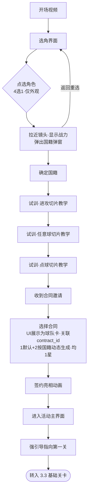
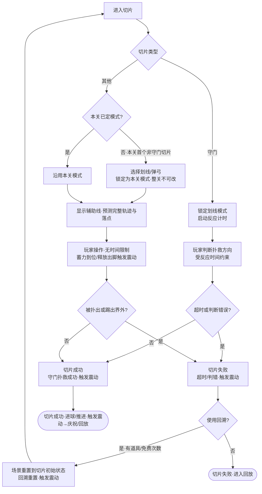
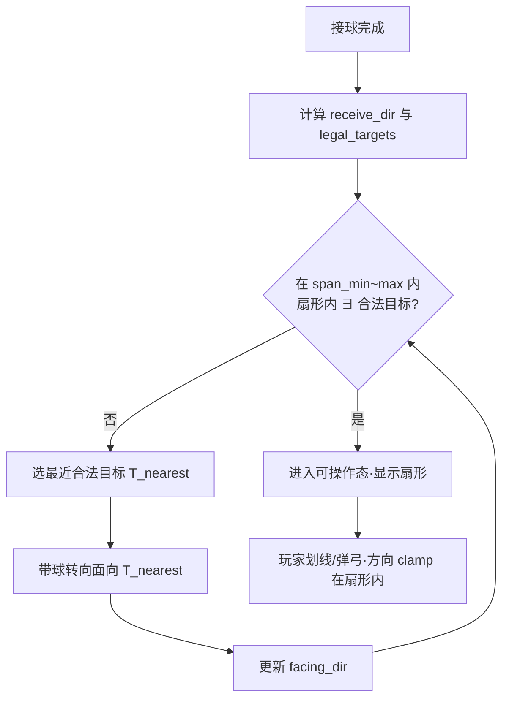
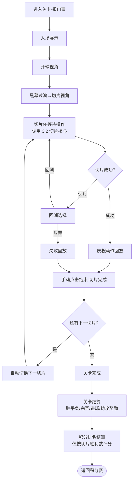
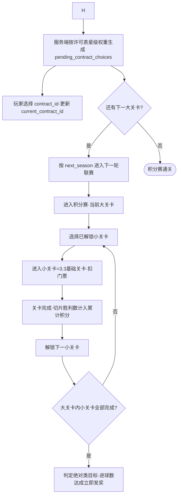
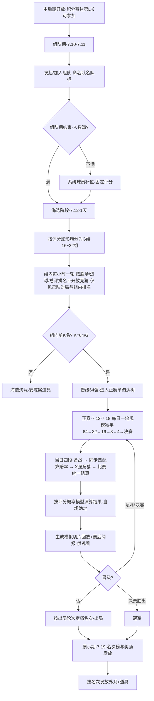
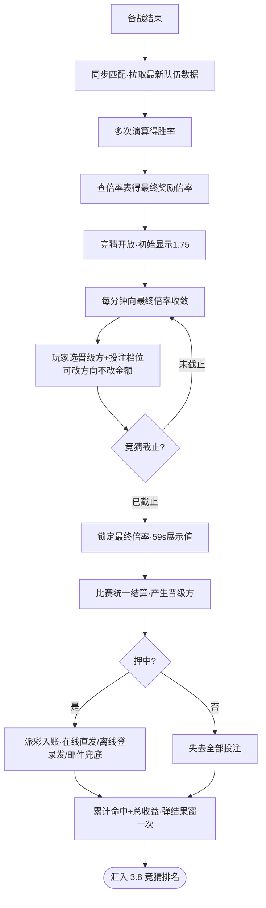

# 变更记录

| 版本 | 变更类型 | 变更内容 | 经办人 | 时间 |
|------|----------|----------|--------|------|
| v1.1 | 派生 | 界面原型从开发文档拆出至 `-界面标注.md`；主案 E 节仅保留子界面清单指针 | — | 2026-06-15 |
| v1.0 | 迁移 | 自 MindToDoc 开发文档迁移为 system-design-doc 单功能策划案 | — | 2026-06-15 |
| v0.9 | 修订 | 养成双线许可奖励 OR 生效等业务规则更新 | — | 2026-06-11 |

# 简介

## 设计目的

世界杯期间在主游戏内上线限时主题活动，以「足球切片小游戏 + 球星生涯养成 + 配套活动」三层结构，借赛事热点提升活跃与付费，并验证划线/弹弓两种操作模式。

## 功能简述

- **创角与引导**：选角、国籍、试训、首签，一次性完成进入活动。
- **切片操作**：6 类切片核心操作引擎，被所有关卡调用。
- **关卡与积分赛**：切片组关、门票、联赛轮次、积分排名。
- **球星养成**：知名度/生活双线、合同与联赛换约。
- **淘汰赛与竞猜**：中后期 PVP 演算 + X1 复用竞猜。
- **配套活动**：排名四榜、BP、兑换商店、礼包。

## 目标与对标

- **目标平台**：移动端（iOS / Android，竖屏单手操作），主游戏内限时活动模块。
- **参考对标**：足球生涯养成 + 切片式休闲操作；竞猜复用 X1「冠军比赛（带竞猜）」及二期优化，胜率改为本活动淘汰赛演算模型。

# 关键决策

| 维度 | 决策 | 关键约束/备注 |
|------|------|----------------|
| 文档粒度 | 整活动为一个功能策划案 | 内部模块为详细规则子章节，不拆独立文档 |
| 合同 vs 球队 | 合同为生效实体，球队纯展示 | `current_contract_id` 驱动数值 |
| 操作模式 | 试训可逐切片切换；正式关首切片锁定整关 | 守门强制划线 |
| 积分规则 | 按切片胜利数累计 | 非胜3平1负0 |
| 联赛换约 | 每轮联赛完成必然换约 | 许可权重抽样 |
| 竞猜 | 复用 X1 | 胜率来自淘汰赛演算 |
| 配置表结构 | 主案不写完整字段表 | 仅数值策划填写的 Excel 表见 `2026世界杯主题活动-配置表结构.md`；运行时/存档/协议结构由程序定义 |

# 详细规则

## 全局玩法机制

- **玩法循环**：创角签约（选择 `contract_id`，UI 展示为球队卡）→ 进入积分赛关卡 → 消耗门票 → 逐切片手动操作（划线/弹弓）→ 切片成功/失败（失败可回溯）→ 关卡结算（胜平负/进球/助攻奖励）→ 积分排名 → 养成提升（知名度/生活）→ 解锁更高星级合同 → 中后期开放淘汰赛与竞猜 → 配套活动（排名/BP/商店）消耗产出。
- **全局规则**： 
    - 切片是最小操作单元；关卡由多切片组成；胜平负由关卡配置（通常按进球数/切片数比例）判定。
    - 积分赛单次消耗**门票**，门票有上限与恢复速度（受生活等级 buff 影响）。
    - 操作模式（划线/弹弓）两种均需开发。**正式关卡：首个非守门切片选定模式后，整关锁定不可更改；守门切片强制划线，不占用也不改变锁定**。**试训为唯一例外，每个切片可自主切换以触发对应教学**。失败回溯后沿用本关已锁定模式。
    - 局内道具：哨子（\+1 非守门切片，默认生效）、回溯（切片失败重来，有免费次数）、瞄准/辅助线（默认生效）。
    - 积分排名规则与真实足球不同：仅按切片胜利数量计分，非胜3平1负0。
- **数值框架**：门票、养成曲线、合同待遇、AI 档位、演算系数等均为**配置表驱动**；竞猜赔率公式与倍率表复用 X1 定稿。具体字段与 TODO 见 **`2026世界杯主题活动-配置表结构.md`**（仅含数值策划填写的 Excel 表，不含玩家存档/运行时结构）。


## 数据兼容总则

| 条目 | 约定 |
|------|------|
| 客户端版本 | 活动入口与存档字段向前兼容；缺字段按安全默认 |
| 转服 | 活动存档随账号迁移；进行中 attempt 作废不续局 |
| 热更/活动窗口 | 不重置已完成创角与已领奖励 |
| 幂等 | 关卡 attempt_id 发奖幂等；竞猜截止后不可改 |

## 创角与新手引导

首次进入活动的一次性流程，结束后进入活动主界面。
- **开场视频：**timeline或者视频，展示球星经典射门（参考游戏是C罗世界杯任意球）
- **选角**：固定 **4 个角色，仅外观差异、无数值差异**，后续可修改。选角界面点选角色 → 拉近镜头 → 显示战力 → 弹出**国籍选择**弹窗，可随时返回重选。
- **国籍**：仅影响**首次签约时系统提供的合同选项**（决定候选合同所属地区/展示球队），不影响角色属性、外观或其他系统。
- **试训**：固定包含**进攻、任意球、点球**三类切片教学，**顺序执行**。试训是操作模式锁定规则的**唯一例外**——每个切片玩家可自主切换划线/弹弓两种操作模式，并触发对应模式的教学（操作细节见 [切片操作核心]）。
- **首次签约**：试训完成后收到合同邀请，进入**选择球队**界面（UI 以球队卡片呈现，**逻辑上玩家选择的是 `contract_id`**）。默认提供 **1 份 1 星合同**，并按国籍**动态生成 2 份对应地区合同**；三者**仅关联展示球队的名字/队服/队标不同**，合同星级同为 1 星、待遇一致。确认签约后写入 `current_contract_id`；展示用球队信息通过 `contract.team_id` → `team_config` 反查。小游戏不要求输入名字，默认用玩家名。
- **签约亮相**：确认签约后展示亮相动画（独立模块「签约亮相」并入此处），进入活动主界面，强引导指向第一关。
    - 第一关还有一个队友游标和滑动视角的教学
    - 第一关本身的新手引导归属 [基础关卡]（未通关重进会重复触发），签约亮相这段仅负责到"进入主界面 \+ 强引导指向第一关"。

### 流程图



### 配置表说明

见 **`2026世界杯主题活动-配置表结构.md` · 创角与新手引导**。


## 切片操作核心

单次足球操作的核心引擎，被所有关卡切片调用。
- **操作模式**： 
    - **划线**：忽略力度和高度，玩家确定落点和弧度，系统做自动轨迹修正。
    - **弹弓**：忽略高度和弧度，玩家确定方向和力度。
    - **守门切片只能用划线**（强制，不触发锁定、也不受锁定影响）；其余切片（进攻/任意球/点球/角球/界外球）的模式由**本关第一个非守门切片选定后锁定整关**，关卡内不可更改，失败回溯后仍沿用锁定模式。
    - **唯一例外是试训**（\[3.1\]）：试训每个切片可单独切换模式，不锁定，用于教学两种操作。
- **6 类切片核心参数**（见数据表）：进攻、任意球、点球、角球、界外球、守门。
- **球员职责**：摆位 `players_init` 中每个球员须配置 `duty`（见 `player_ai_duty`）；我方一律前锋，对方分门将/后卫两档。职责用于 AI 行为匹配、动画状态查找与合法目标筛选（对方球员不算合法传球目标）。
- **成功/失败判定**： 
    - 非守门切片：玩家操作结果（落点/方向/力度）与切片参数（门将权重、可操作夹角等）做命中计算。**失败 = 被门将扑出，或被对方球员出球并踢出界外**；否则进球/推进视为成功。
    - 守门切片：有**反应时间**，**超时失败**；判断扑救方向错误失败。
- **瞄准辅助线**：默认生效。划线与弹弓两种模式下，辅助线均**准确标出足球完整运行轨迹与落点**。
- **操作夹角约束**（非守门切片）： 
    - **总则**：进入可操作态前，系统生成可操作夹角扇形 `[θ_min, θ_max]`（水平面，以控球球员为顶点）。扇形**以接球方向为锚**，宽度在 `angle_span_min` ~ `angle_span_max` 内调整；玩家划线/弹弓方向超出扇形时** clamp 到边界**（或修正为最近合法方向，二选一，MVP 建议 clamp）。 
    - **合法目标**：本切片内可作为出脚方向的**合法目标**包括——**球门**（有效得分区中心或配置 scoring 点）、**我方其他球员**（`players_init` 中同队且非当前控球者，瞄准点为其脚下或跑位点）。对方球员、场外点、纯 UI 装饰箭头**不算**合法目标。 
    - **覆盖判定**：扇形内须**至少存在一个合法目标**（不要求包含全部合法目标，也不要求必须对准当前 objective 的指定点）。多个合法目标时，只要**任意一个**落在扇形内即满足进入可操作态的前置条件。 
    - **接球方向 `receive_dir`**：上一脚为队友传球时 = 传球者→接球者水平方向；否则取 `ball_vector` 或控球球员初始 `facing`。 
    - **扇形生成**：以 `receive_dir` 为初始中心，在 `[receive_dir ± angle_max_center_shift]` 内搜索中心角 `θ_center`；对每个候选中心取满足「扇形内 ∃ 合法目标」的**最小** span，再 clamp 到 `[angle_span_min, angle_span_max]`；若有多个可行解，取 span **最小**者（难度最高）。 
    - **带球调整 `dribble_realign`**：若在 `span = angle_span_max` 且中心已扫完允许偏移范围后，扇形内仍**不存在任何合法目标**，则**不进入可操作态**，自动执行带球：控球球员转向**最近的合法目标**（`argmin |angle_diff(t, facing_dir)|`），更新 `facing_dir` 后**重新生成扇形**；重复直至扇形内存在合法目标，再进入可操作态。**带球调整无次数上限**；调整期间不可操作，与等待操作同样暂停计时；不改变 objective、不额外消耗切片。 
    - **与 objective 的关系**：扇形覆盖保证「有路可走」（射或传至少一个方向在扇形内）；切片**成功/失败**仍由当前 `objectives` 独立判定（如 `pass_to` 必须传给指定队友、`score` 必须进球）。 
    - **回溯**：回溯重置后，面向、扇形与 `realign_count` 一并回到切片 `players_init` 初始状态。 
    - **守门切片**：不适用本规则（守门为方向判断，无操作夹角扇形）。
- **操作时间**：仅守门切片有反应时间限制；其余切片等待操作时**纯暂停、无时间限制**。
- **局内道具**： 
    - **哨子**：增加 1 次非守门切片，默认生效。
    - **回溯**：切片失败时可选使用，**将场景重置到该切片最初状态**（足球与所有球员位置从配置初始位置重新加载）；有免费次数，携带道具时优先用免费次数。
    - **瞄准**：提供辅助线，默认生效。
- **震动反馈（手机震动模块）**： 
    - **覆盖范围**：仅在**关键结果**与**核心操作**两类离散事件触发，操作等待过程（蓄力拖动、划线绘制中）**不持续震动**，与「等待操作纯暂停、无时间限制」规则不冲突。 
        - 核心操作事件（本系统产生）：**蓄力到位/落点锁定**、**释放出脚**。 
        - 关键结果事件：**切片成功（进球/推进）**、**被门将扑出**、**踢出界外**、**守门超时失败**、**守门判断错误**、**守门扑救成功**、**击中门框**、**回溯重置**。 
    - **分级与图案**：震动由**强度档（轻/中/重 `light/medium/heavy`）× 图案（短促/双击/连续 `tick/double/continuous`）** 两个维度组合表达，不同事件映射不同组合（见数据表 `haptic_config`）；例如进球=重+双击、被扑出=中+短促、回溯重置=轻+连续。 
    - **全局开关**：设置内提供「震动」总开关，**新玩家默认开启**，玩家选择写入 `player_profile.haptic_enabled` 持久化；关闭时所有事件**静默跳过**，不影响任何切片判定。 
    - **配置归属**：震动配置独立于切片三层摆位（`slice_type_def/preset/instance`），统一挂在**全局事件→震动映射表** `haptic_config`，按事件类型生效，策划改一处即全局生效，与切片摆位解耦。 
    - **平台与降级（不阻塞主逻辑）**：iOS 用 Core Haptics / `UIFeedbackGenerator`（`light/medium/heavy` 与 success/warning/error），Android 用 `VibrationEffect`(API 26+) 预定义效果（`EFFECT_TICK/CLICK/HEAVY_CLICK/DOUBLE_CLICK`）与 waveform；**无马达或不支持振幅控制的设备**退化为固定时长震动或静默；震动调用失败仅记录、**不阻断切片流程**；连续触发（如失败连点回溯）需做**最小间隔节流**，避免马达过热。
- **关系**：被 [基础关卡] 的每个切片调用；道具携带与库存见 [球星养成] 与局外道具系统；震动开关读 \[3.1\] `player_profile`，事件映射全局复用（淘汰赛回放等其他系统亦可引用 `haptic_config`）。

### 流程图



**操作夹角与带球调整流程**（非守门切片，进入可操作态前）：



### 配置表说明

见 **`2026世界杯主题活动-配置表结构.md` · 切片操作核心**。


## 基础关卡

关卡是切片的容器，定义胜负判定、流程编排与结算。被 [积分赛] 作为轮次内容调用。
- **关卡结构**：一个关卡由多个切片组成（切片类型见 \[3.2\]）。**胜平负由每个关卡单独配置**（通常按进球数/切片数比例，如 2/3 胜、1/3 平、0 球负——仅为示例，逐关配置）。
- **门票消耗与进度（MVP 规则，已定）**： 
    - **进入关卡即扣门票**（开始扣，失败也已扣，不在结算时扣）。
    - **中途退出不保存切片进度**：重进 = 重新进入、再次扣门票、从第一个切片重来。
    - **奖励幂等**：每次进入生成 `attempt_id`，结算奖励按 `attempt_id` 入账且**同一 attempt 只发一次**；重复进入是新 attempt、可再次正常结算（不存在"重复领同一份奖励"）。
    - **断线 / 杀进程 / 后台超时**：未走到结算的 attempt 一律**作废**（门票不退、不发奖），重进按新 attempt 处理；不做断线续局。
- **关卡 AI**：预设多套 AI，作为**关卡级难度档位**，作用到该关各切片的权重参数（门将权重、跑位模板等），控制难度与体验。
- **助攻机制**：玩家扮演球星，场上有系统队友。当**主角传球给队友、队友射门成功**，计为主角助攻（对应"传球给队友"类切片成功）。
- **关卡流程**：入场展示 → 开球视角 → 切片视角（切换均用黑幕过渡）→ 进入第一个切片停留等待操作 → 每切片成功/失败后进入**回放**：成功=庆祝动作展示，失败=回溯选择（消耗道具/免费次数或放弃，见 \[3.2\]）→ 回放需**手动点击结束**视为该切片完成 → 自动切下一切片 → 所有切片完成=关卡完成 → 依次弹出**关卡结算**与**积分排名结算**。→ 如果联赛所有关卡都完成，回到关卡界面后需要衔接联赛关卡推进至下一关的流程
- **关卡结算**：胜平负结果、完赛奖励、进球数奖励、助攻数奖励。
- **排名结算**：与真实足球

积分规则（胜3平1负0）不同，**仅按切片胜利数量算积分**。
- **引导关**：第一关为**固定脚本**引导关；未通关时重进会重复触发引导（S1 创角只负责引导指向第一关，引导关本身属本系统）。
- **关卡道具**：允许携带哨子/回溯/瞄准进入关卡（局内行为见 \[3.2\]）。

### 流程图



### 配置表说明

见 **`2026世界杯主题活动-配置表结构.md` · 基础关卡**。


## 球星养成

#### 球队与合同关系（全局约定）

**合同是唯一生效实体；球队仅为展示配置。**

| 维度 | 合同 `contract` | 球队 `team_config` |
|------|----------------|-------------------|
| 职责 | 星级、待遇、赛季目标、发放门槛等**全部玩法数值** | 队名、队服、队标、地区等**对外展示信息** |
| 玩家存档 | `player_profile.current_contract_id` 指向当前生效合同 | 不直接引用；通过 `contract.team_id` 反查 |
| 首签/换约 | 玩家选择或系统发放时关联 **`contract_id`** | 仅用于渲染球队卡片、战前对阵我方队名/队服 |
| 知名度系数 | `contract.team_star` 参与 `fame_gain_rule` 计算 | 不参与任何数值计算 |

**数据链路**：`current_contract_id` → `contract`（取 `team_star`、待遇、赛季目标）→ `contract.team_id` → `team_config`（取队名/队服/队标/地区用于 UI）。

> 关卡**对手**球队（`level_config.opponent_team_id` / `opponent_team_star`）与玩家合同体系**独立**：对手仅用于 PVE 对阵展示与 AI 难度，不走玩家 `current_contract_id`。

#### 规则与逻辑

主角球星的成长核心，由三条等级线和合同体系构成，连接关卡产出与合同升档。
- **知名度等级**： 
    - 来源：每场比赛的**胜负 \+ 进球 \+ 助攻数据，并结合当前生效合同的 `team_star`** 共同决定获得量；此外**提升生活等级时一次性获得**知名度。
    - 升级效果：
        - 一次性资源奖励 
        - **合同星级许可奖励**（见 `fame_growth_level.contract_star_license_reward`）
        - **主角评分**（见 `fame_growth_level.player_rating`；**仅知名度线投放**，生活等级不参与；知名度档位可拆得更细）
- **生活等级**： 
    - 来源：直接花费**金币**提升。
    - 升级效果：
        - 获得全局 buff —— 门票恢复速度、门票上限、免费回溯次数、比赛额外奖励
        - 一次性获得知名度
        - **合同星级许可奖励**（见 `life_growth_level.contract_star_license_reward`）
- **合同体系**： 
    - **生效原则**：玩家身上始终持有 `current_contract_id`；所有待遇结算、赛季目标追踪、知名度星级系数均读取该合同配置，**不直接读取 `team_config`**。
    - **发放场景分两类**：
        - **首签**（\[3.1\]）：候选列表**固定**，由 `nationality_config.contract_pool` 直接给出 3 个 `contract_id`，玩家择一签约。
        - **联赛完成换约**（\[3.5\]）：候选列表**非固定**，由**服务端**读取玩家当前养成进度，从配置池中**按权重抽样**生成若干份可选合同（默认 3 份），玩家择一后更新 `current_contract_id`。
    - **养成决定许可档位（双线 OR 生效）**：知名度、生活两条养成线**各自独立配置表**（`fame_growth_level` / `life_growth_level`），配置 `contract_star_license_reward`（到达该等级时获得的许可 ID，0=无）。玩家当前生效许可：
        - `fame_lic = fame_growth_level[当前知名度等级].contract_star_license_reward`
        - `life_lic = life_growth_level[当前生活等级].contract_star_license_reward`
        - `effective_license_id = max(fame_lic, life_lic)` —— **两边任意一条线达成对应等级即可**，取较高许可生效（例：知名度 5 级给 3 星许可，或生活 4 级给 3 星许可，只达成其一即按 3 星许可抽样）。
        - `effective_license_id < 2` 时联赛换约**仅可出现 1 星合同**；`≥ 2` 时取 `contract_star_license[effective_license_id]` 按星级权重抽样。
    - **权重抽样（两阶段）**：
        1. **定星级**：读取许可行 `allowed_team_stars` 与 `star_weights`（等长数组，按下标一一对应；如 3 星许可允许 \[1,2,3\] 星，权重 \[10,30,60\]）。在 `team_star ≤ effective_license_id` 且该星级在合格合同池中非空的档位上，按权重加权随机出目标星级。
        2. **定合同**：在 `grant_scene=league_finish`、目标星级、`grant_level_req` 均满足的合同中**均匀随机**抽取 1 条（同星级多合同等概率）。
        3. 重复 1–2 共 `contract_offer_count` 次（默认 3，**不放回**；某星级无可用合同时跳过该次重抽星级）。**同一玩家每次联赛完成的候选列表可不同**。
    - 合同内容：`team_id`（关联展示球队）、`team_star`、待遇（完赛/进球/助攻奖励）、赛季目标（排名达标、进球数）、赛季目标奖励、`grant_scene`。
- **成就体系**：
    - 统计类型：禁区内进球、远射进球、头球进球、任意球进球、点球进球、助攻数
    - 数据展示：场均进球、射门成功率、任意球成功率、点球成功率、最远进球距离、击中门框次数、最高连胜、最高连续进球场次
- **货币体系（全局定义，跨系统引用）**： 
    - **金币**：养成货币，用于提升生活等级。
    - **门票**：用于参加积分赛。
    - **竞猜币**：用于参与竞猜和兑换商店。

### 流程图

```mermaid
flowchart TD
    A[比赛结算<br/>胜负/进球/助攻] --> N[知名度]
    D[花费金币] --> L[生活等级]
    N -->|升级| E[获得合同星级许可奖励]
    L -->|升级| G[获得合同星级许可奖励]
    H[大关卡/联赛完成] --> I{effective_license_id<br/>=max(知名度许可,生活许可)}
    E --> I
    G --> I
    L --> |升级|M[全局buff:门票恢复/上限/免费回溯/比赛奖励]
    I --> L2{effective_license≥2?}
    L2 -->|否| J1[仅1星合同池]
    L2 -->|是| L3[查 contract_star_license<br/>ID=effective_license_id]
    L3 --> W1[按许可 star_weights 抽目标星级]
    J1 --> W2[均匀抽具体 contract_id]
    W1 --> W2
    W2 --> W[生成 pending_contract_choices]
    W --> P[玩家选择 contract_id]
    P --> K([更新 current_contract_id<br/>星级/待遇/赛季目标生效])
```

### 配置表说明

见 **`2026世界杯主题活动-配置表结构.md` · 球星养成**。


## 积分赛

活动主线 PVE 玩法，由基础关卡组织成联赛结构，是养成与合同的主驱动。
- **结构**：配置分 **联赛轮次表** `season_config` 与 **关卡表** `level_config`，通过 `group` 关联。 
    - 1 条 `season_config` = **1 轮联赛（大关卡）**；该轮小关卡 = 所有 `level_config.group == season_id` 的关卡，按 `level_id` 升序通关。
    - 打完该轮全部小关卡 = 完成一轮联赛，**必然触发换约**（无需配置开关）。
- **联赛系列与总轮次**：`season_config.group` 标识联赛系列（如地区预选赛）；**总轮次 = 程序统计 `group` 相同的赛季配置条数**（如 32 条则 UI 显示第 X/32 轮），不再配置 `total_rounds`。
- **轮次推进**：`season_config.next_season` 指向**后置联赛**（完成当前轮后进入的 `season_id`，0=系列结束）；首赛季由程序取同 `group` 中 `season_id` 最小且可达的一条。
- **解锁**：小关卡**顺序解锁**（同 `group` 内按 `level_id` 升序，通关上一个才解锁下一个）；轮次按 `next_season` 链推进。
- **积分与排名**： 
    - 积分 = **所有小关卡切片胜利数的累计**。
    - 排名 = **所有玩家积分横向排名**，关卡结算时展示的同联赛大关卡内的排名，外部排行榜是统计全局排名
- **合同换约**：每完成一个大关卡（联赛轮次）触发一次换约流程——服务端按 \[3.4\] 养成进度查 `contract_star_license`，**按星级权重 + 合同均匀随机**动态生成 `pending_contract_choices`（默认 3 份），玩家择一后更新 `current_contract_id`；候选星级分布与具体列表均随养成变化，**非固定配置表**。
- **赛季目标结算）**： 
    - **绝对类目标（如进球数）**：玩家在大关卡内**所有小关卡完成时即可判定**，达成立即发奖（数据不再受他人影响）。
- **关系**：调用 \[3.3\] 作为小关卡内容；消耗 \[3.4\] 门票；触发 \[3.4\] 合同发放；积分汇入 \[3.8\] 排名。

### 流程图



### 配置表说明

见 **`2026世界杯主题活动-配置表结构.md` · 积分赛**。


## 淘汰赛

独立活动页签，主题活动**中后期开放**；积分赛达到第 L 关的玩家可参加。多人组队的 PVP，结果由系统演算，分**组队期、海选阶段、正赛（单淘汰）、展示期**四阶段，各阶段日期由活动配置固定下发（见下方「赛程时间轴」）。

**赛程时间轴**（日期为示例配置，以 `knockout_config` 下发为准）

> 源排期表中 7.16 后跳至 7.18（缺 7.17），经确认为笔误，正赛 6 个比赛日按**连续日期**排布。

| 日期 | 周几 | 阶段 | 当日内容 |
|------|------|------|----------|
| 7.10 | 周五 | **组队期**（横跨 2 天） | 发起/加入组队、命名队名队标、审批 |
| 7.11 | 周六 | **组队期** | 同上；当日结束时人数不满由系统球员补位 |
| 7.12 | 周日 | **海选** | 1 天内筛出 64 强 |
| 7.13 | 周一 | 正赛·第 1 轮（**64 强**） | 备战 → 64 强下注 → 比赛（64→32） |
| 7.14 | 周二 | 正赛·第 2 轮（**32 强**） | 备战 → 32 强下注 → 比赛（32→16） |
| 7.15 | 周三 | 正赛·第 3 轮（**16 强**） | 备战 → 16 强下注 → 比赛（16→8） |
| 7.16 | 周四 | 正赛·第 4 轮（**8 强**） | 备战 → 8 强下注 → 比赛（8→4） |
| 7.17 | 周五 | 正赛·第 5 轮（**4 强 / 半决赛**） | 备战 → 4 强下注 → 比赛（4→2） |
| 7.18 | 周六 | 正赛·第 6 轮（**决赛**） | 备战 → 决赛下注 → 比赛（2→1，决出冠军） |
| 7.19 | 周日 | **展示期** | 冠军/名次结算与荣誉展示，无对局 |

- **开放条件**：积分赛进度达到第 L 关（TODO 数值）。
- **组队期（7.10–7.11，固定 2 天）**：
    - 发起者命名球队名与队服（队标）；
    - 玩家发起组队后，呈现在组队列表中，盟友/好友可申请加入，发起者可通过审批列表统一同意或拒绝；
    - 已经加入队伍的成员，发起者可踢出；
    - 需 1–M名玩家（M=队伍人数上限-1），**组队期结束时人数不满的位置由系统球员补位**。
- **海选阶段（7.12，固定 1 天）**：参赛队伍可能很多，先海选筛出 **64 强**。
    - **分组**：组队期结束后，将全部参赛队伍**按评分蛇形均分为 G 组（G=16–32，TODO 配置）**，每组队伍数尽量均等。
    - **晋级名额**：每组取前 `K` 名晋级，`K = 64 / G`（16 组取前 4、32 组取前 2），合计晋级 **64 强**。
    - **组内赛制**：组内队伍两两按演算模型（同下，见 `match_simulation_rule`）对战，按**胜场→进球数→总评**排出组内名次；允许轮空。
    - **赛程**：海选赛仅持续 1 天，根据组内队伍数量决定轮次，每小时一轮（胜者进入下一轮），直到决出最终 K 只队伍。
    - **限制**：海选阶段**不开放竞猜**（\[3.7\]）；玩家**只能查看自己队伍的对局与本组排名**，看不到其他组与全局对阵。
    - **未晋级**：海选淘汰的队伍发放安慰奖励（仅道具）。
- **正赛 / 单淘汰阶段（7.13–7.18，固定 6 个比赛日，单败淘汰）**：
    - **赛制**：64 强进入**一棵标准单败淘汰树**，**每日一轮、规模减半**：64→32→16→8→4→决赛，共 **R=6 轮**（轮次 `round` 与日期一一对应）。系统匹配对手，**当日所有对阵统一结算**，允许轮空。
    - **每个比赛日固定四段流程**（复用 X1 二期优化）：**① 备战** → **② 同步匹配** → **③ 当轮下注** → **④ 比赛结算**。
        - **备战**：当日比赛开始前的准备窗口；参赛玩家可调整携带道具/阵容；非参赛玩家可浏览赛程。备战阶段**不展示对手、不计算赔率**（首场比赛备战期显示缺省态）。
        - **同步匹配**：备战结束后短暂窗口；服务端**同步参赛队伍最新养成数值**，并据此**首次计算本轮竞猜胜率与赔率**（见 \[3.7\]）；UI 状态文案为「{轮次}匹配中」（如「32 强匹配中」）。
        - **当轮下注**：开放本轮竞猜，按轮次显示文案「64 强竞猜中 / 32 强竞猜中 / … / 决赛竞猜中」；规则见 \[3.7\]。
        - **比赛结算**：到固定结算时刻统一演算出胜负，胜者进入次日下一轮，败者按本轮定档名次出局。
    - **决赛日（7.18）**：是否同场加打**季军赛（3/4 名）**，TODO 待确认（默认只打冠亚军决赛）。
    - **回放**：结算后生成的**模拟切片回放与赛后简报仅供玩家事后观看**（类似录像回放），不影响已定结果。
    - 本阶段**开放竞猜**（\[3.7\]）。
- **展示期（7.19，固定 1 天）**：正赛全部结束后的收尾阶段，展示冠军与最终名次榜、发放名次奖励，无新对局、不开放下注。
- **演算模型**（海选与单淘汰共用，`match_simulation_rule`，**规则写在本文、不成独立配置表**；系数 TODO 待数值确认）： 
    - 单主角评分 = `fame_growth_level[当前知名度等级].player_rating`（**仅读知名度表**；生活等级保持小量级、不投放评分；知名度档位后续可拆得更细）。
    - 队伍总评 = 队内所有成员评分**累加**；队内**最高评分**单独参与运算。
    - 切片数量 = 由**双方各自最高评分**决定（双方切片数可不同）。
    - 每个切片成功期望 = **己方总评 /（双方总评之和）**；逐切片按期望判定成功，**成功切片数即该队进球数 = 最终比分**。
    - **双方切片数不同时**：各自按自己的切片数累计进球，直接比进球数（不归一化）。
    - **平局破法**：先比队伍总评高者胜；总评再相同比最高评分；仍相同按报名先后（更早者胜），保证唯一晋级方。
    - **轮空**：直接晋级，`winner` = 该队、`score` 记 `bye`、`replay_data` 为空，不生成回放。
    - 系统补位球员评分 = **固定常量**（TODO 数值）。
- **名次与奖励**：单淘汰树天然产出名次（冠/亚/四强/八强…按出局轮次定档）；按名次发放**外观 \+ 道具**；海选淘汰与报名失败安慰奖**仅道具**。**淘汰赛不参与排名**（\[3.8\]）。
- **关系**：消费 \[3.4\] 知名度等级 `player_rating`；单淘汰阶段开放竞猜（见 \[3.7\]）。

### 流程图



### 配置表说明

见 **`2026世界杯主题活动-配置表结构.md` · 淘汰赛**。


## 竞猜

> **复用说明**：本节规则对齐 X1「冠军比赛（带竞猜）」及「[冠军比赛二期优化](https://alidocs.dingtalk.com/i/nodes/r1R7q3QmWe7wMo6whBezmbgbJxkXOEP2)」中的竞猜相关优化。世界杯活动仅替换**胜率数据源**（改用 \[3.6\] 主案 `match_simulation_rule` 多次演算）与**赛程阶段命名**（64 强 / 32 强 / … / 决赛）；赔率公式、投注档位、动态展示、派彩与 UI 交互优化保持一致。

#### 规则与逻辑

依附于 [淘汰赛] 的下注玩法，使用竞猜币押注比赛晋级方。

**参与资格**
- 活动入口解锁后，**无论是否参赛**均可竞猜（未入围淘汰赛的玩家引导至竞猜页）。

**竞猜对象与窗口**
- **对象**：淘汰赛**单淘汰阶段每一场非轮空比赛**（海选阶段不开放竞猜，见 \[3.6\]）。
- **窗口**：对应当日「当轮下注」阶段——从**同步匹配结束、赔率计算完成**开放，到**本轮比赛统一结算前**关闭（与 \[3.6\] 备战 → 同步匹配 → 下注 → 结算四段流程对齐）。
- **赔率计算时机**（二期优化）：备战结束后进入**同步匹配**阶段，服务端拉取最新队伍评分/阵容后再跑多次演算；**不在备战期提前算赔率**。
- **场次选择**：玩家可在本轮任意一场可下注对决中下注；每场仅选**一方**晋级。

**阶段状态文案**（二期优化，荣誉大厅/竞猜页顶部）
- 格式：**{轮次} + {状态}**，例如「32 强准备中」「8 强竞猜中」「决赛比赛中」；同步阶段显示「32 强匹配中」。
- 倒计时字号与状态文案一致放大；展示期显示「已结束」，无倒计时。

**下注与修改**
- **内容**：仅猜胜负（选晋级方）；可押注**自己参赛的队伍**。
- **投注档位**（固定 6 档，复用 X1）：**免费**、50、100、150、200、300 竞猜币；余额不足时不可选该档。
- **免费档**：不消耗竞猜币；命中后**固定获得 5** 竞猜币（与 X1 一致）。
- **未下注**：双方均显示「下注」按钮，点击弹出投注界面。
- **已下注**：已选方显示投注额，另一方下注按钮隐藏；中间显示「更改」按钮。
- **更改投注方**：竞猜截止前允许；弹出二次确认「确认更改投注方为 {队伍名} 吗？投注数量将保持不变」；**仅可改方向，不可改金额**。
- **截止后**：不可更改或撤回；进入「比赛中」状态，隐藏下注按钮。

**胜率与最终奖励倍率（赔率核心，复用 X1）**
1. **同步匹配阶段**，服务端按 \[3.6\] `match_simulation_rule` 基于**最新同步后的队伍数据** **多次模拟**对阵，统计双方胜率 `win_rate_a` / `win_rate_b`（`win_rate_a + win_rate_b = 1`）。
2. 按胜率查 **`ActvSoccerBetMultiplierCfg`**（原 X1 `bet_multiplier_table`），取 `WinRatePctA` 最接近的一行，得到双方【最终奖励倍率】`mult_a` / `mult_b`。
3. 公式（与 X1 一致）：
   - `mult = min(constraint_return_rate / win_rate, max_odds)`
   - **约束返奖率常数** `constraint_return_rate` = **120%**（1.2）
   - **最大赔率常数** `max_odds` = **50**
   - 胜率为 0 时取 `max_odds`
4. 表设计目标：整体返还率 **< 1**，抑制竞猜币膨胀（见下表）。

**奖励倍率对照表** `ActvSoccerBetMultiplierCfg`（复用 X1 数值，活动 xlsx 维护）

| A 胜率 | A 奖励倍率 | B 胜率 | B 奖励倍率 | 返还率 |
|--------|-----------|--------|-----------|--------|
| 98% | 1.02 | 2% | 50 | 0.999608 |
| 97% | 1.03 | 3% | 37.72 | 1.002622 |
| 95% | 1.04 | 5% | 19 | 0.986028 |
| 92% | 1.05 | 8% | 12.75 | 0.970109 |
| 90% | 1.07 | 10% | 9.63 | 0.963 |
| 88% | 1.09 | 12% | 7.75 | 0.9556 |
| 85% | 1.11 | 15% | 6.5 | 0.948095 |
| 83% | 1.13 | 17% | 5.61 | 0.940549 |
| 81% | 1.15 | 19% | 4.94 | 0.932841 |
| 79% | 1.17 | 21% | 4.42 | 0.925116 |
| 75% | 1.22 | 25% | 3.66 | 0.915 |
| 71% | 1.27 | 29% | 3.14 | 0.904263 |
| 67% | 1.33 | 33% | 2.75 | 0.896446 |
| 64% | 1.39 | 36% | 2.46 | 0.888156 |
| 60% | 1.46 | 40% | 2.23 | 0.882331 |
| 50% | 1.75 | 50% | 1.75 | 0.875 |

**竞猜阶段动态赔率展示（复用 X1）**
- **初始展示**：竞猜阶段开始时，双方奖励倍率均显示 **1.75**。
- **逐分钟收敛**：倒计时每过 **1 分钟**，向【最终奖励倍率】变化一次（数字滚动动画）。
- **档位数 ≤ 剩余分钟数**：每次变化 **1 个倍率档次**（沿表中倍率递增/递减，趋势与终值一致）。
- **档位数 > 剩余分钟数**：按差值分配变化次数；每次随机变化档数（上限 = 档次差 − 剩余变化次数）；**最后 1 分钟**直接跳到最终倍率。
- **中间值**：在初始倍率与最终倍率之间随机插值，保证单调向终值靠拢。
- **截止锁定**：**最后 59 秒**起展示并锁定【最终奖励倍率】；派彩以该锁定值为准。

> **爆冷规则**：本期暂不接入（无 `ChampionBaseOdds` / `UpSet*` / 体验扰动 / 爆冷 UI 配置）。

**结算派彩**
- **时机**：本轮比赛统一结算后（\[3.6\] 演算产出晋级方）。
- **命中**：`payout = stake × locked_multiplier`（免费档命中 = 5）；`stake` 为投注额，`locked_multiplier` 为截止锁定的奖励倍率。
- **未命中**：**失去全部投注竞猜币**（不返还，与 X1 一致）。
- **发放方式**（二期优化，取代逐场邮件）：
  - **在线**：结果确定后**直接入账**竞猜币。
  - **本轮离线后上线**：玩家于**本轮内**再次登录时**登录即入账**。
  - **整轮未上线**：至**下轮备战开始前**，未领取部分通过**邮件补发**（避免邮件轰炸）。
- **统计**：累计 **命中次数** `hit_count`、**总收益** `total_profit`（派彩累计 − 投注累计，可为负），汇入 \[3.8\]。

**爆冷局**（本期暂不接入）
- 定义与 UI 特效、配置字段均不在本期范围。

**竞猜币经济**
- **礼包投放**：在**通用** `GiftCfg` / `D2GiftCfg` 的 `Reward` 中配置 `typ:vm` 竞猜币数量（运营礼包统一维护）。
- **每日免费领取**：活动页手动领取，规则见本节（UTC 0 点恢复，可领取时页签红点）；**不成独立配置表**。
- **快捷购买**（二期优化）：竞猜币资产条右上角 **绿色「+」** → 弹出通用购买窗；单次购买上限读配置 `bet_coin_purchase_limit`。
- **消耗**：下注扣减（免费档除外）；[兑换商店] 兑换局外道具。
- **持久性**：竞猜币在服务器「翻天」时**不清空**（跨日保留余额）。

**轮次结算弹窗**（二期优化细化）
- **弹出条件**：本场竞猜结果已确定，且玩家**参与了本场**竞猜。
- **触发时机**：玩家**首次进入竞猜页**或**已处于竞猜页**时弹出。
- **频次**：**每场比赛仅弹一次**，且只展示**刚结束的那场**结果（非历史汇总）。
- **内容**：每条下注标记赢 / 输 / 未下注；可跳转回放或继续进入本轮竞猜。
- **下轮预告**：非最后一轮时可展示「下一轮即将开始」；最后一轮用「决赛开始」文案。

**红点规则**（二期优化）
- 每日免费竞猜币可领 → 活动页签红点。
- 每轮进入**竞猜阶段** → 竞猜页签 + 底部「竞猜」导航**数字红点**（推送一次，进入后消）。
- 每轮进入**备战阶段** → 有资格参赛玩家推送一次阵容调整红点（见 \[3.6\]）。

**投注信息窗口**（二期优化，原「盟友投注」升级）
- 入口：场次卡「{N} 人已投注」。
- 标题：**投注信息**；两个切页：
  - **全部投注**：展示对该队伍下注的所有玩家。
  - **盟友投注**：展示同联盟盟友的下注（无盟友时空状态提示）。

**单局场次卡 UI 状态**（二期优化）
- 五种状态：**待竞猜** / **已竞猜（等待结果）** / **猜中** / **猜错** / **未竞猜（已出结果）**。
- **优化原则**：弱化整卡背景色跳变（避免大面积绿/红/黄/灰）；优先保留对局信息（双方、实力、赔率、投注人数），用**边框/角标/收益数字**表达下注方与猜中猜错，避免与「比赛胜负」语义混淆。

**支持模块**：当前可下注场次、已下注未结算、历史下注、「我的竞猜」列表（UI 条目与竞猜页复用）。

**关系**：对阵与胜率源自 \[3.6\]；货币见 \[3.4\]；兑换见 \[3.10\]；排名见 \[3.8\]。

### 流程图



### 配置表说明

见 **`2026世界杯主题活动-配置表结构.md` · 竞猜**（`ActvSoccerBetMultiplierCfg` / `ActvSoccerBetStakeTierCfg` + 附录 `ActvSoccer_bet_*` 常量）。


## 排名

通用活动，汇总各系统产出数据形成四个榜单，按名次段位发奖，仅处理同赛季跨服榜。

**四个榜单**： 

**积分榜**：活动累计切片胜利数（源自 \[3.5\]）,**仅统计积分赛**（淘汰赛不参与排名）。

**进球榜**：活动累计进球数，**仅统计积分赛进球**（淘汰赛不参与排名）。

**竞猜命中榜**：竞猜命中次数（源自 \[3.7\]）。

**竞猜收益榜**：竞猜总收益（源自 \[3.7\]）。

**结算粒度**：**活动周期结束**结算。

## BP 通行证

通用活动，**免费轨\+ 付费**双轨通行证。
- **升级**：通过**活跃度**提升 BP 等级；活跃度由**每日任务**获得。
- **双轨奖励**：每个等级有免费轨与付费轨各一份奖励。免费轨默认可领。
- **付费轨解锁**：购买后**解锁付费轨所有已达等级的奖励**（可立即补领），并可领取**后续新达到等级**的付费奖励。
- **奖励内容**：外观、比赛道具、生活养成货币（金币）。

## 兑换商店

通用活动，使用**竞猜币**兑换局外道具
- **货币**：竞猜币（来源见 \[3.7\]）。
- **兑换内容**：局外道具（及外观券等）。
- **限制**：每个商品**限购**；商店**周期刷新**（刷新后限购次数重置）。

## 礼包

通用礼包活动
- **类型**：免费活动礼包（直接领取）与付费充值礼包（付费购买）。
- **投放内容**：生活养成货币（金币）、比赛道具、竞猜币。
- **限制**：**限购 \+ 限时**。

# 界面设计

> **派生文档 SSOT**：[2026世界杯主题活动-界面标注.md](2026世界杯主题活动-界面标注.md)  
> 用户提供截图/UI 稿后，按派生文档 **§标准流程** 完成：识图 → 红圈标注 → 用户审核 → 写入派生 md（左图右文 + key 表）→ 上传钉钉插入图文块。  
> **无图不写控件级内容**；仅保留子界面清单占位。

## 子界面清单

完整 ID、进度、钉钉同步状态见派生文档 **§子界面清单与进度**。模块包括：

- **创角与引导**：选角、选国籍、试训、首签、签约亮相/主界面
- **基础关卡**：战前、局内、回溯/视角教学、结算
- **球星养成**：知名度/生活、合同/成就
- **积分赛**：赛程、积分榜/射手/助攻
- **淘汰赛**：组队、管理/审批、淘汰树
- **竞猜**：主页/下注、结果/奖励

规则层交互与数值见主案 **详细规则** 对应模块；界面控件表现与 key 一律在派生文档维护。

# 派生文档说明

- **界面标注（截图/左图右文/key）**：见 [2026世界杯主题活动-界面标注.md](2026世界杯主题活动-界面标注.md)；素材目录 ui-annotation/assets/。
- **开发 Checklist / TODO 数值 / 联调要点**：原 MindToDoc §4，单独维护。
- **美术需求**：原 MindToDoc §5，单独维护。
- **配置表结构（数值策划填表）**：见 [2026世界杯主题活动-配置表结构.md](../2026世界杯主题活动-配置表结构.md)（含**配置表概览**与从 xlsx 自动生成的字段表）；列级 SSOT 为 `output/test-config/ActivitySoccer_preview.xlsx`（**25** 页签；含竞猜赔率/投注档位；通行证/商店/礼包/排名走通用表，局内道具与 `ActvSoccer_bet_*` 等常量见文档附录）。重新生成：`python output/test-config/generate_config_tables_doc.py`。
- **程序/服务端结构**（存档、运行时、协议）：由研发派生文档维护。
