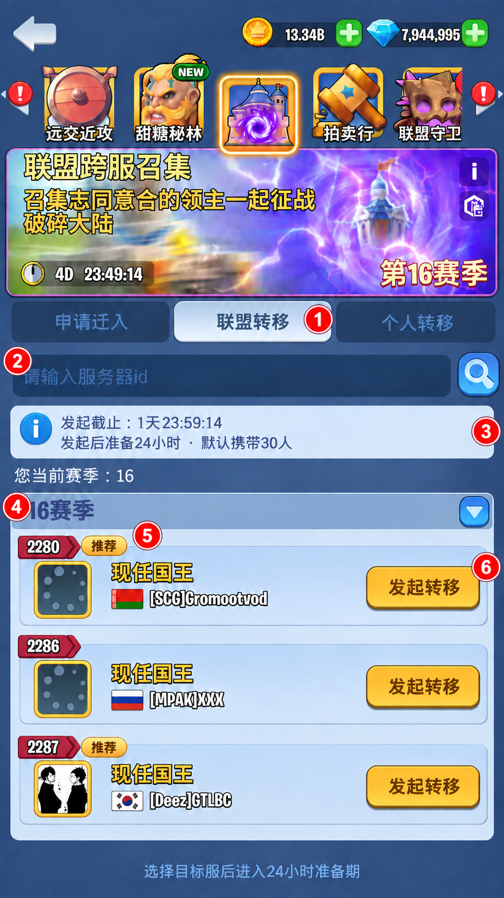
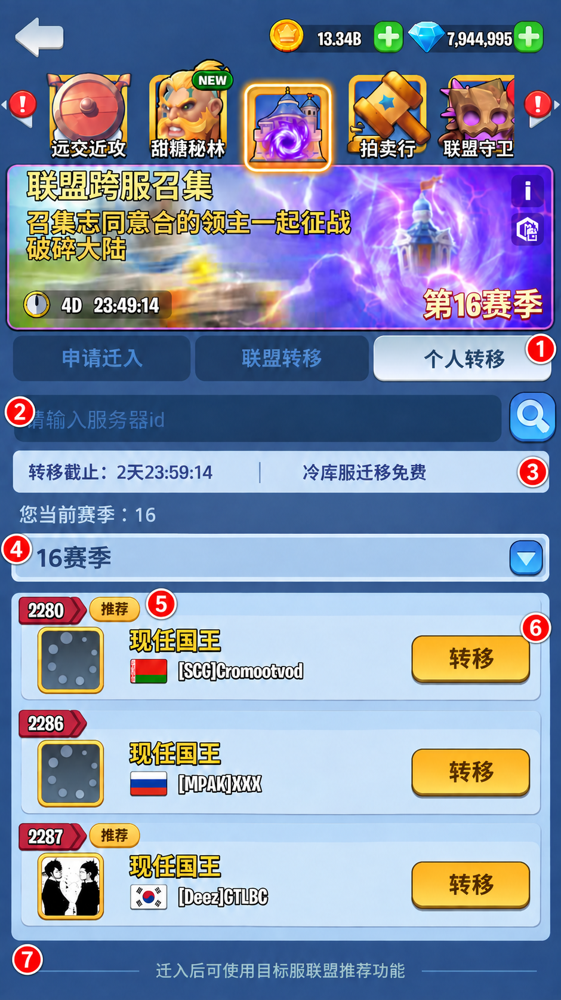

# 文档说明

依据主案及本轮已确认效果图整理，覆盖申请迁入、两类转移目标列表、联盟准备页/弹窗和成员管理。标注聚焦本次新增或变更区域，顶部活动资源等通用区域沿用现有界面。图中人数、服务器与倒计时为示例。

新建 key 以红色标注，已对客户端 Assets/Res/i18n/cn.tsv 查重；复用 key 保留原文。原有联盟资料、职级、动态名字和数字格式沿用原控件。标注图采用 ImageGen，坐标为视觉估计。

# 申请迁入：页签与推荐标识

冷库来源玩家的召集活动入口；申请迁入页签选中。

<table class="ui"><colgroup><col style="width:38.46%"><col style="width:61.54%"></colgroup><tr><td style="vertical-align:top;background:#E8F2FE"></td><td style="vertical-align:top;background:#FFFAE5"><ol><li><b>三通道页签</b><ul><li>冷库服显示申请迁入、联盟转移、个人转移，隐藏审批。迁出后恢复目标服常规页签。</li><li class="key">Activity_button_8901_02</li><li class="key">Transfer_Alliance_Btn</li><li class="key">ColdServer_personalTab</li></ul></li><li><b>目标搜索</b><ul><li>沿用服务器 ID 搜索；搜索结果仍受主案的同分组、当前或 +1 版本规则限制。</li><li class="key">Actv_8901_tips01</li></ul></li><li><b>推荐标识</b><ul><li>只在联盟条目展示，服务器组头不展示。语言与活跃按联盟所在服统计、付费人数按联盟统计，条件同时满足才显示；无标签仍可选择，不展示付费人数等判定数据。</li><li class="key">ColdServer_recommended</li></ul></li><li><b>联盟信息</b><ul><li>保留现有联盟资料、语言、战力门槛及活跃时间；剩余名额展示当前冷库来源可用名额。服务端返回实际值，图中数字仅示意。</li></ul></li><li><b>申请状态</b><ul><li>无盟且满足资格时可申请；已有申请展示撤销和审核中。撤销后按原规则清理申请，玩家有需要手动重申；召集通道仍保留联盟审批。</li><li class="key">Activity_button_8901_02</li><li class="key">Activity_button_8901_03</li><li class="key">Activity_desc_8901_60</li></ul></li></ol></td></tr></table>

# 联盟转移：未发起

盟长进入联盟转移页签，当前联盟尚未发起转移。

<table class="ui"><colgroup><col style="width:38.46%"><col style="width:61.54%"></colgroup><tr><td style="vertical-align:top;background:#E8F2FE"></td><td style="vertical-align:top;background:#FFFAE5"><ol><li><b>页签状态</b><ul><li>未发起时显示目标列表；发起成功立即切换为准备信息页。无盟者提示使用申请迁入或个人转移。</li><li class="key">Transfer_Alliance_Btn</li></ul></li><li><b>搜索</b><ul><li>复用目标服务器 ID 搜索。</li><li class="key">Actv_8901_tips01</li></ul></li><li><b>发起时限与人数</b><ul><li>显示距 D2 结束的剩余时间、24 小时准备期及默认携带人数预览。D2 截止后禁止新发起，已发起联盟继续准备。</li><li class="key">ColdServer_initiateDeadline</li><li class="key">ColdServer_initiateSummary</li></ul></li><li><b>目标分组</b><ul><li>展示当前赛季及目标赛季分组，支持收起展开；冷库可选目标无审批，不设置直接转入／需要审批／无法转入子页签。</li><li class="key">Server_Transfer_List_Tips_10</li><li class="key">ColdServer_seasonGroup</li></ul></li><li><b>服务器条目</b><ul><li>保留服务器 ID、国王头像、国旗和名字。目标服列表不展示推荐标签。</li><li class="key">Transfer_Present_King_Title</li></ul></li><li><b>发起操作</b><ul><li>仅符合资格的盟长可发起。成功后显示目标服和本盟准备倒计时；失败保留选择列表并显示现有失败原因。</li><li class="key">ColdServer_initiate</li><li class="key">ColdServer_chooseHint</li></ul></li></ol></td></tr></table>

# 个人转移：目标列表

非盟长按主案资格使用个人转移；落地后通过目标服既有入口入盟。

<table class="ui"><colgroup><col style="width:38.46%"><col style="width:61.54%"></colgroup><tr><td style="vertical-align:top;background:#E8F2FE"></td><td style="vertical-align:top;background:#FFFAE5"><ol><li><b>个人页签</b><ul><li>展示个人转移目标；盟长提示先转让盟长或使用联盟转移。</li><li class="key">ColdServer_personalTab</li></ul></li><li><b>搜索</b><ul><li>复用服务器 ID 搜索，结果遵守统一目标范围。</li><li class="key">Actv_8901_tips01</li></ul></li><li><b>开放时间与费用</b><ul><li>显示距 D3 结束的转移截止倒计时及免费说明；截止后停止转移操作。</li><li class="key">ColdServer_personalDeadline</li><li class="key">ColdServer_free</li></ul></li><li><b>目标分组</b><ul><li>复用赛季分组及折叠；仅显示符合范围的可选目标，无审批子页签。</li><li class="key">Server_Transfer_List_Tips_10</li><li class="key">ColdServer_seasonGroup</li></ul></li><li><b>目标条目</b><ul><li>保留国王资料。目标服列表不展示推荐标签。</li><li class="key">Transfer_Present_King_Title</li></ul></li><li><b>转移操作</b><ul><li>按现有确认流程和执行校验提交；冷库特权不显示卷轴费用、库存或购买入口。成功按主案迁出，失败保留页面并显示原因。</li><li class="key">transfer_btn01</li></ul></li><li><b>落地入盟提示</b><ul><li>说明迁入后使用目标服既有联盟推荐功能；冷库服不提供这条入盟通道。</li><li class="key">ColdServer_localJoinHint</li></ul></li></ol></td></tr></table>

# 联盟转移：准备中

联盟成功发起后，页签内容替换为准备信息；关闭弹窗、切换页签或重进活动均可从此继续查看。

<table class="ui"><colgroup><col style="width:38.46%"><col style="width:61.54%"></colgroup><tr><td style="vertical-align:top;background:#E8F2FE"></td><td style="vertical-align:top;background:#FFFAE5"><ol><li><b>持续准备状态</b><ul><li>全盟在联盟转移页签看到当前准备信息；搜索、目标列表和发起入口被准备面板替换。D2 截止后也持续显示未结束的准备状态。</li><li class="key">Transfer_Alliance_Btn</li><li class="key">ColdServer_preparingTitle</li></ul></li><li><b>联盟与迁移方向</b><ul><li>显示本盟标识、来源服与目标服，以及准备中状态。</li><li class="key">ColdServer_preparing</li></ul></li><li><b>本盟倒计时</b><ul><li>从实际发起时间计算 24 小时；每次打开读取当前进度。到期切换执行状态并锁定名单操作。</li><li class="key">ColdServer_remainingLabel</li></ul></li><li><b>执行说明</b><ul><li>显示到期自动执行及免费迁移说明。</li><li class="key">ColdServer_autoTransfer</li><li class="key">ColdServer_free</li></ul></li><li><b>名单摘要</b><ul><li>显示携带/不携带人数和本人携带状态；名单变化后刷新。普通成员按主案显示确认加入或退出操作，图中为盟长视角。</li><li class="key">ColdServer_memberCounts</li><li class="key">ColdServer_selfState</li><li class="key">ColdServer_included</li><li class="key">ColdServer_excluded</li></ul></li><li><b>取消转移</b><ul><li>盟长可取消本次转移；关闭页面不等于取消。取消后恢复未发起状态，是否可重发按 D2 截止判定。</li><li class="key">Transfer_Cancel_Notice_Title</li><li class="key">Transfer_Cancel_Notice_Desc</li></ul></li><li><b>成员列表入口</b><ul><li>打开转移列表管理其他成员；返回后仍保留准备信息。普通成员不提供盟长管理权限。</li><li class="key">Alliance_server_transfer_button</li><li class="key">ColdServer_manageHint</li></ul></li></ol></td></tr></table>

# 联盟转移：准备弹窗

发起或准备期登录时展示当前迁移信息；关闭后可通过联盟转移页签重新查看。

<table class="ui"><colgroup><col style="width:38.46%"><col style="width:61.54%"></colgroup><tr><td style="vertical-align:top;background:#E8F2FE"></td><td style="vertical-align:top;background:#FFFAE5"><ol><li><b>标题与关闭</b><ul><li>关闭只关闭弹窗；本次联盟转移继续准备。</li><li class="key">Transfer_Alliance_Notice_Title</li></ul></li><li><b>联盟与执行说明</b><ul><li>展示本盟标识、自动执行和免费说明。</li><li class="key">ColdServer_autoTransfer</li><li class="key">ColdServer_free</li></ul></li><li><b>目标及倒计时</b><ul><li>展示迁移方向与实时准备倒计时，与准备页读取同一状态。</li><li class="key">ColdServer_preparing</li></ul></li><li><b>成员摘要</b><ul><li>与准备页同步携带人数和本人状态；图中为盟长。</li><li class="key">ColdServer_memberCounts</li><li class="key">ColdServer_selfState</li><li class="key">ColdServer_included</li><li class="key">ColdServer_excluded</li><li class="key">ColdServer_manageHint</li></ul></li><li><b>取消操作</b><ul><li>使用准备页相同的取消权限、确认与时限规则。</li><li class="key">Transfer_Cancel_Notice_Title</li><li class="key">Transfer_Cancel_Notice_Desc</li></ul></li><li><b>列表入口</b><ul><li>打开成员管理列表；回到弹窗或页签均保持最新准备状态。</li><li class="key">Alliance_server_transfer_button</li></ul></li></ol></td></tr></table>

# 转移列表：盟长视角

从准备页或弹窗进入，用于查看分组成员并管理携带名单。

<table class="ui"><colgroup><col style="width:38.46%"><col style="width:61.54%"></colgroup><tr><td style="vertical-align:top;background:#E8F2FE"></td><td style="vertical-align:top;background:#FFFAE5"><ol><li><b>标题与关闭</b><ul><li>从准备弹窗或联盟转移准备页进入。关闭只收起列表，保留准备状态；再次进入读取最新名单。</li><li class="key">Alliance_server_transfer_button</li></ul></li><li><b>目标与准备摘要</b><ul><li>展示目标服、当前准备剩余时间及携带/不携带人数；操作成功后刷新，失败按现有提示处理，不提前改变人数。</li><li class="key">ColdServer_target</li><li class="key">ColdServer_remaining</li><li class="key">ColdServer_memberCounts</li></ul></li><li><b>成员分组与本人</b><ul><li>携带成员按联盟职级分组；不携带单独分组。组头显示人数并支持折叠。成员展示头像、昵称和战力；本人显示身份与携带状态。</li><li class="key">ColdServer_excluded</li><li class="key">ColdServer_included</li><li class="key">Alliance_server_transfer_tips2</li><li class="key">UNION_power</li></ul></li><li><b>移除成员</b><ul><li>仅盟长在准备中管理其他成员；本人无移除按钮。点击后使用现有二次确认交互，确认文案改为只说明移出携带名单，不使用旧提示中“无法再次申请转移”的表述。</li><li class="key">UNION_member_remove</li><li class="key">ColdServer_removeConfirm</li><li class="key">LC_MENU_cancel_cap</li><li class="key">LC_MENU_confirm_cap</li></ul></li><li><b>恢复携带</b><ul><li>盟长可将不携带成员恢复到名单，沿用名额校验；成功后刷新分组、状态和人数。</li><li class="key">ColdServer_restore</li><li class="key">ColdServer_removed</li></ul></li><li><b>操作说明与执行状态</b><ul><li>说明移除名单不会立即退盟。准备结束后名单锁定，移除/恢复停止响应，按主案自动执行；此处为提示条，不能点击执行转移。</li><li class="key">ColdServer_removeHint</li><li class="key">ColdServer_lockHint</li></ul></li></ol></td></tr></table>

# 本地化文本汇总

复用 key 与新增 key 分别汇总，每个 key 只登记一次；新增 key 已对客户端 cn.tsv 查重。

## 复用 key（17 条）

| 枚举 KEY | 中文内容 | 占位符传参说明 |
|---|---|---|
| Activity_button_8901_02 | 申请迁入 | 无 |
| Transfer_Alliance_Btn | 联盟转移 | 无 |
| Actv_8901_tips01 | 请输入服务器id | 无 |
| Activity_button_8901_03 | 撤销 | 无 |
| Activity_desc_8901_60 | 审核中 | 无 |
| Server_Transfer_List_Tips_10 | 您当前赛季：{0} | {0}=玩家当前赛季编号 |
| Transfer_Present_King_Title | 现任国王 | 无 |
| transfer_btn01 | 转移 | 无 |
| Transfer_Cancel_Notice_Title | 取消转移 | 无 |
| Transfer_Cancel_Notice_Desc | 是否取消转移？ | 无 |
| Alliance_server_transfer_button | 转移列表 | 无 |
| Transfer_Alliance_Notice_Title | 联盟转移 | 无 |

| 枚举 KEY | 中文内容 | 占位符传参说明 |
|---|---|---|
| Alliance_server_transfer_tips2 | 自己 | 无 |
| UNION_power | 战力：{0} | {0}=成员战力；沿用既有数字格式 |
| UNION_member_remove | 移除 | 无 |
| LC_MENU_cancel_cap | 取消 | 无 |
| LC_MENU_confirm_cap | 确认 | 无 |

## 新增 key（26 条）

| 枚举 KEY | 中文内容 | 占位符传参说明 |
|---|---|---|
| ColdServer_personalTab | 个人转移 | 无 |
| ColdServer_recommended | 推荐 | 无 |
| ColdServer_initiateDeadline | 发起截止：{0} | {0}=距 D2 结束的剩余时长，如 1天23:59:14 |
| ColdServer_initiateSummary | 发起后准备{0}小时 · 默认携带{1}人 | {0}=准备期小时数，当前24；{1}=本次默认携带人数预览 |
| ColdServer_seasonGroup | {0}赛季 | {0}=目标服务器赛季编号 |
| ColdServer_initiate | 发起转移 | 无 |
| ColdServer_chooseHint | 选择目标服后进入{0}小时准备期 | {0}=准备期小时数，当前24 |
| ColdServer_personalDeadline | 转移截止：{0} | {0}=距 D3 结束的剩余时长 |
| ColdServer_free | 冷库服迁移免费 | 无 |
| ColdServer_localJoinHint | 迁入后可使用目标服联盟推荐功能 | 无 |
| ColdServer_preparingTitle | 联盟转移准备中 | 无 |
| ColdServer_preparing | 准备中 | 无 |

| 枚举 KEY | 中文内容 | 占位符传参说明 |
|---|---|---|
| ColdServer_remainingLabel | 准备剩余时间 | 无；数字倒计时沿用现有格式 |
| ColdServer_autoTransfer | 准备结束后自动执行联盟转移 | 无 |
| ColdServer_memberCounts | 已携带 {0} 人 · 不携带 {1} 人 | {0}=当前携带人数；{1}=当前不携带人数 |
| ColdServer_selfState | 本人状态：{0} | {0}=本人的携带状态本地化文本 |
| ColdServer_included | 已携带 | 无 |
| ColdServer_excluded | 不携带 | 无 |
| ColdServer_manageHint | 可在转移列表中管理其他成员 | 无；盟长视角显示 |
| ColdServer_target | 目标服：{0} | {0}=本次目标服务器 ID |
| ColdServer_remaining | 准备剩余：{0} | {0}=本盟准备剩余时长，如 23:59:56 |
| ColdServer_removeConfirm | 是否将该成员移出本次携带名单？移除不会立即退盟，准备结束前可由盟长恢复携带。 | 无 |
| ColdServer_restore | 恢复携带 | 无 |
| ColdServer_removed | 已移出名单 | 无 |

| 枚举 KEY | 中文内容 | 占位符传参说明 |
|---|---|---|
| ColdServer_removeHint | 移除仅调整携带名单，不会立即退盟 | 无 |
| ColdServer_lockHint | 准备结束后锁定名单并自动转移 | 无 |
