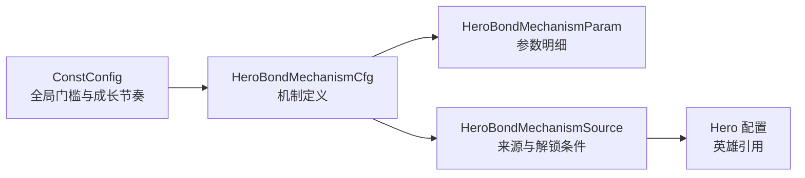

# 羁绊系统调整 · 配置表结构（数值策划填表）

> **定位**：仅描述数值策划在 Excel 中需要维护的配置文件、页签与字段，不包含玩家存档、运行时结构、协议或代码类名。
>
> **规则依据**：`英雄羁绊系统调整策划案.md`。
>
> **配置策略**：采用“全局参数 + 机制定义 + 参数明细 + 来源关系”的拆分方式，避免把六种机制的不同参数硬塞入同一个可变 JSON 字段。

# 配置表概览

## 配置文件清单

| 文件 | 页签 | 用途 | 策划维护 |
|------|------|------|----------|
| `ConstConfig.xlsx` | 现有常量页签 | 维护羁绊等级上限、机制解锁门槛与默认成长节奏 | 系统/数值策划 |
| `HeroBondMechanism.xlsx`（建议新增） | `HeroBondMechanismCfg` | 维护机制基础信息、展示顺序与开放状态 | 系统/数值策划 |
| `HeroBondMechanism.xlsx`（建议新增） | `HeroBondMechanismParam` | 维护每个机制的固定参数、成长参数和效果上限 | 数值策划 |
| `HeroBondMechanism.xlsx`（建议新增） | `HeroBondMechanismSource` | 维护通用来源、主将来源与指定英雄上阵条件 | 系统/数值策划 |

## 配置关系

## 公共依赖

| 依赖 | 本功能用法 | 策划动作 |
|------|------------|----------|
| 英雄配置 | 来源英雄、主将英雄及指定上阵英雄的外键来源 | 只引用有效英雄 ID，不在本表复制英雄名称 |
| 多语言配置 | 机制名称、机制说明、锁定提示与动态效果文案 | 按 K1 功能名前缀新增并查重；占位符从 `{0}` 起连续编号 |
| 资源配置 | 机制图标及锁定/失效表现资源 | 维护资源键，不在数值字段中填写路径说明文本 |
| 战斗效果枚举 | 将机制类型映射到战斗判定 | 配置只能引用已实现的效果类型，不允许通过文案创造新效果 |

# 全局参数

## ConstConfig

| 配置项 | 类型 | 当前设计值 | 说明 | 填表要点 |
|--------|------|------------|------|----------|
| `HeroBondPowerLevelCap` | int | 660 | 羁绊战力参与计算的最高等级 | 必须大于 0；总羁绊等级可继续超过该值 |
| `HeroBondMechanismUnlockLevel` | int | 660 | 机制功能解锁门槛 | 当前与战力上限相同，但应独立配置 |
| `HeroBondMechanismGrowthLevelStep` | int | 10 | 机制成长一次需要的超额等级 | 必须大于 0；不足一个完整间隔不产生部分成长 |
| `HeroBondMechanismGrowthValueStep` | int | 100 | 每个成长节点增加的默认参数值 | 建议按万分比存储；100 表示 1 个百分点 |

- 有效羁绊等级使用 `min（总羁绊等级，HeroBondPowerLevelCap）`。
- 超额等级使用 `max（0，总羁绊等级－HeroBondPowerLevelCap）`。
- 默认成长值使用 `向下取整（超额等级÷HeroBondMechanismGrowthLevelStep）×HeroBondMechanismGrowthValueStep`。
- 若单个机制参数需要不同成长步长，可在参数明细中配置覆盖值；未配置时读取全局默认值。

# 机制定义

## HeroBondMechanismCfg

一行代表一种可供玩家选择的机制类型。相同机制只维护一行；通用来源与英雄来源通过来源关系表关联，不复制机制行。

| 字段 | 类型 | 读取端 | 说明 | 填表要点 |
|------|------|--------|------|----------|
| `CfgID` | int | cs | 机制唯一 ID | 全表唯一；发布后不得复用历史 ID |
| `MechanismType` | int | cs | 战斗机制类型枚举 | 当前支持暴击、闪避、连击、额外伤害、反击、克制强化 |
| `NameLcKey` | string | c | 机制名称多语言 KEY | 使用 K1 功能名前缀；不得直接填中文 |
| `DescLcKey` | string | c | 机制完整效果说明 KEY | 支持动态参数占位符；与参数明细顺序一致 |
| `BriefDescLcKey` | string | c | 选择卡片短说明 KEY | 卡片空间不足时使用；不能与完整说明产生规则差异 |
| `Icon` | string | c | 机制图标资源键 | 锁定态通过界面状态处理，不另配灰图时复用原图 |
| `Sort` | int | c | 固定展示顺序 | 数值小的优先；锁定、失效和已选择状态不得改变排序 |
| `Enable` | bool | cs | 机制开放开关 | 关闭后不进入候选池；历史选择进入失效状态 |
| `DerivedActionLimit` | int | s | 单次触发可产生的最大派生行为次数 | 暴击/闪避可填 0；连击等按规则配置，防止递归触发 |

## 当前机制枚举建议

| MechanismType | 对外名称 | 主要参数 | 规则摘要 |
|---------------|----------|----------|----------|
| 1 | 暴击 | 触发概率、固定伤害倍率 | 攻击时概率造成配置倍率的总伤害 |
| 2 | 闪避 | 触发概率 | 受击时概率令本次伤害为 0 |
| 3 | 连击 | 触发概率、追加攻击次数 | 攻击结束后追加攻击；派生攻击不递归触发 |
| 4 | 额外伤害 | 额外伤害比例 | 按本次实际伤害追加伤害；追加伤害不递归触发 |
| 5 | 反击 | 反击比例 | 按实际承受伤害反击；伤害为 0 时不触发 |
| 6 | 克制强化 | 克制增幅、非克制减免 | 两个成长参数同步成长、分别封顶 |

# 机制参数

## HeroBondMechanismParam

一行代表某机制的一个参数。固定参数与成长参数共用本页签，通过参数角色区分；这样能够支持单参数机制和克制强化的双成长参数，而无需在配置中使用不定长 JSON。

| 字段 | 类型 | 读取端 | 说明 | 填表要点 |
|------|------|--------|------|----------|
| `CfgID` | int | cs | 参数行唯一 ID | 全表唯一 |
| `MechanismID` | int | cs | 所属机制 ID | 外键关联 `HeroBondMechanismCfg.CfgID` |
| `ParamType` | int | cs | 参数类型枚举 | 例如触发概率、伤害倍率、追加次数、额外伤害比例、反击比例、克制增幅、非克制减免 |
| `ParamRole` | int | cs | 参数角色 | 1=固定参数；2=成长参数 |
| `BaseValue` | int | cs | 参数基础值 | 百分比建议统一用万分比；次数使用整数 |
| `GrowthValueStep` | int | cs | 每成长节点增加值 | 0 表示读取全局默认值；固定参数必须填 0 |
| `UpperLimit` | int | cs | 参数最终上限 | 固定参数填写与基础值相同；成长参数必须不低于基础值 |
| `DisplayUnit` | int | c | 展示单位枚举 | 百分比、整数次数、倍率等 |
| `DisplayPrecision` | int | c | 界面保留小数位 | 当前整数百分比可填 0；不得只靠客户端自行猜精度 |
| `Sort` | int | c | 文案占位参数顺序 | 从 0 起连续，用于把多个参数传入说明文案 |

## 当前参数示例

以下仅说明字段组合，不代替最终数值平衡：

| 机制 | ParamType | ParamRole | BaseValue | GrowthValueStep | UpperLimit |
|------|-----------|-----------|-----------|-----------------|------------|
| 暴击 | 伤害倍率 | 固定 | 15000 | 0 | 15000 |
| 暴击 | 触发概率 | 成长 | 0 | 0（读全局） | 由数值配置 |
| 闪避 | 触发概率 | 成长 | 0 | 0（读全局） | 由数值配置 |
| 连击 | 追加攻击次数 | 固定 | 1 | 0 | 1 |
| 连击 | 触发概率 | 成长 | 0 | 0（读全局） | 由数值配置 |
| 额外伤害 | 额外伤害比例 | 成长 | 0 | 0（读全局） | 由数值配置 |
| 反击 | 反击比例 | 成长 | 0 | 0（读全局） | 由数值配置 |
| 克制强化 | 克制增幅 | 成长 | 0 | 0（读全局） | 由数值配置 |
| 克制强化 | 非克制减免 | 成长 | 0 | 0（读全局） | 由数值配置 |

# 机制来源与英雄条件

## HeroBondMechanismSource

一行代表一个“机制来源”。同一机制允许配置多行来源；运行时只要任一来源有效，机制即保持可用，但效果不叠加。

| 字段 | 类型 | 读取端 | 说明 | 填表要点 |
|------|------|--------|------|----------|
| `CfgID` | int | cs | 来源行唯一 ID | 全表唯一 |
| `MechanismID` | int | cs | 机制 ID | 外键关联机制定义表 |
| `SourceType` | int | cs | 来源类型 | 1=通用；2=当前主将提供 |
| `SourceHeroID` | int | cs | 提供来源的英雄 ID | 通用来源填 0；主将来源必须填写有效英雄 ID |
| `RequiredHeroID` | int | cs | 额外要求上阵的英雄 ID | 无额外条件填 0；存在时按当前编队任意位置判断 |
| `LockTipLcKey` | string | c | 条件不满足提示 KEY | 支持英雄名称占位符；无指定英雄条件时使用通用锁定提示 |
| `Enable` | bool | cs | 来源开放开关 | 关闭单条来源不影响同机制的其他有效来源 |

## 来源判定示例

| 机制 | SourceType | SourceHeroID | RequiredHeroID | 结果 |
|------|------------|--------------|----------------|------|
| 暴击 | 通用 | 0 | 0 | 所有已解锁机制功能的编队可选择 |
| 连击 | 当前主将提供 | 英雄 A | 0 | 英雄 A 为当前主将时可选择 |
| 闪避 | 当前主将提供 | 英雄 B | 英雄 C | 英雄 B 为主将且英雄 C 已上阵时可选择 |
| 暴击 | 当前主将提供 | 英雄 D | 0 | 与通用来源重复时仍只展示一个暴击选项 |

# 多语言文本需求

| 文案类型 | 占位符 | 示例 | 维护要求 |
|----------|--------|------|----------|
| 机制完整说明 | 按 Param.Sort 传入 | 攻击时有 `{0}%` 概率造成 `{1}%` 伤害 | 参数顺序固定，多语言版本数量与顺序一致 |
| 机制短说明 | 按 Param.Sort 传入 | 攻击时概率造成暴击 | 不得与完整规则矛盾 |
| 指定英雄锁定提示 | `{0}`=英雄名称 | 上阵 `{0}` 英雄解锁 | 英雄名称读取英雄本地化，不拼接配置表中文 |
| 等级解锁提示 | `{0}`=解锁等级 | 总羁绊等级达到 `{0}` 级解锁机制 | 等级读取全局配置 |
| 下一成长说明 | `{0}`=机制参数名，`{1}`=目标值 | `{0}` 提升至 `+{1}%` | 双参数机制按两个参数分别展示或合并为完整句 |
| 保存成功提示 | 无 | 更换结果仅对下一次出征生效 | 固定文案 |

# 配置校验

- `CfgID`、机制类型与来源行 ID 必须唯一；发布后不得复用历史 ID。
- 机制定义引用的多语言 KEY、图标资源和战斗类型必须存在。
- `Sort` 必须可稳定排序；相同值按 `CfgID` 升序兜底。
- 成长等级间隔必须大于 0；概率和比例上限不得超过战斗系统允许范围。
- 固定参数的 `GrowthValueStep` 必须为 0，且 `UpperLimit` 必须等于 `BaseValue`。
- 成长参数的 `UpperLimit` 必须不低于 `BaseValue`。
- 一个机制内的参数 `Sort` 必须从 0 起连续，且与多语言文案占位符一致。
- `SourceType=通用` 时 `SourceHeroID` 必须为 0；`SourceType=当前主将提供` 时必须填写有效英雄 ID。
- 多条来源指向同一机制时只影响可用性，不得累加参数。
- 关闭或删除机制前必须检查历史玩家选择；历史选择按主案失效规则处理。

# 配置变更影响

| 变更 | 新出征部队 | 已出征部队 | 历史选择 |
|------|------------|------------|----------|
| 调整全局成长间隔或单次成长值 | 使用新值重新计算 | 保留出征快照 | 保留选择 |
| 调整机制参数或上限 | 使用新值 | 保留出征快照 | 保留选择 |
| 关闭某条来源 | 重新判断其他来源 | 保留出征快照 | 无其他来源时标记失效 |
| 关闭整个机制 | 不再进入有效候选池 | 保留出征快照 | 标记失效，不自动替换 |
| 重新开放机制或来源 | 新出征恢复使用 | 保留原快照 | 玩家未改选时自动恢复 |

