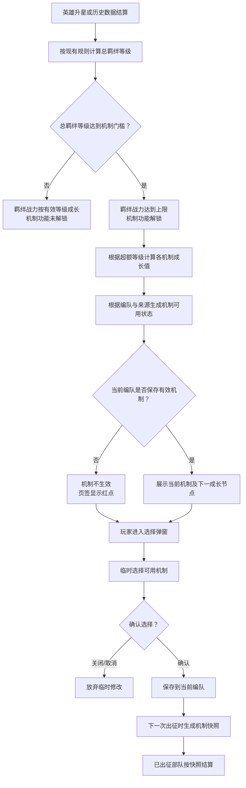

# 变更记录

| 版本 | 变更类型 | 变更内容 | 经办人 | 时间 |
|------|----------|----------|--------|------|
| v1.0 | 新建 | 明确羁绊等级封顶、机制解锁与成长、编队选择、失效恢复、出征快照、红点及界面状态规则 | — | 2026-08-05 |

# 简介

## 设计目的

现有英雄羁绊在达到等级上限后，英雄继续升星无法产生新的可感知成长，容易削弱玩家长期培养 SSR、SR 英雄的动力。本次调整在不继续放大羁绊战力加成的前提下，将超出上限的羁绊等级转化为可选择、可成长的队伍机制，使玩家能够根据阵容与战斗目标选择战斗倾向。

本次调整需要同时满足以下目标：

- **保留原有培养价值**：英雄星级仍持续累计为总羁绊等级，达到原战力上限后不浪费后续成长。
- **控制战力膨胀**：羁绊战力加成仍在配置上限处停止成长，超额等级只用于提升机制效果。
- **形成战前选择**：玩家按队伍选择一个机制，不进行点数分配，也不能同时叠加多个机制。
- **保证出征稳定性**：机制更换、阵容变化与配置调整不回溯影响已出征部队。
- **降低误操作成本**：机制因英雄条件失效时保留原选择；条件恢复后自动重新生效。

## 功能简述

- **羁绊等级**：沿用现有英雄星级累计规则，区分总羁绊等级、有效羁绊等级与超额等级。
- **机制解锁**：有效羁绊等级达到配置门槛后开放机制功能，但不自动替玩家选择机制。
- **机制成长**：超额等级按配置间隔转化为机制成长值，并受各机制独立效果上限约束。
- **机制选择**：每个编队独立保存一个机制；通用来源与当前主将来源共同决定候选机制的可用性。
- **失效恢复**：已保存机制不再满足英雄条件时暂时失效，条件重新满足后自动恢复。
- **出征快照**：部队出征时固化机制类型与最终效果，后续变更只作用于新的出征。
- **界面反馈**：在英雄羁绊界面增加机制页签、机制成长展示和机制选择弹窗，并通过红点提示未选择或已失效状态。

## 目标与对标

- **所属项目**：K1。
- **功能定位**：英雄长期培养的封顶后成长出口，以及编队出征前的战斗策略选择。
- **参考对标**：无额外竞品对标；以本方案规则和已提供的三张界面图为设计依据。

## 调整范围

- 本期调整羁绊等级封顶后的成长用途，并新增队伍机制功能。
- 原有羁绊激活条件、英雄星级折算规则、羁绊战力计算方式及英雄详情功能保持不变；其中战力计算只新增封顶约束。
- 本期不增加机制养成资源、机制升级按钮、效果点分配、机制预设方案或多机制同时生效能力。
- 最终平衡数值、机制图标与正式多语言文案由配置和资源验收确定，不在主功能案中固化资源 ID 或本地化 KEY。

# 关键决策

| 维度 | 决策 | 关键约束/备注 |
|------|------|----------------|
| 文档粒度 | 羁绊等级调整与机制功能作为一个完整系统交付 | 不把机制成长、选择弹窗等拆成独立功能案 |
| 羁绊等级 | 总羁绊等级继续累计，且只增不减 | 沿用现有英雄星级累计规则 |
| 战力上限 | 660 级同时作为羁绊战力成长上限与机制解锁门槛 | 660 为当前设计值，正式值配置化 |
| 超额成长 | 超出上限的等级不再提高羁绊战力，只提高所选机制 | 不允许把超额等级自由分配给多个机制 |
| 成长节奏 | 每超额 10 级，成长参数增加 1 个百分点 | 等级间隔与单次增幅均配置化 |
| 解锁初态 | 首次解锁后不自动跳转、不自动选择默认机制 | 未选择时允许出征，但无机制效果 |
| 队伍归属 | 每个编队独立保存一个机制 | 不同编队之间不继承、不联动覆盖 |
| 候选来源 | 可选机制由通用来源与当前主将来源共同决定 | 相同类型去重；来源不向玩家展示 |
| 条件失效 | 保留已保存选择并标记失效 | 条件恢复后自动生效，不要求重新确认 |
| 保存时机 | 弹窗内点击卡片只产生临时选择，点击“确认选择”才保存 | 关闭弹窗放弃临时修改 |
| 生效时机 | 保存结果只对下一次出征生效 | 已出征部队不回溯更新 |
| 战斗数据 | 出征时固化机制类型、有效状态与最终效果值 | 战斗过程只读取快照，不实时读取编队选择 |
| 递归限制 | 机制产生的追加攻击、追加伤害与反击不能再次触发同一机制 | 避免连击、反击等形成无限触发链 |
| 数值边界 | 每种机制单独配置固定参数、成长参数与效果上限 | 不同机制在同一总羁绊等级下可得到不同最终值 |

# 详细规则

## 名词定义

| 名词 | 定义 |
|------|------|
| 总羁绊等级 | 按现有英雄星级累计规则得到的实际羁绊等级；达到战力上限后仍继续累计 |
| 羁绊等级上限 | 羁绊战力可以参与计算的最高等级；当前设计值为 660 级 |
| 有效羁绊等级 | `min（总羁绊等级，羁绊等级上限）`，用于计算羁绊战力与羁绊页主进度 |
| 超额等级 | `max（0，总羁绊等级－羁绊等级上限）`，只用于计算机制成长 |
| 成长等级间隔 | 机制成长一次所需的超额等级；当前设计值为 10 级 |
| 单次成长值 | 每跨过一个成长等级间隔时，成长参数增加的百分点；当前设计值为 1 个百分点 |
| 机制固定参数 | 不随羁绊等级变化的机制参数，例如暴击造成 150% 伤害中的 150% |
| 机制成长参数 | 随超额等级提高的参数，例如暴击概率、额外伤害比例 |
| 有效机制 | 已保存且当前仍满足机制来源、英雄条件与配置有效性的机制 |
| 失效机制 | 已保存，但当前不再满足英雄条件或已不在有效候选来源中的机制 |
| 出征快照 | 部队出征时记录的机制类型、有效状态和最终效果值；用于该部队后续全部战斗 |

## 整体流程

## 羁绊等级与战力封顶

- **等级来源不变**
  - 总羁绊等级继续按照现有英雄星级累计规则计算。
  - 原有羁绊激活条件与英雄展示规则保持不变；本期不调整兵种匹配、英雄数量或品质折算口径。
  - 总羁绊等级一经获得只增不减。英雄阵容调整只影响机制候选与机制有效性，不回扣总羁绊等级。

- **战力按有效等级计算**
  - 总羁绊等级低于上限时，有效羁绊等级等于总羁绊等级。
  - 总羁绊等级达到或超过上限时，有效羁绊等级固定为上限值。
  - 羁绊战力加成只读取有效羁绊等级；超额等级不得继续增加羁绊战力。
  - 羁绊等级上限与机制解锁门槛当前共用 660 级，但配置上应保留独立定义能力，避免后续调整时强制修改程序逻辑。

- **羁绊页展示**
  - 主进度按“有效羁绊等级/羁绊等级上限”展示。总羁绊等级超过上限时仍显示满级，例如总等级 685 时显示 `660/660`。
  - 达到上限后显示“已满级”状态，并展示“超出上限的等级用于提升所选机制”的说明。
  - 战力加成继续沿用现有计算与数字格式，仅停止上限后的继续增长。
  - “英雄详情”继续进入原有英雄羁绊明细功能，不在本期改变其统计口径。

## 机制解锁

- **未解锁状态**
  - 当总羁绊等级低于机制解锁门槛时，【机制】页签保持可见，但处于未解锁状态。
  - 点击页签后展示解锁条件，不展示可操作的当前机制和更换按钮。
  - 未解锁期间不计算或保存机制效果，且不显示待选择红点。
  - 未满足条件提示采用“总羁绊等级达到{等级}级解锁机制”的动态模板，等级取配置值。

- **首次解锁**
  - 当总羁绊等级首次达到门槛时立即解锁机制功能。
  - 解锁不强制跳转【机制】页签，不弹出强制选择层，也不自动分配默认机制。
  - 解锁后所有编队的机制选择初始为空；玩家可以不选择机制并正常出征。
  - 未选择机制的编队出征时不获得任何机制效果。

- **解锁后状态保持**
  - 在正常成长规则下，总羁绊等级只增不减，因此机制一经解锁不会因英雄阵容变化重新锁定。
  - 若运营调整机制解锁门槛，功能状态根据调整后的门槛重新计算；具体兼容规则见“线上数据兼容”。

## 机制成长

- **成长计算**
  - 机制成长值完全由超额等级决定，玩家不消耗道具，也不手动分配点数。
  - 未达到一个完整成长等级间隔的余数不提供部分效果。
  - 通用计算为：`成长值＝向下取整（超额等级÷成长等级间隔）×单次成长值`。
  - 某机制的实际成长参数为：`min（成长值，该机制对应参数的效果上限）`。
  - 固定参数不参与上述成长。例如暴击的固定伤害倍率为 150%，超额等级只提高触发概率。

- **不同机制独立封顶**
  - 每个机制的成长参数和效果上限独立配置。
  - 同一个总羁绊等级切换到不同机制时，按新机制自身的参数和上限重新计算，不继承旧机制的封顶状态。
  - 一个机制包含多个成长参数时，各参数在同一个成长节点同步增加单次成长值，并分别受各自上限限制。
  - 当某机制的全部成长参数均达到上限后，该机制停止显示下一成长节点；总羁绊等级仍可继续累计，并可用于其他尚未封顶的机制。

- **成长示例**
  - 羁绊等级上限为 660，成长等级间隔为 10，单次成长值为 1 个百分点。
  - 总羁绊等级 685 时，超额等级为 25，已完成 2 个成长间隔，成长值为 2 个百分点。
  - 若当前选择暴击，则完整效果为“攻击时有 2% 概率造成 150% 伤害”。
  - 下一成长节点为总羁绊等级 690；达到后暴击概率提升至 3%。

- **成长进度展示**
  - 已选择有效机制且未封顶时，展示“当前总羁绊等级/下一成长节点”，并说明到达节点后的效果变化。
  - 示例中展示 `685/690` 和“暴击概率提升至 3%”。
  - 已解锁但未选择有效机制时，仍保留玩家已经获得的超额等级，不产生效果；界面提示“选择机制后查看成长效果”。
  - 当前机制已经封顶时，进度区域改为“当前机制已达效果上限”，不虚构无法达到的下一节点。

## 机制类型与战斗规则

机制名称、规则说明、固定参数、成长参数、效果上限、图标及解锁来源均配置化。当前版本包含以下六类机制：

| 机制 | 玩家规则 | 固定参数 | 成长参数 | 战斗判定补充 |
|------|----------|----------|----------|----------------|
| 暴击 | 攻击时有一定概率造成 150% 伤害 | 伤害倍率 | 触发概率 | 150% 表示该次攻击的总伤害倍率，不是额外增加 150%；一次符合条件的攻击最多由本机制暴击一次 |
| 闪避 | 受到攻击时，有一定概率免疫本次伤害 | 无 | 触发概率 | 闪避成功后本次攻击伤害记为 0；与伤害无关的控制或状态仍按原技能规则处理 |
| 连击 | 攻击时有一定概率再次进行攻击 | 追加攻击次数 | 触发概率 | 追加攻击沿用原攻击的目标规则；目标已失效时按原战斗规则重新寻敌；追加攻击不能再次触发连击 |
| 额外伤害 | 攻击时额外造成一定比例伤害 | 无 | 额外伤害比例 | 以本次攻击结算后的实际伤害为基数追加一次伤害；追加伤害不再触发机制 |
| 反击 | 受到攻击时，按实际承受伤害的一定比例进行反击 | 无 | 反击比例 | 伤害为 0 时不反击；攻击者已失效时不追溯目标；反击不能再次触发反击或其他机制追加行为 |
| 克制强化 | 克制伤害增加，受到非克制方伤害时获得减免 | 无 | 克制增幅、非克制减免 | 我方攻击被其克制的目标时提高伤害；我方受到不克制我方的攻击时降低伤害；两个参数同节点成长、分别封顶 |

- **统一触发规则**
  - 每支队伍同时只可能有一个机制生效，因此同一队伍不存在多个羁绊机制之间的触发先后问题。
  - 机制只在其定义的攻击、受击或伤害事件成立时判定；治疗、护盾获得、非伤害状态变化不触发攻击类机制。
  - 机制产生的追加攻击、追加伤害和反击均标记为机制派生行为，不能再次触发同一机制，避免形成无限循环。
  - 与原有英雄技能、Buff 或同类战斗属性同时存在时，沿用原战斗系统既有的同类效果合并、互斥与伤害结算顺序；本期不修改原系统规则。
  - 所有概率在战斗侧按出征快照中的最终值独立判定；概率达到配置上限后不得继续溢出。

- **文案规则**
  - 配置或效果图中的 `X%` 只作为占位符，正式界面必须显示当前编队、当前机制对应的实际效果值。
  - 概率与比例统一按百分比展示；成长文案中的“+1%”表示增加 1 个百分点。
  - “破甲”不属于当前版本机制；原示例位置由“闪避”替换。

## 机制候选池与解锁来源

- **候选池生成**
  - 每次进入机制页面、打开选择弹窗、调整当前编队阵容或主将后，重新计算当前编队的机制候选状态。
  - 候选来源由通用机制与当前主将提供的机制取并集。
  - 来源只决定机制是否可选择，不叠加机制效果，不改变超额等级换算结果。
  - 相同机制类型由多个来源提供时，只展示一张机制卡片。

- **英雄条件**
  - 机制可以额外配置指定英雄上阵条件；条件依据当前编队阵容动态判定。
  - 指定英雄存在于当前编队时，视为满足“上阵{英雄名}”条件；不要求该英雄必须担任主将，除非该机制的来源配置本身限定主将。
  - 条件不满足时保留该机制卡片和配置排序位置，显示锁定态，不隐藏、不统一沉底。
  - 锁定提示使用“上阵{英雄名}英雄解锁”，其中英雄名必须读取实际配置对应的本地化名称。

- **多来源判定**
  - 同一个机制只要任一来源仍然有效，就保持可选择或有效状态。
  - 例如某机制的主将来源失效，但该机制同时属于通用机制，则不判定为失效。
  - 通用来源、主将来源和具体来源英雄不直接展示给玩家；界面只展示是否可选以及不满足时的解锁条件。

- **排序**
  - 机制按配置顺序固定展示。
  - 已选择、临时选择、锁定与失效状态均不改变卡片位置。
  - 新增机制时按新配置顺序插入；不得因为玩家历史选择而生成个人化排序。

## 编队选择与保存

- **保存归属**
  - 机制选择绑定玩家可编辑的编队槽位。同一槽位后续更换英雄时仍保留已保存的机制类型，并重新判断有效性。
  - 每个编队槽位最多保存一个机制，不同编队的选择相互独立。
  - 复制编队时只复制阵容信息，不复制机制选择，避免无意识覆盖目标编队的战斗策略；目标编队保留自身原选择。

- **打开选择弹窗**
  - 只有机制功能已解锁时可以打开选择弹窗。
  - 弹窗打开时，以当前已保存机制作为初始临时选择；若当前未选择或已保存机制失效，则不默认选中其他机制。
  - 当前已保存且有效的机制显示“已选择”；当前已保存但失效的机制显示“已失效”和对应解锁提示。

- **临时选择**
  - 点击可用机制卡片后，只更新弹窗内的临时选择和高亮状态，不立即覆盖服务器保存结果。
  - 点击锁定机制不改变临时选择，并展示对应英雄解锁条件。
  - 玩家可在确认前反复切换临时选择，最终只提交最后一次选择。

- **确认保存**
  - 点击“确认选择”时重新校验机制是否仍然可用，防止弹窗打开后阵容或配置已经变化。
  - 校验成功后保存到当前编队，并以最新服务器结果刷新当前机制卡片与红点。
  - 校验失败时不覆盖原选择，弹窗保留并刷新卡片状态，同时显示最新的不满足提示。
  - 重复提交同一个已保存机制视为幂等成功，不重复产生状态变更。

- **取消修改**
  - 点击关闭按钮、系统返回键或弹窗外允许关闭区域时，放弃本次临时修改。
  - 放弃临时修改后继续使用打开弹窗前的已保存机制。

- **生效提示**
  - 保存成功后提示“更换结果仅对下一次出征生效”。
  - 已出征部队不因当前编队保存结果改变而刷新。

## 机制失效与恢复

- **失效条件**
  - 当前编队阵容或主将变化，导致已保存机制的全部来源均不再有效。
  - 已保存机制要求的指定英雄不再上阵。
  - 配置调整导致机制被关闭、移除，或原来源不再向该编队提供该机制。

- **失效处理**
  - 保留已保存机制 ID，不自动清空，也不自动替换为其他可用机制。
  - 当前机制区域显示“已失效”，并展示造成失效的可恢复条件；指定英雄条件优先使用“上阵{英雄名}英雄解锁”。
  - 失效机制不对后续新出征部队生效，但不阻止玩家出征。
  - 失效状态下允许玩家打开选择弹窗并改选其他可用机制。

- **自动恢复**
  - 编队重新满足原机制任一有效来源后，原选择自动恢复为有效机制，无需再次选择或确认。
  - 自动恢复只影响恢复后的下一次出征，不修改已出征部队快照。
  - 如果玩家已在失效期间改选其他机制，则以后恢复的是新保存机制，不再自动切回旧机制。

## 出征快照与战斗生效

- **快照生成**
  - 每次出征时读取对应编队当时的已保存机制，并再次校验其有效性。
  - 有效时记录机制类型、固定参数、成长参数最终值和必要的战斗判定版本，形成该部队的机制快照。
  - 未选择或已失效时记录“无有效机制”，该部队后续不获得机制效果。

- **快照生命周期**
  - 机制快照随该出征部队存在，直至部队完成、撤回、解散或按原系统规则结束。
  - 部队连续参与多次战斗时，始终使用出征时的同一快照，不在每场战斗前重新读取编队。
  - 后续英雄升星、机制成长、阵容变化、机制更换、条件恢复或配置热更均不改变已经生成的快照。

- **下一次出征**
  - 任何选择或成长变化均在下一次创建出征部队时重新计算。
  - “下一次出征”指新的出征实例，不包括当前部队在地图上的继续行军、转向或再次进入战斗。

## 红点规则

- **触发条件**
  - 机制功能已解锁，且当前查看编队尚未保存机制。
  - 机制功能已解锁，且当前查看编队已保存的机制处于失效状态。

- **不触发条件**
  - 机制功能尚未解锁。
  - 当前编队存在一个已保存且有效的机制。
  - 当前编队机制已达到效果上限；封顶本身不是待办事项。
  - 仅存在尚未解锁的新机制卡片；卡片锁定本身不产生页签红点。

- **消除条件**
  - 当前编队成功保存一个有效机制后红点消失。
  - 失效机制因阵容恢复而重新有效时，红点自动消失。
  - 弹窗内仅完成临时选择时不消除红点；必须确认保存成功。

- **刷新时机**
  - 英雄星级变化并首次解锁机制时。
  - 切换编队、调整阵容或主将时。
  - 确认机制、机制自动恢复或机制配置发生变化时。
  - 登录、断线重连以及服务器推送相关状态后。

- **展示位置**
  - 红点展示在英雄羁绊界面的【机制】页签右上角。
  - 本期不新增更上层入口红点冒泡；若项目统一红点系统已经要求页签红点向父入口冒泡，则沿用统一规则。

## 界面流程与状态

### 英雄羁绊页—羁绊页签

- 顶部保留英雄羁绊标题、返回入口及【羁绊】【机制】两个页签。
- 羁绊激活英雄、激活状态和现有激活条件说明沿用原功能。
- 中部展示满级状态、有效羁绊等级进度与羁绊战力加成。
- 达到等级上限后，增加超额等级用于机制成长的说明，引导玩家切换到【机制】页签。
- 底部“英雄详情”继续进入现有羁绊等级来源明细。

### 英雄羁绊页—机制页签

- 顶部展示机制解锁门槛及当前解锁状态。
- 已解锁且存在有效机制时，展示机制图标、名称与包含实际参数的完整效果说明。
- 未选择时，当前机制区域展示空状态和选择引导；失效时展示原机制与失效原因。
- “下一次提升”区域展示当前总羁绊等级、下一成长节点和提升后的目标效果。
- 当前机制封顶时，“下一次提升”区域改为已达上限状态。
- “更换机制”按钮只在功能已解锁时可用；点击后打开机制选择弹窗。
- 按钮下方持续提示“更换结果仅对下一次出征生效”。

### 机制选择弹窗

- 机制卡片采用固定顺序的双列列表，内容包括图标、名称和简短效果说明。
- 卡片至少支持以下状态：普通可选、当前已选择、当前临时选择、锁定、已保存但失效。
- 当前临时选择使用高亮边框、勾选标记与“已选择”标识；同一时刻只能有一张卡片处于临时选择状态。
- 锁定卡片置灰并显示锁定图标与动态解锁提示，位置保持不变。
- 点击“确认选择”提交当前临时选择；未形成可提交选择时按钮保持不可提交状态。
- 点击关闭按钮放弃临时选择并返回机制页签。

### 页面状态矩阵

| 功能状态 | 当前选择 | 当前机制区域 | 成长区域 | 更换按钮 | 机制页签红点 |
|----------|----------|--------------|----------|----------|--------------|
| 未解锁 | 无 | 展示解锁条件 | 不展示机制成长 | 不可用 | 无 |
| 已解锁 | 未选择 | 空状态，引导选择 | 展示等级积累，提示选择后查看效果 | 可用 | 有 |
| 已解锁 | 有效 | 展示完整机制效果 | 展示下一节点或已封顶 | 可用 | 无 |
| 已解锁 | 失效 | 展示原机制、已失效及恢复条件 | 不提供当前生效效果；保留等级积累 | 可用 | 有 |

### 数字与文案展示

- 羁绊页主进度使用有效羁绊等级，例如总等级 685 时展示 `660/660`。
- 机制成长进度使用总羁绊等级与下一节点，例如展示 `685/690`。
- 概率与比例按配置精度展示；无小数时不强制显示小数位。
- 正向增量使用 `+N%`；机制完整效果中的概率可直接显示 `N%`，避免“有+2%概率”一类不自然文案。
- 动态占位符必须在正式展示前替换为实际等级、比例和英雄名称，不允许将 `{英雄名}`、`X%` 等占位符直接显示给玩家。

## 配置需求

主功能案只定义配置模块及用途，不约束最终 Excel 字段和技术结构。

| 配置模块 | 用途 | 影响规则 |
|----------|------|----------|
| 羁绊系统参数 | 配置战力等级上限、机制解锁门槛、成长等级间隔与单次成长值 | 等级封顶、功能解锁、成长节点计算 |
| 羁绊机制定义 | 配置机制类型、名称、说明、图标、展示顺序、固定参数、成长参数及各参数上限 | 卡片展示、最终效果、封顶状态 |
| 机制来源关系 | 配置通用来源、主将来源、指定英雄条件及机制开放状态 | 候选池、锁定、失效与自动恢复 |
| 机制战斗参数 | 配置概率、倍率、比例、追加次数及战斗侧使用的效果标识 | 出征快照与战斗判定 |

- 客户端展示与服务器战斗必须读取同一版本的机制数值，禁止仅客户端调整显示值。
- 配置校验需要保证机制 ID 唯一、展示顺序有效、成长间隔大于 0、概率与比例上限合法、多成长参数数量对应。
- 机制被关闭或移除时，历史选择按“机制失效与恢复”规则处理，不允许静默替换为其他机制。

## 线上数据兼容

| 风险维度 | 兼容规则 |
|----------|----------|
| 既有玩家等级 | 功能上线时根据既有英雄星级数据按原规则计算总羁绊等级；有效等级按新上限截断，超额等级直接参与机制成长 |
| 既有玩家选择 | 上线前不存在机制选择的数据统一初始化为空，不自动选择机制；达到门槛的编队按未选择状态显示红点 |
| 既有战力 | 上线前已经超过新上限的玩家，羁绊战力按有效等级重新读取；本方案不追回历史收益，也不补发额外资源 |
| 编队数据 | 每个现有编队初始化独立的空机制选择；后续选择随玩家编队数据正常保存与迁移 |
| 老客户端 | 功能随客户端与服务器兼容版本开放；不支持机制界面的旧客户端不能发起选择，服务器仍可保留玩家已有选择，但不得因缺少展示字段导致异常出征 |
| 转服/跨服 | 编队已保存的机制选择随玩家数据迁移；已出征部队继续使用其快照，不在转服或跨服战斗时按新编队重算 |
| 热更参数 | 参数调整只影响热更后新生成的出征快照；已出征部队继续使用旧快照 |
| 调整解锁门槛 | 按新门槛重算是否解锁；门槛提高导致暂时未满足时保留历史选择但不生效，重新满足后恢复 |
| 机制关闭/移除 | 保留无法使用的历史选择并标记失效；玩家可改选其他机制，配置恢复且玩家未改选时可自动恢复 |
| 断线重连 | 重新读取服务器保存的编队机制与有效性；弹窗中的未确认临时选择不恢复 |
| 重复请求 | 确认选择按玩家、编队和目标机制做幂等处理；同一结果重复提交不产生重复状态或重复回包副作用 |

## 边界情况处理

| 场景 | 处理规则 |
|------|----------|
| 总羁绊等级恰好达到 660 | 机制功能解锁，超额等级为 0；可以选择机制，但成长参数为初始值 |
| 总羁绊等级为 669 | 超额等级为 9，尚未跨过成长间隔，成长值仍为 0；下一节点为 670 |
| 总羁绊等级为 670 | 完成第一个成长间隔，成长参数增加 1 个百分点 |
| 总羁绊等级持续超过上限但未选择机制 | 等级正常累计，不产生机制效果；选择后按当前总等级一次性计算，无需补做升级操作 |
| 切换至上限更低的机制 | 按新机制上限截断并显示已封顶，不损失总羁绊等级 |
| 切换至尚未封顶的机制 | 按当前超额等级立即计算新机制效果与下一节点 |
| 多个来源提供同一机制 | 只展示一个机制选项；任一来源有效即有效，不叠加效果 |
| 弹窗打开后阵容发生变化 | 确认时重新校验；目标机制失效则保存失败并刷新卡片状态 |
| 选择弹窗直接关闭 | 丢弃本次临时选择，保留原服务器选择 |
| 保存机制时断线或超时 | 重新连接后以服务器保存结果为准；客户端不得仅凭本地高亮认定保存成功 |
| 连续点击确认选择 | 同一选择按幂等成功处理；界面只展示一次最终结果 |
| 已保存机制的条件失效 | 保留选择、显示红点、停止对新出征生效，不阻止出征 |
| 条件恢复前玩家改选其他机制 | 新机制覆盖历史选择；旧条件恢复后不自动切回旧机制 |
| 已出征后更换机制 | 当前部队继续使用旧快照，新选择只作用于下一次新出征 |
| 已出征后机制配置热更 | 当前部队继续使用旧参数；热更后的新出征使用新参数 |
| 机制派生攻击再次满足触发条件 | 不再次触发同一机制，终止递归触发链 |
| 概率或比例达到配置上限 | 最终值按上限取值；不再展示下一成长节点 |
| 配置缺失或非法 | 该机制按不可用处理，不参与候选池和战斗快照；已保存该机制时进入失效状态，并记录配置异常供排查 |

# 界面设计

本期包含三个子界面。功能规则和状态要求以本策划案为准；参考图用于确认信息层级和交互方向，不作为最终像素稿或最终数值依据。控件坐标、编号标注、多语言 KEY 与资源 ID 统一在独立的《羁绊系统调整-界面规则》派生文档中维护。

| 界面 ID | 界面名 | 参考图覆盖状态 | 设计用途 |
|----------|--------|----------------|----------|
| `HeroBond_Bond` | 英雄羁绊—羁绊页签 | 羁绊已激活、等级已满 | 展示激活英雄、有效羁绊等级、战力加成与超额成长说明 |
| `HeroBond_Mechanism` | 英雄羁绊—机制页签 | 机制已解锁、已选择暴击、存在下一成长节点 | 展示解锁状态、当前机制、成长进度和更换入口 |
| `HeroBond_MechanismSelect` | 机制选择弹窗 | 同时存在已选择、普通可选和英雄条件锁定卡片 | 浏览机制、形成临时选择并确认保存 |

# 必须避免的方向

- {{red:不得让超额羁绊等级继续提高原羁绊战力。}}
- {{red:不得在机制首次解锁时自动替玩家选择默认机制。}}
- {{red:不得让同一编队同时保存或生效多个机制。}}
- {{red:不得把不同来源的同名机制效果进行叠加。}}
- {{red:不得在玩家只点击卡片、尚未确认时覆盖服务器保存结果。}}
- {{red:不得因英雄条件暂时失效而清空玩家已保存的机制。}}
- {{red:不得让机制更换、阵容变化或热更回溯修改已出征部队。}}
- {{red:不得让连击、反击或追加伤害递归触发自身形成无限链。}}
- {{red:不得将效果图中的 X%、{英雄名} 等占位符直接显示给玩家。}}
