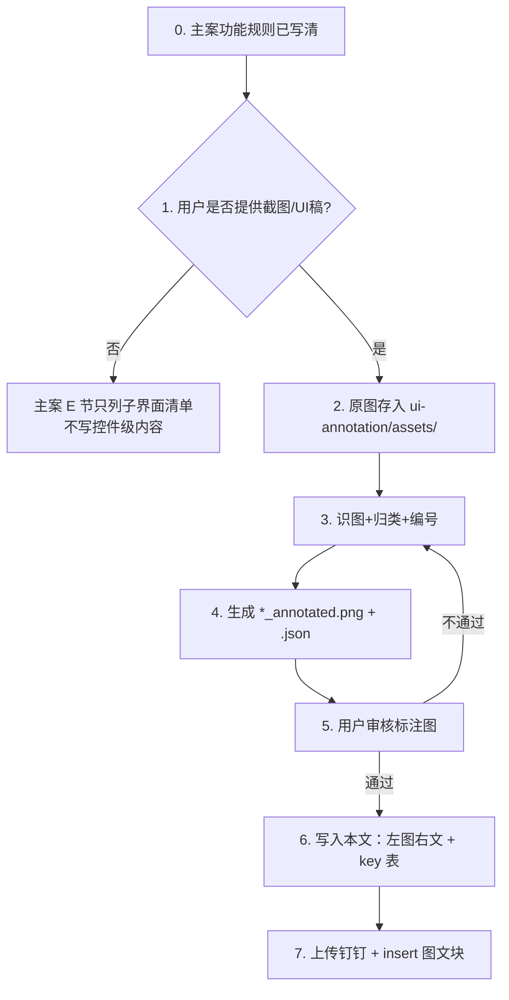

# {{功能名}} · 界面标注（派生文档）

> **定位**：主策划案 `{{功能名}}.md` 之 **E. 界面设计** 的 SSOT。  
> **规则层**在主案「详细规则」；本文只收**界面规则**（控件、状态、文案 key、交互）。  
> **钉钉落地**：本地 md 定稿 → `system-design-doc` 的 `dingtalk-sync-reference`；图文块见 `ui-annotation-reference`。

---

## 标准流程（用户提供图片后）

### 硬性约束

- **无图不写控件**；不得凭相似系统补图里没有的元素。
- **功能 vs 界面**：触发、结算、数值进主案；按钮态、布局、key 进本文。
- 新建 key 按项目 localization reference 查重；右栏待新建用 `{{red:KeyName｜中文}}`。

### 文件命名

| 类型 | 规则 | 示例 |
|------|------|------|
| 界面 ID | `{模块}-{简述}` 小写连字符 | `shop-main` |
| 原图 | `ui-annotation/assets/{界面ID}.png` | `shop-main.png` |
| 标注图 | `{界面ID}_annotated.png` | `shop-main_annotated.png` |

---

## 子界面清单与进度

| 模块 | 界面 ID | 界面名 | 源图 | 标注 | 已写本文 | 已同步钉钉 |
|------|---------|--------|------|------|----------|------------|
| {{模块}} | `{{界面ID}}` | {{界面名}} | 待收图 | ☐ | ☐ | ☐ |

---

## 单屏模板（标准产出格式）

### {{界面名}}

| 项 | 内容 |
|----|------|
| 界面 ID | `{{界面ID}}` |
| 源图 | `ui-annotation/assets/{{界面ID}}.png` |
| 标注图 | `ui-annotation/assets/{{界面ID}}_annotated.png` |
| 钉钉占位 | `<!-- IMG: {{界面名}} \| {{界面ID}} -->` |

#### 概述

{{screen_desc：这屏做什么、默认状态、入口}}

#### 左图右文

| 编号 | 说明 |
|------|------|
| 1 | {{归类后的要素说明；二级 bullet 展开子项}} |
| 2 | {{…}} |

#### 新建 key 录入

| KEY | 中文 |
|-----|------|
| {{KeyName}} | {{中文}} |
