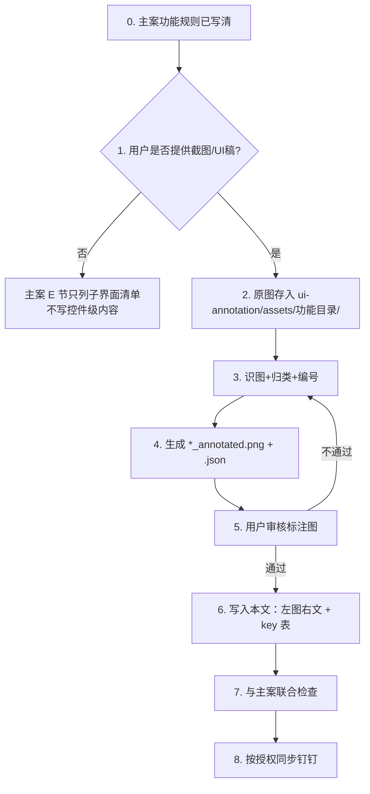

# {{功能名}} · 界面标注（派生文档）

> **定位**：主策划案 `{{功能名}}.md` 之 **E. 界面设计** 的 SSOT。  
> **规则层**在主案「详细规则」；本文只收**界面规则**（控件、状态、文案 key、交互）。  
> **钉钉落地**：本地 md 定稿 → `references/dingtalk-sync-reference.md`；图文块见 `references/ui-annotation-reference.md`。

---

## 标准流程（用户提供图片后）

### 硬性约束

- **无图不写控件**；不得凭相似系统补图里没有的元素。
- **功能 vs 界面**：触发、结算、数值进主案；按钮态、布局、key 进本文。
- 新建 key 按项目 localization reference 查重；右栏待新建用 `{{red:KeyName｜中文}}`。

### 文件命名

| 类型 | 规则 | 示例 |
|------|------|------|
| 界面 ID | `{模块}-{简述}` 小写连字符 | `shop-main` |
| 功能目录 | `ui-annotation/assets/{功能标识}/` | `ui-annotation/assets/cold-server/` |
| 原图 | `ui-annotation/assets/{功能标识}/{界面ID}.png` | `cold-server/shop-main.png` |
| 标注图 | `{界面ID}_annotated.png` | `shop-main_annotated.png` |

---

## 子界面清单与进度

| 模块 | 界面 ID | 界面名 | 源图 | 标注 | 已写本文 | 已同步钉钉 |
|------|---------|--------|------|------|----------|------------|
| {{模块}} | `{{界面ID}}` | {{界面名}} | 待收图 | ☐ | ☐ | ☐ |

---

## 单屏模板（标准产出格式）

### {{界面名}}

| 项 | 内容 |
|----|------|
| 界面 ID | `{{界面ID}}` |
| 源图 | `ui-annotation/assets/{{功能标识}}/{{界面ID}}.png` |
| 标注图 | `ui-annotation/assets/{{功能标识}}/{{界面ID}}_annotated.png` |
| 钉钉占位 | `<!-- IMG: {{界面名}} \| {{界面ID}} -->` |

#### 概述

{{screen_desc：这屏做什么、默认状态、入口}}

#### 左图右文

<table><colgroup><col style="width:38.46%"><col style="width:61.54%"></colgroup><tr><td style="vertical-align:top;background:#E8F2FE"></td><td style="vertical-align:top;background:#FFFAE5"><ol><li><b>{{要素分组名称}}</b><ul><li>{{对应状态与交互说明}}</li><li>{{本地化 key；新建标红，复用黑色}}</li></ul></li></ol></td></tr></table>

本地 HTML 表用于表达真实图文两栏；钉钉须按图文表结构单独生成 JSONML，不把本段 HTML 直接交给 Markdown 转换器。每屏先校验同一行内左图、右栏全部说明，再按 reference 完成远端回读与实际页面验收。

> 每条涉及界面文案的说明都要标出它采用的本地化枚举 key；key 的中文与传参在文末「本地化文本汇总」统一登记，此处只引用 key 名，不重复写中文。

---

## 本地化文本汇总

> 汇总**本文档全部标注图涉及的界面文案**：复用 key 和新增 key 分别列入独立小节与表格，标题注明条数，每个 key 只登记一次。新增组统一说明查重状态；过长时在本组内拆表。
> **key 前缀按所在项目规范**：K1 用功能名前缀（如 `ActvSoccer_`），不用 `LC_`+页签名；X1/X15 可能用 `LC_<页签>_`。全文档前缀统一。
> 占位符用 `{0}{1}` 从 0 起连续编号；有占位符必须在「占位符传参说明」列写清每个参数的含义、来源与示例。

### 复用 key（{{数量}} 条）

| 枚举 KEY | 中文内容 | 占位符传参说明 |
|----------|----------|----------------|
| {{<前缀>_key}} | {{中文文案}} | {{无／或：`{0}`=队伍名（来源…），`{1}`=轮次}} |

### 新增 key（{{数量}} 条）

查重状态：{{已查重及来源／未查重及原因}}。

| 枚举 KEY | 中文内容 | 占位符传参说明 |
|----------|----------|----------------|
| {{<前缀>_key}} | {{中文文案}} | {{无／或：`{0}`=参数来源与示例}} |
